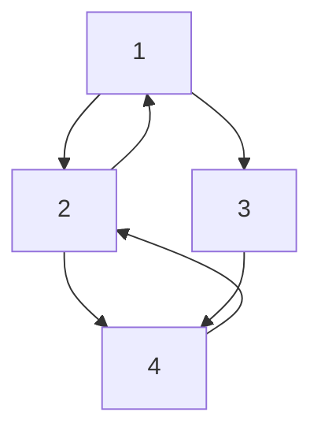
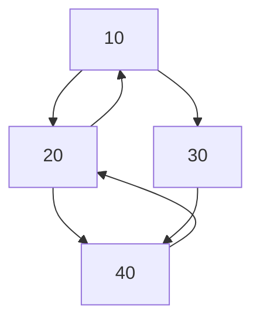
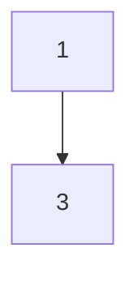

> Este ejercicio debe ser resuelto mediante **recursión** y funciones de alto orden. No se permite el uso de ciclos `for` o `while`. Las funciones deben ser puras y no modificar el grafo original, así como tampoco tener variables mutables (no utilice `var` ni estructuras mutables como ``MutableSet``.

Tienes un grafo definido por nodos y aristas. Cada nodo puede tener múltiples vecinos (puede ser un grafo dirigido o no dirigido). Los nodos contienen valores de un tipo genérico `T`.

Tu tarea es implementar las siguientes funciones de alto orden para el grafo:

1. **`map`**: Transforma el valor de cada nodo utilizando una función dada.
2. **`filter`**: Filtra nodos basados en un predicado.
3. **`fold`**: Acumula los valores de los nodos utilizando una operación binaria.

**Estructura del Grafo**:

Asume la siguiente clase `Node` en Kotlin:

```kotlin
data class Node<T>(
    val value: T,
    val neighbors: List<Node<T>>
)
```

## Consejo

Puede serte útil definir una función iterativa primero y luego refactorizarla para que sea recursiva. Esto te permitirá comprender mejor el problema y cómo se comporta la función en cada paso.

## P1. [2 pts] Implementar la función `mapGraph`:

```kotlin
mapGraph: (node: Node<T>, transform: (T) -> R) -> Node<R>
```

La función `mapGraph` te pide transformar los valores de todos los nodos de un grafo usando una función `transform`. El resultado debe ser un **nuevo grafo** donde cada nodo tiene su valor transformado, pero las conexiones entre los nodos (sus vecinos) se mantienen.

#### Ejemplo

Supongamos que tienes un grafo con 4 nodos y un ciclo:

- El nodo $n_1$ tiene un valor de $1$ y está conectado a $n_2$ y $n_3$.
- El nodo $n_2$ tiene un valor de $2$ y está conectado a $n_4$ y de vuelta a $n_1$ (formando un ciclo).
- El nodo $n_3$ tiene un valor de $3$ y está conectado a $n_4$.
- El nodo $n_4$ tiene un valor de $4$ y está conectado a $n_2$ (formando otro ciclo).

Vamos a transformar este grafo usando una función que multiplica el valor de cada nodo por `10`.

#### Grafo original:



#### Grafo resultante después de aplicar `mapGraph` (multiplicando cada valor por `10`):



En este ejemplo:

- El valor del nodo $n_1$ se transforma de $1$ a $10$.
- El valor del nodo $n_2$ se transforma de $2$ a $20$.
- El valor del nodo $n_3$ se transforma de $3$ a $30$.
- El valor del nodo $n_4$ se transforma de $4$ a $40$.

El grafo **mantiene su estructura** y los **ciclos**, pero los valores de los nodos han sido transformados de acuerdo con la función proporcionada.

#### Hints:

1. **Usa una función auxiliar recursiva**: Necesitarás una función auxiliar que lleve un registro de los nodos que ya han sido visitados para evitar procesar el mismo nodo más de una vez, lo que es crucial para manejar correctamente los grafos con ciclos.
2. **Pasa un conjunto o mapa de nodos visitados como parámetro**: En cada paso recursivo, lleva un mapa o conjunto inmutable de nodos visitados. Este conjunto debe ser actualizado con cada nodo visitado y pasado a la siguiente llamada recursiva.
3. **Usa `fold` para recorrer los vecinos**: La operación `fold` es útil para procesar de manera acumulativa la lista de vecinos. Puedes acumular los resultados de las llamadas recursivas, asegurando que el estado de los nodos visitados se mantenga actualizado en cada paso.
4. **Devuelve un par (nuevo nodo, nodos visitados)**: En lugar de solo devolver el nuevo nodo transformado, devuelve un par que incluya tanto el nodo transformado como el conjunto actualizado de nodos visitados. Esto te permitirá mantener el estado de forma inmutable sin usar variables mutables.

## P2. [2 pts] Implementar la función `filterGraph`:

```kotlin
filterGraph: (node: Node<T>, predicate: (T) -> Boolean) -> Node<T>?
```

La función `filterGraph` debe recorrer el grafo y **filtrar** los nodos cuyos valores satisfacen el predicado `predicate`. Los nodos que no cumplan con el predicado, junto con sus conexiones, deben ser **excluidos** del grafo resultante.

#### Ejemplo:

Supongamos que tienes el siguiente grafo con ciclos:


Queremos filtrar este grafo utilizando un predicado que solo permita los nodos con valores **impares**.

#### Grafo resultante después de aplicar `filterGraph` con el predicado `{ it % 2 != 0 }`:



En este ejemplo:

- Los nodos con valores $2$ y $4$ fueron **excluidos** porque no cumplen con el predicado (no son impares).
- El nodo $1$ y el nodo $3$ permanecen, ya que ambos son impares.
- Las conexiones entre los nodos también fueron ajustadas; los vecinos de nodos excluidos no forman parte del grafo resultante.
Aquí tienes algunos **hints** útiles que podrían ayudar a quienes intentan implementar la función `filterGraph` de forma recursiva sin usar estructuras mutables:

#### Hints:

1. **Usa una función auxiliar recursiva**: Necesitarás una función recursiva que lleve un conjunto de nodos visitados. Esto te permitirá evitar visitar un nodo más de una vez y así prevenir ciclos infinitos.

2. **Usa un conjunto de nodos visitados inmutable**: Dado que no puedes usar estructuras mutables, asegúrate de pasar un conjunto inmutable que se actualice con cada llamada recursiva para mantener un seguimiento de los nodos que ya has procesado.
3. **Gestiona los vecinos recursivamente**: Después de verificar el nodo actual, aplica la recursión a sus vecinos. Debes construir una nueva lista de vecinos que también pasen el filtro.
4. **Devuelve `null` si el nodo no cumple con el predicado**: Si el nodo no pasa el filtro, no lo incluyas en el grafo resultante. En lugar de devolver un nodo, devuelve `null` para indicarlo.
5. **Evita múltiples `return`**: Trata de simplificar la función para evitar múltiples declaraciones de retorno. Puedes combinar las condiciones en una sola estructura condicional (como un `if`).
6. Sí, **usar `fold`** es una excelente sugerencia, ya que te permite recorrer los vecinos del grafo de manera inmutable y acumulativa. Aquí tienes algunos **hints adicionales** que mencionan específicamente el uso de `fold`:
7. **Usa `fold` para acumular vecinos filtrados**: El método `fold` es útil para iterar sobre los vecinos del nodo y construir una nueva lista de vecinos que pasen el filtro. En lugar de usar estructuras mutables, `fold` te permite acumular los resultados recursivamente en una lista inmutable.

## P3. [2 pts] Implementar la función `foldGraph`

```kotlin
foldGraph: (node: Node<T>, initial: R, operation: (R, T) -> R) -> R
```

La función `foldGraph` tiene como objetivo **recorrer todo el grafo** y **acumular** los valores de los nodos utilizando una operación de plegado (`fold`), comenzando con un valor inicial. Es similar a la función `fold` que se aplica a listas, pero en este caso, estás operando sobre un grafo, lo que requiere especial atención a los **ciclos**.

#### Ejemplo de uso:

Supón que tienes un grafo donde los nodos contienen valores numéricos y quieres calcular la suma de todos los valores.

Si tienes el siguiente grafo:


Y aplicas `foldGraph` con una operación de suma:

```kotlin
val sum = foldGraph(node1, 0) { acc, value -> acc + value }
println(sum) // Debe imprimir 10
```

Aquí tienes algunos **hints** útiles para quienes estén trabajando en la implementación de la función `foldGraph`:

#### Hints:

1. **Usa una función auxiliar recursiva**: Implementa una función auxiliar que tome el nodo actual, el valor acumulado y el conjunto de nodos ya visitados para evitar ciclos. Esto te ayudará a llevar un seguimiento del proceso recursivo y a evitar visitar el mismo nodo más de una vez.
2. **Pasa un conjunto de nodos visitados**: Para evitar ciclos, usa un **conjunto inmutable de nodos visitados**. Cada vez que visites un nodo, agrégalo al conjunto, y antes de procesar un nodo, verifica si ya ha sido visitado.
3. **Recorre los vecinos con `fold`**: Usa `fold` para recorrer los vecinos del nodo actual de manera inmutable. Con cada vecino, acumula el resultado de la función auxiliar recursiva para combinar el valor del nodo actual con los de sus vecinos.
4. **Devuelve un par (acumulador y nodos visitados)**: En cada llamada recursiva, devuelve un par que contiene el acumulador actualizado y el conjunto de nodos visitados. Esto te permitirá mantener el estado de manera inmutable sin utilizar variables mutables.
5. **Condiciones de salida**: Si el nodo ya ha sido visitado, simplemente devuelve el acumulador sin modificarlo. Este es el caso base para evitar recursiones infinitas en grafos con ciclos.

## Restricciones:

- **Evitar ciclos**: Los grafos pueden contener ciclos. Para evitar recursiones infinitas, lleva un registro de los nodos visitados.
- **Inmutabilidad**: Las funciones deben ser puras y no modificar el grafo original.
- **Conectividad**: Puedes asumir que todos los nodos son accesibles desde el nodo inicial.
- **Firma de funciones**: Debes respetar las firmas de las funciones proporcionadas.
