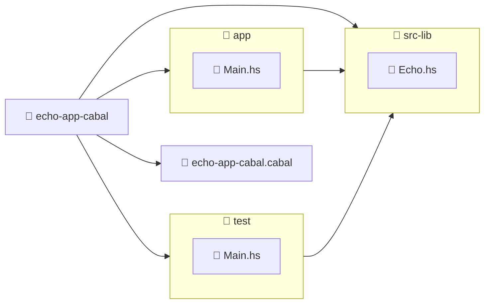

import ReadingTime from '@site/src/components/ReadingTime'
import GitHubRepoLink from '@site/src/components/GithubRepoLink'
import Explanation from '@site/src/components/admonitions/Explanation'
import BoxedTabs from '@site/src/components/cajitas/BoxedTabs'
import TabItem from '@theme/TabItem'

<ReadingTime />
<GitHubRepoLink user="r8vnhill" repo="echo-app-cabal" />

En esta lección aprenderás a estructurar un proyecto en **Haskell** con múltiples módulos usando **Cabal**, la herramienta oficial del ecosistema. Veremos cómo separar la lógica principal en una biblioteca reutilizable, cómo escribir un ejecutable que la consuma, y cómo preparar el terreno para agregar pruebas automatizadas más adelante.

Este enfoque modular es especialmente importante si vienes del mundo de las bibliotecas en Kotlin o Scala, donde separar `lib` y `app` es una práctica común. En Haskell, esa separación también es posible (y deseable), y nos permite escribir código más mantenible, reutilizable y listo para crecer.

A lo largo del camino:

- Construiremos un proyecto llamado `echo-app-cabal` con una estructura clara y bien definida.
- Implementaremos una función simple para imprimir mensajes.
- Veremos cómo pasar argumentos desde la terminal para probar su reutilización.
- Y ajustaremos el archivo `.cabal` para conectar todo de forma explícita.

Como siempre en este curso, no solo veremos el *cómo*, sino también el *por qué*. Porque entender la intención detrás de las decisiones de diseño es lo que te convierte en alguien que no solo usa herramientas, sino que sabe cuándo y cómo usarlas.

初め！

## 🧱 Estructura esperada



:::info Explicación de la estructura del proyecto

Este diagrama representa la estructura resultante tras ejecutar `cabal init` con soporte para biblioteca, ejecutable y pruebas.

- **📁 `echo-app-cabal/`**: Carpeta raíz del proyecto. Contiene el archivo de configuración y las carpetas de código.
    - **📄 `echo-app-cabal.cabal`**: Archivo central de configuración. Define los targets (`library`, `executable`, `test-suite`), las dependencias, opciones de compilación y metadatos del paquete.
- **📁 `src-lib/`**: Contiene el código fuente de la biblioteca.  
  - **📄 `Echo.hs`**: Define funciones reutilizables que se pueden importar desde otras partes del proyecto.
- **📁 `app/`**: Contiene el ejecutable principal de la aplicación.  
  - **📄 `Main.hs`**: Módulo de entrada con la función `main`. Importa y utiliza funciones definidas en `src-lib`.
- **📁 `test/`**: Contiene la suite de pruebas del proyecto.  
  - **📄 `Main.hs`**: Punto de entrada de las pruebas. También importa la biblioteca (`src-lib`) para verificar su comportamiento.

Las flechas del diagrama indican **relaciones de dependencia**:
- El ejecutable (`app/Main.hs`) **usa** código de la biblioteca (`src-lib/Echo.hs`).
- Las pruebas (`test/Main.hs`) también **dependen** de la biblioteca para poder verificar su funcionalidad.

Esta separación permite una arquitectura modular, donde la lógica central reside en la biblioteca (`src-lib`), y tanto la aplicación como las pruebas la consumen de forma independiente.  
Esto favorece la reutilización de código, facilita el testing, y prepara el terreno para publicar la biblioteca en el futuro.

:::

## 🧪 Paso 1: Crear un módulo de biblioteca

Primero definiremos una pequeña biblioteca que nos permita imprimir mensajes con un formato determinado.  
Vamos a crear el archivo `src-lib/Echo.hs` con el siguiente contenido:

```haskell title="src-lib/Echo.hs"
module Echo (echoMessage) where

echoMessage :: String -> IO ()
echoMessage msg = do
    putStrLn msg
```

<Explanation>
    En este paso creamos un **módulo llamado `Echo`** que define una función pública `echoMessage`.  
    Esta función toma un texto (`String`) y lo imprime por pantalla (`IO ()`).  
    El archivo está ubicado dentro del directorio `src-lib/`, que configuramos como origen de la biblioteca durante el `cabal init`.

    - `module Echo (echoMessage) where`: declara el nombre del módulo y exporta la función `echoMessage`.
    - `echoMessage :: String -> IO ()`: especifica que la función recibe un texto y produce una acción de entrada/salida.
    - `putStrLn msg`: imprime el mensaje en la consola.
</Explanation>

**Por ahora comenzamos con una versión simple**, pero en pasos posteriores le agregaremos más funcionalidades útiles, como imprimir la hora actual junto al mensaje.  
Esto nos permitirá reutilizar `echoMessage` tanto en la aplicación principal como en otros contextos del proyecto.

## 🚀 Paso 2: Usar la biblioteca desde el ejecutable

Ahora que tenemos una función `echoMessage` en nuestra biblioteca, vamos a usarla desde el ejecutable.  
Edita el archivo `app/Main.hs` para que reciba argumentos desde la línea de comandos y los imprima uno por uno con nuestra función:

```haskell title="app/Main.hs" showLineNumbers
module Main where

import Echo (echoMessage)
import System.Environment (getArgs)
import Control.Monad (forM_)

main :: IO ()
main = do
    messages <- getArgs
    forM_ messages $ \msg -> 
        echoMessage msg
```

<Explanation>
    En este paso creamos el **punto de entrada de la aplicación**, donde conectamos el ejecutable con la biblioteca `Echo`.

    - `getArgs`: obtiene los argumentos pasados al programa desde la línea de comandos.
    - `forM_ messages $ \msg -> ...`: recorre cada argumento (`msg`) y lo pasa a `echoMessage` para imprimirlo.
    - `echoMessage msg`: delega en la biblioteca la lógica de impresión.

    Este diseño ya nos permite probar la reutilización del módulo `Echo`, y sienta las bases para seguir extendiéndolo.  
</Explanation>

<details>
    <summary>ℹ️ ¿Qué es <code>forM_</code> y por qué usamos <code>Control.Monad</code>?</summary>

    En Haskell, `forM_` es una función de la librería `Control.Monad` que permite recorrer una lista realizando acciones de tipo `IO`, **sin acumular los resultados**.

    ```haskell
    forM_ :: Monad m => [a] -> (a -> m b) -> m ()
    ```

    Es equivalente a `mapM_`, pero con los argumentos en orden más natural: primero la lista, luego la acción.

    Usamos `forM_` en lugar de un bucle tradicional porque Haskell no tiene bucles imperativos como `for` o `while`.  
    En su lugar, usamos funciones de orden superior como `mapM_`, `forM_` o recursión explícita para recorrer listas y realizar efectos colaterales.

    Importamos `Control.Monad` porque ahí se definen estas funciones monádicas útiles para trabajar con efectos como `IO`, listas, `Maybe`, etc.
</details>

## ⚙️ Paso 3: Ajustar el archivo `.cabal`

A continuación, ajustaremos el archivo `echo-app-cabal.cabal` para que el ejecutable y la suite de pruebas puedan acceder a la biblioteca definida en `src-lib`.

<BoxedTabs>
  <TabItem label={"Código esencial"} value={"Código esencial"}>
    ```haskell showLineNumbers title="echo-app-cabal.cabal"
    -- Nombre del proyecto
    name:               echo-app-cabal

    -- Configuración de la biblioteca
    library
      exposed-modules:  Echo
      hs-source-dirs:   src-lib

    -- Ejecutable que usa la biblioteca
    executable echo-app-cabal
      main-is:          Main.hs
      hs-source-dirs:   app
      build-depends:
        echo-app-cabal

    -- Suite de pruebas que también depende de la biblioteca
    test-suite echo-app-cabal-test
      hs-source-dirs:   test
      main-is:          Main.hs
      build-depends:
        echo-app-cabal
    ```
  </TabItem>

  <TabItem label={"Código completo"} value={"Código completo"}>
    ```haskell showLineNumbers title="echo-app-cabal.cabal"
    cabal-version:      3.0
    name:               echo-app-cabal
    version:            0.1.0.0
    homepage:           https://dibs.pages.dev
    license:            BSD-2-Clause
    license-file:       LICENSE
    author:             r8vnhill
    maintainer:         reachme@ravenhill.cl
    build-type:         Simple
    extra-doc-files:    CHANGELOG.md

    common warnings
      ghc-options: -Wall

    library
      import:           warnings
      exposed-modules:  Echo
      build-depends:    base ^>=4.17.2.1
      hs-source-dirs:   src-lib
      default-language: GHC2021

    executable echo-app-cabal
      import:           warnings
      main-is:          Main.hs
      build-depends:
        base ^>=4.17.2.1,
        echo-app-cabal
      hs-source-dirs:   app
      default-language: GHC2021

    test-suite echo-app-cabal-test
      import:           warnings
      default-language: GHC2021
      type:             exitcode-stdio-1.0
      hs-source-dirs:   test
      main-is:          Main.hs
      build-depends:
        base ^>=4.17.2.1,
        echo-app-cabal
    ```
  </TabItem>
</BoxedTabs>

<Explanation>
    El archivo `.cabal` define cómo se construyen los distintos componentes del proyecto:

    - En la sección `library`, declaramos el módulo `Echo` como expuesto y lo ubicamos en `src-lib/`.
    - En el bloque `executable`, indicamos que `Main.hs` es el punto de entrada y que este ejecutable depende de la biblioteca `echo-app-cabal` (sí, el mismo nombre del proyecto).
    - En `test-suite`, hacemos lo mismo: configuramos el punto de entrada y declaramos la dependencia hacia la biblioteca.

    De esta forma, tanto el ejecutable como la suite de pruebas pueden importar y reutilizar código desde el módulo `Echo`.
</Explanation>

## ▶️ Paso 4: Ejecutar el proyecto

Con la biblioteca, el ejecutable y la configuración listos, ahora podemos compilar y ejecutar el programa desde la raíz del proyecto.

Ejecuta el siguiente comando:

```bash
cabal run echo-app-cabal -- "Hi Barbie!" "Hi Ken!" "Do you guys ever think about dying?"
```

La salida será algo como:

```plaintext
Hi Barbie!
Hi Ken!
Do you guys ever think about dying?
```

<Explanation>
    Usamos `cabal run` seguido del nombre del ejecutable (`echo-app-cabal`) y una serie de argumentos entre comillas.  
    Estos argumentos se transforman en una lista de `String` que `getArgs` recibe en `Main.hs`.

    Luego, cada uno se imprime línea por línea mediante `forM_`, usando la función `echoMessage` de nuestra biblioteca.

</Explanation>

👉 Este paso comprueba que **el ejecutable está correctamente conectado a la biblioteca** y que **puede recibir entradas dinámicas desde la línea de comandos**, lo que lo hace mucho más flexible y útil.

## 🎯 Conclusiones

Dividir un proyecto Haskell en múltiples módulos no es solo una cuestión de orden: es una forma de expresar con claridad qué partes del código son reutilizables, cuáles se ejecutan como aplicación y cuáles prueban su correcto funcionamiento. Esta separación de responsabilidades es clave al diseñar bibliotecas, y en esta lección dimos nuestros primeros pasos en esa dirección.

Aprendimos a usar `cabal init` para crear un proyecto bien estructurado, a definir una biblioteca simple con una función exportada, y a configurar el ejecutable para que la consuma. También comprendimos cómo ajustar el archivo `.cabal` para reflejar estas relaciones y cómo ejecutar el programa con argumentos reales desde la terminal.

Este ejercicio no solo nos enseñó herramientas, sino también una forma de pensar: **crear software reutilizable, modular y preparado para crecer**.

### 🔑 Puntos clave

- Crear un proyecto con `cabal init` permite estructurar desde el inicio la biblioteca, el ejecutable y las pruebas.
- Definir módulos separados facilita la reutilización y el mantenimiento del código.
- El archivo `.cabal` actúa como contrato entre los componentes: describe qué se construye, desde dónde y con qué dependencias.
- La función `getArgs` permite capturar argumentos desde la terminal, y `forM_` es una forma idiomática de recorrerlos.
- Tanto la app como los tests pueden importar lógica común desde la biblioteca.

### 🧰 ¿Qué nos llevamos?

Esta lección nos mostró que un proyecto no comienza cuando escribimos código, sino cuando tomamos decisiones sobre su estructura.  
Separar la lógica reutilizable en una biblioteca, definir un ejecutable claro y configurar correctamente los archivos del proyecto es lo que transforma un conjunto de archivos en una base sólida para construir software real.

Pero también nos llevamos algo más sutil: que **la forma en que organizamos nuestro código influye en cómo pensamos nuestros programas**.  
Cuando estructuramos bien, podemos escribir menos y lograr más. Podemos componer, reutilizar y probar.  
Y cuando eso ocurre, lo que estamos creando no es solo un programa... es una biblioteca que puede vivir más allá del proyecto original.

## 📖 Referencias

### 🔥 Recomendadas

- 🌐 Structure of a Haskell project—HaskellWiki. (s. f.). Recuperado 5 de abril de 2025, de https://wiki.haskell.org/Structure_of_a_Haskell_project

{/* ### 🔹 Adicionales */}
