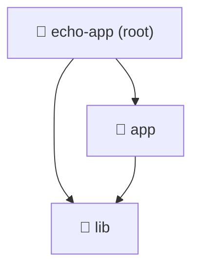

import ReadingTime from '@site/src/components/ReadingTime'
import { ProCons, Pros, Cons } from '@site/src/components/cajitas/ProCons'
import References from '@site/src/components/ReferencesComponent'
import Tabs from '@theme/Tabs'
import TabItem from '@theme/TabItem'
import Exercise from '@site/src/components/exercise/Exercise'
import Solution from '@site/src/components/exercise/Solution'
import Hint from '@site/src/components/exercise/Hint'
import Definition from '@site/src/components/Definition'
import Corollary from '@site/src/components/Corollary'
import GithubRepoLink from '@site/src/components/GithubRepoLink'
import { LanguageCard, PoetryCard } from '@site/src/components/cards/LanguageCard'
import Explanation from '@site/src/components/admonitions/Explanation'
import RepoClone from '@site/src/components/admonitions/RepoClone'

<ReadingTime />
<GithubRepoLink user="r8vnhill" repo="echo-app-maven" />

Cuando trabajamos con **Maven** en proyectos que contienen múltiples módulos, es fundamental configurar correctamente el archivo `pom.xml` del proyecto raíz. Este archivo define la estructura del proyecto, permitiendo organizar módulos de manera eficiente y facilitando la reutilización del código.

En esta lección, exploraremos cómo configurar proyectos multi-módulo en Maven, entenderemos el papel de las **dependencias**, y aprenderemos a gestionar versiones de manera centralizada utilizando un **BOM (Bill of Materials)**. Estas prácticas son clave para desarrollar bibliotecas de software modulares y mantenibles.

## 🛠️ `pom.xml` en proyectos multi-módulo

El archivo `pom.xml` es el núcleo de la configuración en Maven. En un **proyecto multi-módulo**, el `pom.xml` del proyecto raíz se conoce como **"POM padre"**, y los submódulos heredan su configuración.

En el caso de nuestro proyecto, comenzaríamos con un archivo `pom.xml` simple en el directorio raíz:

```xml showLineNumbers title="pom.xml (proyecto raíz)"
<project xmlns="http://maven.apache.org/POM/4.0.0"
         xmlns:xsi="http://www.w3.org/2001/XMLSchema-instance"
         xsi:schemaLocation="http://maven.apache.org/POM/4.0.0
         http://maven.apache.org/maven-v4_0_0.xsd">
    <modelVersion>4.0.0</modelVersion>

    <groupId>com.github.username</groupId>
    <artifactId>echo-app-maven</artifactId>
    <packaging>pom</packaging>
    <version>1.0-SNAPSHOT</version>
    <name>echo-app-maven</name>

    <modules>
        <module>app</module>
        <module>lib</module>
    </modules>
</project>
```

<Explanation>
    - **`<packaging>pom</packaging>`** → Indica que este módulo es solo un contenedor de otros módulos y no generará un artefacto propio.
    - **`<modules>`** → Lista los submódulos que forman parte del proyecto. Cada entrada dentro de `<modules>` debe coincidir con una carpeta dentro del directorio raíz del proyecto.
    - **Herencia de configuración** → Los submódulos heredan automáticamente configuraciones comunes del `pom.xml` principal, lo que permite evitar redundancias en cada módulo individual.
    - **Compilación en cascada** → Cuando ejecutamos `mvn install` desde el directorio raíz, Maven compilará primero los submódulos en el orden definido dentro de `<modules>`, asegurando que las dependencias internas se resuelvan correctamente.
</Explanation>

## 📂 Proyectos Multi-Módulo en Maven

En proyectos grandes, gestionar todo en un único módulo puede volverse ineficiente y difícil de mantener. Dividir el código en módulos facilita la reutilización y mejora la modularidad. 

A diferencia de otros sistemas de construcción, en Maven:
- **Cada módulo tiene su propio `pom.xml`**, que puede definir dependencias específicas.
- **Los módulos heredan configuraciones del POM padre**, pero pueden sobrescribirlas si es necesario.

### 📌 Estructura de un Proyecto Multi-Módulo en Maven



:::info Estructura del Proyecto

- **📂 `echo-app (root)`**: Contiene el POM padre (`pom.xml`), que define la estructura del proyecto.
- **📂 `app` (módulo de aplicación)**: Contiene la lógica principal y depende del código en `lib`.
- **📂 `lib` (módulo de biblioteca)**: Contiene código reutilizable que puede ser consumido por `app` y otros proyectos.

:::

Cada submódulo tiene su propio `pom.xml`. Por ejemplo, el módulo `app` incluiría lo siguiente:

```xml showLineNumbers title="app/pom.xml"
<project xmlns="http://maven.apache.org/POM/4.0.0"
         xmlns:xsi="http://www.w3.org/2001/XMLSchema-instance"
         xsi:schemaLocation="http://maven.apache.org/POM/4.0.0
         http://maven.apache.org/xsd/maven-4.0.0.xsd">
    <modelVersion>4.0.0</modelVersion>

    <parent>
        <groupId>com.github.username</groupId>
        <artifactId>echo-app-maven</artifactId>
        <version>1.0-SNAPSHOT</version>
    </parent>

    <artifactId>app</artifactId>

    <dependencies>
        <dependency>
            <groupId>com.github.username</groupId>
            <artifactId>lib</artifactId>
            <version>1.0-SNAPSHOT</version>
        </dependency>
    </dependencies>
</project>
```

<Explanation>
    - **`<parent>`** → Define que este módulo (`app`) hereda la configuración del `pom.xml` del proyecto raíz (`echo-app-maven`). Esto evita la necesidad de duplicar configuraciones comunes en cada submódulo.
    - **`<artifactId>app</artifactId>`** → Especifica el identificador único para este módulo dentro del proyecto.
    - **`<dependencies>`** → Declara las dependencias necesarias para este módulo. 
        - En este caso, el módulo `app` depende del módulo `lib`, por lo que se incluye como una dependencia.
        - Como ambos módulos pertenecen al mismo proyecto, se usa la misma `groupId` (`com.github.username`) y la misma versión (`1.0-SNAPSHOT`).
    - **Gestión de versiones** → Al heredar del `POM` padre, este módulo puede omitir ciertas configuraciones como la versión de `Maven` o plugins, ya que serán tomadas del `pom.xml` raíz.
    - **Compilación jerárquica** → Cuando se ejecuta `mvn install` en el directorio raíz, primero se compilará `lib` (porque `app` depende de él) y luego `app`, asegurando que todas las dependencias internas estén disponibles.
</Explanation>

## 🏗️ Gestión de Dependencias en Maven

### 📦 Herencia vs. Dependencias en Multi-Módulo

A diferencia de otros sistemas de construcción, en Maven un **módulo puede heredar configuraciones globales** a través de `<parent>`, pero debe **declarar explícitamente sus dependencias** en `<dependencies>`. Esto es crucial para mantener independencia entre módulos.

### 🔥 Bill of Materials (BOM)

Maven permite gestionar versiones de dependencias de manera centralizada usando un **BOM (Bill of Materials)**. Esto se logra a través del `dependencyManagement`, que permite definir versiones sin repetirlas en cada módulo.

Ejemplo de un BOM en el `pom.xml` raíz:

```xml showLineNumbers title="pom.xml"
<dependencyManagement>
    <dependencies>
        <dependency>
            <groupId>org.springframework.boot</groupId>
            <artifactId>spring-boot-dependencies</artifactId>
            <version>3.0.0</version>
            <scope>import</scope>
            <type>pom</type>
        </dependency>
    </dependencies>
</dependencyManagement>
```

<Explanation>
    - **`dependencyManagement`** centraliza versiones de dependencias.
    - **Los módulos hijos pueden usar estas dependencias sin especificar la versión.**
</Explanation>

## 📊 Comparación entre Maven y Gradle en Proyectos Multi-Módulo

| **Aspecto**               | **Maven**                                  | **Gradle**                                   |
|--------------------------|------------------------------------------|----------------------------------------------|
| **Definición de módulos** | Se usa `<modules>` en el `pom.xml` raíz  | Se usa `include(":modulo")` en `settings.gradle.kts` |
| **Herencia de configuración** | Se logra con `<parent>` en cada `pom.xml` | Se logra con `plugins` y `subprojects` |
| **Manejo de versiones** | Se centraliza con un **BOM** | Se centraliza con un **catálogo de versiones** |
| **Compilación incremental** | No soporta compilación incremental | Sí soporta compilación incremental |
| **Flexibilidad** | Estricto, basado en XML | Más flexible, basado en código |
| **Ecosistema** | Usado en grandes proyectos empresariales | Preferido en proyectos modernos y startups |

### ⚖️ Beneficios y limitaciones

<ProCons>
    <Pros>
        - **Estandarización**: Maven sigue convenciones estrictas, lo que hace que su estructura sea predecible.
        - **Compatibilidad con grandes proyectos**: Usado en entornos empresariales con dependencias complejas.
    </Pros>
    <Cons>
        - **Menos flexibilidad**: No permite definir tareas personalizadas fácilmente.
        - **XML más verboso**: Las configuraciones pueden ser largas y difíciles de leer.
    </Cons>
</ProCons>

## 🎯 Conclusiones

A lo largo de esta lección, hemos explorado la configuración de **proyectos multi-módulo en Maven**, abordando su estructura, gestión de dependencias y diferencias con otros sistemas de construcción como **Gradle**. Esta configuración es fundamental para desarrollar **bibliotecas de software** modulares, reutilizables y mantenibles.

### 🔑 Puntos clave

1. **Maven estructura proyectos multi-módulo con un POM padre (`pom.xml`)**  
   - Define la relación entre los módulos y permite que hereden configuraciones comunes.
   - Facilita la organización de grandes proyectos en componentes independientes.
2. **Cada módulo tiene su propio `pom.xml`, pero hereda configuraciones del POM padre**  
   - La herencia simplifica la configuración, evitando duplicación innecesaria.
   - A diferencia de Gradle, las dependencias deben declararse explícitamente en cada módulo.
3. **La compilación en Maven es jerárquica**  
   - Maven compila primero los módulos en el orden especificado dentro de `<modules>`.
   - Asegura que las dependencias internas estén disponibles antes de compilar otros módulos.
4. **Manejo centralizado de versiones con BOM (`Bill of Materials`)**  
   - Permite definir versiones de dependencias en un solo lugar.
   - Los módulos pueden utilizar estas dependencias sin necesidad de especificar la versión.
5. **Diferencias clave entre Maven y Gradle en proyectos multi-módulo**  
   - **Maven** es más estricto y basado en XML, con una estructura rígida pero predecible.
   - **Gradle** ofrece mayor flexibilidad con su DSL basada en código, lo que facilita la configuración de tareas personalizadas.

### ✅ Cuándo elegir Maven sobre Gradle

Maven es una excelente opción en los siguientes casos:

✔️ **Proyectos empresariales grandes** con múltiples equipos, donde la estandarización y la compatibilidad son clave.  
✔️ **Sistemas con muchas dependencias** que necesitan versiones bien controladas y estabilidad.  
✔️ **Organizaciones que ya usan Maven** y buscan continuidad en herramientas y flujos de trabajo.  

### ⚠️ Cuándo considerar Gradle en su lugar

En cambio, **Gradle** puede ser preferible si:

❌ **Se requiere mayor flexibilidad**, ya que permite definir tareas personalizadas de forma más sencilla.  
❌ **Se busca optimizar tiempos de compilación**, dado que Gradle admite compilación incremental.  
❌ **Se quiere evitar XML verboso**, optando por una sintaxis más concisa y expresiva.  

### 🚀 Reflexión final

El uso de **proyectos multi-módulo en Maven** permite escalar aplicaciones y bibliotecas de manera eficiente, promoviendo la **separación de responsabilidades** y la **modularidad**. Si bien Gradle ofrece más flexibilidad, **Maven sigue siendo la opción preferida en proyectos empresariales** por su predictibilidad y amplia adopción en el ecosistema Java.  

<References references={[
    {
        title: "Multi-module Projects",
        bookTitle: "Apache Maven cookbook: Over 90 hands-on recipes to successfully build and automate development life cycle tasks following Maven conventions and best practices",
        publisher: "Packt Publishing",
        pages: "177–195",
        year: "2015",
        author: "Raghuram Bharathan",
        type: "book",
    },    
]} additionalReferences={[
    {
        title: "Guide to Working with Multiple Subprojects in Maven 4",
        url: "https://maven.apache.org/guides/mini/guide-multiple-subprojects-4.html",
        accessedDate: "20 de marzo de 2025",
        type: "web",
        // Último acceso: 20 de marzo de 2025
    },
]}/>
