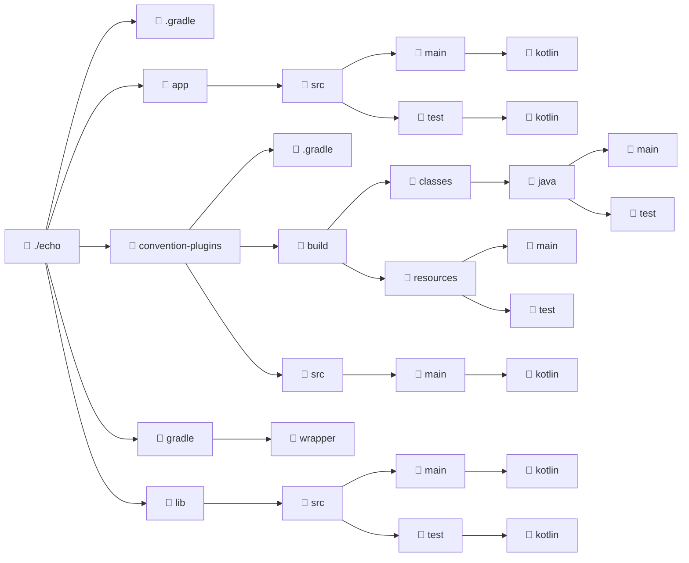

import ReadingTime from '@site/src/components/ReadingTime'
import { ProCons, Pros, Cons } from '@site/src/components/cajitas/ProCons'
import References from '@site/src/components/ReferencesComponent'
import Tabs from '@theme/Tabs'
import TabItem from '@theme/TabItem'
import Exercise from '@site/src/components/exercise/Exercise'
import Solution from '@site/src/components/exercise/Solution'
import Hint from '@site/src/components/exercise/Hint'
import Definition from '@site/src/components/Definition'
import Corollary from '@site/src/components/Corollary'
import GithubRepoLink from '@site/src/components/GithubRepoLink'
import { LanguageCard } from '@site/src/components/cards/LanguageCard'
import Explanation from '@site/src/components/admonitions/Explanation'
import RepoClone from '@site/src/components/admonitions/RepoClone'
import BoxedTabs from '@site/src/components/cajitas/BoxedTabs'

<ReadingTime />
<GithubRepoLink user="r8vnhill" repo="echo-app-kt" />

En proyectos con múltiples módulos, es común y recomendable contar con un módulo dedicado a centralizar configuraciones compartidas que puedan ser reutilizadas por el resto del proyecto. En el contexto de **Gradle**, a este tipo de módulo se le conoce como un **convention plugin**, y también se asocia con el patrón conocido como **`buildSrc`**.

Estos plugins permiten consolidar configuraciones comunes, lo que mejora la consistencia entre módulos y simplifica el mantenimiento general del proyecto.

Más adelante profundizaremos en el uso de plugins personalizados dentro del ecosistema Gradle. Por ahora, comenzaremos con una configuración básica.

## 🧩 Configuración de un Convention Plugin

Lo primero que debemos hacer es definir un módulo que se cargue **antes que los demás**. Esto se configura en el archivo `settings.gradle.kts`, asegurando que el módulo de plugins esté disponible para el resto del proyecto desde el inicio.

```kotlin showLineNumbers title="settings.gradle.kts"
// ...
pluginManagement {
    includeBuild("convention-plugins")
    repositories {
        mavenCentral()
        gradlePluginPortal()
    }
}
```

<Explanation>
    - **[2–8]**: Esta sección configura la gestión de plugins en Gradle. Aquí es posible personalizar cómo se resuelven y desde dónde se descargan.
    - **[3]**: Se incluye el módulo `convention-plugins` como un *build externo* (`includeBuild`). Este módulo contendrá las configuraciones comunes que serán aplicadas automáticamente en el resto del proyecto. Al estar declarado aquí, se garantiza que se cargue antes que los demás módulos.
    - **[4–7]**: Se definen los repositorios desde los cuales se obtendrán los plugins:
        - **[5]**: `mavenCentral()`: Repositorio central de Maven, ampliamente utilizado para dependencias y plugins.
        - **[6]**: `gradlePluginPortal()`: Repositorio oficial de Gradle para plugins.
</Explanation>

## 🗂️ Configuración de Convention Plugins

El siguiente paso es crear la estructura de directorios necesaria para definir nuestros *convention plugins*. Estos plugins encapsulan configuraciones comunes que podrán ser reutilizadas en otros módulos del proyecto. 

En este ejemplo, omitiremos el directorio de pruebas, ya que este tipo de módulo no suele requerir código testeable: su propósito es únicamente configurar comportamientos comunes.

### 🏗️ Crear la Estructura de Directorios

Primero, crea el directorio donde ubicaremos el código fuente del plugin de convenciones:

<BoxedTabs groupId={"os"}>
    <TabItem value="Windows" label="Windows">
        ```powershell
        New-Item -Path "convention-plugins\src\main\kotlin" `
            -ItemType "Directory" `
            -Force
        ```

        <Explanation>  
            Este comando crea el directorio `convention-plugins\src\main\kotlin`, incluyendo todas las carpetas intermedias si no existen. El parámetro `-ItemType "Directory"` indica que se debe crear un directorio, y `-Force` asegura que no falle si alguna parte del path ya existe. La barra invertida invertida (`` ` ``) al final de cada línea permite dividir el comando en varias líneas para mayor legibilidad.  
        </Explanation>
    </TabItem>
    <TabItem value={"Windows (corto)"} label={"Windows (corto)"}>
        ```powershell
        md "convention-plugins\src\main\kotlin" -f
        ```

        <Explanation>  
            Este comando utiliza el alias `md` (abreviatura de `mkdir`) para crear el directorio `convention-plugins\src\main\kotlin`, incluyendo cualquier carpeta intermedia que no exista. El parámetro `-f` (de *force*) evita errores si el directorio ya existe. Esta es una forma más corta y comúnmente usada en PowerShell para crear directorios.  
        </Explanation>
    </TabItem>
    <TabItem value="Linux/macOS" label="Linux/macOS">
        ```bash
        mkdir -p convention-plugins/src/main/kotlin
        ```

        <Explanation>  
            Este comando crea el directorio `convention-plugins/src/main/kotlin` y, gracias al parámetro `-p`, también crea automáticamente cualquier directorio intermedio que no exista. Es una forma segura y habitual de crear estructuras de carpetas en sistemas basados en Unix (Linux y macOS), sin generar errores si los directorios ya existen.  
        </Explanation>
    </TabItem>
</BoxedTabs>

### ⚙️ Configuración de `settings.gradle.kts`

Dentro de la carpeta principal `convention-plugins`, debemos crear el archivo `settings.gradle.kts`. Este archivo configura el nombre del proyecto, la gestión de plugins y la resolución de dependencias para este módulo.

```kotlin showLineNumbers title="convention-plugins/settings.gradle.kts"
rootProject.name = "convention-plugins"

// Gestión de plugins y definición de repositorios para su descarga
pluginManagement {
    repositories {
        mavenCentral()
        gradlePluginPortal()
    }
}

// Configuración para la resolución de dependencias
@Suppress("UnstableApiUsage")
dependencyResolutionManagement {
    repositories {
        mavenCentral()
        gradlePluginPortal()
    }

    // Definición de un catálogo centralizado de versiones de dependencias
    versionCatalogs {
        create("libs") {
            from(files("../gradle/libs.versions.toml"))
        }
    }
}
```

<Explanation>
    Este archivo `settings.gradle.kts` define la configuración principal del módulo `convention-plugins`. En la línea 1 se establece el nombre del proyecto, necesario para que Gradle lo identifique correctamente como un build independiente.

    La sección `pluginManagement` (líneas 4–9) indica desde qué repositorios deben descargarse los plugins utilizados en este módulo. Aquí se usan `mavenCentral()` y `gradlePluginPortal()`, que cubren la mayoría de los plugins comunes en proyectos Java y Kotlin.

    La sección `dependencyResolutionManagement` (líneas 12–25) configura cómo se resolverán las dependencias declaradas en los archivos `build.gradle.kts` del módulo. Se especifican los mismos repositorios, y además se declara un catálogo de versiones (`versionCatalogs`) en la línea 20, apuntando al archivo `libs.versions.toml` ubicado fuera del módulo. Este catálogo permite mantener versiones centralizadas y consistentes en todos los módulos del proyecto.

    :::note `@Suppress("UnstableApiUsage")`

    Se incluye la anotación `@Suppress("UnstableApiUsage")` porque la propiedad `repositories` dentro de `dependencyResolutionManagement` se considera **inestable** en las versiones actuales de Gradle, y su uso genera un warning en compilaciones con Kotlin DSL.

    :::
</Explanation>

<details>
    <summary>¿Por qué aparece el warning sobre "UnstableApiUsage"?</summary>

    En el archivo `settings.gradle.kts` del módulo `convention-plugins`, se utiliza la anotación `@Suppress("UnstableApiUsage")` antes de la configuración de `dependencyResolutionManagement`. Esto se debe a que, en las versiones actuales de Gradle, al invocar `repositories` dentro de `dependencyResolutionManagement`, se genera una advertencia indicando que la función está marcada como inestable con la anotación `@Incubating`.

    La anotación `@Incubating` en Gradle señala que una característica o API está en fase de incubación, lo que significa que aún está en desarrollo y podría sufrir cambios en futuras versiones. Aunque estas funcionalidades son utilizables, es importante ser consciente de su estado y de la posibilidad de modificaciones. Para suprimir las advertencias relacionadas con el uso de APIs inestables, se emplea `@Suppress("UnstableApiUsage")`, lo que permite mantener el código limpio y sin advertencias innecesarias.

    Es recomendable revisar periódicamente la documentación oficial de Gradle para estar al tanto del estado de las APIs utilizadas y ajustar el código en consecuencia a medida que evolucionan hacia versiones estables.
</details>

Tu sección está muy bien enfocada, pero puede beneficiarse de una redacción un poco más fluida, una explicación clara del propósito del archivo, y una descripción de por qué se usa `kotlin-dsl` y `libs.kotlin.gradle.plugin`.

### 🛠️ Crear el archivo de construcción

Dentro de la carpeta `convention-plugins`, crea un archivo de construcción llamado `build.gradle.kts`. Este archivo define cómo se compilará y configurará el módulo de plugins de convención.

A continuación, el contenido básico para iniciar el módulo:

```kotlin showLineNumbers title="convention-plugins/build.gradle.kts"
plugins {
    `kotlin-dsl`
}

repositories {
    mavenCentral()
    gradlePluginPortal()
}

dependencies {
    implementation(libs.kotlin.gradle.plugin)
}
```

<Explanation>
    Este archivo `build.gradle.kts` define cómo se construye el módulo `convention-plugins`:

    - **[2]** `kotlin-dsl`: Aplica el plugin de Kotlin DSL, necesario para escribir scripts de Gradle en Kotlin y habilitar autocompletado y validación estática dentro de los archivos `.gradle.kts`.
    - **[5–8]** `repositories`: Declara los repositorios desde los cuales se resolverán los plugins y dependencias que se utilicen en este módulo. Se incluyen `mavenCentral()` y `gradlePluginPortal()` por compatibilidad y disponibilidad.
    - **[11]** `implementation(libs.kotlin.gradle.plugin)`: Agrega como dependencia el plugin de Gradle para Kotlin. Esta línea asume que el proyecto está utilizando un catálogo de versiones (`libs.versions.toml`) donde se encuentra declarada `kotlin.gradle.plugin`, lo cual permite mantener las versiones de dependencias centralizadas y consistentes.
</Explanation>

Tu sección está muy bien estructurada y clara. Solo haría **pequeñas mejoras de estilo y fluidez** para que la redacción sea más natural y didáctica, especialmente al introducir el concepto de convenciones y la progresión del ejemplo.

## 🧪 Mi Primer Plugin

<Definition title="Plugin" id="plugin-def">
    Un **plugin** es un componente de software que extiende o modifica la funcionalidad de un sistema existente.  
    En el contexto de Gradle, un plugin es un conjunto de tareas, configuraciones y comportamientos que se pueden aplicar a un proyecto para automatizar su construcción y administración.
</Definition>

Gradle permite definir plugins de distintas formas. Una de las más utilizadas es mediante **plugins de convención**, que encapsulan configuraciones comunes aplicadas automáticamente a todos los subproyectos de un proyecto.

En esta sección, crearemos un plugin de convención básico para proyectos basados en la JVM. Comenzaremos con una configuración mínima y la iremos expandiendo en las siguientes secciones.

### ✨ Creando el Plugin

Primero, vamos a crear el archivo que contendrá nuestro plugin. Dentro de la carpeta `convention-plugins/src/main/kotlin`, crea un archivo llamado `jvm.conventions.gradle.kts` con el siguiente contenido:

```kotlin showLineNumbers title="convention-plugins/src/main/kotlin/jvm.conventions.gradle.kts"
plugins {
    kotlin("jvm")
}

kotlin {
    jvmToolchain {
        languageVersion = JavaLanguageVersion.of(21)
    }
}
```

<Explanation>
    Este archivo define un **plugin de convención** que aplica automáticamente el plugin `kotlin("jvm")` y configura la versión del compilador de Java a través del bloque `jvmToolchain`.

    - **[2]**: Aplica el plugin de Kotlin para la JVM. Al estar definido en un archivo de convención, se aplicará de forma implícita a todos los módulos que utilicen este plugin.
    - **[5–9]**: Configura la herramienta de compilación (`jvmToolchain`) para usar Java 21 como versión del lenguaje. Esto garantiza que todos los proyectos que usen este plugin compilen con la misma versión de Java, asegurando compatibilidad y consistencia.
</Explanation>

#### ❓ ¿Por qué no especificamos la versión del plugin?

Aunque es común declarar el plugin con una versión explícita, como en el siguiente ejemplo:

```kotlin showLineNumbers
plugins {
    kotlin("jvm") version "2.1.20"
}
```

en este caso **no es necesario**, ya que hemos centralizado la gestión de versiones mediante el archivo `libs.versions.toml`. Esta estrategia asegura que todas las dependencias y plugins de Kotlin utilicen la misma versión, facilitando su actualización y manteniendo coherencia en todo el proyecto.

### 📦 Usando el Plugin

Una vez creado nuestro plugin de convenciones, podemos aplicarlo en los subproyectos donde queramos que se utilicen esas configuraciones comunes. En este ejemplo, lo aplicaremos en dos subproyectos: `app` y `lib`.

Primero, necesitamos crear las carpetas correspondientes para cada subproyecto. Puedes hacerlo con los siguientes comandos según tu sistema operativo:

<BoxedTabs>
    <TabItem value="Windows" label="Windows">
        ```powershell
        "src\main\kotlin" | ForEach-Object { 
            "app\$_", "lib\$_" | ForEach-Object { 
                New-Item -Path $_ -ItemType "Directory" -Force 
            }
        }
        ```

        <Explanation>
            Este fragmento utiliza dos bucles `ForEach-Object` anidados para crear de forma concisa los directorios `app\src\main\kotlin` y `lib\src\main\kotlin`.

            - En el primer pipeline (`"src\main\kotlin"`), se define el segmento de ruta común que será añadido a cada módulo.
            - En el segundo pipeline (`"app\$_", "lib\$_"`), se generan las rutas completas para ambos subproyectos combinando los nombres de los módulos (`app`, `lib`) con la ruta común.
            - `New-Item` crea los directorios y el parámetro `-Force` asegura que no se generen errores si alguno ya existe.

            Este patrón permite mantener el código limpio y fácilmente extensible en caso de que se agreguen más módulos o rutas.
        </Explanation>
    </TabItem>
    <TabItem value="Windows (corto)" label="Windows (corto)">
        ```powershell
        "src\main\kotlin" | % { "app\$_", "lib\$_" | % { md $_ -f } }
        ```
        
        <Explanation>
            Este comando usa una forma abreviada y funcional de crear múltiples directorios en PowerShell utilizando el alias `%` para `ForEach-Object`.

            - `"src\main\kotlin"` es la ruta común que se desea agregar a los módulos `app` y `lib`.
            - En el primer `%`, se toma ese valor (`$_`) y se construyen dos rutas: `"app\$_"` y `"lib\$_"`, es decir, `app\src\main\kotlin` y `lib\src\main\kotlin`.
            - El segundo `%` recorre esas rutas y ejecuta `md` (alias de `mkdir`) con el parámetro `-f` (alias de `-Force`), que crea los directorios y no lanza error si ya existen.

            Es una forma compacta y efectiva de crear varias rutas en un solo comando.
        </Explanation>
    </TabItem>
    <TabItem value="Linux/macOS" label="Linux/macOS">
        ```bash
        printf "%s\n" app lib | xargs -I{} mkdir -pv "{}/src/main/kotlin"
        ```

        <Explanation>
            Este comando crea las carpetas `app/src/main/kotlin` y `lib/src/main/kotlin` de forma compacta y funcional:

            - `printf "%s\n" app lib` imprime cada nombre de módulo (`app` y `lib`) en una línea separada.
            - `xargs -I{}` toma cada línea y reemplaza `{}` en el comando `mkdir -pv "{}/src/main/kotlin"`.
            - `mkdir -p` crea todos los directorios intermedios si no existen.
            - `-v` (verbose) muestra en consola qué directorios se están creando.

            Esto asegura que se creen correctamente dos rutas independientes, evitando el error común de que se cree una carpeta llamada `"app lib"` si se usa `echo` sin separación de líneas.

            :::warning Nota

            Si no se imprime nada en consola, es porque las carpetas ya existían. En ese caso, `mkdir -p` no realiza ninguna acción y suprime cualquier salida, incluso con `-v`.

            :::
        </Explanation>

    </TabItem>
</BoxedTabs>


#### En el subproyecto `app`:

```kotlin showLineNumbers title="app/build.gradle.kts"
plugins {
    id("jvm.conventions")
}
```

#### En el subproyecto `lib`:

```kotlin showLineNumbers title="lib/build.gradle.kts"
plugins {
    id("jvm.conventions")
}
```

<Explanation>
    Al aplicar el plugin `jvm.conventions` en los subproyectos `app` y `lib`, aseguramos que ambos compartan una base común de configuraciones para proyectos basados en la JVM. En su forma actual, este plugin aplica automáticamente el plugin de Kotlin para JVM y configura la versión del compilador.

    A medida que el plugin crezca, podremos extenderlo con reglas, convenciones y dependencias adicionales que se aplicarán de forma coherente en todos los subproyectos, facilitando el mantenimiento y promoviendo la consistencia del proyecto.
</Explanation>

## 🔍 Verificar que el Plugin se Aplica Correctamente

Una vez aplicado el plugin en los subproyectos, puedes verificar que las configuraciones se hayan aplicado correctamente utilizando algunos comandos de Gradle:

<BoxedTabs groupId={"os"}>
    <TabItem value="Windows" label="Windows">
        ```powershell
        .\gradlew --quiet app:dependencies | Select-String "kotlin"
        ```

        <Explanation>
            Este comando permite verificar si el plugin `kotlin("jvm")` fue aplicado correctamente en el subproyecto `app`.

            - `.\gradlew app:dependencies` imprime el árbol de dependencias del subproyecto.
            - `--quiet` reduce el ruido en la salida, omitiendo mensajes como `"Task :convention-plugins:checkKotlinGradlePluginConfigurationErrors SKIPPED"`.
            - `| Select-String "kotlin"` filtra la salida mostrando solo las líneas relacionadas con Kotlin, lo que permite confirmar si las dependencias del compilador y estándar de Kotlin están presentes.

            Esto es útil para validar que el plugin de convenciones está funcionando correctamente.

            :::note Nota

            Como se usó la opción `--quiet`, no se mostrarán mensajes durante la ejecución del comando, a menos que haya errores o advertencias. Por eso, podría parecer que no ocurre nada, pero en realidad se está filtrando la salida para mostrar solo las dependencias relacionadas con Kotlin. ¡Paciencia y confianza! 😉

            :::
        </Explanation>
    </TabItem>
    <TabItem value="Windows (corto)" label="Windows (corto)">
        ```powershell
        .\gradlew -q app:dependencies | sls "kotlin"
        ```

        <Explanation>
            Este comando compacto verifica si el plugin `kotlin("jvm")` fue aplicado correctamente en el subproyecto `app`:

            - `.\gradlew -q app:dependencies` imprime las dependencias de forma silenciosa, omitiendo mensajes irrelevantes.
            - `sls "kotlin"` es un alias de `Select-String` y filtra la salida para mostrar solo las líneas que contienen la palabra `kotlin`.

            Esto permite confirmar rápidamente que las dependencias de Kotlin están presentes sin ruido adicional.

            :::note Nota

            Como se usó la opción `-q`, no se mostrarán mensajes durante la ejecución del comando, a menos que haya errores o advertencias. Por eso, podría parecer que no ocurre nada, pero en realidad se está filtrando la salida para mostrar solo las dependencias relacionadas con Kotlin. ¡Paciencia y confianza! 😉

            :::
        </Explanation>
    </TabItem>
    <TabItem value="Linux/Mac" label="Linux/Mac">
            ```bash
            ./gradlew --quiet app:dependencies | grep kotlin
            ```

            <Explanation>
                Este comando permite verificar si el plugin `kotlin("jvm")` fue aplicado correctamente al subproyecto `app`:

                - `./gradlew --quiet app:dependencies` ejecuta la tarea que imprime el árbol de dependencias del subproyecto, y la opción `--quiet` reduce la salida omitiendo tareas informativas y mensajes innecesarios.
                - `| grep kotlin` filtra la salida para mostrar únicamente las líneas que contienen la palabra `kotlin`, facilitando la identificación de dependencias del compilador, estándar u otras herramientas de Kotlin.

                Este comando es útil para confirmar que el plugin de convenciones está funcionando como se espera.

                :::note Nota

                Al usar la opción `--quiet`, no se mostrarán mensajes durante la ejecución del comando, a menos que haya errores o advertencias. Por eso, podría parecer que no ocurre nada, pero en realidad se está filtrando la salida para mostrar solo las dependencias relacionadas con Kotlin. ¡Paciencia y confianza! 😉

                :::
            </Explanation>
    </TabItem>
</BoxedTabs>

Si la salida del comando muestra dependencias relacionadas con Kotlin, significa que el plugin se aplicó correctamente y que las configuraciones comunes están siendo compartidas entre los subproyectos.
En caso contrario, es probable que el plugin no se haya aplicado correctamente, por lo que conviene revisar los pasos anteriores.

### 🧱 Estructura Final del Proyecto

Después de ejecutar el comando de construcción, tu proyecto debería tener una estructura de directorios similar a la
siguiente:



## 🎯 Conclusiones

A lo largo de esta sección, exploramos cómo crear un plugin de convenciones en Gradle para proyectos multi-módulo. Vimos cómo configurar un módulo especial dedicado a definir reglas comunes, cómo estructurar sus carpetas y archivos, y cómo aplicarlo fácilmente en los subproyectos.

Este enfoque permite mantener la coherencia en el uso de herramientas como Kotlin, JDK, y librerías compartidas, al tiempo que reduce el esfuerzo de mantenimiento y mejora la escalabilidad del proyecto.

### 🔑 Puntos clave

- Un **convention plugin** permite encapsular y reutilizar configuraciones comunes entre módulos.
- Gradle permite incluir estos plugins mediante `includeBuild`, asegurando que se carguen antes que el resto del proyecto.
- Utilizar un **catálogo de versiones centralizado** (`libs.versions.toml`) simplifica la gestión de dependencias.
- La estructura de carpetas debe seguir el layout estándar de `src/main/kotlin`, incluso para los plugins.
- Es posible verificar la aplicación de configuraciones con herramientas como `dependencies`, `grep`, o `Select-String`.

### 🧰 ¿Qué nos llevamos?

El uso de plugins de convención es una herramienta poderosa para mejorar la mantenibilidad de proyectos con múltiples módulos. Nos permite encapsular buenas prácticas, aplicar configuraciones consistentes de forma automática, y reducir la duplicación de código entre subproyectos.

Adoptar este enfoque desde las primeras etapas de un proyecto contribuye a mantener un entorno de desarrollo más ordenado, coherente y fácil de evolucionar.

## 📖 Referencias

### 🔥 Recomendadas

- 🌐 Sharing build logic between subprojects Sample. (s. f.). Recuperado 27 de marzo de 2025, de https://docs.gradle.org/current/samples/sample_convention_plugins.html
