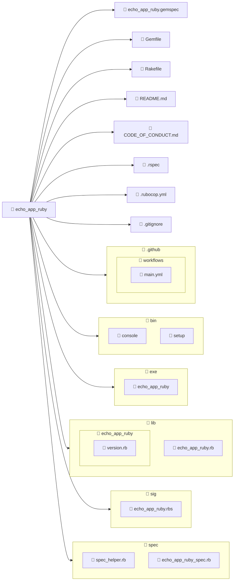

import BoxedTabs from '@site/src/components/cajitas/BoxedTabs'
import TabItem from '@theme/TabItem'
import Explanation from '@site/src/components/admonitions/Explanation'

## 💎 Paso -1: Instalar Ruby

**Ruby** es un lenguaje de programación dinámico, elegante y muy expresivo. En esta unidad lo utilizaremos junto con herramientas del ecosistema Ruby, como [Rake](https://ruby.github.io/rake/), para explorar cómo construir, organizar y automatizar tareas en proyectos de software, al igual que hicimos con Gradle.

A continuación, se presentan las instrucciones para instalar Ruby según tu sistema operativo:

<BoxedTabs groupId={"os"}>
    <TabItem value="Windows" label="Windows">
        ```powershell
        scoop install ruby
        ```
    </TabItem>
    <TabItem value="macOS" label="macOS">
        ```bash
        brew install ruby
        ```
    </TabItem>
    <TabItem value="Linux" label="Linux (Debian/Ubuntu)">
        ```bash
        sudo apt update && \
            sudo apt upgrade && \
            sudo apt install ruby-full
        ```
    </TabItem>
</BoxedTabs>

### ✅ Verificación de la instalación

Para comprobar que Ruby se instaló correctamente, ejecuta en tu terminal:

```bash
ruby --version
```

Deberías ver una salida similar a:

```plaintext
ruby 3.4.2 (2025-02-15 revision d2930f8e7a) +PRISM [x64-mingw-ucrt]
```

Esto indica que Ruby está instalado y disponible en tu entorno.

También puedes verificar que el gestor de paquetes de Ruby está disponible:

```bash
gem --version
```

Si ambos comandos funcionan y muestran una versión, ¡todo está listo para continuar!

## 📦 Paso 0: Instalar Bundler

**Bundler** es la herramienta oficial para gestionar dependencias en proyectos Ruby. Se encarga de instalar las gemas necesarias y mantenerlas sincronizadas con el archivo `Gemfile`.

Para instalar Bundler, ejecuta el siguiente comando en la terminal:

```bash
gem install bundler
```

<Explanation>
    - Este comando instala Bundler globalmente en tu sistema.
    - Asegúrate de tener acceso al comando `gem`, que viene con Ruby por defecto.
</Explanation>

Una vez instalado, puedes verificar la versión con:

```bash
bundler --version
```

Esto debería mostrar algo como:

```plaintext
Bundler version 2.6.7
```

## 🧱 Paso 1: Crear la gema con ejecutable

Para comenzar, vamos a crear una gema llamada `echo_app_ruby` que incluya un archivo ejecutable. Esto nos permitirá estructurar el proyecto como una biblioteca reutilizable con una interfaz de línea de comandos.

```bash
bundler gem echo_app_ruby --exe
```

<Explanation>
    Este comando genera la estructura base de una gema Ruby llamada `echo_app_ruby`.

    - `bundler gem` → Comando principal para crear una nueva gema.
    - `echo_app_ruby` → Nombre del proyecto/gema.
    - `--exe` → Crea un archivo ejecutable en `exe/echo_app_ruby`, útil si planeas que tu gema se use como aplicación desde la terminal.
</Explanation>

## 🧪 Paso 2: Elegir un framework de testing

Durante la creación de la gema, Bundler te preguntará si deseas generar pruebas junto con tu proyecto. Aunque no usaremos pruebas de inmediato, es una buena práctica elegir un framework para mantener la estructura preparada desde el inicio.

```plaintext
Do you want to generate tests with your gem?
Future `bundle gem` calls will use your choice. This setting can be changed anytime with `bundle config gem.test`.
Enter a test framework. rspec/minitest/test-unit/(none): rspec
```

:::tip ¿Por qué elegir `rspec`?

Elegimos `rspec` porque su estilo **BDD** (Behavior-Driven Development) y su sistema de **aserciones expresivas** (matchers) se alinean con los temas que abordaremos más adelante en la unidad de testing. Esto nos permitirá escribir pruebas más legibles, naturales y enfocadas en el comportamiento esperado de nuestras bibliotecas.

:::

## 🔄 Paso 3: Configurar integración continua (CI)

Durante la configuración inicial, Bundler ofrece la posibilidad de preparar archivos para **integración continua**, que permite ejecutar pruebas automáticamente en cada cambio del proyecto.

```plaintext
Do you want to set up continuous integration for your gem? Supported services:
* CircleCI:       https://circleci.com/
* GitHub Actions: https://github.com/features/actions
* GitLab CI:      https://docs.gitlab.com/ee/ci/

Future `bundle gem` calls will use your choice. This setting can be changed anytime with `bundle config gem.ci`.
Enter a CI service. github/gitlab/circle/(none): github
```

:::tip ¿Por qué elegir GitHub Actions?

Si tu código estará alojado en GitHub, usar **GitHub Actions** es una opción práctica y directa. Genera automáticamente un flujo de trabajo básico en `.github/workflows/ci.yml`, listo para ejecutar tus pruebas en cada push o pull request.

Aunque aún no lo aprovecharemos, tener este archivo configurado desde el inicio facilita adoptar buenas prácticas más adelante.

:::

## ⚖️ Paso 4: Elegir una licencia

Durante el proceso de creación de la gema, Bundler ofrece añadir una licencia de uso abierta para tu código:

```plaintext
Do you want to license your code permissively under the MIT license?
This means that any other developer or company will be legally allowed to use your code for free as long as they admit you created it. You can read more about the MIT license at https://choosealicense.com/licenses/mit.
y/(n):
```

:::info ¿Qué significa esto?

Si eliges **"y"**, Bundler agregará la licencia MIT a tu proyecto. Esta es una licencia permisiva que permite el uso, modificación y redistribución del código con muy pocas restricciones, siempre que se mantenga el aviso de autoría.

:::

:::tip ¿Y si uso otra licencia?

En nuestro caso, preferimos la **[BSD-2-Clause](https://opensource.org/license/bsd-2-clause/)**, una licencia también permisiva pero con un lenguaje más conciso y restricciones mínimas.

Puedes omitir la opción (`n`) aquí y luego añadir manualmente el archivo `LICENSE` y el campo `license` en el `.gemspec`.

:::

## 🤝 Paso 5: Código de conducta

Durante la creación de la gema, Bundler te preguntará si deseas incluir un **código de conducta**:

```plaintext
Do you want to include a code of conduct in gems you generate?
Codes of conduct can increase contributions to your project by contributors who prefer collaborative, safe spaces. You can read more about the code of conduct at contributor-covenant.org. Having a code of conduct means agreeing to the responsibility of enforcing it, so be sure that you are prepared to do that.
y/(n):
```

:::tip Buenas prácticas

Incluir un código de conducta como el de [Contributor Covenant](https://www.contributor-covenant.org/) es una forma de **fomentar la colaboración en un entorno respetuoso y seguro**.

No lo usaremos activamente en esta unidad, pero es una buena costumbre para proyectos abiertos o colaborativos. Si eliges `yes`, asegúrate de especificar un email de contacto válido.

:::

## 🗒️ Paso 6: Changelog

Durante la creación de la gema, Bundler te preguntará si deseas incluir un **changelog**:

```plaintext
Do you want to include a changelog?
A changelog is a file which contains a curated, chronologically ordered list of notable changes for each version of a project. [...]
see https://keepachangelog.com
y/(n):
```

:::tip Cambios transparentes

Un changelog permite documentar los **cambios relevantes entre versiones** de forma clara y cronológica. Esto facilita que otras personas (y tú misma en el futuro) entiendan qué ha cambiado, por qué y cuándo.

Elegir `yes` genera un archivo `CHANGELOG.md` con una estructura recomendada por [Keep a Changelog](https://keepachangelog.com), que podrás completar a medida que avances con tu proyecto.

:::

## 🧹 Paso 7: Añadir un Linter

Al crear la gema, Bundler preguntará si deseas agregar un **linter y formateador de código**:

```plaintext
Do you want to add a code linter and formatter to your gem? Supported Linters:
* RuboCop:       https://rubocop.org
* Standard:      https://github.com/standardrb/standard

Future `bundle gem` calls will use your choice. This setting can be changed anytime with `bundle config gem.linter`.
Enter a linter. rubocop/standard/(none): rubocop
```

:::tip Código limpio desde el principio

Elegimos `rubocop` como linter para el proyecto. Es una herramienta muy utilizada en la comunidad Ruby que **fuerza buenas prácticas** y ayuda a mantener un estilo de código uniforme.

Aunque no es obligatorio, tener un linter desde el inicio **previene errores comunes**, mejora la legibilidad y facilita el trabajo colaborativo en proyectos más grandes.

:::

## 🗂 Estructura del proyecto



:::info Explicación de la estructura

Esta es la estructura generada automáticamente por `bundler gem echo_app_ruby --exe`, pensada para desarrollar una **gema Ruby** lista para pruebas, publicación y uso como ejecutable de consola:

- **📄 `echo_app_ruby.gemspec`**: Archivo principal que define los metadatos de la gema (nombre, versión, dependencias, etc.).
- **📄 `Gemfile`**: Lista de dependencias necesarias para desarrollar o probar la gema.
- **📄 `Rakefile`**: Define tareas automatizadas (como pruebas, limpieza, instalación, etc.) que se pueden ejecutar con `rake`.
- **📄 `README.md`**: Documentación inicial del proyecto.
- **📄 `CODE_OF_CONDUCT.md`**: Código de conducta del proyecto, útil si se planea recibir contribuciones de otras personas.
- **📄 `.rspec`**: Configuración de RSpec, el framework de pruebas.
- **📄 `.rubocop.yml`**: Configuración para el linter y formateador RuboCop.
- **📄 `.gitignore`**: Lista de archivos que Git debe ignorar.
- 📁 `.github/workflows/`: Contiene flujos de trabajo para integración continua (CI), como pruebas automáticas con GitHub Actions (`main.yml`).
- 📁 `bin/`: Contiene scripts de desarrollo:
    - **`console`**: Permite iniciar una consola interactiva para explorar la gema.
    - **`setup`**: Script para instalar dependencias y preparar el entorno.
- 📁 `exe/`: Contiene el archivo ejecutable que permite usar la gema desde la línea de comandos:
    - **`echo_app_ruby`**: Archivo invocable si se instala como binario.
- 📁 `lib/`: Contiene el código fuente principal de la gema:
    - **`echo_app_ruby.rb`**: Punto de entrada principal que carga el resto de la gema.
    - **`echo_app_ruby/version.rb`**: Define la versión actual de la gema.
- 📁 `sig/`: Contiene definiciones de tipos en formato RBS (Ruby Signature), si usas tipado estático con herramientas como [Steep](https://github.com/soutaro/steep).
- 📁 `spec/`: Contiene las pruebas escritas con RSpec:
    - **`spec_helper.rb`**: Configuración inicial de RSpec.
    - **`echo_app_ruby_spec.rb`**: Archivo de prueba para el comportamiento principal de la gema.

:::

{/* TODO: Hello, world */}
