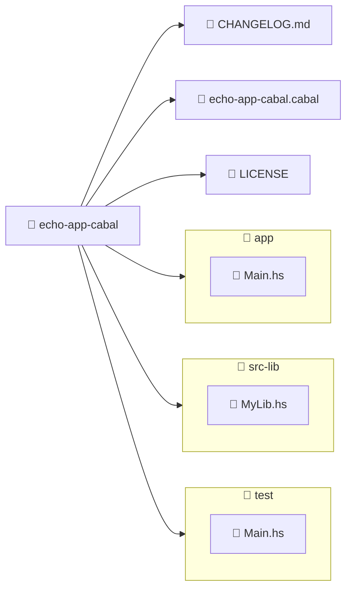

import ReadingTime from '@site/src/components/ReadingTime'
import GitHubRepoLink from '@site/src/components/git/GitHubRepoLink'
import Explanation from '@site/src/components/admonitions/Explanation'
import BoxedTabs from '@site/src/components/cajitas/BoxedTabs'
import TabItem from '@theme/TabItem'
import { ProCons, Pros, Cons } from '@site/src/components/cajitas/ProCons'

<ReadingTime />
<GitHubRepoLink user="r8vnhill" repo="echo-app-cabal" />

En esta lección aprenderás a crear un proyecto básico en **Haskell** utilizando **Cabal**, la herramienta estándar del ecosistema para construir y administrar proyectos. Si ya trabajaste con Gradle en Kotlin, reconocerás varias ideas familiares: una estructura de carpetas bien definida, configuración asistida, soporte para múltiples componentes (bibliotecas, ejecutables, tests) y herramientas para automatizar el ciclo de desarrollo.

Nuestro objetivo es crear una aplicación llamada `echo-app-cabal`, que siga buenas prácticas de organización y sirva como base para futuras lecciones sobre tareas, pruebas, publicación y diseño de bibliotecas en Haskell. A lo largo del proceso usaremos **GHCup** para instalar y configurar las herramientas necesarias, y detallaremos cada paso del asistente de `cabal init` para que puedas tomar decisiones informadas según las necesidades de tu proyecto.

Este enfoque comparativo te permitirá no solo aprender Haskell, sino también ampliar tu perspectiva sobre cómo distintos ecosistemas abordan la creación y gestión de software bien estructurado.

## 🧰 Paso -2: Instalar GHCup

**GHCup** es el instalador oficial y recomendado para configurar el entorno de desarrollo en Haskell. Permite administrar fácilmente versiones del compilador **GHC**, la herramienta de construcción **Cabal**, el servidor de lenguaje **HLS**, y el gestor de proyectos alternativo **Stack**. Funciona en Windows, Linux y macOS, y garantiza una instalación consistente y reproducible sin interferir con otras herramientas del sistema.

<BoxedTabs groupId={"os"}>
    <TabItem value="Windows" label="Windows">
        ```powershell
        scoop install ghcup
        ```
    </TabItem>
    <TabItem value="macOS" label="macOS">
        ```bash
        brew install ghcup
        ```
    </TabItem>
    <TabItem value="Linux" label="Linux">
        ```bash
        curl --proto '=https' --tlsv1.2 -sSf https://get-ghcup.haskell.org | sh
        ```

        <Explanation>
            Este comando descarga e instala **GHCup** utilizando `curl` y una tubería (`|`) para ejecutar el script directamente en la terminal:

            - `curl` es una herramienta de línea de comandos para transferir datos desde o hacia un servidor.  
            - `--proto '=https'` y `--tlsv1.2` obligan al uso de conexiones seguras (HTTPS con TLS 1.2), lo que garantiza la integridad del contenido descargado.  
            - `-sSf` activa los siguientes modos en `curl`:
                - `-s`: silencioso, no muestra progreso.
                - `-S`: muestra errores si ocurren (solo útil junto a `-s`).
                - `-f`: falla si la respuesta HTTP no es exitosa.
            - El URL apunta al script de instalación oficial de GHCup.
            - El operador `| sh` ejecuta ese script inmediatamente usando el intérprete de comandos `sh`.
        </Explanation>
    </TabItem>
</BoxedTabs>

### ✅ Verificar la instalación

Una vez completada la instalación, puedes confirmar que **GHCup** se instaló correctamente ejecutando el siguiente comando en tu terminal:

```bash
ghcup --version
```

Si todo salió bien, verás un mensaje como este:

```plaintext
The GHCup Haskell installer, version 0.1.50.1
```

Esto indica que la herramienta está lista para usarse y puedes continuar instalando componentes como GHC, Cabal o HLS desde la misma terminal.

## 🔌 Paso -1: Instalar GHC

**GHC (Glasgow Haskell Compiler)** es el compilador principal del lenguaje Haskell y una de las herramientas más importantes para cualquier proyecto en este ecosistema. Permite compilar código fuente a ejecutables nativos, ejecutar programas de forma interactiva con `ghci`, y sirve como base para otras herramientas como `cabal`, `stack` y `haskell-language-server`.

En esta sección instalaremos GHC utilizando **GHCup**.

<BoxedTabs groupId={"os"}>
    <TabItem value="Windows" label="Windows">
        ```powershell
        ghcup install ghc && `
            (ghcup whereis ghc).Trim() | ForEach-Object {
                $binPath = Split-Path $_ -Parent
                [Environment]::SetEnvironmentVariable(
                    "PATH",
                    "$($env:PATH);$binPath",
                    "User"
                )
                $env:PATH += ";$binPath"
            }
        ```

        <Explanation>
            Este bloque de PowerShell instala GHC mediante `ghcup` y luego actualiza la variable de entorno `PATH` para que incluya la ruta al compilador recién instalado.

            - **`ghcup install ghc`**: Instala la versión más reciente disponible del compilador GHC.
            - **`ghcup whereis ghc`**: Devuelve la ruta completa del ejecutable `ghc`, por ejemplo: `.../ghc/9.12.2/bin/ghc.exe`.
            - **`.Trim()`**: Elimina espacios en blanco del resultado, asegurando una ruta limpia.
            - **`Split-Path $_ -Parent`**: Extrae la carpeta contenedora de `ghc.exe` (es decir, el directorio `bin`), que es lo que realmente debe agregarse al `PATH`.
            - **`SetEnvironmentVariable("PATH", ..., "User")`**: Agrega esa carpeta al final del `PATH` a nivel de usuario, haciendo persistente el cambio.
            - **`$env:PATH += ";$binPath"`**: También agrega la ruta en tiempo de ejecución para que esté disponible de inmediato en la sesión actual de PowerShell.

            De esta manera, no es necesario reiniciar la terminal: podrás usar `ghc`, `ghci` o cualquier otro ejecutable disponible en esa ruta sin cerrar y volver a abrir PowerShell.

            :::warning Precaución al modificar el PATH

            Este script modifica la variable de entorno PATH del usuario. Aunque es seguro si se hace correctamente, asegúrate de no sobrescribir accidentalmente el valor anterior. Siempre añade rutas al final sin eliminar el contenido existente.

            :::
        </Explanation>
    </TabItem>
    <TabItem value="Linux/macOS" label="Linux/macOS">
        ```bash
        ghcup install ghc
        ```

        <Explanation>
            Este comando instala la versión más reciente del compilador **GHC** utilizando **GHCup**.
            - Al usar `ghcup install ghc` sin argumentos adicionales, se instalará automáticamente la última versión recomendada disponible.
            - La instalación es administrada por GHCup, lo que garantiza que no interfiera con otras versiones que pudieran estar instaladas manualmente o por otros gestores de paquetes.
        </Explanation>
    </TabItem>
</BoxedTabs>

### ✅ Verificar la instalación

Una vez completada la instalación de GHC, puedes comprobar que todo esté funcionando correctamente ejecutando el siguiente comando en tu terminal:

```bash
ghc --version
```

Si la instalación fue exitosa, deberías ver un mensaje similar al siguiente:

```plaintext
The Glorious Glasgow Haskell Compilation System, version 9.4.8
```

## ⚙️ Paso 0: Instalar Cabal

**Cabal** es la herramienta oficial para construir y administrar proyectos Haskell. Permite compilar bibliotecas y ejecutables, resolver dependencias, y definir metadatos del proyecto a través de un archivo `.cabal`.

Para instalarla, ejecuta:

```bash
ghcup install cabal
```

### ✅ Verificar la instalación

Puedes verificar que **Cabal** se haya instalado correctamente ejecutando el siguiente comando en tu terminal:

```bash
cabal --version
```

Esto debería mostrar una salida similar a:

```plaintext
cabal-install version 3.12.1.0
compiled using version 3.12.1.0 of the Cabal library
```

:::tip ¿No funciona el comando?

Si ves un error como “`cabal` no se reconoce como un comando interno o externo”, intenta cerrar y volver a abrir la terminal. Asegúrate también de que la ruta a `cabal` esté incluida en la variable de entorno `PATH`.

:::

## 🏗️ Paso 1: Crear un nuevo proyecto

La forma más sencilla de comenzar un proyecto en Haskell es usando el comando `cabal init`. Este comando genera la estructura básica de archivos y carpetas, similar a lo que hace `gradle init`:

```bash
cabal init
```

Esto iniciará un asistente interactivo que te permitirá configurar el tipo de proyecto que deseas crear.

## 🧠 Paso 2: Seleccionar el tipo de componente

Durante la inicialización, `cabal` te preguntará qué tipo de paquete deseas construir:

```plaintext
What does the package build:
   1) Library
 * 2) Executable
   3) Library and Executable
   4) Test suite
Your choice? [default: Executable] 3
```

Selecciona la opción **3: Library and Executable** para seguir un enfoque similar al que usamos con Gradle, donde tenemos una aplicación (`app`) que depende de una biblioteca propia (`lib`).

## 📜 Paso 3: Elegir la versión de la especificación de Cabal

En este paso, `cabal init` te pedirá que elijas la versión de la especificación del archivo `.cabal`. Esta especificación define las capacidades del formato del proyecto (como soporte para `common stanzas`, `mixins`, globs con `**`, etc.).

```plaintext
Please choose version of the Cabal specification to use:
   1) 1.24
   2) 2.0   (support for Backpack, internal sub-libs, '^>=' operator)
   3) 2.2   (+ support for 'common', 'elif', redundant commas, SPDX)
   4) 2.4   (+ support for '**' globbing)
 * 5) 3.0   (+ set notation for ==, common stanzas in ifs, more redundant commas, better pkgconfig-depends)
   6) 3.4   (+ sublibraries in 'mixins', optional 'default-language')
Your choice? [default: 3.0]
```

Puedes aceptar la opción por defecto (`3.0`) a menos que tengas un motivo específico para usar una versión más reciente como `3.4`. Esta opción proporciona una buena base moderna compatible con la mayoría de herramientas y bibliotecas.

:::info ¿Qué es la especificación de Cabal?

La versión de la especificación determina qué características puedes usar en tu archivo `.cabal`. Elegir una versión más reciente te da acceso a mejoras en la configuración del proyecto, pero puede requerir versiones más nuevas de `cabal` o `ghc`.

:::

## 🏷️ Paso 4: Definir el nombre del paquete

En este punto, `cabal init` te pedirá un nombre para tu paquete. Este nombre se usará en el archivo `.cabal`, en los metadatos del proyecto y al publicar bibliotecas.

```plaintext
Package name? [default: echo-app-cabal]
```

Puedes aceptar el valor por defecto (`echo-app-cabal`) o escribir un nombre distinto si lo prefieres.  
Es recomendable elegir un nombre en minúsculas, con palabras separadas por guiones, que refleje claramente el propósito del proyecto.

## 🆙 Paso 5: Asignar la versión del paquete

Cabal te pedirá que indiques la versión inicial del paquete. Este número sigue el esquema **semántico** `mayor.menor.parche.build`, útil para controlar versiones durante el desarrollo y la publicación.

```plaintext
Package version? [default: 0.1.0.0]
```

Puedes aceptar el valor por defecto (`0.1.0.0`) si estás comenzando el proyecto.  
Más adelante podrás actualizar esta versión en el archivo `.cabal` a medida que evolucione tu biblioteca o aplicación.

## ⚖️ Paso 6: Elegir una licencia

Cabal te solicitará que elijas una licencia para tu proyecto. Esto define los permisos legales sobre el uso, modificación y distribución de tu código. Aparecerá una lista de licencias comunes, con la opción **BSD-3-Clause** seleccionada por defecto.

```plaintext
Please choose a license:
   1) BSD-2-Clause
 * 2) BSD-3-Clause
   3) Apache-2.0
   4) MIT
   ...
  17) Other (specify)
Your choice? [default: BSD-3-Clause] 1
```

- Si no tienes una preferencia específica, puedes aceptar la licencia por defecto (**BSD-3-Clause**), que es ampliamente utilizada en el ecosistema Haskell.
- También puedes elegir una licencia más permisiva (como **MIT**) o más restrictiva (como **GPL**), según tus necesidades.

:::tip ¿Cuál elegir?

Para proyectos de aprendizaje o bibliotecas reutilizables, **BSD-3-Clause** o **MIT** son buenas opciones por su compatibilidad y simplicidad. En este curso, usamos **BSD-2-Clause** debido a su simplicidad c:

:::

## ✍️ Paso 7: Indicar el nombre del autor

El asistente de `cabal init` te pedirá que indiques el nombre del autor del proyecto. Este nombre aparecerá en el archivo `.cabal` como metadato del paquete, útil para identificación y distribución.

```plaintext
Author name? [default: r8vnhill]
```

Puedes presionar **Enter** para aceptar el valor por defecto (en este caso, `r8vnhill`) o escribir otro nombre si prefieres usar tu nombre real, un alias o el nombre de tu organización.

:::tip Recomendación

Usar un nombre identificable facilita la colaboración y el reconocimiento cuando publicas tu paquete en repositorios públicos como Hackage.

:::

## 📬 Paso 8: Proporcionar el correo del responsable

El siguiente paso en el asistente de `cabal init` solicita el correo electrónico de la persona encargada del mantenimiento del proyecto. Este dato se incluirá en el archivo `.cabal` y puede ser utilizado por otras personas para contactarte en caso de dudas, errores o contribuciones.

```plaintext
Maintainer email? [default: reachme@ravenhill.cl]
```

Puedes aceptar el valor por defecto o escribir otra dirección de correo electrónico si lo deseas.

:::info ¿Qué significa "maintainer"?

El *maintainer* es quien se encarga de mantener el código, responder preguntas, revisar contribuciones y publicar nuevas versiones. No tiene por qué ser la misma persona que el autor.

:::

## 🌐 Paso 9: Indicar la URL del proyecto

Ahora puedes proporcionar la URL del sitio web del proyecto, si tienes una. Esto es útil si el proyecto cuenta con una página de documentación, una demo en línea o un repositorio público.

```plaintext
Project homepage URL? [optional] https://dibs.pages.dev
```

Este campo es **opcional**, pero recomendable si tu proyecto está alojado públicamente, ya que permite a otras personas encontrar fácilmente más información.

:::tip ¿Qué pasa si lo dejas vacío?

Si no tienes una página para el proyecto todavía, puedes presionar Enter y completarlo más adelante editando el archivo `.cabal`.

:::

## 📝 Paso 10: Escribir una sinopsis del proyecto

En este paso puedes proporcionar una **sinopsis corta** que describa brevemente el propósito del proyecto. Este texto suele mostrarse en listas o catálogos de paquetes, así que conviene que sea conciso y descriptivo.

```plaintext
Project synopsis? [optional]
```

Por ejemplo:

```plaintext
A small echo application that prints messages with timestamps.
```

:::tip ¿Puedo dejarlo vacío?

Sí, este campo es **opcional**. Sin embargo, agregar una sinopsis clara mejora la visibilidad y comprensión del proyecto cuando otras personas lo encuentren, especialmente si planeas publicarlo.

:::

## 🧭 Paso 11: Elegir una categoría para el proyecto

Este paso te permite asignar una **categoría temática** al proyecto, lo cual facilita su clasificación en repositorios de paquetes como [Hackage](https://hackage.haskell.org/). Elegir una categoría adecuada ayuda a que otrxs usuarixs encuentren tu proyecto con mayor facilidad.

```plaintext
Project category:
   1) Codec
   2) Concurrency
   3) Control
   4) Data
   5) Database
   6) Development
   7) Distribution
   8) Game
   9) Graphics
  10) Language
  11) Math
  12) Network
  13) Sound
  14) System
  15) Testing
  16) Text
  17) Web
  18) Other (specify)
Your choice? [default: (none)]
```

Por ejemplo, si estás creando una aplicación de línea de comandos que responde a entradas, podrías elegir:

```plaintext
Your choice? 6
```

:::tip ¿Y si mi proyecto no encaja en ninguna categoría?

Puedes elegir la opción **18) Other (specify)** y escribir una categoría personalizada que se ajuste mejor a tu proyecto.

:::

## 📂 Paso 12: Elegir el directorio de código fuente

En este paso defines en qué carpeta estarán los archivos fuente de la biblioteca. Esta decisión afecta tanto la estructura del proyecto como su mantenibilidad a largo plazo.

```plaintext
Library source directory:
 * 1) src
   2) lib
   3) src-lib
   4) Other (specify)
Your choice? [default: src] 3
```

- `src`: Convención común en muchos lenguajes y herramientas. Simple y estándar.
- `lib`: Más tradicional en algunos proyectos Haskell antiguos, aunque menos usada hoy en día.
- `src-lib`: Útil si deseas separar claramente los archivos fuente de la biblioteca respecto a los de la aplicación (`src-app`), especialmente en proyectos mixtos.

Por ejemplo, si planeas tener tanto una biblioteca como una aplicación en el mismo repositorio, elegir `src-lib` puede facilitar esa separación desde el inicio:

```plaintext
Your choice? 3
```

## 🗣️ Paso 13: Elegir el estándar de lenguaje

En este paso defines qué versión del estándar del lenguaje Haskell se usará como base para tu biblioteca. Esto afecta qué extensiones están habilitadas por defecto y qué tan moderno (o conservador) será tu entorno de compilación.

```plaintext
Choose a language for your library:
 * 1) Haskell2010
   2) Haskell98
   3) GHC2021 (requires at least GHC 9.2)
   4) GHC2024 (requires at least GHC 9.10)
   5) Other (specify)
Your choice? [default: Haskell2010]
```

- **`Haskell2010`**: Opción segura y ampliamente soportada. Requiere menos dependencias de GHC, ideal para bibliotecas con alta compatibilidad.
- **`GHC2021`**: Activa muchas extensiones modernas por defecto (como `DerivingStrategies`, `LambdaCase`, etc.). Recomendado para nuevos proyectos que usen GHC 9.2 o superior.
- **`GHC2024`**: Versión más reciente del conjunto de extensiones por defecto. Ideal si deseas estar al día con las prácticas modernas, pero requiere GHC 9.10 o superior.

```plaintext
Your choice? 3
```

:::info ¿Qué significa esto?

La opción que elijas aquí se reflejará en el campo `default-language` del archivo `.cabal`.  
Por ejemplo:

```cabal
default-language: GHC2021
```

Esto afecta el comportamiento por defecto del compilador sin necesidad de habilitar manualmente extensiones comunes.

:::

## 🧾 Paso 14: Definir el módulo principal

Este paso te pide especificar el archivo fuente donde comenzará la ejecución del programa, es decir, el que contiene la función `main`. Es equivalente a definir el punto de entrada en lenguajes como Kotlin o Java.

```plaintext
What is the main module of the executable:
 * 1) Main.hs
   2) Main.lhs
   3) Other (specify)
Your choice? [default: Main.hs]
```

- **`Main.hs`**: La opción estándar para la mayoría de los proyectos Haskell.  
- **`Main.lhs`**: Usado si prefieres escribir el código como *Literate Haskell*, donde el programa está entremezclado con documentación (no tan común).
- **Other**: Si quieres usar otro nombre o ubicar el archivo en una ruta diferente.

Si no tienes razones específicas para cambiarlo, puedes aceptar la opción por defecto (`Main.hs`), que funcionará para la mayoría de los casos.

```plaintext
Your choice? [Enter]
```

<details>
    <summary>📘 Literate Haskell</summary>

    **Literate Haskell** es una forma especial de escribir programas en Haskell donde el código fuente puede mezclarse con documentación escrita en texto plano o Markdown. Existen dos estilos principales:

    #### Estilo Bird

    En este estilo, cualquier línea que comienza con `>` se interpreta como código Haskell. Todo lo demás se considera documentación.

    ```haskell
    This is a comment or explanation.
    > double x = x * 2
    > main = print (double 5)
    ```

    #### Estilo LaTeX (o `.lhs`)

    Usado en combinación con procesadores LaTeX. El código va entre bloques `\begin{code}` y `\end{code}`.

    ```latex
    \begin{code}
    double x = x * 2
    main = print (double 5)
    \end{code}
    ```

    #### 📦 Extensión `.lhs`

    Los archivos literate Haskell deben tener la extensión `.lhs` para que el compilador (`ghc`) los reconozca como tal:

    ```bash
    ghc MyProgram.lhs -o my-program
    ```

    #### ✅ ¿Cuándo usarlo?

    Es útil cuando quieres que tu código funcione como un documento explicativo o como parte de un tutorial, artículo o presentación técnica.
</details>

## 🗃️ Paso 15: Elegir el directorio principal de la aplicación

Durante la creación del proyecto, `cabal init` te preguntará dónde deseas ubicar el código fuente principal de tu aplicación:

```plaintext
Application directory:
 * 1) app
   2) exe
   3) src-exe
   4) Other (specify)
Your choice? [default: app]
```

- **`app/`** → 📦 *Recomendado por defecto.* Contiene el punto de entrada (`Main.hs`) de la aplicación. Es la opción más usada para proyectos simples.
- **`exe/`** → Útil si quieres separar explícitamente ejecutables de bibliotecas (`src/`).
- **`src-exe/`** → Variante menos común para quienes prefieren agrupar ejecutables dentro de `src-` prefijado.
- **`Other`** → Permite definir un directorio personalizado.

:::tip ¿Qué elegir?

Si no estás segurx de qué elegir, puedes simplemente presionar `Enter` para aceptar la opción predeterminada: **`app/`**.

:::

## 🧩 Paso 16: Elegir el estándar del lenguaje Haskell

Durante la creación del proyecto, `cabal init` te pedirá que elijas la versión del lenguaje Haskell que se usará en el ejecutable:

```plaintext
Choose a language for your executable:
 * 1) Haskell2010
   2) Haskell98
   3) GHC2021 (requires at least GHC 9.2)
   4) GHC2024 (requires at least GHC 9.10)
   5) Other (specify)
Your choice? [default: Haskell2010]
```

- **`Haskell2010`** → ✅ *Valor por defecto.* Estándar estable y ampliamente soportado. Adecuado para la mayoría de los proyectos.
- **`Haskell98`** → Versión más antigua, útil para compatibilidad con código legado.
- **`GHC2021`** → Activa por defecto varias extensiones modernas. Requiere GHC ≥ 9.2.
- **`GHC2024`** → Similar a GHC2021 pero con más extensiones preactivadas. Requiere GHC ≥ 9.10.
- **`Other`** → Permite definir manualmente otro estándar o conjunto de extensiones.

:::tip ¿Qué opción elegir?

Para proyectos nuevos con GHC ≥ 9.2, se recomienda `GHC2021` por su equilibrio entre modernidad y estabilidad.  
Si no estás segurx o usas una versión antigua del compilador, puedes dejar la opción por defecto: **`Haskell2010`**.

:::

## 🧪 Paso 17: Generar un test suite

Al crear el proyecto, `cabal init` te preguntará si deseas incluir una suite de pruebas para la biblioteca:

```plaintext
Should I generate a test suite for the library? [default: y]
```

Una *test suite* es un conjunto de pruebas automatizadas que permiten verificar que tu código funcione como se espera. Incluir una desde el principio es una excelente práctica para mantener tu proyecto robusto y confiable.

:::tip Recomendación

Presiona `Enter` para aceptar la opción predeterminada (**`y`**) y generar la suite de pruebas básica.  
Siempre puedes modificarla o eliminarla después.

- Se recomienda mantener la suite de pruebas incluso si no planeas escribir tests aún.
- Es más fácil ignorarla que agregarla más tarde.
:::

## 🔬 Paso 18: Elegir el módulo principal de la suite de pruebas

Si elegiste generar una suite de pruebas, `cabal init` te preguntará cuál debe ser su módulo principal:

```plaintext
What is the main module of the test suite?:
 * 1) Main.hs
   2) Main.lhs
   3) Other (specify)
Your choice? [default: Main.hs]
```

- **`Main.hs`** → 📄 Archivo Haskell convencional. Recomendado en la mayoría de los casos.
- **`Main.lhs`** → ✍️ Versión *literate* de Haskell. Útil si planeas escribir documentación y código en el mismo archivo.
- **`Other`** → Permite indicar un nombre distinto o una ruta personalizada para el archivo principal de pruebas.

:::tip Recomendación

A menos que tengas una razón específica para usar *Literate Haskell* o un nombre diferente, presiona `Enter` para usar **`Main.hs`**, que es la opción más común y esperada por muchas herramientas.

:::

## 🗂️ Paso 19: Elegir el directorio para la suite de pruebas

`cabal init` te preguntará dónde deseas ubicar los archivos de prueba:

```plaintext
Test directory? [default: test]
```

Aquí se colocan los archivos fuente de la suite de pruebas, incluyendo el archivo principal (`Main.hs` o equivalente).

:::tip ¿Deberías cambiarlo?

Generalmente no. La opción `test/` es ampliamente compatible con herramientas como `cabal`, `stack` y editores como VSCode o IntelliJ con soporte Haskell. Solo considera usar otro nombre si tienes necesidades muy específicas de estructura.

:::

## 🧫 Paso 20: Elegir el lenguaje base para la suite de pruebas

Durante la configuración del proyecto, `cabal init` te preguntará qué estándar de lenguaje Haskell deseas usar para compilar la suite de pruebas:

```plaintext
Choose a language for your test suite:
 * 1) Haskell2010
   2) Haskell98
   3) GHC2021 (requires at least GHC 9.2)
   4) GHC2024 (requires at least GHC 9.10)
   5) Other (specify)
Your choice? [default: Haskell2010]
```

Esta opción determina el conjunto de características del lenguaje Haskell que estarán habilitadas por defecto en tu suite de pruebas.

- **`Haskell2010`** → ✅ *Opción predeterminada y segura.* Compatible con la mayoría de compiladores y herramientas.
- **`GHC2021` / `GHC2024`** → 🧠 *Más modernas*, incluyen muchas extensiones útiles habilitadas por defecto, pero requieren versiones recientes del compilador.
- **`Haskell98`** → 🧓 Muy conservadora y limitada; rara vez se usa en proyectos nuevos.
- **`Other`** → Te permite especificar manualmente otro estándar (poco común).

:::tip ¿Cuál elegir?

- Si estás empezando o buscas compatibilidad amplia: **Haskell2010** es suficiente.
- Si ya usas **GHC >= 9.2**, considera **GHC2021** para aprovechar un entorno más moderno y expresivo.

:::

## 💬 Paso 21: ¿Agregar comentarios informativos al archivo `.cabal`?

Al finalizar la configuración, `cabal init` te ofrecerá la opción de añadir comentarios explicativos a cada campo del archivo de configuración:

```plaintext showLineNumbers
Add informative comments to each field in the cabal file. (y/n)? [default: y]
```

Si eliges **sí** (`y`), el archivo `echo-app-cabal.cabal` incluirá anotaciones en forma de comentarios (`-- ...`) que explican el propósito de cada sección y campo: nombre del paquete, versión, dependencias, opciones de compilación, etc.

Por ejemplo:

```plaintext
-- The license under which the package is released.
license:            BSD-2-Clause
```

Esto es especialmente útil si estás comenzando con Haskell o si no estás familiarizadx con la sintaxis de los archivos `.cabal`.

:::tip ¿Qué opción elegir?

Te recomendamos **aceptar la opción predeterminada (`y`)**, sobre todo si es la primera vez que trabajas con Cabal. Los comentarios pueden actuar como una pequeña guía de referencia para futuras ediciones.

:::

## 🗂 Estructura del proyecto



:::info Explicación de la estructura

Esta estructura representa un proyecto Haskell inicializado con `cabal init` y configurado para seguir buenas prácticas de organización:

- **📁 `echo-app-cabal/`**: Carpeta raíz del proyecto. Contiene todos los archivos fuente, metadatos y configuración.
    - **📁 `app/`**: Contiene el punto de entrada de la aplicación.  
        - **📄 `Main.hs`**: Módulo principal del ejecutable, donde inicia el programa (`main :: IO ()`).
    - **📁 `src-lib/`**: Carpeta destinada a la **lógica de la biblioteca** del proyecto.  
        - **📄 `MyLib.hs`**: Archivo donde se definen funciones reutilizables y separadas del ejecutable.
    - **📁 `test/`**: Directorio para las pruebas del proyecto.  
        - **📄 `Main.hs`**: Módulo principal de la suite de tests, que suele importar y verificar el comportamiento de la biblioteca.
    - **📄 `echo-app-cabal.cabal`**: Archivo central de configuración del proyecto. Define el nombre del paquete, los targets (`library`, `executable`, `test-suite`), las dependencias y otras opciones de compilación.
    - **📄 `CHANGELOG.md`**: Documento opcional que permite llevar un historial de cambios y versiones.
    - **📄 `LICENSE`**: Archivo con los términos de licencia del proyecto (por ejemplo, MIT, BSD, etc.).

Esta separación facilita el mantenimiento y escalabilidad del proyecto, permitiendo escribir código más modular, reutilizable y probado.

:::

## 🎙️ Paso 22: Crear y ejecutar un *Hello, World* con alma existencialista

Con tu proyecto ya configurado, es momento de escribir y ejecutar tu primer programa en Haskell.  
Vamos a editar el archivo `app/Main.hs` para imprimir una línea emblemática de *Ergo Proxy*:

```haskell title="app/Main.hs"
module Main where

main :: IO ()
main = putStrLn "I do not belong to the world. That is the limit, the boundary between all and self."
```

### ▶️ Ejecutar el proyecto

Desde la raíz del proyecto, compila y ejecuta la aplicación con:

```bash
cabal run
```

Si todo está bien configurado, verás una salida similar a esta:

```plaintext
Resolving dependencies...
Build profile: -w ghc-9.4.8 -O1
In order, the following will be built (use -v for more details):
 - echo-app-cabal-0.1.0.0 (lib) (first run)
 - echo-app-cabal-0.1.0.0 (exe:echo-app-cabal) (first run)
Configuring library for echo-app-cabal-0.1.0.0...
Preprocessing library for echo-app-cabal-0.1.0.0...
Building library for echo-app-cabal-0.1.0.0...
[1 of 1] Compiling MyLib            ( src-lib\MyLib.hs, ...\build\MyLib.o )
Configuring executable 'echo-app-cabal' for echo-app-cabal-0.1.0.0...
Preprocessing executable 'echo-app-cabal' for echo-app-cabal-0.1.0.0...
Building executable 'echo-app-cabal' for echo-app-cabal-0.1.0.0...
[1 of 1] Compiling Main             ( app\Main.hs, ...\build\Main.o )
[2 of 2] Linking ...
I do not belong to the world. That is the limit, the boundary between all and self.
```

<Explanation>
    El comando `cabal run` compila y ejecuta automáticamente el ejecutable definido en el archivo `.cabal`.

    - Si es la primera vez que lo corres (o si hiciste cambios), recompilará antes de ejecutar.
    - Si no hay cambios pendientes, ejecutará directamente el binario previamente compilado.
</Explanation>

:::note ¿Dónde se define el nombre del ejecutable?

En el archivo `.cabal`, dentro de la sección `executable`, puedes cambiar el nombre del ejecutable:

```cabal
executable echo-app-cabal
  ...
```

Si prefieres un nombre más breve o con temática del proyecto, como `ergo`, puedes cambiar esa línea y luego ejecutar el nuevo nombre con `cabal run ergo`.

:::

## 🎯 Conclusiones

Crear un proyecto básico en Haskell con Cabal no solo te permite dar tus primeros pasos en el lenguaje, sino también comprender cómo se estructuran las bibliotecas, ejecutables y pruebas dentro de un ecosistema funcional moderno. Aunque al principio puede parecer que hay muchas decisiones por tomar, el asistente de `cabal init` guía el proceso de forma clara y flexible, permitiéndote adaptar el proyecto a tus necesidades.

Este tutorial buscó no solo mostrar los comandos necesarios, sino también **explicar el "por qué" detrás de cada elección**, brindándote una base sólida para futuros desarrollos.

### 🔑 Puntos clave

- **GHCup** es la herramienta recomendada para instalar y administrar componentes de Haskell como GHC, Cabal y HLS.
- `cabal init` ofrece un asistente interactivo que facilita la creación de proyectos bien organizados.
- La estructura típica de un proyecto con biblioteca, ejecutable y pruebas se puede definir desde el inicio.
- Elegir estándares modernos como `GHC2021` permite aprovechar extensiones útiles del lenguaje desde el principio.
- Incluir una suite de pruebas desde el inicio es una buena práctica incluso si aún no planeas escribir tests.

### 🧰 ¿Qué nos llevamos?

Más allá de comandos y configuraciones, esta lección nos mostró que Haskell no exige grandes herramientas para comenzar: con GHC, Cabal y un buen entendimiento de su estructura, ya es posible construir proyectos claros, escalables y bien organizados.

Pero también aprendimos algo más profundo: que crear un proyecto no es solo cuestión de responder preguntas en un asistente, sino de tomar decisiones que influirán en la forma en que pensamos, escribimos y compartimos código. Desde la elección de la licencia hasta la estructura del repositorio, cada decisión refleja una intención sobre cómo queremos que evolucione nuestro trabajo.

Con eso en mente, cerrar esta primera etapa escribiendo una línea de *Ergo Proxy* no fue solo una elección estética, sino una declaración: nuestros programas también pueden tener alma, y cada línea de código puede decir algo más que lo estrictamente necesario.

Nos llevamos, entonces, no solo una carpeta compilable, sino una herramienta lista para crecer con nosotrxs.

## 📖 Referencias

### 🔥 Recomendadas

- 🌐 1. Getting Started with Haskell and Cabal—Cabal 3.4.0.0 User’s Guide. (s. f.). Recuperado 3 de abril de 2025, de https://cabal.readthedocs.io/en/3.4/getting-started.html
