import ReadingTime from "@site/src/components/ReadingTime";
import BoxedTabs from '@site/src/components/cajitas/BoxedTabs';
import TabItem from '@theme/TabItem';
import GithubRepoLink from '@site/src/components/GithubRepoLink';
import Explanation from '@site/src/components/admonitions/Explanation';
import ReferenceList from '@site/src/components/references/ReferenceList';
import Book from '@site/src/components/references/Book';

<ReadingTime multiplier={2} />
<GithubRepoLink user="r8vnhill" repo="echo-app-rust" />

Esta lección está pensada como una puerta de entrada práctica a Rust desde una perspectiva de diseño de bibliotecas y herramientas. Aprenderás a instalar su toolchain, crear un proyecto reproducible desde cero y comprender cómo organizarlo correctamente. Todo lo que necesitas para comenzar a construir con confianza en este nuevo ecosistema.

## 🧰 Paso 0: Instalar dependencias necesarias para Rust

Rust es un lenguaje moderno que combina **rendimiento a nivel de C++**, con un enfoque en **seguridad de memoria sin recolector de basura**. Es especialmente atractivo para desarrollo de sistemas, programación embebida, bibliotecas de alto rendimiento y herramientas CLI seguras y reproducibles.

A diferencia de muchos lenguajes, Rust se distribuye con una herramienta oficial llamada **Cargo**, que unifica:

- Gestión de dependencias (`Cargo.toml`)
- Compilación (`cargo build`)
- Ejecución (`cargo run`)
- Pruebas (`cargo test`)
- Publicación de paquetes (`cargo publish`)

Esto hace que iniciar y mantener proyectos sea más consistente, productivo y reproducible —incluso en equipos distribuidos o ambientes de CI.

:::note Nota

Usar Rust sin Cargo es técnicamente posible, pero extremadamente raro. Cargo es parte integral del ecosistema, y la gran mayoría de proyectos Rust lo utilizan como punto de partida.

:::

<BoxedTabs groupId={"os"}>
    <TabItem value="Windows" label="Windows">
        ```powershell showLineNumbers title="scripts/windows/Install-RustDependencies.ps1"
        function Install-RustDependencies {
            function Test-Installed([string[]] $CheckCommands) {
                foreach ($command in $CheckCommands) {
                    try {
                        & $command --version | Out-Null
                    } catch {
                        throw "❌ '$CheckCommand' was not found after installation."
                    }
                }
            }

            scoop install rustup
            Test-Installed rustup, rustc, cargo

            Write-Host "✅ Rust toolchain is installed successfully." -ForegroundColor Green
        }

        Install-RustDependencies
        ```

        Guarda este script como `Install-RustDependencies.ps1` y ejecútalo:

        ```powershell
        .\Install-RustDependencies.ps1
        ```
    </TabItem>
    <TabItem value="macOS" label="macOS">
        ```bash showLineNumbers title="scripts/macos/install_rust_dependencies.sh"
        #!/usr/bin/env bash

        set -euo pipefail

        # Function to check if commands are available by calling them with --version
        test_installed() {
            for cmd in "$@"; do
                if ! command -v "$cmd" &> /dev/null; then
                    echo "❌ '$cmd' was not found after installation. Check your PATH." >&2
                    exit 1
                fi
                "$cmd" --version > /dev/null || {
                    echo "❌ '$cmd' exists but failed to respond to --version." >&2
                    exit 1
                }
            done
        }

        install_rust_dependencies() {
            # Install rustup via Homebrew if not already installed
            if ! command -v rustup &> /dev/null; then
                echo "📦 Installing rustup using Homebrew..."
                brew install rustup-init
                rustup-init -y
            else
                echo "ℹ️ rustup is already installed."
            fi

            # Add the cargo bin directory to PATH
            if [ -f "$HOME/.cargo/env" ]; then
                . "$HOME/.cargo/env"
            else
                echo "⚠️ Warning: '$HOME/.cargo/env' not found. Ensure Rust is properly installed."
            fi
            
            # Ensure rustc and cargo are installed
            test_installed rustup rustc cargo
            
            echo "✅ Rust toolchain is installed successfully."
        }

        install_rust_dependencies
        ```

        Guarda este script como `install_rust_dependencies.sh` y ejecútalo:

        ```bash
        bash install_rust_dependencies.sh
        ```
    </TabItem>
    <TabItem value="Ubuntu/Debian" label="Ubuntu/Debian">
        ```bash showLineNumbers title="Instalación de Rust en Linux"
        #!/usr/bin/env bash

        set -euo pipefail

        # Function to check if commands are available by calling them with --version
        test_installed() {
            for cmd in "$@"; do
                if ! command -v "$cmd" &> /dev/null; then
                    echo "❌ '$cmd' was not found after installation. Check your PATH." >&2
                    exit 1
                fi
                "$cmd" --version > /dev/null || {
                    echo "❌ '$cmd' exists but failed to respond to --version." >&2
                    exit 1
                }
            done
        }

        install_rust_dependencies() {
            # Check if rustup is installed
            if ! command -v rustup &> /dev/null; then
                echo "📦 Installing rustup using the official script..."
                curl --proto '=https' --tlsv1.2 -sSf https://sh.rustup.rs | sh -s -- -y
            else
                echo "ℹ️ rustup is already installed."
            fi

            # Add the cargo bin directory to PATH
            if [ -f "$HOME/.cargo/env" ]; then
                . "$HOME/.cargo/env"
            else
                echo "⚠️ Warning: '$HOME/.cargo/env' not found. Ensure Rust is properly installed."
            fi

            # Ensure rustc and cargo are installed
            test_installed rustup rustc cargo

            echo "✅ Rust toolchain is installed successfully."
        }

        install_rust_dependencies
        ```

        Guarda este script como `install_rust_dependencies.sh` y ejecútalo:

        ```bash
        bash install_rust_dependencies.sh
        ```

        Luego, asegúrate de que el directorio de Cargo esté en tu `PATH`. Puedes agregar la siguiente línea a tu archivo `~/.bashrc` o `~/.zshrc`:

        ```bash
        export PATH="$HOME/.cargo/bin:$PATH"
        ```

        Después, recarga tu terminal para que los cambios surtan efecto y prueba que Rust está instalado correctamente:

        ```bash
        rustc --version
        cargo --version
        ```
    </TabItem>
</BoxedTabs>

## 📦 Paso 1: Crear un proyecto nuevo

Con Cargo es trivial arrancar un proyecto:

<BoxedTabs groupId={"os"}>
    <TabItem value="Windows" label="Windows">
        ```powershell showLineNumbers title="scripts/windows/Initialize-RustProject.ps1"
        function Initialize-RustProject {
            [CmdletBinding()]
            param (
                # Name of the Rust project to create.
                [string]$ProjectName
            )

            # Create a new Rust binary project with the specified name using Cargo.
            # This will generate a new directory containing a basic Rust project structure.
            cargo new $ProjectName

            # Change the current working directory to the newly created project folder.
            # This makes it easier to run further setup steps inside the project context.
            Push-Location $ProjectName
        }

        # Call the function to create and navigate into a new Rust project named "echo_app_rust"
        Initialize-RustProject -ProjectName "echo_app_rust"
        ```

        Guarda este script como `Initialize-RustProject.ps1` y ejecútalo:

        ```powershell
        .\Initialize-RustProject.ps1
        ```
    </TabItem>
    <TabItem value="macOS" label="macOS">
        ```bash showLineNumbers title="scripts/macos/initialize_rust_project.sh"
        #!/usr/bin/env bash

        set -euo pipefail

        # Initializes a new Rust binary project and changes into its directory.
        # 
        # Arguments:
        #   $1 - Name of the Rust project to create
        initialize_rust_project() {
            local project_name="$1"

            # Create a new Rust binary project using Cargo
            cargo new "$project_name"

            # Change into the newly created project directory
            pushd "$project_name"
        }

        # Call the function with the desired project name
        initialize_rust_project "echo_app_rust"
        ```

        Guarda este script como `initialize_rust_project.sh` y ejecútalo:

        ```bash
        bash initialize_rust_project.sh
        ```
    </TabItem>
    <TabItem value="Ubuntu/Debian" label="Ubuntu/Debian">
        ```bash showLineNumbers title="scripts/linux/initialize_rust_project.sh"
        #!/usr/bin/env bash

        set -euo pipefail

        # Initializes a new Rust binary project and changes into its directory.
        # 
        # Arguments:
        #   $1 - Name of the Rust project to create
        initialize_rust_project() {
            local project_name="$1"

            # Create a new Rust binary project using Cargo
            cargo new "$project_name"

            # Change into the newly created project directory
            pushd "$project_name"
        }

        # Call the function with the desired project name
        initialize_rust_project "echo_app_rust"
        ```

        Guarda este script como `initialize_rust_project.sh` y ejecútalo:

        ```bash
        bash initialize_rust_project.sh
        ```
    </TabItem>
</BoxedTabs>

## 📁 Estructura del Proyecto

Al crear un proyecto con `cargo new`, se genera automáticamente una estructura clara y coherente para desarrollar en Rust. A continuación se muestra la organización típica:

```mermaid
graph TD
    subgraph root[📁 echo_app_rust]
        direction LR

        target
        gitignore[".gitignore"]
        cargoLock["Cargo.lock"]
        cargoToml["Cargo.toml"]
        subgraph src["📁 src"]
            mainrs["main.rs"]
        end
    end
```



:::info Explicación de la estructura

- **📁 `src/`**: Contiene el código fuente del proyecto.
    - `main.rs`: Punto de entrada de una aplicación binaria de Rust. Aquí empieza la ejecución del programa.
- **`Cargo.toml`**: Archivo de configuración del proyecto. Declara el nombre, versión, dependencias y configuración general.
- **`Cargo.lock`**: Archivo generado automáticamente por Cargo para bloquear las versiones exactas de las dependencias.
- **`.gitignore`**: Archivo usado por Git para ignorar archivos y carpetas no deseadas (como `target/`).
- **📁 `target/`**: Carpeta generada automáticamente al compilar. Contiene los binarios, archivos intermedios y metadata del build.

:::

## 🛠️ Paso 2: Tomando el control de tu `Cargo.toml`

El archivo `Cargo.toml` es el corazón de cualquier proyecto Rust. Aquí defines no solo el nombre y versión del paquete, sino también metadatos importantes, perfiles de compilación y dependencias. Aprender a configurarlo correctamente es clave para construir proyectos mantenibles, portables y bien documentados.

```toml showLineNumbers title="Cargo.toml"
[package]
name = "echo_app_rust"
version = "0.1.0"
edition = "2024"
authors = ["Tu Nombre <correo@example.com>"]
description = "A basic echo app implemented in Rust."
license = "BSD-2"
repository = "https://github.com/tu_usuario/echo_app_rust"
keywords = ["echo", "cli", "example", "learning"]
categories = ["command-line-utilities"]

[dependencies]
# Aquí se declararán las dependencias cuando las agregues

[profile.dev]
opt-level = 0               # Sin optimizaciones: compila rápido, ideal para desarrollo
overflow-checks = true      # Verifica desbordamientos aritméticos
debug = true                # Incluye información de depuración

[profile.release]
opt-level = 3               # Optimizaciones agresivas para producción
lto = true                  # Link Time Optimization para binarios más pequeños y rápidos
codegen-units = 1           # Compilación más lenta, pero con mejor rendimiento final
```

<Explanation>
    En este ejemplo ajustamos el archivo `Cargo.toml` para incluir información básica del proyecto y mejorar el comportamiento de compilación tanto en modo desarrollo como en modo producción. Estos perfiles permiten controlar cómo se compila tu código dependiendo del entorno y tus necesidades: rapidez para probar, o eficiencia para desplegar.
</Explanation>

:::tip

Recuerda reemplazar los valores de `authors` y `repository` con tu información real 😄

:::

## 🌄 Paso 3: Tu primer programa en Rust

Es momento de escribir tu primera función `main`, el punto de entrada de toda aplicación Rust. En este ejemplo, usaremos una cita inspiradora[^1] para ilustrar cómo imprimir texto en consola, una tarea sencilla pero esencial para comenzar cualquier proyecto.

```rust showLineNumbers title="src/main.rs"
fn main() {
    println!("Even the darkest night will end and the sun will rise.");
}
```

<Explanation>
    Esta función es el punto de entrada del programa. En Rust, la función `main` se ejecuta automáticamente al iniciar el binario. La macro `println!` imprime texto a la salida estándar, similar a `println` en Kotlin.
</Explanation>

:::note ¿!?

En Rust, el signo `!` indica que estamos llamando a una **macro**, no a una función normal. Las macros permiten generar código durante la compilación y ofrecen una sintaxis más flexible que las funciones. En este caso, `println!` se comporta como una versión mejorada de `print`, con soporte para **interpolación de variables**, saltos de línea automáticos y otras comodidades.

::: 

### 🚀 Ejecutando tu programa

Ahora que escribiste tu primera función `main`, ¡es momento de ejecutarla!

Abre una terminal en la carpeta raíz del proyecto (donde está tu archivo `Cargo.toml`) y ejecuta el siguiente comando:

```bash
cargo run
```

Verás en la salida algo como esto:

```plaintext
   Compiling echo_app_rust v0.1.0 (path/to/echo_app_rust)
    Finished `dev` profile [unoptimized + debuginfo] target(s) in 1.82s
     Running `path/to/executable`
Even the darkest night will end and the sun will rise.
```

Rust compilará automáticamente tu proyecto (si es la primera vez, tomará unos segundos) y luego ejecutará el binario generado.

:::tip ¿Qué hace `cargo run`?

Este comando hace **dos cosas**:
1. Compila el proyecto (si hay cambios).
2. Ejecuta el binario generado.

Es ideal para desarrollo, ya que te permite probar cambios rápidamente sin preocuparte por compilar manualmente cada vez.

:::

## 🎯 Conclusiones

Comenzar con Rust puede parecer desafiante por su enfoque en la seguridad y el control, pero herramientas como Cargo simplifican enormemente el proceso. En esta lección aprendiste a instalar las dependencias necesarias en distintos sistemas operativos, a crear y organizar un nuevo proyecto, y a configurar de forma consciente tu archivo `Cargo.toml`. También ejecutaste tu primer programa, entendiendo la sintaxis básica de Rust y cómo se estructura una aplicación.

Adoptar buenas prácticas desde el inicio —como mantener una estructura clara, documentar tu proyecto, y entender los perfiles de compilación— te permitirá construir bibliotecas y herramientas más robustas y sostenibles a largo plazo.

### 🔑 Puntos clave

- **Cargo** es la herramienta central del ecosistema Rust: gestiona dependencias, compila, ejecuta, prueba y publica.
- Crear un nuevo proyecto con `cargo new` establece una estructura limpia y coherente.
- El archivo `Cargo.toml` permite definir metadatos, dependencias y perfiles de compilación de forma declarativa.
- Rust usa macros como `println!` para ofrecer funcionalidades potentes con una sintaxis simple.
- Ejecutar un proyecto con `cargo run` simplifica el ciclo de desarrollo, compilación y prueba.

### 🧰 ¿Qué nos llevamos?

Al construir un proyecto básico en Rust, sentamos las bases para diseñar bibliotecas seguras, eficientes y reproducibles. La experiencia de configurar desde cero con Cargo te prepara para escalar hacia proyectos más complejos con confianza, sabiendo que el ecosistema de Rust promueve buenas prácticas desde el primer paso. Más allá de la sintaxis, te llevas una forma distinta de pensar la programación: centrada en la seguridad, la claridad y la sostenibilidad del código.

## 📖 ¿Con ganas de más?

<ReferenceList title="🔥 Referencias recomendadas" items={[
    <Book
        chapter="Getting Started"
        pages={[1, 11]}
        book="The Rust Programming Language, 2nd Edition"
        author="Steve Klabnik & Carol Nichols"
    >
        Este capítulo presenta los fundamentos esenciales para comenzar a programar en Rust de forma reproducible y moderna. Explica cómo instalar el compilador y el gestor de paquetes (<code>cargo</code>) en distintos sistemas operativos, cómo compilar y ejecutar un programa sencillo con <code>rustc</code>, y luego cómo crear y estructurar proyectos reales usando <code>cargo new</code>. También introduce conceptos clave como <code>Cargo.toml</code>, perfiles de compilación (<code>debug</code> vs. <code>release</code>), uso de macros (<code>println!</code>), y buenas prácticas de organización de proyectos. Es un recurso ideal para quienes comienzan su aprendizaje de Rust enfocado en la creación de herramientas y bibliotecas robustas.
    </Book>
]}/>

[^1]: La cita —“Even the darkest night will end and the sun will rise”— proviene de *Les Misérables* de Victor Hugo. Es un recordatorio de que, al igual que al aprender Rust, al principio puede parecer oscuro o difícil, pero si persistes, la claridad llega.
