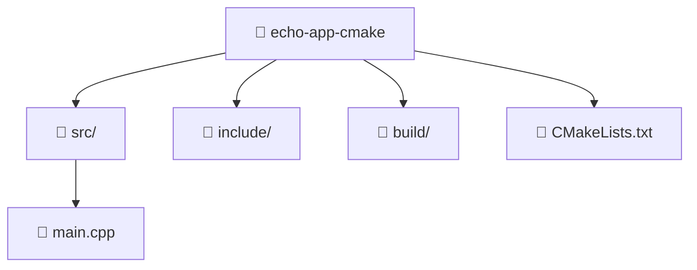

import GitHubRepoLink from "@site/src/components/git/GitHubRepoLink";
import References from "@site/src/components/ReferencesComponent";
import ReadingTime from '@site/src/components/ReadingTime';
import { ProCons, Pros, Cons } from '@site/src/components/cajitas/ProCons'
import BoxedTabs from '@site/src/components/cajitas/BoxedTabs'
import TabItem from '@theme/TabItem'
import Explanation from '@site/src/components/admonitions/Explanation'

<ReadingTime/>
<GitHubRepoLink repo={"echo-app-cmake"} user={"r8vnhill"} />

## 🧰 Paso 0: Instalar dependencias necesarias para CMake

<BoxedTabs groupId={"os"}>
    <TabItem value="Windows" label="Windows">
        ```powershell showLineNumbers title=""
        
        ```
    </TabItem>
    <TabItem value="macOS" label="macOS">
        ```bash showLineNumbers title=""
        
        ```
    </TabItem>
    <TabItem value="Ubuntu/Debian" label="Ubuntu/Debian">
        ```bash showLineNumbers title=""
        
        ```
    </TabItem>
</BoxedTabs>

## 🏗️ Crear un Proyecto con CMake

A diferencia de Gradle, CMake no tiene un comando `init` que genere estructuras por defecto. Normalmente, un proyecto se inicia creando manualmente los archivos.

### 🧱 Estructura típica del proyecto



:::info[Explicación]

Este diagrama muestra la estructura típica de un proyecto en C++ configurado con CMake:

- **`CMakeLists.txt`** es el archivo principal de configuración del proyecto. Define el estándar del lenguaje, los archivos fuente, el nombre del ejecutable, y cualquier configuración adicional.
- **📂 `src/`** contiene el código fuente del proyecto. Aquí se define la lógica de la aplicación. En este ejemplo, el archivo `main.cpp` es el punto de entrada.
- **📂 `include/`** suele contener los archivos de cabecera (`.h` o `.hpp`) que declaran interfaces, funciones, y estructuras utilizadas en el código fuente.
- **📂 `build/`** es la carpeta destinada a contener los artefactos de compilación. Es buena práctica mantenerla separada del código fuente para permitir builds limpios y múltiples configuraciones (debug/release, etc.).

Esta estructura facilita la organización del código, la reutilización de componentes, y el uso de herramientas como CMake sin mezclar archivos generados con archivos fuente.

:::

### 📄 Contenido de `CMakeLists.txt`

```cmake showLineNumbers title="CMakeLists.txt"
cmake_minimum_required(VERSION 3.16)
project(echo_app)

set(CMAKE_CXX_STANDARD 17)

add_executable(echo-app src/main.cpp)
```

:::warning

A diferencia de Gradle, CMake **no gestiona dependencias automáticamente**. La gestión de bibliotecas externas requiere herramientas adicionales como `vcpkg`, `FetchContent`, o integraciones personalizadas.

:::

### 🔠 Ejemplo de `main.cpp`

```cpp showLineNumbers title="src/main.cpp"
#include <iostream>

int main() {
    std::cout << "Hello, world" << std::endl;
    return 0;
}
```

### ⚙️ Compilar el Proyecto

<BoxedTabs>
  <TabItem value="Windows" label="Windows">
    ```powershell
    mkdir build
    cd build
    cmake ..
    cmake --build .
    .\Debug\echo-app.exe
    ```

    <Explanation>
      Este conjunto de comandos compila y ejecuta el proyecto en Windows utilizando el generador predeterminado de CMake, que suele ser **Visual Studio**:

      - `mkdir build` crea un directorio de compilación fuera del árbol de código fuente.
      - `cd build` entra al directorio de compilación.
      - `cmake ..` genera los archivos de solución (`.sln`) y configuraciones del proyecto.
      - `cmake --build .` compila el proyecto usando el entorno de desarrollo detectado.
      - `.\Debug\echo-app.exe` ejecuta el binario generado, ubicado por defecto en la carpeta `Debug`.

      Este flujo es útil para trabajar con compiladores de Visual Studio directamente desde la terminal, sin necesidad de abrir el IDE.
    </Explanation>
  </TabItem>

  <TabItem value="Linux/Mac" label="Linux/Mac">
    ```bash
    mkdir build
    cd build
    cmake ..
    make
    ./echo-app
    ```

    <Explanation>
      Este conjunto de comandos compila y ejecuta el proyecto en sistemas Unix-like (como Ubuntu o macOS) utilizando `make`:

      - `mkdir build` crea un directorio de compilación fuera del árbol de código fuente.
      - `cd build` accede al nuevo directorio.
      - `cmake ..` genera los archivos de construcción a partir de `CMakeLists.txt`.
      - `make` compila el proyecto utilizando Makefiles generados por CMake.
      - `./echo-app` ejecuta el binario generado, que se encuentra en el mismo directorio.

      Esta práctica de **compilación fuera de árbol** ayuda a mantener el proyecto limpio y facilita el manejo de configuraciones o builds paralelos.
    </Explanation>
  </TabItem>
</BoxedTabs>


## 📊 Resumen comparativo

| **Aspecto**                      | **CMake**                                                                 | **Gradle (Kotlin DSL)**                                                   |
|----------------------------------|---------------------------------------------------------------------------|---------------------------------------------------------------------------|
| **Inicialización del proyecto** | Manual (`mkdir`, archivos a mano)                                         | `gradle init`, con opciones guiadas                                       |
| **Gestión de dependencias**     | No incluida; requiere `vcpkg`, `FetchContent`, etc.                       | Integrada (con `dependencies` y repositorios como Maven Central)         |
| **Lenguaje de configuración**   | Propio DSL (declarativo, estilo CMakeLists)                               | Kotlin DSL (o Groovy)                                                     |
| **Soporte multiplataforma**     | Fuerte en C/C++, multiplataforma por naturaleza                          | Soporte para JVM, Android, JS, Native, multiplataforma con plugins       |
| **Sistema de tareas**           | No cuenta con un sistema de tareas general                               | Basado en tareas (`tasks`, `doLast`, `dependsOn`, etc.)                  |
| **Compilación fuera del árbol** | Sí, mediante `mkdir build && cd build`                                    | Sí, pero no es una práctica obligatoria                                   |
| **Wrapper**                     | No tiene; depende de instalación global de CMake                          | Tiene (`gradlew`), asegura versión unificada                             |
| **Plugins/extensiones**         | No tiene sistema de plugins integrado                                     | Soporte amplio con `plugins {}` y repositorios                            |
| **Integración de pruebas**      | Manual (requiere `gtest`, configuración adicional)                        | Integración directa con frameworks como JUnit, Kotest, etc.              |
| **Publicación de artefactos**   | Requiere configuración manual o scripts externos                          | Soporte integrado (Maven, GitHub, Nexus, etc.)                           |
| **Curva de aprendizaje**        | Menor para proyectos pequeños, pero puede crecer rápido                   | Algo más empinada al principio, pero más fluida con experiencia           |
| **Casos de uso comunes**        | Proyectos en C/C++, bibliotecas de sistemas, compiladores, herramientas   | Aplicaciones y bibliotecas en Kotlin/JVM, Android, multiplataforma       |
| **Compatibilidad con IDEs**     | Alta (Visual Studio, CLion, VS Code, etc.)                                | Alta (IntelliJ, Android Studio, VS Code, etc.)                           |

### ✅ Beneficios / ❌ Limitaciones

<ProCons>
    <Pros>
        - **Altamente portable**: CMake permite generar archivos de proyecto para múltiples entornos (Make, Ninja, Visual Studio, Xcode), facilitando la compilación cruzada y la portabilidad entre plataformas.
        - **Separación clara entre código y artefactos de compilación**: La compilación fuera del árbol (`out-of-source builds`) mantiene el repositorio limpio y facilita pruebas paralelas o builds separados.
        - **Gran compatibilidad con herramientas de C/C++**: CMake es el estándar de facto para proyectos en C++ y tiene soporte nativo en muchos IDEs y herramientas de análisis estático.
        - **Soporta proyectos complejos**: Puede gestionar proyectos grandes con múltiples módulos, bibliotecas compartidas, y targets personalizados con lógica condicional avanzada.
        - **Extensible**: Puedes escribir funciones propias en el DSL de CMake para encapsular configuraciones repetidas.
    </Pros>
    <Cons>
        - **No gestiona dependencias de forma nativa**: A diferencia de Gradle, CMake no incluye un sistema de resolución de dependencias. Se requiere integrar herramientas como `vcpkg`, `FetchContent`, o realizar instalaciones manuales.
        - **DSL con sintaxis peculiar**: El lenguaje de configuración de CMake puede ser menos intuitivo, especialmente al trabajar con listas, condiciones, o bucles.
        - **Falta un sistema de tareas integrado**: No tiene un mecanismo declarativo para definir tareas como `test`, `format`, `publish`, lo cual limita la automatización dentro del mismo sistema.
        - **Menor integración con ecosistemas de publicación**: Publicar bibliotecas o binarios requiere scripts adicionales o soluciones externas, a diferencia del enfoque plugin-driven de Gradle.
    </Cons>
</ProCons>

## 🎯 Conclusiones

CMake es una herramienta poderosa y versátil para gestionar la compilación de proyectos en C y C++. Aunque su enfoque es más manual que el de herramientas como Gradle, ofrece gran flexibilidad y control sobre cada aspecto del proceso de construcción. A lo largo de esta lección aprendiste a crear un proyecto básico con CMake, organizar su estructura, compilarlo en diferentes sistemas operativos y contrastarlo con un enfoque más automatizado como Gradle.

Mientras que Gradle ofrece una experiencia más guiada y automatizada, CMake se destaca por su portabilidad, su compatibilidad con múltiples entornos y su uso extensivo en proyectos de software de sistemas.

### 🔑 Puntos clave

- **CMake no genera estructura automáticamente**: Requiere crear los archivos y carpetas iniciales manualmente, lo que da más control pero implica más responsabilidad.
- **Compilación fuera del árbol**: Es una práctica estándar con CMake y ayuda a mantener el proyecto limpio y bien organizado.
- **CMakeLists.txt es el núcleo del sistema**: Define cómo debe compilarse el proyecto, qué archivos incluir y qué estándar utilizar.
- **No incluye un sistema de dependencias**: A diferencia de Gradle, deberás integrar soluciones externas si necesitas bibliotecas de terceros.
- **Alta compatibilidad con IDEs y herramientas**: CMake es ampliamente soportado, lo que lo hace ideal para proyectos en C++ que necesitan portabilidad y flexibilidad.

### 🧰 ¿Qué nos llevamos?

Más allá de la configuración básica de un proyecto, trabajar con CMake nos invita a entender mejor el proceso de construcción del software. Al no depender de comandos automáticos ni estructuras predefinidas, nos enfrentamos directamente con las decisiones de diseño que hay detrás de un sistema de build. Esta exposición no solo nos da mayor control, sino que también profundiza nuestra comprensión de cómo el código fuente se transforma en binarios ejecutables.

A diferencia de Gradle, que abstrae muchas de estas decisiones, CMake exige una participación más activa, lo que puede parecer una barrera al principio, pero se convierte en una ventaja al escalar hacia proyectos más complejos o multiplataforma. Comprender sus principios desde lo básico nos prepara para afrontar escenarios reales de desarrollo en C y C++, donde el entorno, el compilador y la portabilidad son elementos clave.

Así, lo que nos llevamos no es solo un ejecutable funcional, sino una visión más clara y precisa del rol que cumple un sistema de construcción en el ciclo de vida de una biblioteca o aplicación.

## 📖 Referencias

### 🔥 Recomendadas

- 🌐 CMake Tutorial—CMake 4.0.0-rc5 Documentation. (s. f.). Recuperado 23 de marzo de 2025, de https://cmake.org/cmake/help/latest/guide/tutorial/index.html
