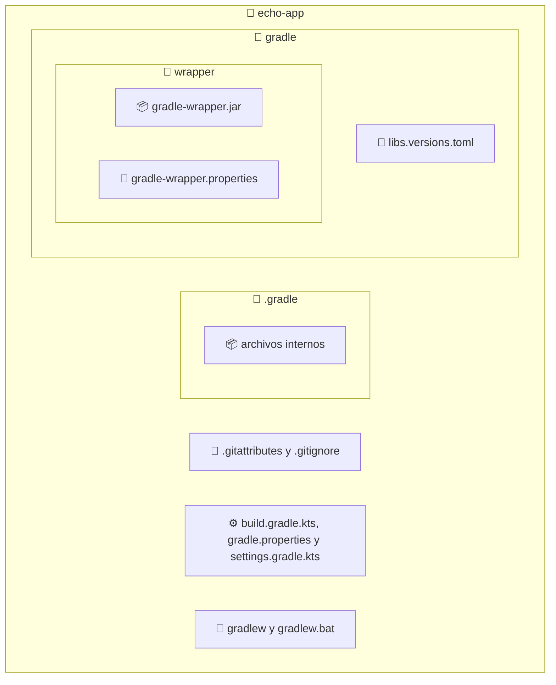

import GitHubRepoLink from "@site/src/components/git/GitHubRepoLink";
import References from "@site/src/components/ReferencesComponent";
import ReadingTime from '@site/src/components/reading-time/ReadingTime';
import * as LanguageCards from '@site/src/components/cards/LanguageCard'
import { ProCons, Pros, Cons } from '@site/src/components/cajitas/ProCons'
import BoxedTabs from '@site/src/components/cajitas/BoxedTabs'
import TabItem from '@theme/TabItem'
import Explanation from '@site/src/components/admonitions/Explanation'
import RepoLinks from '@site/src/components/git/RepoLinks';
import GitLabRepo from '@site/src/components/git/GitLabRepo';
import GitHubRepo from '@site/src/components/git/GitHubRepo';
import InitializeGradleProjectPs from '@site/src/components/mdx/build-systems/init/gradle/InitializeGradleProjectPs';
import InitializeGradleProjectSh from '@site/src/components/mdx/build-systems/init/gradle/InitializeGradleProjectSh';
import ReferenceList from '@site/src/components/references/ReferenceList';
import WebPage from '@site/src/components/references/WebPage';

<ReadingTime multiplier={2} />
<RepoLinks>
    <GitLabRepo repo={"echo-app-kt"} user={"r8vnhill"} />
    <GitHubRepo repo={"echo-app-kt"} user={"r8vnhill"} />
</RepoLinks>

Gradle es una herramienta de automatización moderna y flexible que permite compilar, testear y empaquetar proyectos de software de manera declarativa. Es ampliamente utilizada en el desarrollo de aplicaciones y bibliotecas en JVM (Java, Kotlin, Scala), y es la base del sistema de construcción de Android.

En esta lección aprenderás a crear un proyecto básico con Gradle desde cero, usando la herramienta `gradle init`. Este proceso inicial es fundamental para establecer una estructura de proyecto coherente, reproducible y escalable. También te familiarizarás con conceptos esenciales como el wrapper, el lenguaje de scripting (Kotlin DSL) y las convenciones que seguiremos en el resto del curso.

:::warning Prerequisitos

Esta lección asume que ya seguiste los pasos descritos en la sección [Herramientas necesarias y recomendadas](/docs/installation)

Si aún no has realizado esa configuración, te recomendamos completarla antes de continuar.

:::


## 📂 Paso 1: Inicializar el Proyecto Gradle

Primero, crea la estructura base del proyecto utilizando el script correspondiente a tu sistema operativo:

<BoxedTabs groupId={"os"}>
    <TabItem value="Windows" label="Windows">
        <InitializeGradleProjectPs />
    </TabItem>
    <TabItem value="macOS" label="macOS">
        <InitializeGradleProjectSh os="unix" />
    </TabItem>
    <TabItem value="Ubuntu/Debian" label="Ubuntu/Debian">
        <InitializeGradleProjectSh os="unix" />
    </TabItem>
</BoxedTabs>

:::tip ¿Qué es `gradle init`?

El comando `gradle init` es una utilidad interactiva que te permite **crear rápidamente la estructura básica de un proyecto Gradle**. Mediante un asistente paso a paso, puedes elegir:

- El tipo de proyecto (aplicación, biblioteca, básico, etc.)
- El lenguaje de script para la configuración (`Kotlin` o `Groovy`)
- El nombre del proyecto
- Si deseas usar nuevas APIs experimentales

Este comando es ideal para iniciar proyectos desde cero sin tener que escribir los archivos manualmente, asegurando que todo esté estructurado de acuerdo a las convenciones de Gradle.

:::

## 🧠 Paso 2: Elegir el Tipo de Proyecto

Durante la inicialización, Gradle te preguntará qué tipo de proyecto deseas generar.  

```text
Select type of build to generate:
  1: Application
  2: Library
  3: Gradle plugin
  # highlight-next-line
  4: Basic (build structure only)
Enter selection (default: Application) [1..4]
> 4
```

<Explanation>
    Para comenzar con una base **simple, limpia y flexible**, selecciona la opción:

    **`4: Basic (build structure only)`**

    Esta opción crea únicamente la estructura mínima del proyecto, sin incluir código de aplicación, permitiéndonos definirla desde cero de acuerdo con los objetivos del curso.
</Explanation>

En un caso real, probablemente elegirías `1: Application` o `2: Library`, pero aquí construiremos todo desde la base para entender mejor cómo funciona Gradle.

## 🏷️ Paso 3: Asignar un Nombre al Proyecto

Gradle te pedirá que asignes un nombre al proyecto.  
Si presionas Enter sin escribir nada, se usará por defecto el nombre del directorio actual, que en este caso es `echo-app`.

```text
Project name (default: echo-app):
```

::::info Explicación

El nombre del proyecto se utiliza internamente por Gradle para identificar este módulo o subproyecto.  
También se refleja en archivos como `settings.gradle.kts`, donde aparecerá como:

```kotlin
rootProject.name = "echo-app"
```

Este valor no tiene impacto directo en los nombres de paquetes o clases, pero **sí influye en la generación de artefactos**, como por ejemplo `echo-app.jar`, y en la identificación del módulo dentro de proyectos multi-módulo o al publicar a repositorios como Maven Central.

:::tip Usa kebab-case

Se recomienda utilizar **nombres cortos, en minúsculas y con guiones (`kebab-case`)**, ya que:

- Es el estilo convencional para artefactos en Maven Central y otros repositorios públicos.
- Facilita la lectura en entornos donde los nombres de los archivos o módulos aparecen frecuentemente (por ejemplo, `cl.ravenhill:echo-app:1.0.0`).

:::

::::

## 🧾 Paso 4: Elegir el Lenguaje de Script (DSL)

Gradle te pedirá que elijas el lenguaje con el que se escribirán los archivos de configuración del proyecto.  
En este curso trabajaremos con **Kotlin DSL**, por lo que debes seleccionar la opción:

**`1: Kotlin`**

```text
Select build script DSL:
  # highlight-next-line
  1: Kotlin
  2: Groovy
Enter selection (default: Kotlin) [1..2]
> 1
```

:::info Explicación

Gradle permite definir la configuración del proyecto usando dos lenguajes de scripting:

- **Groovy DSL** (usado históricamente desde las primeras versiones de Gradle)
- **Kotlin DSL** (introducido como alternativa moderna y con mejor soporte estático)

En este curso utilizamos **Kotlin DSL** porque:

- Es más expresivo y seguro gracias al tipado estático.
- Ofrece mejor autocompletado e integración con IDEs como IntelliJ o VS Code.
- Es consistente con el lenguaje principal que usaremos para desarrollar las bibliotecas.

Ambos DSLs son equivalentes en términos de capacidades, pero el estilo y la experiencia de desarrollo con Kotlin DSL se alinean mejor con proyectos modernos y profesionales.

:::

## 🧪 Paso 5: Usar o No Nuevas APIs Experimentales

Gradle preguntará si deseas generar el proyecto utilizando **nuevas APIs y comportamientos que podrían cambiar en futuras versiones**.

Para este curso, selecciona **`no`**, ya que preferimos una configuración más estable y predecible:

```text
Generate build using new APIs and behavior (some features may change in the next minor release)? (default: no) [yes, no]
> no
```

:::info Explicación

Gradle introduce ocasionalmente **nuevas APIs y convenciones** como parte de su evolución.  
Al optar por habilitarlas (`yes`), estás generando un proyecto con lo más reciente en cuanto a estructura y comportamiento, pero también:

- **Podrías enfrentarte a cambios no compatibles** en futuras actualizaciones menores.
- La documentación y los plugins aún podrían no estar completamente adaptados.

En contextos de aprendizaje, producción o documentación, lo más recomendable es usar la opción **estable (`no`)**, que garantiza:

- Mayor compatibilidad con herramientas y ejemplos existentes.
- Comportamiento más predecible entre versiones de Gradle.

:::

## 🗂️ Estructura del Proyecto Generado

Después de completar el asistente de `gradle init`, se generará una estructura mínima pero funcional que permite compilar y configurar el proyecto desde el primer momento:



:::info Explicación de la Estructura del Proyecto

Gradle genera una estructura estándar que permite mantener proyectos bien organizados, reproducibles y compatibles con herramientas modernas. Aquí un desglose de los elementos más relevantes:

- **📁 `echo-app/`**: Directorio raíz del proyecto.
    - **📁 `.gradle/`**: Carpeta interna usada por Gradle para almacenar datos temporales, cachés y metainformación de builds.
    - **📁 `gradle/`**: Contiene configuraciones globales del proyecto.
        - **📁 `wrapper/`**: Incluye los archivos necesarios para usar Gradle sin depender de una instalación global.
            - **📦 `gradle-wrapper.jar`**: Código ejecutable del wrapper.
            - **📝 `gradle-wrapper.properties`**: Define la versión de Gradle a utilizar.
        - **🧩 `libs.versions.toml`**: Permite declarar versiones centralizadas de dependencias si se usa la versión catalog de Gradle.
    - **📝 `.gitattributes` y `.gitignore`**: Archivos para control de versiones. Ayudan a excluir archivos temporales y mantener consistencia entre plataformas.
    - **⚙️ `build.gradle.kts`, `settings.gradle.kts`, `gradle.properties`**:
        - `build.gradle.kts`: Archivo principal de configuración del build (usando Kotlin DSL).
        - `settings.gradle.kts`: Declara el nombre del proyecto y, en builds multi-módulo, los subproyectos.
        - `gradle.properties`: Archivo de configuración para definir propiedades comunes al proyecto.
    - **🚀 `gradlew` y `gradlew.bat`**: Scripts del wrapper para ejecutar Gradle desde cualquier entorno (Unix/Windows), sin necesidad de instalación previa.

Esta estructura asegura portabilidad, reproducibilidad y una base profesional para construir bibliotecas, aplicaciones o herramientas complejas.

:::

:::tip Actualizando el Wrapper de Gradle

Puedes actualizar la versión del wrapper de Gradle modificando automáticamente el archivo `gradle/wrapper/gradle-wrapper.properties` usando el siguiente comando:

```bash
./gradlew wrapper --gradle-version=latest
```

Esto descargará y configurará la **última versión estable** de Gradle disponible.

También puedes fijar una versión específica:

```bash
./gradlew wrapper --gradle-version=8.13.0
```

Esto garantiza que todas las personas que trabajen en el proyecto usen exactamente la misma versión, lo cual mejora la reproducibilidad y evita inconsistencias entre entornos.

:::

## 🎯 Conclusiones

Iniciar un proyecto con Gradle es mucho más que generar archivos automáticamente: es dar el primer paso hacia una forma profesional, reproducible y automatizada de construir software.

En esta lección aprendiste a crear desde cero una estructura de proyecto bien organizada, compatible con buenas prácticas modernas y pensada para escalar. También comprendiste cómo funciona el comando `gradle init`, sus decisiones clave y cómo aprovechar al máximo las herramientas que Gradle pone a tu disposición desde el comienzo.

### 🔑 Puntos clave

- `gradle init` es una forma flexible y guiada de iniciar proyectos desde cero.
- Elegimos la opción **Basic** para construir una estructura mínima sin lógica de aplicación predefinida.
- El nombre del proyecto debe seguir el estilo `kebab-case`, especialmente si el proyecto se publicará como biblioteca.
- Utilizamos **Kotlin DSL** por su seguridad, expresividad y mejor integración con el lenguaje que usaremos.
- Optamos por **no usar APIs experimentales**, priorizando estabilidad y compatibilidad con documentación existente.
- Gradle genera automáticamente archivos clave como `build.gradle.kts`, `settings.gradle.kts`, el wrapper (`gradlew`) y carpetas de configuración como `.gradle/` y `gradle/wrapper/`.

### 🧰 ¿Qué nos llevamos?

Crear un proyecto con una estructura clara y reproducible no es solo una decisión técnica: es una declaración de intención sobre cómo queremos trabajar.

Elegir buenas convenciones desde el inicio —como el uso de `kebab-case`, el wrapper, y un DSL con tipado estático— nos prepara para colaborar mejor, evitar errores comunes y facilitar la automatización de tareas. Gradle, al ofrecer una base sólida y portable desde el primer paso, nos permite enfocarnos en construir código de calidad sin preocuparnos por configuraciones frágiles o manuales.

Este primer paso, aunque sencillo, sienta las bases para todo lo que construiremos en las siguientes lecciones. A partir de aquí, no solo escribirás código: estarás diseñando sistemas que se configuran, validan y despliegan de manera confiable y profesional.

<div className="language-card-container">
    <LanguageCards.CMakeCard link="/docs/build-systems/init/cmake" />
    <LanguageCards.MesonCard link="/docs/build-systems/init/meson" />
    <LanguageCards.MSBuildCard link="/docs/build-systems/init/msbuild" />
    <LanguageCards.CabalCard link="/docs/build-systems/init/cabal" />
    <LanguageCards.NxCard link="/docs/build-systems/init/nx" />
    <LanguageCards.MavenCard link="/docs/build-systems/init/maven" />
    <LanguageCards.UvCard link="/docs/build-systems/init/uv" />
    <LanguageCards.RubyCard link="/docs/build-systems/init/ruby" />
    <LanguageCards.CargoCard link="/docs/build-systems/init/cargo" />
    <LanguageCards.SbtCard link="/docs/build-systems/init/sbt" />
    <LanguageCards.SwiftCard link="/docs/build-systems/init/swift" />
</div>


## 📖 ¿Con ganas de más?

<ReferenceList 
    title="🔥 Referencias recomendadas"
    items={[
        <WebPage
            title="Building Java Applications Sample"
            url="https://docs.gradle.org/current/samples/sample_building_java_applications.html"
            location="la documentación oficial de Gradle"
        >
            Muestra paso a paso cómo generar un proyecto desde cero con estructura modular, configuración en Kotlin DSL, y soporte para pruebas con JUnit. Incluye instrucciones para compilar, ejecutar y empaquetar la aplicación, así como para publicar un <i>Build Scan</i> y entender la estructura del proyecto generada automáticamente por Gradle. Ideal como referencia práctica para aprender las convenciones y funcionalidades básicas de Gradle en proyectos reales.
        </WebPage>
    ]}
/>
