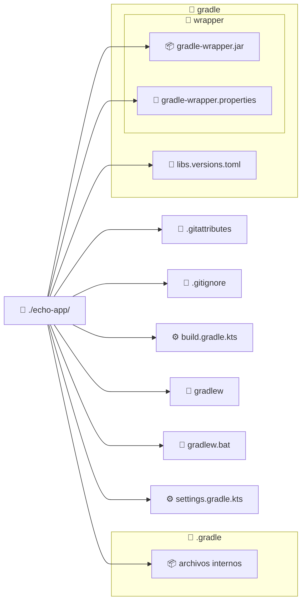

import GitHubRepoLink from "@site/src/components/git/GithubRepoLink";
import References from "@site/src/components/ReferencesComponent";
import ReadingTime from '@site/src/components/ReadingTime';
import * as LanguageCards from '@site/src/components/cards/LanguageCard'
import { ProCons, Pros, Cons } from '@site/src/components/cajitas/ProCons'
import BoxedTabs from '@site/src/components/cajitas/BoxedTabs'
import TabItem from '@theme/TabItem'
import Explanation from '@site/src/components/admonitions/Explanation'

<ReadingTime/>
<GitHubRepoLink repo={"echo-app-kt"} user={"r8vnhill"} />

Antes de poder automatizar tareas, compilar bibliotecas o aplicar convenciones reutilizables, necesitamos tener una estructura de proyecto bien definida. En esta lección aprenderás a crear tu primer proyecto con **Gradle**, usando el **Kotlin DSL**, que nos permitirá configurar todo el entorno de construcción con el mismo lenguaje en el que desarrollamos nuestras bibliotecas.

A lo largo de esta unidad construiremos una pequeña aplicación llamada `echo-app`, que dependerá de una biblioteca definida por nosotrxs. Esta aplicación recibirá parámetros desde la línea de comandos y mostrará un mensaje con la fecha y hora actual. Esta estructura nos permitirá trabajar con múltiples módulos y comenzar a aplicar gradualmente conceptos como tareas personalizadas, análisis estático y publicación.

El objetivo de esta lección es guiarte paso a paso en la creación de un proyecto básico, utilizando `gradle init` y seleccionando las opciones adecuadas para que el resultado sea coherente con los requerimientos de una biblioteca bien organizada.

## 📁 Paso 1: Crear el Directorio del Proyecto

Comienza creando un nuevo directorio para tu proyecto y luego accede a él:

<BoxedTabs groupId={"os"}>
  <TabItem value="Windows" label="Windows">
    ```powershell
    "echo-app" | ForEach-Object {
        New-Item -Path $_ -ItemType Directory -Force && `
            Set-Location -Path $_
    }
    ```

    <Explanation>
      Este bloque de PowerShell crea un directorio llamado `echo-app` y luego cambia el directorio actual para ubicarse dentro de él.

      - `"echo-app"` genera un único valor en la secuencia (el nombre del proyecto).
      - `ForEach-Object { ... }` aplica el bloque de código a cada valor recibido.
      - `New-Item -Path $_ -ItemType Directory -Force` crea el directorio si no existe. La opción `-Force` evita errores si el directorio ya está presente.
      - `Set-Location -Path $_` cambia al directorio recién creado.

      Esta combinación es útil en scripts porque permite trabajar con nombres definidos dinámicamente, manteniendo un flujo declarativo y reutilizable en PowerShell.
    </Explanation>
  </TabItem>

  <TabItem value="Windows (corto)" label="Windows (corto)">
    ```powershell
    "echo-app" | % { md $_ -f && cd $_ }
    ```

    <Explanation>
      Este comando de PowerShell es una versión abreviada para crear y acceder a un directorio llamado `echo-app`.

      - `"echo-app"` envía el nombre del directorio mediante una canalización (`|`).
      - `%` es un alias de `ForEach-Object`, que ejecuta el bloque `{ ... }` sobre cada valor recibido.
      - `md $_ -f` es un alias de `mkdir`, y la opción `-f` evita errores si el directorio ya existe.
      - `cd $_` cambia al directorio recién creado.

      Este estilo es más conciso y útil para tareas rápidas en la terminal, aunque puede resultar menos claro para personas que no estén familiarizadas con los alias de PowerShell.
    </Explanation>
  </TabItem>

  <TabItem value="Linux/macOS" label="Linux/macOS">
    ```bash
    dir="echo-app"; mkdir -p "$dir" && cd "$dir"
    ```

    <Explanation>
      Esta línea crea un directorio llamado `echo-app` y luego cambia al interior de ese directorio, todo en una sola instrucción:

      - `dir="echo-app"` define una variable con el nombre del directorio, evitando repetirlo y permitiendo modificarlo fácilmente si es necesario.
      - `mkdir -p "$dir"` crea el directorio si no existe. La opción `-p` previene errores si ya está creado.
      - `&& cd "$dir"` cambia al directorio **solo si la creación fue exitosa**.

      Esta forma es directa, clara y recomendada tanto para uso interactivo como para scripts simples en Bash o Zsh.
    </Explanation>
  </TabItem>
</BoxedTabs>

## 🧩 Paso 2: Inicializar el Proyecto con Gradle

Ejecuta el siguiente comando para comenzar la configuración del proyecto:

```bash
gradle init
```

Este comando te guiará paso a paso por un asistente interactivo donde podrás definir aspectos clave como el tipo de proyecto, el lenguaje de scripting y el nombre del módulo. Es una forma rápida y flexible de generar la estructura base sin tener que crear los archivos manualmente.

## 🧠 Paso 3: Elegir el Tipo de Proyecto

En este paso, Gradle te preguntará qué tipo de proyecto deseas crear. Para comenzar con una base simple y flexible, selecciona la opción:

**`4: Basic (build structure only)`**

Esta opción genera la estructura mínima de un proyecto sin incluir lógica de aplicación, lo que nos permite definirla desde cero según las necesidades del curso.

```text
Select type of build to generate:
  1: Application
  2: Library
  3: Gradle plugin
  # highlight-next-line
  4: Basic (build structure only)
Enter selection (default: Application) [1..4]
> 4
```

## 🏷️ Paso 4: Asignar un Nombre al Proyecto

Gradle te pedirá que indiques el nombre del proyecto. Si presionas Enter sin escribir nada, usará por defecto el nombre de la carpeta actual (en este caso, `echo-app`), lo cual es perfectamente adecuado para este ejercicio.

```text
Project name (default: echo-app):
```

## 🧾 Paso 5: Elegir el Lenguaje de Script (DSL)

En este paso, Gradle te pedirá que selecciones el lenguaje para los archivos de configuración del proyecto.  
En este curso trabajaremos con **Kotlin DSL**, así que elige la opción **`1: Kotlin`**.

```text
Select build script DSL:
  # highlight-next-line
  1: Kotlin
  2: Groovy
Enter selection (default: Kotlin) [1..2]
> 1
```

## 🧪 Paso 6: Usar o No Nuevas APIs Experimentales

Gradle puede preguntarte si deseas generar el proyecto utilizando **nuevas APIs y comportamientos** que podrían cambiar en futuras versiones.

Para este curso, selecciona **no**, ya que optar por la opción estable nos garantiza un entorno más predecible y compatible con la documentación actual.

```text
Generate build using new APIs and behavior (some features may change in the next minor release)? (default: no) [yes, no]
> no
```

## 🗂️ Estructura del Proyecto Generado

Una vez que completes los pasos anteriores, Gradle generará una estructura básica de proyecto como la siguiente:



:::info Explicación de la Estructura del Proyecto

Al inicializar el proyecto con Gradle, se genera una estructura mínima pero completa que incluye archivos clave para configurar, construir y compartir tu aplicación o biblioteca.

- **📁 `./echo-app/`**: Carpeta raíz del proyecto.
- **📄 `.gitattributes` / `.gitignore`**: Archivos de control de versiones usados por Git para definir reglas de formato y exclusión.
- **⚙️ `build.gradle.kts`**: Script principal de Gradle donde se definen tareas, dependencias y configuración del proyecto, usando Kotlin DSL.
- **🚀 `gradlew` / `gradlew.bat`**: Scripts ejecutables del wrapper de Gradle para Unix y Windows. Permiten ejecutar Gradle sin requerir instalación global.
- **⚙️ `settings.gradle.kts`**: Archivo donde se declara el nombre del proyecto y se configuran subproyectos en configuraciones multi-módulo.
- **🗂️ `.gradle/`**: Carpeta interna donde Gradle guarda archivos temporales y de estado.
- **📁 `gradle/`**: Carpeta de configuración general de Gradle.
  - **🧩 `libs.versions.toml`**: Archivo opcional para centralizar y versionar dependencias usando el sistema de versiones compartidas de Gradle.
  - **📁 `wrapper/`**: Contiene los archivos del *Gradle Wrapper*.
    - **📦 `gradle-wrapper.jar`**: Ejecutable del wrapper de Gradle.
    - **📝 `gradle-wrapper.properties`**: Archivo que define la versión de Gradle que debe usarse en el proyecto.

Esta estructura permite comenzar rápidamente con un entorno reproducible, portable y preparado para crecer hacia configuraciones más avanzadas como proyectos multi-módulo o bibliotecas publicables.

:::

:::tip Actualizando el Wrapper de Gradle

Puedes actualizar la versión del wrapper de Gradle que está en el archivo de propiedades (`gradle-wrapper.properties`) con el comando:

```bash
./gradlew wrapper --gradle-version=latest # Actualiza a la última versión de Gradle
```

También puedes especificar una versión específica de Gradle:

```bash
./gradlew wrapper --gradle-version="8.13.0"  # Actualiza a una versión específica de Gradle
```

:::

## ▶️ Paso 7: Ejecutar una Tarea Básica

Ejecuta la siguiente tarea predefinida para verificar que todo esté funcionando como se espera:

```bash
./gradlew tasks
```

Este comando debe mostrar una lista organizada de tareas disponibles en el proyecto, agrupadas por categorías como *Build tasks*, *Help tasks*, etc.

Si ves este listado sin errores, significa que:

- Gradle está correctamente configurado.
- El proyecto fue creado exitosamente.
- El *wrapper* (`./gradlew`) funciona correctamente.

:::tip ¿Qué pasa si algo falla?

Si ves errores relacionados con el comando `gradle` o `./gradlew`, verifica lo siguiente:

- Estás en el directorio raíz del proyecto (`echo-app`).
- El archivo `gradlew` tiene permisos de ejecución (en Linux/macOS puedes usar `chmod +x ./gradlew`).
- Tienes una versión de Java instalada (puedes verificarla con `java -version`).

:::

A partir de aquí, puedes comenzar a extender el proyecto con módulos, tareas personalizadas y configuraciones más complejas, sabiendo que la base es sólida y funcional.

## 🎯 Conclusiones

Iniciar un proyecto correctamente es el primer paso para construir software robusto, automatizable y mantenible. En esta lección aprendimos a crear un proyecto básico con Gradle usando el Kotlin DSL, sentando las bases para una estructura de desarrollo moderna y escalable.

### 🔑 Puntos clave

- Gradle permite inicializar proyectos fácilmente con `gradle init`, guiándote en cada decisión importante (tipo de proyecto, nombre, DSL, etc.).
- Elegimos **Kotlin DSL** para mantener consistencia entre el lenguaje de desarrollo y el de configuración.
- La estructura generada por Gradle incluye archivos esenciales como `build.gradle.kts`, `settings.gradle.kts` y el wrapper, lo que garantiza portabilidad y consistencia entre entornos.
- Verificar la instalación mediante `./gradlew tasks` permite asegurarse de que todo funciona antes de avanzar hacia tareas más complejas.

### 🧰 ¿Qué nos llevamos?

Crear un proyecto con una estructura clara y reproducible no es solo una cuestión técnica: es una decisión que impacta directamente en la calidad, mantenibilidad y colaboración futura de tu biblioteca. Al usar Gradle con Kotlin DSL, no solo alineamos las herramientas con el lenguaje de desarrollo, sino que también adoptamos prácticas que favorecen la automatización, la coherencia y la evolución controlada del proyecto.

Este primer paso puede parecer simple, pero sienta las bases para todo lo que construiremos a lo largo de la unidad. A partir de aquí, ya no solo estaremos escribiendo código: estaremos construyendo sistemas que se configuran, validan y despliegan de forma profesional.

<div className="language-card-container">
  <LanguageCards.CMakeCard link="/docs/build-systems/init/cmake" />
  <LanguageCards.MesonCard link="/docs/build-systems/init/meson" />
  <LanguageCards.MSBuildCard link="/docs/build-systems/init/msbuild" />
  <LanguageCards.CabalCard link="/docs/build-systems/init/cabal" />
  <LanguageCards.NxCard link="/docs/build-systems/init/nx" />
  <LanguageCards.MavenCard link="/docs/build-systems/init/maven" />
  <LanguageCards.UvCard link="/docs/build-systems/init/uv" />
  <LanguageCards.RubyCard link="/docs/build-systems/init/ruby" />
  <LanguageCards.CargoCard link="/docs/build-systems/init/cargo" />
  <LanguageCards.SbtCard link="/docs/build-systems/init/sbt" />
  <LanguageCards.SwiftCard link="/docs/build-systems/init/swift" />
</div>


## 📖 Referencias

### 🔥 Recomendadas

- 🌐 Building Kotlin Applications Sample. (s. f.). Recuperado 31 de marzo de 2025, de https://docs.gradle.org/current/samples/sample_building_kotlin_applications.html

### 🔹 Adicionales

- 🌐 Configurar un proyecto Gradle—AWS SDK for Java 2.x. (s. f.). Recuperado 4 de abril de 2025, de https://docs.aws.amazon.com/es_es/sdk-for-java/latest/developer-guide/setup-project-gradle.html
