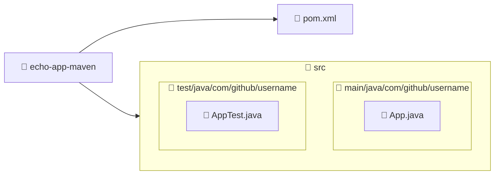

import GitHubRepoLink from "@site/src/components/GithubRepoLink";
import References from "@site/src/components/ReferencesComponent";
import ReadingTime from '@site/src/components/ReadingTime';
import { ProCons, Pros, Cons } from '@site/src/components/cajitas/ProCons'
import BoxedTabs from '@site/src/components/cajitas/BoxedTabs'
import TabItem from '@theme/TabItem'
import Explanation from '@site/src/components/admonitions/Explanation'

<ReadingTime/>
<GitHubRepoLink repo={"echo-app-maven"} user={"r8vnhill"} />

## 🧱 Paso 0: Instalar Maven

Para instalar Maven, puedes usar un gestor de paquetes según tu sistema operativo:

<BoxedTabs groupId={"os"}>
    <TabItem value="Windows" label="Windows">
        ```powershell
        scoop install maven
        ```
    </TabItem>
    <TabItem value="macOS" label="macOS">
        ```bash
        brew install maven
        ```
    </TabItem>
    <TabItem value="Linux" label="Linux">
        ```bash
        sdk install maven
        ```
    </TabItem>
</BoxedTabs>

### ✅ Verificar instalación

Para comprobar que Maven se instaló correctamente, ejecuta el siguiente comando en tu terminal:

```bash
mvn --version
```

Si la instalación fue exitosa, deberías ver una salida similar a esta:

```plaintext
Apache Maven 3.9.9 (8e8579a9e76f7d015ee5ec7bfcdc97d260186937)
Maven home: /path/to/maven
Java version: 23, vendor: Azul Systems, Inc., runtime: /path/to/java
Default locale: en_US, platform encoding: UTF-8
OS name: "Windows 10", version: "10.0", arch: "amd64", family: "windows"
```

## 🛠️ Paso 1: Crear el proyecto base

Ejecuta el siguiente comando para generar un nuevo proyecto Maven usando una plantilla básica:

<BoxedTabs groupId={"os"}>
    <TabItem value="Windows" label="Windows">
        ```powershell
        mvn archetype:generate "-DarchetypeArtifactId=maven-archetype-quickstart"
        ```
    </TabItem>
    <TabItem value="Linux/macOS" label="Linux/macOS">
        ```bash
        mvn archetype:generate -DarchetypeArtifactId=maven-archetype-quickstart
        ```
    </TabItem>
</BoxedTabs>

<Explanation>
    - **`archetype:generate`**: Ejecuta el plugin de arquetipos de Maven, que permite generar proyectos a partir de plantillas.
    - **`-DarchetypeArtifactId=maven-archetype-quickstart`**: Indica que queremos usar el arquetipo *quickstart*, una plantilla básica para proyectos Java con estructura estándar (`src/main/java` y `src/test/java`).
    - Al ejecutar este comando, Maven te guiará con preguntas interactivas como el `groupId`, `artifactId` y `version`, para personalizar el nuevo proyecto.
</Explanation>

## ✏️ Paso 2: Definir el identificador del grupo (`groupId`)

Durante la creación del proyecto, Maven te pedirá que ingreses un valor para la propiedad `groupId`. Verás algo como:

```plaintext
Define value for property 'groupId': com.github.username
```

<Explanation>
    El **`groupId`** representa el nombre del grupo o la organización que desarrolla el proyecto. Suele seguir una convención similar al nombre de un paquete Java (por ejemplo, `com.miempresa.proyecto`). Este identificador se utilizará para distinguir tus artefactos en el repositorio Maven.
</Explanation>

## 🏷️ Paso 3: Definir el identificador del artefacto (`artifactId`)

Maven solicitará ahora el valor de `artifactId`. Verás una línea como esta en la terminal:

```plaintext
Define value for property 'artifactId': echo-app-maven
```

<Explanation>
    El **`artifactId`** define el nombre del módulo o proyecto. Este será el nombre del directorio que se creará y también el identificador del artefacto generado (por ejemplo, `echo-app-maven.jar`).  
    Debe ser único dentro del grupo (`groupId`) y suele describir la función o propósito del proyecto.
</Explanation>

## 🧭 Paso 4: Definir la versión del proyecto (`version`)

Durante el proceso de creación, Maven pedirá que definas la versión del proyecto:

```plaintext
Define value for property 'version' 1.0-SNAPSHOT: 1.0.0
```

<Explanation>
    La propiedad **`version`** especifica la versión del artefacto que estás generando.  
    - Por defecto, Maven sugiere `1.0-SNAPSHOT`, que indica una versión en desarrollo.
    - En este caso, optamos por una versión **estable** (`1.0.0`), lo cual es útil cuando no necesitas trabajar con snapshots y quieres una numeración semántica clara para tus módulos.
</Explanation>

## 🧾 Paso 5: Definir el nombre del paquete base (`package`)

Durante la configuración, Maven solicitará el nombre del paquete donde se generará el código fuente:

```plaintext
Define value for property 'package' com.github.username:
```

<Explanation>
    La propiedad **`package`** define el **espacio de nombres** donde se ubicará tu código Java o Kotlin.  
    - Maven sugiere usar el mismo valor que `groupId`, lo cual es una buena práctica para mantener consistencia.  
    - Puedes aceptar el valor por defecto (`com.github.username`) o personalizarlo si prefieres una estructura distinta.

    Este valor se reflejará en la carpeta generada (`src/main/java/com/github/username`) y en los `package` del código fuente.
</Explanation>

## ✔️ Paso 6: Confirmar la configuración del proyecto

Una vez que hayas completado todos los campos, Maven mostrará un resumen con los valores que proporcionaste:

```plaintext
groupId: com.github.username  
artifactId: echo-app-maven  
version: 1.0.0  
package: com.github.username  
 Y:
```

<Explanation>
    Este paso es una **confirmación final** antes de que Maven genere el proyecto.  
    - Si estás de acuerdo con los valores, simplemente presiona `Enter` o escribe `Y` y presiona `Enter`.
    - Si deseas corregir alguno, escribe `N` para volver atrás y modificar los campos.

    Una vez confirmado, Maven creará la estructura del proyecto en una nueva carpeta llamada `echo-app-maven`.
</Explanation>

## 🌳 Estructura de un Proyecto Maven



:::info Explicación de la estructura

Esta es la **estructura típica de un proyecto Maven** generado con el arquetipo `maven-archetype-quickstart`. Cada carpeta cumple un rol específico:

- **📂 `echo-app-maven`**: Es la carpeta raíz del proyecto. Contiene el archivo `pom.xml`, que define la configuración del proyecto, sus dependencias, plugins y estructura.
    - **📄 `pom.xml`**: Archivo clave de Maven. Define el proyecto, sus metadatos y cómo debe compilarse. En proyectos multi-módulo, también coordina los módulos hijos.
    - **📂 `src`**: Carpeta raíz del código fuente del proyecto.
        - **📂 `main/java`**: Contiene el **código fuente principal** del proyecto. Aquí es donde se escriben las clases y funciones que conforman la lógica de la aplicación.
            - El subpaquete `com/github/username` sigue la **convención de nombres de paquetes Java**, basada en el dominio invertido del desarrollador.
        - **📂 `test/java`**: Contiene el **código de pruebas**. Se usa para implementar pruebas unitarias o de integración usando frameworks como JUnit.
    - **📄 `App.java` y `AppTest.java`**: Archivos de ejemplo generados por el arquetipo. Representan la clase principal del proyecto y su prueba asociada.

Esta organización permite separar claramente el código de producción del código de pruebas, y sigue las buenas prácticas de desarrollo en Java y Maven.

:::

{/* TODO: Agregar paso hello-world; recuerda hacer cd */}