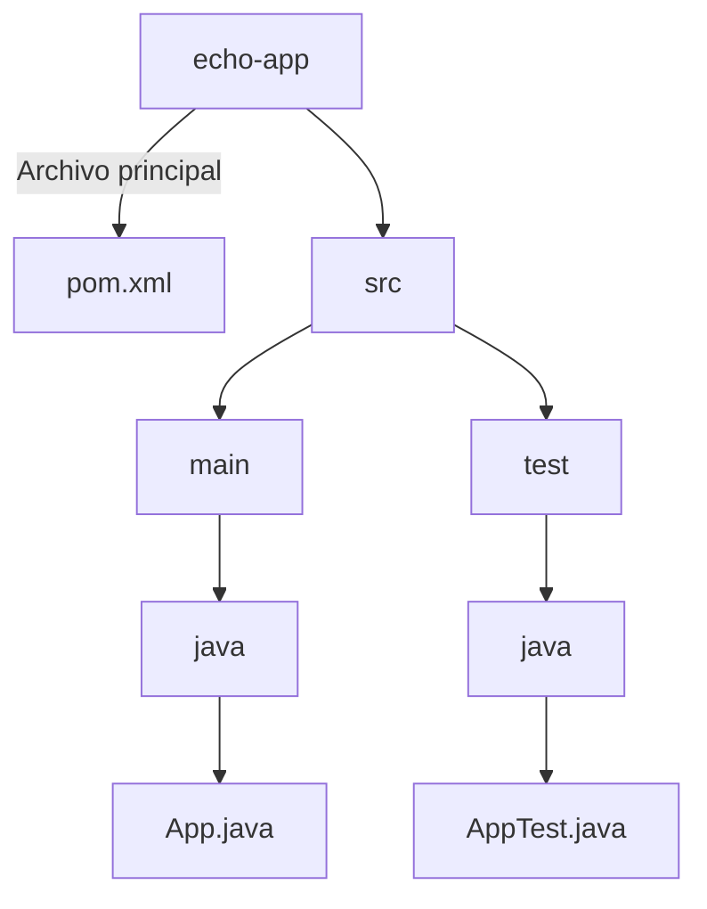

import GitHubRepoLink from "@site/src/components/GithubRepoLink";
import References from "@site/src/components/ReferencesComponent";
import ReadingTime from '@site/src/components/ReadingTime';
import { ProCons, Pros, Cons } from '@site/src/components/cajitas/ProCons'
import BoxedTabs from '@site/src/components/cajitas/BoxedTabs'
import TabItem from '@theme/TabItem'
import Explanation from '@site/src/components/admonitions/Explanation'

<ReadingTime/>
<GitHubRepoLink repo={""} user={"r8vnhill"} />

Esta lección compara **Gradle** con **Maven**, otro sistema de construcción de proyectos ampliamente usado en Java y otros lenguajes JVM. Partiendo de que ya conoces cómo funciona Gradle, nos centraremos en entender las diferencias más importantes y en cómo realizar tareas equivalentes en Maven.

## 🚧 Inicialización de Proyecto con Maven  

A diferencia de Gradle, en Maven la inicialización de un proyecto se realiza mediante **arquetipos (`archetype`)**, que son plantillas predefinidas que facilitan la creación de una estructura de proyecto estándar.

<BoxedTabs groupId={"os"}>
    <TabItem value="Windows" label="Windows">
        ```powershell
        mvn archetype:generate `
            "-DgroupId=com.github.username" `
            "-DartifactId=echo-app-maven" `
            "-DarchetypeArtifactId=maven-archetype-quickstart" `
            "-DinteractiveMode=false"
        ```
    </TabItem>
    <TabItem value="Linux/Mac" label="Linux/Mac">
        ```bash
        mvn archetype:generate \
            -DgroupId=com.github.username \
            -DartifactId=echo-app-maven \
            -DarchetypeArtifactId=maven-archetype-quickstart \
            -DinteractiveMode=false
        ```
    </TabItem>
</BoxedTabs>

<Explanation>
    - **`mvn archetype:generate`** → Comando para generar un nuevo proyecto Maven basado en un arquetipo.
    - **`-DgroupId`** → Nombre del grupo o paquete base del proyecto (por convención, suele usar un dominio invertido).
    - **`-DartifactId`** → Nombre del proyecto, que define el nombre del directorio y del artefacto generado.
    - **`-DarchetypeArtifactId=maven-archetype-quickstart`** → Plantilla predeterminada para proyectos Java simples.
    - **`-DinteractiveMode=false`** → Ejecuta el comando sin solicitar confirmaciones, generando el proyecto de inmediato.
</Explanation>

Este proceso creará la estructura básica del proyecto, incluyendo un archivo `pom.xml`, directorios para el código fuente y pruebas, y una clase de ejemplo lista para ejecutar.

## 🌳 Estructura de un Proyecto Maven

La estructura básica generada por Maven es menos personalizable que Gradle, pero muy consistente en todos los proyectos:



Mientras en Gradle la configuración es más flexible, Maven adopta esta estructura estándar y rígida por defecto, lo que simplifica la configuración pero limita la personalización.

## 🚀 Ejecución de tareas en Maven

Maven utiliza un enfoque basado en fases, distinto al sistema de tareas de Gradle. Las fases más comunes son:

```bash
mvn clean        # Limpia el proyecto
mvn compile      # Compila el proyecto
mvn test         # Ejecuta pruebas unitarias
```

A diferencia de Gradle, no puedes definir nuevas tareas arbitrarias fácilmente. Maven es rígido respecto a las fases predefinidas.

## 📌 **Conclusiones**  

En esta lección, comparamos la inicialización y estructura de proyectos en **Maven** y **Gradle**, destacando las diferencias clave entre ambos enfoques.

### **🔑 Puntos clave**  

1. **Inicialización del proyecto**  
   - Maven utiliza **arquetipos (`archetype`)** para generar una estructura estándar, mientras que Gradle permite mayor flexibilidad desde su configuración inicial.  
   - El comando `mvn archetype:generate` crea un proyecto siguiendo una plantilla predefinida.  
2. **Estructura del proyecto**  
   - Maven tiene una **estructura fija** con directorios estándar (`src/main/java`, `src/test/java`), mientras que en Gradle esta estructura es más flexible.  
   - En Maven, `pom.xml` es el único archivo de configuración, mientras que Gradle separa configuraciones en múltiples archivos (`build.gradle.kts`, `settings.gradle.kts`).  
3. **Ejecución de tareas**  
   - Maven usa **fases del ciclo de vida** (`clean`, `compile`, `test`), mientras que Gradle usa **tareas definidas por el usuario**.  
   - En Gradle, se pueden agregar tareas personalizadas fácilmente, mientras que en Maven, todo debe encajar dentro de su modelo predefinido.  
4. **Flexibilidad vs. Estandarización**  
   - **Maven**: Estructura y convenciones estrictas → Facilita la integración con otros proyectos, pero limita la personalización.  
   - **Gradle**: Mayor flexibilidad en la configuración y personalización, permitiendo definir tareas específicas para distintos proyectos.  

### **🚀 Reflexión final**  

La elección entre **Maven** y **Gradle** depende del nivel de control y flexibilidad que necesites:  
- **Maven** es ideal para proyectos que prefieren una convención estándar sin necesidad de ajustes personalizados.  
- **Gradle** es una mejor opción cuando necesitas definir tareas personalizadas, gestionar dependencias de manera más flexible o mejorar el rendimiento de compilación.  

Ambas herramientas son ampliamente utilizadas en el ecosistema JVM, por lo que comprender sus diferencias te permitirá tomar decisiones informadas al desarrollar y administrar proyectos.

<References references={[]} additionalReferences={[
    {
        title: "Gradle and Maven Comparison",
        url: "https://gradle.org/maven-and-gradle/",
        accessedDate: "20 de marzo de 2025",
        type: "web",
        // Último acceso: 20 de marzo de 2025
    },
]} />
