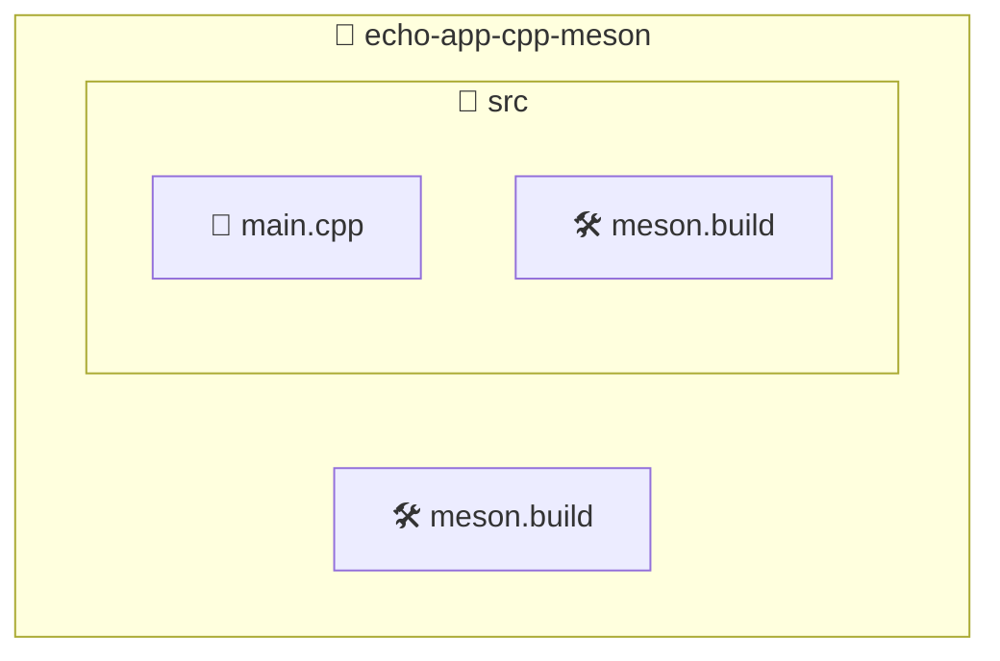

import BoxedTabs from '@site/src/components/cajitas/BoxedTabs'
import TabItem from '@theme/TabItem'
import Explanation from '@site/src/components/admonitions/Explanation'
import ReadingTime from '@site/src/components/ReadingTime'
import GitHubRepoLink from '@site/src/components/git/GitHubRepoLink'

<GitHubRepoLink user="r8vnhill" repo="echo-app-cpp-meson" />

Una de las primeras habilidades que debemos dominar al construir software moderno —especialmente bibliotecas— es cómo organizar y compilar nuestro código de forma clara, eficiente y automatizada.

En esta lección aprenderás a crear un proyecto básico en **C++** usando **Meson**, un sistema de construcción que destaca por su velocidad, simplicidad y soporte multiplataforma. Pero esto no se trata solo de compilar un “Hello, World”: se trata de comprender y aplicar buenas prácticas desde el primer archivo. Verás cómo herramientas como **Clang**, **Ninja** y **Meson** trabajan en conjunto, y aprenderás a automatizar tanto su instalación como la creación de proyectos.

Además, verás que aunque esta lección usa C++ como ejemplo, lo que aprendes aquí se puede aplicar a muchos otros lenguajes. La clave está en aprender a estructurar bien, automatizar lo esencial y preparar el camino para un desarrollo mantenible.

:::info ¿Y por qué no usar CMake?

CMake es muy popular, pero puede volverse complejo rápidamente. **Meson ofrece una sintaxis más clara, tiempos de configuración más rápidos y detección automática de muchos detalles**. Es ideal para quienes comienzan y para proyectos modernos que priorizan la simplicidad y la automatización.

:::

## 🧰 Paso 0: Instalar dependencias necesarias para Meson

Antes de compilar o probar un proyecto con **Meson**, necesitamos contar con tres herramientas clave en nuestro entorno de desarrollo. A continuación te explicamos **qué son**, **para qué se usan**, y luego te mostramos cómo instalarlas automáticamente según tu sistema operativo.

Meson no actúa solo: **es el director de orquesta** en el proceso de construcción. Se encarga de interpretar tu configuración, preparar todo el entorno y delegar las tareas concretas (como compilar) a otras herramientas especializadas. Por eso es fundamental que trabajen en conjunto:

| 🛠️ Herramienta | ¿Qué es? | ¿Para qué la usamos? |
|----------------|----------|----------------------|
| **Meson** | Un sistema de construcción (*build system*) moderno, rápido y centrado en la simplicidad. Fue diseñado para reemplazar herramientas más complejas como Autotools o CMake. Aunque es especialmente popular en proyectos en C y C++, **Meson también puede usarse con otros lenguajes como Rust, Fortran o Java**, gracias a su enfoque modular. | Para **configurar** el proyecto y generar las instrucciones que controlan la compilación (como los archivos que entiende Ninja). |
| **Ninja** | Un backend de compilación minimalista y altamente eficiente, diseñado para ser usado junto con Meson. | Para **ejecutar la compilación** real, siguiendo las reglas definidas por Meson. |
| **LLVM (Clang)** | Una infraestructura de compilación moderna y modular, con herramientas de análisis, optimización y compilación. Clang es su frontend para los lenguajes C y C++. | Para **traducir** el código fuente C o C++ a binarios ejecutables. Es el compilador real que se invoca al compilar con Ninja. |

> 🧠 **En conjunto:**  
> 🧩 **Meson** configura → ⚡ **Ninja** ejecuta → 🏗️ **Clang (LLVM)** compila tu código.

Este ecosistema es ampliamente adoptado en proyectos modernos por su velocidad, claridad, y facilidad de integración en entornos multiplataforma.

A continuación, selecciona tu sistema operativo para ver cómo instalarlas paso a paso:

<BoxedTabs groupId={"os"}>
    <TabItem value="Windows" label="Windows">
        ```powershell showLineNumbers title="En PowerShell"
        function Install-MesonDependencies {
            [CmdletBinding()]
            param (
                [switch]$Quiet
            )

            # 🔍 Checks if a given command is available in the system
            function Test-Command {
                param ([string]$Command)
                return ($null -ne (Get-Command $Command -ErrorAction SilentlyContinue))
            }

            # 📦 Installs a list of packages with Scoop if their associated command is missing
            function Install-PackagesWithScoop {
                param (
                    [hashtable]$CommandMap,
                    [switch]$Quiet
                )

                foreach ($pkg in $CommandMap.Keys) {
                    $command = $CommandMap[$pkg]

                    if (Test-Command {
                        Write-Host "🔹 $pkg is already available (via '$command'). Skipping Scoop." `
                            -ForegroundColor DarkGray
                        continue
                    }

                    Write-Host "📦 Installing $pkg with Scoop..." -ForegroundColor Cyan

                    if ($Quiet) {
                        scoop install $pkg *>&1 | Out-Null
                    } else {
                        scoop install $pkg
                    }

                    if ($LASTEXITCODE -eq 0) {
                        Write-Host "✅ $pkg installed successfully." -ForegroundColor Green
                    } else {
                        Write-Error "❌ Failed to install $pkg." -ForegroundColor Red
                        return 1
                    }
                }
            }

            # 🧱 Define which packages to install and how to verify them
            $commandMap = @{
                llvm  = 'clang'   # Required to compile C/C++ code
                meson = 'meson'   # Build system configuration tool
                ninja = 'ninja'   # Compilation executor
            }

            Install-PackagesWithScoop -CommandMap $commandMap @PSBoundParameters
        }
        ```

        ```powershell showLineNumbers title="Uso"
        Install-MesonDependencies         # Normal installation
        # Install-MesonDependencies -Quiet  # Uncomment for silent installation
        ```

        <Explanation>
            Esta función permite instalar automáticamente las herramientas necesarias para usar **Meson** en Windows, usando **Scoop** como gestor de paquetes.

            - ✅ Comprueba si cada herramienta ya está disponible en el sistema.
            - ⛔ Si ya está instalada (como `clang` o `ninja`), se omite su instalación.
            - 📦 Si no está, la instala con `scoop install`.
            - 🔕 La opción `-Quiet` permite suprimir la salida del comando para scripts silenciosos.
        </Explanation>
    </TabItem>
    <TabItem value="macOS" label="macOS">
        ```bash showLineNumbers title="En Terminal"
        install_meson_dependencies() {
            local llvm_method="$1"
            local quiet="$2"

            # ⏱ Waits for Xcode CLI installation to finish
            wait_for_xcode_cli() {
                echo "⏳ Waiting for installation to complete..."
                while ! xcode-select -p &>/dev/null; do
                    sleep 5
                done
            }

            # 📦 Installs Xcode Command Line Tools
            install_xcode_cli() {
                local quiet="$1"

                echo "🧰 Checking for Xcode Command Line Tools..."
                if ! xcode-select -p &>/dev/null; then
                    echo "📦 Installing Xcode Command Line Tools..."
                    if [[ "$quiet" == "quiet" ]]; then
                        xcode-select --install &>/dev/null
                    else
                        xcode-select --install
                    fi
                    wait_for_xcode_cli
                    echo "✅ Xcode Command Line Tools installed successfully."
                else
                    echo "✅ Xcode Command Line Tools are already installed."
                fi
            }

            # ➕ Appends a line to a file if not already present
            add_if_missing() {
                local file="$1"
                local line="$2"
                grep -Fxq "$line" "$file" || echo "$line" >> "$file"
            }

            # 🔧 Configures environment variables for LLVM based on the shell
            configure_llvm_env() {
                local shell_name file
                shell_name="$(basename "$SHELL")"
                echo "🔧 Configuring environment for: $shell_name"

                case "$shell_name" in
                    bash) file="$HOME/.bashrc" ;;
                    zsh)  file="$HOME/.zshrc" ;;
                    fish)
                        file="$HOME/.config/fish/config.fish"
                        mkdir -p "$(dirname "$file")"
                        touch "$file"
                        ;;
                    *)
                        echo "❌ Unsupported shell: $shell_name"
                        return 1
                        ;;
                esac

                local env_lines=(
                    "PATH=\"/opt/homebrew/opt/llvm/bin:\$PATH\""
                    "LDFLAGS=\"-L/opt/homebrew/opt/llvm/lib\""
                    "CPPFLAGS=\"-I/opt/homebrew/opt/llvm/include\""
                )

                for line in "${env_lines[@]}"; do
                    if [[ "$shell_name" == "fish" ]]; then
                        add_if_missing "$file" "set -x ${line//=/ }"
                    else
                        add_if_missing "$file" "export $line"
                    fi
                done

                # Reload shell config
                if [[ "$shell_name" == "fish" ]]; then
                    fish -c "source $file"
                else
                    # shellcheck source=/dev/null
                    source "$file"
                fi

                echo "✅ LLVM environment variables configured for $shell_name"
            }

            # 🍺 Installs any Homebrew package with optional quiet mode
            brew_install() {
                local package="$1"
                local quiet="$2"
                echo "📦 Installing $package..."
                if [[ "$quiet" == "quiet" ]]; then
                    brew install "$package" &>/dev/null
                else
                    brew install "$package"
                fi
                echo "✅ $package installed successfully."
            }

            # 🍺 Installs LLVM with Homebrew and configures the environment
            install_llvm_brew() {
                local quiet="$1"
                brew_install llvm "$quiet"
                configure_llvm_env
            }

            # 🚀 Main LLVM installation dispatcher
            install_llvm() {
                local method="$1"
                local quiet="$2"

                case "$method" in
                    xcode) install_xcode_cli "$quiet" ;;
                    brew)  install_llvm_brew "$quiet" ;;
                    *)
                        echo "❌ Unknown LLVM installation method: '$method'"
                        echo "   Use: install_meson_dependencies xcode|brew [quiet]"
                        return 1
                        ;;
                esac
            }

            install_meson() { brew_install meson "$1"; }
            install_ninja() { brew_install ninja "$1"; }

            # ✅ Validate input and install all
            if [[ "$llvm_method" != "brew" && "$llvm_method" != "xcode" ]]; then
                echo "❌ Invalid LLVM installation method: '$llvm_method'"
                echo "   Use: install_meson_dependencies xcode|brew [quiet]"
                return 1
            fi

            echo "🚀 Installing dependencies for Meson using LLVM via $llvm_method..."

            install_llvm "$llvm_method" "$quiet" || return 1
            install_meson "$quiet" || return 1
            install_ninja "$quiet" || return 1

            echo "✅ All Meson dependencies installed successfully."
        }
        ```

        ```bash showLineNumbers title="Uso"
        # Recommended if you already have Xcode
        install_meson_dependencies xcode        # Installs via xcode-select
        # install_meson_dependencies xcode quiet  # Silently installs

        # Alternatively, use Homebrew
        # install_meson_dependencies brew         # Installs via Homebrew
        # install_meson_dependencies brew quiet   # Silently installs
        ```

        <Explanation>
            Esta función instala todas las herramientas necesarias para usar el sistema de construcción **Meson** en macOS. Puedes elegir entre instalar LLVM con **Xcode** o **Homebrew**.

            - `llvm`: proporciona `clang`, el compilador requerido para proyectos en C/C++.
            - `meson`: es el sistema de construcción que usaremos.
            - `ninja`: ejecuta el proceso de compilación a partir de las instrucciones generadas por Meson.

            Si eliges la opción `brew`, también se configuran las variables de entorno necesarias para usar LLVM de Homebrew correctamente (`PATH`, `LDFLAGS`, `CPPFLAGS`).

            La función permite ocultar la salida con `quiet` para integrarse en scripts o procesos más grandes sin ruido visual innecesario.
        </Explanation>
    </TabItem>
    <TabItem value="Debian/Ubuntu" label="Debian/Ubuntu">
        ```bash showLineNumbers title="En Terminal"
        install_meson_dependencies() {
            local quiet="$1"

            # 🚫 Silences output if quiet mode is enabled
            run() {
                if [[ "$quiet" == "quiet" ]]; then
                    "$@" &>/dev/null
                else
                    "$@"
                fi
            }

            # ✅ Installs a package if its command is missing
            install_if_missing() {
                local name="$1"     # Friendly name (for messages)
                local cmd="$2"      # Command to check
                local pkg="$3"      # Package to install

                echo "🔍 Checking for $name..."
                if command -v "$cmd" &>/dev/null; then
                    echo "✅ $name is already installed."
                else
                    echo "📦 Installing $name..."
                    if run sudo apt install -y "$pkg"; then
                        echo "✅ $name installed successfully."
                    else
                        echo "❌ Failed to install $name." >&2
                        return 1
                    fi
                fi
            }

            echo "🔄 Updating package list..."
            if ! run sudo apt update; then
                echo "❌ Failed to update package list." >&2
                return 1
            fi

            install_if_missing "Clang" "clang" "clang" || return 1
            install_if_missing "Meson" "meson" "meson" || return 1
            install_if_missing "Ninja" "ninja" "ninja-build" || return 1

            echo "✅ All Meson dependencies installed successfully."
        }
        ```

        ```bash title="Uso"
        install_meson_dependencies           # Normal installation
        # install_meson_dependencies quiet   # Uncomment for silent installation
        ```

        <Explanation>
            Esta función Bash instala todas las dependencias necesarias para trabajar con el sistema de construcción **Meson** en distribuciones basadas en Debian/Ubuntu.

            - `clang`: proporciona el compilador C/C++ usado por Meson para compilar el código.
            - `meson`: es el sistema de construcción moderno que genera instrucciones de compilación.
            - `ninja-build`: ejecuta esas instrucciones de forma eficiente y rápida.

            Antes de instalar, se actualiza la lista de paquetes (`apt update`) y se verifica si cada herramienta ya está disponible usando `command -v`.

            El argumento `quiet` permite suprimir la salida de los comandos para facilitar la integración en scripts más grandes.
        </Explanation>
    </TabItem>
</BoxedTabs>

### ✅ Verificar la instalación

Una vez instaladas todas las herramientas, es importante confirmar que quedaron correctamente configuradas y disponibles en tu sistema. Ejecuta el siguiente comando para verificar la versión de cada componente clave:

```bash
clang --version && clang++ --version && meson --version && ninja --version
```

Deberías ver una salida similar a la siguiente (aunque los números de versión pueden variar dependiendo del momento en que instales):

```plaintext title="Salida esperada (puede variar)"
clang version 20.1.2
Target: x86_64-pc-windows-msvc
Thread model: posix
InstalledDir: B:\scoop\apps\llvm\20.1.2\bin
clang version 20.1.2
Target: x86_64-pc-windows-msvc
Thread model: posix
InstalledDir: B:\scoop\apps\llvm\20.1.2\bin
1.7.1
1.12.1
```

:::tip 

Si alguna de las versiones no aparece o el comando falla, asegúrate de que las herramientas estén correctamente instaladas y que sus rutas estén disponibles en el `PATH` del sistema.

:::

## 🧱 Paso 1: Crear la estructura inicial del proyecto

<BoxedTabs groupId={"os"}>
    <TabItem value="Windows" label="Windows">
        ```powershell showLineNumbers title="En PowerShell o como script"
        function New-MesonProject {
            [CmdletBinding()]
            param (
                [Parameter(Mandatory)]
                [string]$ProjectName,

                [string[]]$SourceFiles = @("main.cpp")
            )

            Write-Host "🚀 Creating new Meson project: $ProjectName" `
                -ForegroundColor Cyan

            # Resolve full path and create base directory
            $projectPath = Resolve-Path -Path (
            New-Item -Path $ProjectName -ItemType Directory -Force
            ).FullName
            $srcPath = Join-Path $projectPath "src"

            Write-Host "📁 Creating folders and Meson files..."
            New-Item -Path (Join-Path $projectPath "meson.build") `
                    -ItemType File `
                    -Force | Out-Null
            New-Item -Path $srcPath `
                    -ItemType Directory `
                    -Force | Out-Null
            New-Item -Path (Join-Path $srcPath "meson.build") `
                    -ItemType File `
                    -Force | Out-Null

            foreach ($file in $SourceFiles) {
                $filePath = Join-Path $srcPath $file
                if (-not (Test-Path $filePath)) {
                    New-Item -Path $filePath `
                            -ItemType File `
                            -Force | Out-Null
                    Write-Host "📄 Created source file: $file"
                } else {
                    Write-Warning "⚠️ File already exists: $file"
                }
            }

            Write-Host "✅ Meson project '$ProjectName' created successfully." `
                -ForegroundColor Green

            # Output path so it can be piped into Set-Location
            return $projectPath
        }
        ```

        ```powershell title="Uso"
        New-MesonProject -ProjectName 'echo-app-cpp-meson' | Set-Location
        ```

        <Explanation>
            Esta función crea un proyecto básico con la estructura que espera Meson:
            - Una carpeta principal con el nombre del proyecto.
            - Un archivo `meson.build` en la raíz del proyecto.
            - Una subcarpeta `src/` con su propio `meson.build`.
            - Uno o más archivos fuente, como `main.cpp`.

            Además, si usas esta función con un pipe a `Set-Location`, podrás cambiar de directorio directamente al nuevo proyecto.
        </Explanation>

        Aunque podríamos crear todo esto manualmente o con unos pocos comandos, encapsularlo en una función como esta mejora la legibilidad, facilita su reutilización y permite extenderla en el futuro (por ejemplo, para autogenerar contenido base en los archivos). 🎯
    </TabItem>
    <TabItem value="macOS" label="macOS">
        ```bash showLineNumbers title="En Terminal o como script"
        #!/bin/bash

        new_meson_project() {
            local project_name="$1"
            shift
            local source_files=("$@")
            local default_files=("main.cpp")

            if [[ -z "$project_name" ]]; then
                echo "❌ Project name is required." >&2
                return 1
            fi

            # Use default source file if none provided
            if [[ ${#source_files[@]} -eq 0 ]]; then
                source_files=("${default_files[@]}")
            fi

            echo "🚀 Creating new Meson project: $project_name" >&2

            # Get absolute path
            local project_path
            if command -v realpath &>/dev/null; then
                project_path="$(realpath "$project_name")"
            else
                project_path="$PWD/$project_name"
            fi

            # Create base directory structure
            if ! mkdir -p "$project_path/src"; then
                echo "❌ Failed to create project structure." >&2
                return 1
            fi

            echo "📁 Creating folders and Meson files..." >&2
            : > "$project_path/meson.build"
            : > "$project_path/src/meson.build"

            for file in "${source_files[@]}"; do
                local file_path="$project_path/src/$file"
                if [[ ! -f "$file_path" ]]; then
                    : > "$file_path"
                    echo "📄 Created source file: $file" >&2
                else
                    echo "⚠️ File already exists: $file" >&2
                fi
            done

            echo "✅ Meson project '$project_name' created successfully." >&2

            # Output path for chaining with cd
            echo "$project_path"
        }
        ```

        ```bash title="Uso"
        cd "$(new_meson_project 'echo-app-cpp-meson')"
        ```

        <Explanation>
            Esta función crea un nuevo proyecto compatible con **Meson**, con la siguiente estructura:

            ```
            echo-app-cpp-meson/
            ├── meson.build
            └── src/
                ├── meson.build
                └── main.cpp
            ```

            - Usa `realpath` para entregar una ruta absoluta lista para ser usada con `cd`.
            - Todos los mensajes informativos se envían a `stderr` (`>&2`), de forma que el único valor en `stdout` sea la ruta del proyecto.
            - Puede recibir una lista de archivos fuente opcionales. Si no se proporciona, creará `main.cpp` por defecto.
            - Si un archivo ya existe, lo informa sin sobrescribirlo.

            :::tip Ideal para scripts de inicialización o flujos automatizados

            Puedes expandirla fácilmente para agregar contenido por defecto en los archivos o configurar opciones de compilación.

            :::
        </Explanation>
    </TabItem>
    <TabItem value="Ubuntu/Debian" label="Ubuntu/Debian">
        ```bash showLineNumbers title="En Terminal o como script"
        #!/bin/bash

        new_meson_project() {
            local project_name="$1"
            shift
            local source_files=("$@")
            local default_files=("main.cpp")

            if [[ -z "$project_name" ]]; then
                echo "❌ Project name is required." >&2
                return 1
            fi

            # Use default source file if none provided
            if [[ ${#source_files[@]} -eq 0 ]]; then
                source_files=("${default_files[@]}")
            fi

            echo "🚀 Creating new Meson project: $project_name" >&2

            # Get absolute path
            local project_path
            if command -v realpath &>/dev/null; then
                project_path="$(realpath "$project_name")"
            else
                project_path="$PWD/$project_name"
            fi

            # Create base directory structure
            if ! mkdir -p "$project_path/src"; then
                echo "❌ Failed to create project structure." >&2
                return 1
            fi

            echo "📁 Creating folders and Meson files..." >&2
            : > "$project_path/meson.build"
            : > "$project_path/src/meson.build"

            for file in "${source_files[@]}"; do
                local file_path="$project_path/src/$file"
                if [[ ! -f "$file_path" ]]; then
                    : > "$file_path"
                    echo "📄 Created source file: $file" >&2
                else
                    echo "⚠️ File already exists: $file" >&2
                fi
            done

            echo "✅ Meson project '$project_name' created successfully." >&2

            # Output path for chaining with cd
            echo "$project_path"
        }
        ```

        ```bash title="Uso"
        cd "$(new_meson_project 'echo-app-cpp-meson')"
        ```

        <Explanation>
            Esta función crea un nuevo proyecto compatible con **Meson**, con la siguiente estructura:

            ```
            echo-app-cpp-meson/
            ├── meson.build
            └── src/
                ├── meson.build
                └── main.cpp
            ```

            - Usa `realpath` para entregar una ruta absoluta lista para ser usada con `cd`.
            - Todos los mensajes informativos se envían a `stderr` (`>&2`), de forma que el único valor en `stdout` sea la ruta del proyecto.
            - Puede recibir una lista de archivos fuente opcionales. Si no se proporciona, creará `main.cpp` por defecto.
            - Si un archivo ya existe, lo informa sin sobrescribirlo.

            :::tip Ideal para scripts de inicialización o flujos automatizados

            Puedes expandirla fácilmente para agregar contenido por defecto en los archivos o configurar opciones de compilación.

            :::
        </Explanation>
    </TabItem>
</BoxedTabs>

### 📂 Estructura de archivos

Cuando creamos un proyecto básico con Meson, se genera una estructura de carpetas y archivos que permite compilar el código de forma organizada. A continuación, se muestra un diagrama que ilustra cómo se estructura el proyecto por defecto:



::::info Explicación de la estructura de archivos

Esta es la estructura mínima generada para un proyecto en C++ gestionado con **Meson**:

- **📁 echo-app-cpp-meson/**: Carpeta raíz del proyecto.
    - **🛠️ meson.build**: Archivo de configuración principal del proyecto. Aquí se declara el nombre del proyecto, su versión, el compilador y los subdirectorios a incluir.
    - **📁 src/**: Carpeta donde vive el código fuente.
        - **📄 main.cpp**: Archivo principal de código en C++. Aquí estará tu función `main()`.
        - **🛠️ meson.build**: Archivo de configuración específico para el código fuente. Aquí se declaran los archivos que conforman el ejecutable y las dependencias que requiere.

:::tip

Separar la configuración del proyecto en varios archivos `meson.build` (uno por directorio) permite **modularizar tu proyecto** y facilita el mantenimiento a medida que crece.

:::

::::

## 🧾 Paso 2: Definir el archivo de configuración raíz

El archivo `meson.build` ubicado en la raíz del proyecto indica a Meson cómo compilar el programa y qué subdirectorios deben incluirse durante el proceso de construcción. Es el punto de partida del sistema de build.

A continuación, se muestra un ejemplo básico:

```python showLineNumbers title="meson.build"
project('main', 'cpp', version : '0.1.0')
subdir('src')
```

<Explanation>
    - **`project('main', 'cpp', version : '0.1.0')`**: Declara un proyecto llamado `main`, escrito en C++ (`cpp`), con la versión `0.1.0`.
    - **`subdir('src')`**: Indica que Meson debe procesar también el archivo `meson.build` ubicado dentro de la carpeta `src/`, donde se definirá el ejecutable y sus fuentes.
</Explanation>

Este archivo es esencial para organizar la compilación en proyectos modulares, ya que permite dividir la lógica de construcción en distintos niveles y carpetas.

## 🧩 Paso 3: Definir la compilación del ejecutable

Ahora que ya tenemos la estructura del proyecto y el archivo `meson.build` en la raíz está apuntando al subdirectorio `src`, es momento de indicarle a Meson **qué archivo fuente compilar** y **cómo generar el ejecutable**.

Edita el archivo `src/meson.build` con lo siguiente:

```python showLineNumbers title="src/meson.build"
main_sources = files('main.cpp')
main_exe = executable('main', main_sources)
```

<Explanation>
    En esta configuración:

    - `files('main.cpp')` indica a Meson que incluya `main.cpp` como archivo fuente del proyecto. Puedes agregar más archivos si los necesitas, como `'util.cpp'`, separándolos por comas.
    - `executable('main', main_sources)` crea un ejecutable llamado `main` a partir de los archivos listados en `main_sources`.
</Explanation>

## 🎯 Paso 4: Escribir el archivo principal del programa

Ahora que configuraste tu proyecto y definiste las reglas de compilación, es momento de escribir el código fuente. Crearemos un archivo simple llamado `main.cpp` que imprimirá un mensaje motivador en la consola.

```cpp showLineNumbers title="src/main.cpp"
#include <iostream>

int main() {
    std::cout << "Nothing can happen till you swing the bat\n";
    return 0;
}
```

<Explanation>
    Este archivo define el **punto de entrada** del programa en C++:

    - `#include <iostream>` permite usar `std::cout`, que se encarga de mostrar texto en la consola.
    - La función `main` es donde comienza la ejecución del programa.
    - `std::cout << "..."` imprime un mensaje motivacional seguido de un salto de línea.
        - En lugar de `std::endl`, se utiliza `\n` para mayor eficiencia: `std::endl` no solo agrega una nueva línea, sino que también **fuerza el vaciado del buffer** (`flush`), lo cual puede tener un impacto en el rendimiento si se hace repetidamente.
    - Aunque en muchos compiladores modernos no es obligatorio, se recomienda incluir `return 0;` al final de `main()` para indicar que el programa finalizó correctamente.

    Este programa sirve como ejemplo mínimo para comprobar que la configuración del proyecto funciona correctamente.
</Explanation>

## 🏗️ Paso 5: Compilar y ejecutar el proyecto

Una vez que has definido la estructura del proyecto, los archivos de configuración y tu código fuente, ya puedes compilar y ejecutar el programa.

### ⚙️ Compilar con Meson y Ninja

Primero inicializa el entorno de compilación y luego ejecuta la compilación:

```bash showLineNumbers title="Compilación"
meson setup build         # Crea la carpeta de compilación y configura el proyecto
meson compile -C build    # Compila el proyecto dentro del directorio 'build'
```

### 🚀 Ejecutar el binario

Una vez compilado, el ejecutable estará ubicado dentro de la carpeta `build/src/`. Usa el siguiente comando según tu sistema operativo:

<BoxedTabs groupId={"os"}>
    <TabItem value="Windows" label="Windows">
        ```powershell showLineNumbers title="En PowerShell"
        .\build\src\main.exe
        ```
    </TabItem>
    <TabItem value="macOS" label="macOS">
        ```bash showLineNumbers title="En Terminal"
        ./build/src/main
        ```
    </TabItem>
    <TabItem value="Ubuntu/Debian" label="Ubuntu/Debian">
        ```bash showLineNumbers title="En Terminal"
        ./build/src/main
        ```
    </TabItem>
</BoxedTabs>

```plaintext title="Salida esperada"
Nothing can happen till you swing the bat
```

<Explanation>
    - `meson setup build` crea una carpeta `build/` y genera dentro de ella los archivos de configuración necesarios.
    - `meson compile -C build` ejecuta `ninja` en el directorio `build/` para compilar el proyecto.
    - El binario resultante se guarda en `build/src/`, ya que allí fue definido en `src/meson.build`.

    Este flujo te permite mantener separados los archivos fuente y los archivos generados por la compilación, lo cual es una buena práctica en proyectos de software.
</Explanation>

## 🎯 Conclusiones

En esta lección construimos desde cero un proyecto en C++ utilizando **Meson** como sistema de construcción. Aprendiste a instalar las herramientas necesarias, generar la estructura inicial, configurar la compilación y ejecutar tu primer programa exitosamente.

Más allá del clásico "Hello World", lo importante fue comprender cómo se relacionan las herramientas involucradas y por qué organizar el proyecto desde el comienzo marca la diferencia cuando el código crece.

Este ejercicio, aunque básico, refleja una práctica esencial en el desarrollo de bibliotecas de software: **construir una base clara, portable y automatizable**.

## 🔑 Puntos clave

- **Meson no compila código por sí solo**: genera las instrucciones que luego Ninja ejecuta.
- **Clang** (o cualquier compilador compatible) es quien traduce el código fuente en binarios.
- Separar código fuente y artefactos de compilación usando una carpeta como `build/` mantiene tu proyecto limpio.
- La modularidad de `meson.build` permite escalar a estructuras más complejas fácilmente.
- Usar funciones para automatizar la instalación y creación de proyectos mejora la productividad y promueve buenas prácticas.

## 🧰 ¿Qué nos llevamos?

Este ejercicio nos muestra que incluso tareas simples como compilar un "Hello World" pueden convertirse en una oportunidad para practicar cómo automatizar, estructurar y documentar un proyecto correctamente. Estas habilidades son fundamentales para diseñar **librerías reutilizables** y **entornos de desarrollo sostenibles**.

A medida que avancemos, dejaremos atrás los scripts de terminal manuales y daremos paso a tareas automatizadas dentro del build system, lo que facilitará la portabilidad entre plataformas y equipos. Entender cómo y por qué automatizar desde el principio es un paso necesario para convertir un conjunto de archivos fuente en una biblioteca profesional y mantenible.

:::info Ejemplos reales con Meson

- [GTK](https://gitlab.gnome.org/GNOME/gtk) y muchas bibliotecas del ecosistema GNOME usan Meson como build system principal.
- [Systemd](https://github.com/systemd/systemd) migró de Autotools a Meson por su claridad y velocidad.

Explorar estos proyectos puede darte ideas sobre cómo estructurar bibliotecas complejas.

:::

## 📖 Referencias

### 🔥 Recomendadas

- [🌐 "Introduction to meson build system"](https://twdev.blog/2022/09/meson/) en *twdev.blog* por **Tomasz Wisniewski**: Introducción práctica y progresiva al uso de Meson en proyectos C++. El artículo muestra cómo estructurar un proyecto con bibliotecas, pruebas automatizadas y dependencias externas usando subproyectos y el sistema de empaquetado WrapDB. A través del ejemplo `libmagick`, enseña a declarar bibliotecas compartidas, integrar `gtest` como framework de testing, y configurar distintos modos de compilación. Es especialmente relevante para esta lección porque ejemplifica **buenas prácticas de organización, modularización y automatización** aplicadas desde el inicio del proyecto, alineadas con el objetivo del curso de construir software mantenible y profesional desde el primer archivo.

{/* ### 🔹 Adicionales */}
