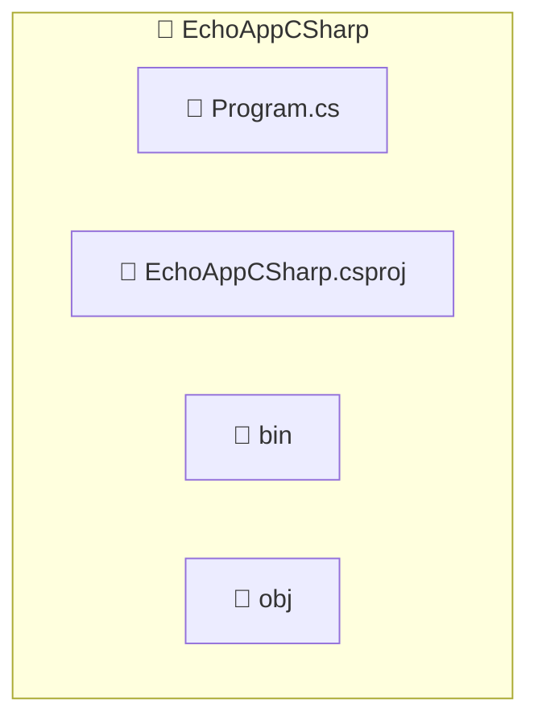

import ReadingTime from '@site/src/components/reading-time/ReadingTime';
import GithubRepoLink from '@site/src/components/GithubRepoLink';
import BoxedTabs from '@site/src/components/cajitas/BoxedTabs';
import TabItem from '@theme/TabItem';
import Explanation from '@site/src/components/admonitions/Explanation';
import ReferenceList from '@site/src/components/references/ReferenceList';
import Book from '@site/src/components/references/Book';

<ReadingTime multiplier={2} />
<GithubRepoLink user="r8vnhill" repo="echo-app-csharp"/>

En esta lección aprenderás a crear un proyecto básico en C# utilizando el sistema de construcción **MSBuild** y el ecosistema de herramientas de .NET. El objetivo no es solo compilar y ejecutar un programa, sino entender **cómo se estructura un proyecto profesional en C# desde cero**, con especial atención al archivo `.csproj`, que define su configuración, sus dependencias y su comportamiento.

Partiremos desde la instalación de herramientas necesarias hasta la escritura de un primer programa funcional, pasando por la creación del proyecto, el análisis de su estructura, y la personalización del archivo de configuración. Al final, contarás con una base sólida para construir aplicaciones y bibliotecas en C#, comprendiendo el rol de `dotnet`, MSBuild y el SDK de .NET en el ciclo de vida del software.

Este enfoque te permitirá desarrollar no solo aplicaciones de consola, sino también bibliotecas reutilizables —que es el foco central de este curso.

## 🧰 Paso 0: Instalar dependencias necesarias para C\#

C# es un lenguaje moderno, de propósito general, desarrollado por Microsoft. Se utiliza ampliamente para construir bibliotecas, aplicaciones web, servicios y herramientas de escritorio. Compila a código intermedio que corre sobre .NET, una plataforma multiplataforma y de alto rendimiento.

En el corazón del ecosistema de compilación en C# está **MSBuild**, un sistema de construcción basado en archivos XML que describe cómo compilar, empacar y distribuir aplicaciones. Aunque es poderoso y flexible, la mayoría de los proyectos modernos usan la herramienta de línea de comandos `dotnet`, que abstrae muchas operaciones comunes (como `dotnet build`, `dotnet run`, `dotnet test`).

Durante esta unidad trabajaremos con el SDK de .NET, que incluye:

- El compilador de C# (`csc`)
- El sistema de construcción (`MSBuild`)
- El CLI unificado (`dotnet`)
- Soporte para herramientas adicionales como generación de documentación o publicación de bibliotecas

A continuación, encontrarás scripts específicos para instalar estas herramientas según tu sistema operativo.

<BoxedTabs groupId={"os"}>
    <TabItem value="Windows" label="Windows">
        ```powershell showLineNumbers title="scripts/windows/Install-CSharpDependencies.ps1"
        function Install-CSharpDependencies {
            # Helper function to verify that a command is installed and returns a valid version.
            function Test-Installed([string] $Command) {
                try {
                    # Run the command with '--version' and capture both standard output and error.
                    $output = & $Command --version 2>&1

                    # Check if the output looks like a semantic version (e.g., 8.0.411).
                    if ($output -match '^\d+\.\d+\.\d+') {
                        # If a version is detected, we assume the SDK was installed correctly.
                        return
                    } else {
                        # If the command doesn't return a valid version string, throw a detailed error.
                        throw "❌ '$Command' did not return a valid version. Output was:`n$output"
                    }
                } catch {
                    # If running the command failed entirely, throw a different error.
                    throw "❌ Failed to verify '$Command'. $_"
                }
            }

            # Install the .NET SDK using Scoop.
            scoop install dotnet-sdk

            # Confirm that the 'dotnet' command works and returns a valid version string.
            Test-Installed dotnet

            Write-Host "✅ .NET SDK is installed successfully." -ForegroundColor Green
        }

        # Run the installation and validation process.
        Install-CSharpDependencies
        ```

        Guarda este script como `Install-CSharpDependencies.ps1` y ejecútalo:

        ```powershell showLineNumbers title="En PowerShell"
        .\Install-CSharpDependencies.ps1
        ```
    </TabItem>
    {/* region : macOS ----------------------------------------------------------------------------- */}
    <TabItem value="macOS" label="macOS">

    ```bash showLineNumbers title=""

    ```

    </TabItem>
    {/* endregion macOS ---------------------------------------------------------------------------- */}

    {/* region : Ubuntu/Debian --------------------------------------------------------------------- */}
    <TabItem value="Ubuntu/Debian" label="Ubuntu/Debian">

    ```bash showLineNumbers title=""

    ```

    </TabItem>
</BoxedTabs>

## 📦 Paso 1: Crear un proyecto nuevo

Para crear un nuevo proyecto en C#, usaremos la herramienta de línea de comandos `dotnet`, que simplifica el proceso de inicialización. En este caso, vamos a crear una aplicación de consola básica llamada `EchoApp`.

Esto generará automáticamente una estructura de proyecto basada en MSBuild, con un archivo `EchoApp.csproj` que describe cómo compilar, ejecutar y empacar tu aplicación.

<BoxedTabs groupId={"os"}>
    <TabItem value="Windows" label="Windows">
        ```powershell showLineNumbers title="scripts/windows/Initialize-CSharpProject.ps1"
        function Initialize-CSharpProject([string] $ProjectName) {
            # Create a new C# console project with the specified name
            dotnet new console -n $ProjectName

            # Change the current working directory to the newly created project folder
            Push-Location $ProjectName
        }

        Initialize-CSharpProject "EchoAppCSharp"
        ```

        Guarda este script como `Initialize-CSharpProject.ps1` y ejecútalo:

        ```powershell showLineNumbers title="En PowerShell"
        .\Initialize-CSharpProject.ps1
        ```
    </TabItem>

    <TabItem value="macOS" label="macOS">
        ```bash showLineNumbers title="scripts/macos/initialize_csharp_project.sh"

        ```

        Guarda este script como `initialize_csharp_project.sh` y ejecútalo:

        ```bash
        bash initialize_csharp_project.sh
        ```
    </TabItem>

    <TabItem value="Ubuntu/Debian" label="Ubuntu/Debian">
        ```bash showLineNumbers title="scripts/linux/initialize_csharp_project.sh"
        
        ```

        Guarda este script como `initialize_csharp_project.sh` y ejecútalo:

        ```bash
        bash initialize_csharp_project.sh
        ```
    </TabItem>
</BoxedTabs>

Una vez creado el proyecto, encontrarás un archivo `EchoApp.csproj` que representa la configuración del proyecto, y un archivo `Program.cs` con un ejemplo básico de programa.

## 📁 Estructura del Proyecto

Cuando creas un proyecto con `dotnet new console`, se genera automáticamente una estructura simple basada en MSBuild. Esta estructura permite compilar, ejecutar y distribuir tu aplicación de forma organizada.



:::info Explicación de la estructura

- **`Program.cs`**: Archivo principal del proyecto. Contiene el punto de entrada de la aplicación.
- **`EchoAppCSharp.csproj`**: Archivo de configuración del proyecto en formato XML. Define metadatos, dependencias, propiedades de compilación y tareas personalizadas.
- **`bin/`**: Carpeta generada automáticamente al compilar. Contiene los ejecutables (`.exe`, `.dll`) y archivos auxiliares del build.
- **`obj/`**: Carpeta temporal usada durante la compilación. Guarda archivos intermedios como recursos generados y metadata para MSBuild.

:::

## 🛠️ Paso 2: Tomando el control de tu `.csproj`

El archivo `.csproj` es el corazón del sistema de construcción en C#. Define cómo compilar tu aplicación, qué versión del lenguaje usar, qué dependencias incluir y qué configuración aplicar para diferentes entornos (desarrollo, producción, pruebas, etc.).

Aunque al principio puede parecer un simple archivo de configuración XML, modificarlo con intención te permite crear bibliotecas mantenibles, controladas y seguras.

A continuación, se muestra un ejemplo con varias opciones que te permiten tener un mayor control sobre el comportamiento del proyecto:

```xml showLineNumbers title="EchoAppCSharp.csproj"
<Project Sdk="Microsoft.NET.Sdk">

    <PropertyGroup>
        <OutputType>Exe</OutputType>
        <TargetFramework>net9.0</TargetFramework>
        <ImplicitUsings>enable</ImplicitUsings>
        <Nullable>enable</Nullable>
        <LangVersion>preview</LangVersion>
        <TreatWarningsAsErrors>true</TreatWarningsAsErrors>
        <GenerateDocumentationFile>true</GenerateDocumentationFile>
    </PropertyGroup>

    <PropertyGroup Condition="'$(Configuration)' == 'Debug'">
        <DefineConstants>DEBUG;TRACE</DefineConstants>
    </PropertyGroup>

    <PropertyGroup Condition="'$(Configuration)' == 'Release'">
        <Optimize>true</Optimize>
        <DefineConstants>TRACE</DefineConstants>
    </PropertyGroup>

    <PropertyGroup>
        <PackageId>EchoAppCSharp</PackageId>
        <Description>A basic echo application implemented in C# using .NET 9.</Description>
        <Authors>Tu Nombre</Authors>
        <PackageLicenseExpression>BSD-2-Clause</PackageLicenseExpression>
        <RepositoryUrl>https://github.com/username/echo-app-csharp</RepositoryUrl>
        <RepositoryType>git</RepositoryType>
        <PackageTags>echo;cli;example;learning</PackageTags>
    </PropertyGroup>
</Project>
```

<Explanation>
    - **`OutputType`**: Define el tipo de artefacto generado. `"Exe"` genera un ejecutable, `"Library"` una DLL.
    - **`TargetFramework`**: Especifica la versión de .NET. Aquí usamos `.NET 9.0`, que requiere el SDK más reciente.
    - **`ImplicitUsings`**: Activa las importaciones automáticas de espacios de nombres comunes. Facilita el código más limpio en programas pequeños.
    - **`Nullable`**: Activa la verificación de nulabilidad a nivel de lenguaje. Esto ayuda a prevenir errores comunes con referencias nulas.
    - **`LangVersion`**: Define la versión del lenguaje C# a utilizar. `"preview"` permite experimentar con las características más recientes.
    - **`TreatWarningsAsErrors`**: Trata cualquier advertencia del compilador como error. Es útil para mantener alta la calidad del código.
    - **`GenerateDocumentationFile`**: Genera un archivo `.xml` con los comentarios de documentación (usado en generación de documentación externa como DocFX).

    Los grupos condicionales (`Condition`) permiten definir propiedades distintas para distintos perfiles de compilación:
    - En `Debug`, se activan constantes para depuración (`DEBUG`, `TRACE`).
    - En `Release`, se activan optimizaciones y se eliminan símbolos innecesarios.

    En la sección final del archivo, se definen metadatos del paquete:
    - **`PackageId`**: Identificador único del paquete. Se usa al publicar en NuGet.
    - **`Description`**: Descripción breve del paquete.
    - **`Authors`**: Lista de autores del paquete. Reemplaza con tu nombre.
    - **`PackageLicenseExpression`**: Licencia del paquete. Aquí usamos la licencia BSD-2-Clause, pero puedes cambiarla según tus necesidades.
    - **`RepositoryUrl`**: URL del repositorio donde se aloja el código
    - **`RepositoryType`**: Tipo de repositorio, generalmente `git`.
    - **`PackageTags`**: Etiquetas que ayudan a categorizar el paquete en repositorios como NuGet.
</Explanation>

:::tip

Recuerda reemplazar los valores de `<Authors>` y `<RepositoryUrl>` con tu información personal y la URL de tu repositorio.

:::

## 💬 Paso 3: Tu primer programa en C\#

Ahora que tienes tu proyecto inicializado, es momento de ejecutar tu primer programa en C#. Vamos a comenzar con una frase icónica[^1] —como en otras lecciones— para ilustrar cómo imprimir texto en la consola.

```csharp showLineNumbers title="Program.cs"
Console.WriteLine("Super ultra great delicious wonderful bad");
```

<Explanation>
    Este programa imprime una línea en la salida estándar. La función `Console.WriteLine` es parte de la biblioteca base de .NET y se utiliza para mostrar mensajes por consola, similar a `println` en Kotlin.
</Explanation>

[^1]: La cadena utilizada —*"Super ultra great delicious wonderful bad"*— es una referencia al anime *Nichijou*, específicamente al personaje Yuuko Aioi, quien intenta describir un error de manera dramáticamente desproporcionada. Es una forma divertida de comenzar explorando la salida por consola en C#.

### 🚀 Ejecutando tu programa

Una vez que hayas escrito tu código en `Program.cs`, puedes compilarlo y ejecutarlo en un solo paso usando:

```bash showLineNumbers title="En la terminal"
dotnet run
```

Este comando compilará tu proyecto (si es necesario) y luego lo ejecutará inmediatamente, mostrando la salida en la consola.

:::tip ¿Qué es `dotnet run`?

El comando `dotnet run` es parte de la interfaz de línea de comandos de .NET. Combina dos pasos: `dotnet build` (que compila el proyecto) y la ejecución del binario resultante.

Es útil durante el desarrollo, ya que permite probar rápidamente los cambios sin preocuparte por rutas de salida o comandos adicionales. Si deseas compilar sin ejecutar, puedes usar `dotnet build` por separado.

:::

## 🎯 Conclusiones

En esta lección dimos nuestros primeros pasos con C# y el ecosistema .NET, comprendiendo cómo crear, estructurar y configurar un proyecto básico utilizando `dotnet` y MSBuild. Exploramos no solo cómo generar el proyecto, sino también cómo personalizar su archivo `.csproj` para obtener control sobre la compilación y la distribución.

### 🔑 Puntos clave

- **MSBuild** es el sistema de construcción de base en C#, controlado a través de archivos `.csproj`.
- El comando `dotnet` permite crear, compilar, ejecutar y probar proyectos .NET de forma unificada.
- El archivo `.csproj` puede configurarse para definir el framework, las versiones del lenguaje, las reglas de compilación, y metadatos útiles para publicación.
- C# incluye herramientas modernas como verificación de nulabilidad, compilación cruzada y documentación automática.

### 🧰 ¿Qué nos llevamos?

Esta lección no se trató solo de escribir `Console.WriteLine`, sino de entender los cimientos que sostienen un proyecto en C#. Al controlar activamente el archivo `.csproj`, transformamos una simple app de consola en una base sólida para bibliotecas y herramientas profesionales.

Nos llevamos la capacidad de iniciar proyectos bien estructurados y el conocimiento para ajustarlos a nuestras necesidades. Este control es clave al diseñar bibliotecas reutilizables y mantenibles, que es el enfoque central de este curso.

En próximas lecciones, construiremos sobre esta base para explorar temas como pruebas, publicación, organización modular y más.

{/* “Hello, C#! Welcome, .NET!” In C 12 and .NET 8 - Modern Cross-Platform Development Fundamentals: Start Building Websites and Services with ASP.NET Core 8, Blazor, and EF Core 8, 1st ed., 1–52. Birmingham: Packt Publishing Limited, 2023. */}

## 📖 ¿Con ganas de más?

<ReferenceList title="🔥 Referencias recomendadas" items={[
    <Book
        chapter="Hello, C#! Welcome, .NET!"
        pages={[1, 52]}
        book="C# 12 and .NET 8 - Modern Cross-Platform Development Fundamentals: Start Building Websites and Services with ASP.NET Core 8, Blazor, and EF Core 8"
        author="Mark J. Price"
    >
        Este capítulo introductorio te guía en la configuración del entorno de desarrollo, la creación de tus primeros proyectos con C# 12 y .NET 8, y la comprensión de las diferencias entre plataformas como .NET Framework, .NET Core y modern .NET. Se abordan distintos editores (Visual Studio, Visual Studio Code, GitHub Codespaces), se explica el sistema de archivos generado por MSBuild, y se introducen conceptos clave como programas de nivel superior, versiones del SDK y runtime de .NET, y buenas prácticas para el trabajo multiplataforma. También se presentan herramientas complementarias como Polyglot Notebooks y GitHub Copilot, y se ofrecen recursos de ayuda y comunidad. El capítulo incluye ejemplos prácticos de creación y ejecución de aplicaciones de consola en múltiples entornos, y prepara al lector para los temas más avanzados de lenguaje, bibliotecas y desarrollo web abordados en los capítulos siguientes.
    </Book>
]} />
