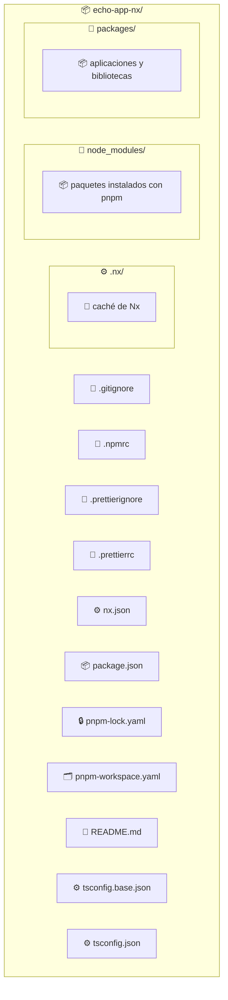
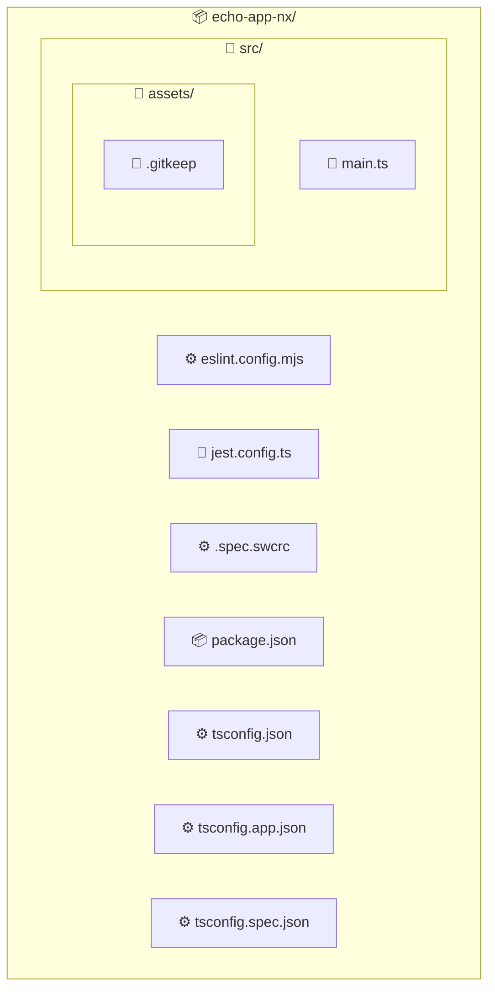

import GitHubRepoLink from "@site/src/components/git/GithubRepoLink";
import References from "@site/src/components/ReferencesComponent";
import ReadingTime from '@site/src/components/ReadingTime';
import * as LanguageCards from '@site/src/components/cards/LanguageCard'
import { ProCons, Pros, Cons } from '@site/src/components/cajitas/ProCons'
import BoxedTabs from '@site/src/components/cajitas/BoxedTabs'
import TabItem from '@theme/TabItem';
import Explanation from '@site/src/components/admonitions/Explanation'
                         
<ReadingTime/>
<GitHubRepoLink repo={"echo-app-nx"} user={"r8vnhill"} />

Al igual que con Gradle, es importante partir con una buena base para estructurar proyectos en **TypeScript** o **JavaScript**. En este caso, exploraremos cómo hacerlo con **Nx**, una herramienta de construcción para *monorepos* diseñada para gestionar múltiples aplicaciones y bibliotecas dentro de un solo repositorio, con énfasis en productividad, escalabilidad y buenas prácticas.

En esta unidad, crearemos un proyecto con **Nx** que incluya una biblioteca compartida y una aplicación de consola que la consuma.

## 🧰 Paso -1: Instalar Node.js

Antes de usar **Nx**, necesitas tener instalado **Node.js**, ya que es el entorno de ejecución necesario para las herramientas del ecosistema JavaScript/TypeScript (incluyendo `pnpm`, `npm` y `nx`).

<BoxedTabs groupId={"os"}>
    <TabItem value="Windows" label="Windows">
        ```powershell
        scoop install nodejs
        ```
    </TabItem>
    <TabItem value="macOS" label="macOS">
        ```bash
        brew install node
        ```
    </TabItem>
    <TabItem value="Linux" label="Linux">
        ```bash
        curl -o- https://raw.githubusercontent.com/nvm-sh/nvm/v0.39.7/install.sh | bash && \
        source ~/.nvm/nvm.sh && \
        nvm install --lts && \
        nvm use --lts && \
        nvm alias default 'lts/*'
        ```

        <Explanation>
            Este comando instala y configura **NVM** (Node Version Manager), una herramienta para gestionar múltiples versiones de Node.js:

            - `curl ... | bash`: Descarga e instala NVM.
            - `source ~/.nvm/nvm.sh`: Habilita NVM en tu terminal actual.
            - `nvm install --lts`: Instala la última versión LTS (Long Term Support) de Node.js.
            - `nvm use --lts`: Activa esa versión.
            - `nvm alias default 'lts/*'`: Establece esa versión como predeterminada.

            Una vez finalizado, ya podrás usar `npm` para instalar `pnpm` y otras herramientas necesarias.
        </Explanation>
    </TabItem>
</BoxedTabs>

### ✅ Verifica que la instalación fue exitosa

Para confirmar que **Node.js** está correctamente instalado, ejecuta el siguiente comando:

```bash
node --version
# v23.9.0
```

Si obtienes un número de versión como ese, ¡ya estás listx para continuar!

## 📦 Paso 0: Instalar `pnpm`

[`pnpm`](https://pnpm.io) es un gestor de paquetes moderno para el ecosistema de Node.js. A diferencia de `npm` o `yarn`, utiliza una estructura basada en enlaces simbólicos que evita la duplicación de dependencias, lo que se traduce en instalaciones más rápidas y eficientes.

Es especialmente útil en proyectos **monorepo**, como los que se construyen con Nx, porque:

- 📂 Reduce significativamente el espacio ocupado en `node_modules`.
- 🚀 Acelera la instalación de dependencias.
- 🧰 Proporciona `pnpm dlx`, una alternativa moderna a `npx`, ideal para ejecutar herramientas como `create-nx-workspace` sin necesidad de instalarlas globalmente.

Para instalar `pnpm` globalmente:

```bash
npm install -g pnpm
```

<Explanation>
    Este comando instala `pnpm` de forma global utilizando `npm`. Una vez instalado, podrás usar comandos como `pnpm install`, `pnpm dlx`, o `pnpm add` en cualquier proyecto.
</Explanation>

### ✅ Verifica que la instalación fue exitosa

Ejecuta el siguiente comando para confirmar que `pnpm` está disponible:

```bash
pnpm --version
```

Si ves un número de versión (por ejemplo, `10.7.1`), ¡todo está en orden para continuar! 🎉

### 🧱 Paso 1: Crear el Proyecto Base con Nx

Comenzaremos generando la estructura inicial del proyecto con **Nx**. Para ello, ejecuta el siguiente comando desde tu terminal:

```bash
pnpm dlx create-nx-workspace@latest echo-app-nx
```

<Explanation>
    Este comando crea un nuevo workspace utilizando la herramienta `create-nx-workspace`, ejecutada directamente desde el registro con `pnpm dlx`.

    - **`pnpm dlx`**: Ejecuta paquetes temporales sin necesidad de instalarlos globalmente (similar a `npx`, pero más eficiente).
    - **`create-nx-workspace@latest`**: Obtiene la versión más reciente del generador oficial de Nx.
    - **`echo-app-nx`**: Es el nombre del directorio que se creará, y por defecto también será el nombre del workspace.

    Tras ejecutar el comando, Nx iniciará un asistente interactivo que te guiará para elegir el tipo de aplicación, lenguaje base, estilo de formato y otras opciones de configuración inicial.
</Explanation>

## 🧩 Paso 2: Seleccionar la Pila Tecnológica

Durante la creación del workspace, Nx te preguntará qué tipo de **stack** deseas utilizar. Verás una pregunta como la siguiente:

```text
? Which stack do you want to use? ...
❯ None:          Configures a TypeScript/JavaScript monorepo.
  React:         Configures a React application with your framework of choice.
  Vue:           Configures a Vue application with your framework of choice.
  Angular:       Configures an Angular application with modern tooling.
  Node:          Configures a Node API application with your framework of choice.
```

<Explanation>
    La opción `None` configura un **monorepo base** en TypeScript o JavaScript, sin agregar ningún framework específico como React, Angular o Node.

    Esta elección es ideal si deseas tener control total sobre la organización de tus aplicaciones y bibliotecas, o si estás creando un proyecto desde cero que no depende aún de una pila en particular.

    También es una excelente forma de aprender cómo funciona Nx en su forma más flexible y minimalista.
</Explanation>

## 🎨 Paso 3: Elegir un Formateador de Código (Prettier)

Nx te preguntará si deseas incluir **Prettier** como herramienta de formateo automático del código fuente, ampliamente utilizada para mantener el código consistente mediante reglas automáticas de estilo como el espaciado, la indentación o el uso de comillas.

```text
? Would you like to use Prettier for code formatting?
❯ Yes
  No
```

<Explanation>
    Al elegir **Yes**, Nx incluirá automáticamente su configuración básica y un conjunto de comandos útiles para aplicarlo al proyecto. Esto resulta especialmente útil cuando varias personas colaboran en el mismo repositorio, ya que evita discusiones innecesarias sobre el estilo del código.

    Si eliges **No**, siempre puedes configurar Prettier (u otra herramienta) manualmente más adelante.
</Explanation>

<details>
    <summary>📎 ¿Cómo se compara Prettier con ktlint?</summary>

    | Característica                  | Prettier                                                                 | ktlint                                                      |
    |--------------------------------|--------------------------------------------------------------------------|-------------------------------------------------------------|
    | **Lenguajes compatibles**      | Multilenguaje (JS, TS, HTML, Markdown, etc.)                             | Solo Kotlin                                                 |
    | **Reescritura del código**     | Reescribe el archivo completo siguiendo un estilo fijo                   | Más respetuoso con el estilo existente                      |
    | **Análisis estático**          | No incluye                                                               | Sí, incluye algunas reglas de lint                          |
    | **Proyectos multiplataforma**  | Ideal para unificar estilos en proyectos frontend y backend              | Más específico para proyectos solo-Kotlin                   |
</details>

<details>
    <summary>▶️ ¿Cómo se ejecuta Prettier en un proyecto Nx?</summary>

    Puedes verificar si tu código está correctamente formateado **sin modificarlo** usando:

    ```bash
    pnpm nx format:check
    ```

    Si hay archivos que no cumplen con las reglas de estilo, se mostrará una lista con los archivos afectados.

    Para formatear automáticamente todos los archivos según la configuración de Prettier, ejecuta:

    ```bash
    pnpm nx format
    ```

    Este comando analiza los archivos del proyecto y aplica las reglas definidas.

    :::tip ¿Tienes problemas al ejecutar los comandos?

    Si ves un error como `Cannot find module '.../nx/bin/nx.js'`, es probable que las dependencias no estén correctamente instaladas. Para solucionarlo, ejecuta:

    <BoxedTabs groupId={"os"}>
        <TabItem value="Windows" label="Windows">
            ```powershell
            pnpm self-update && `
            pnpm install && `
            pnpm approve-builds
            ```
        </TabItem>
        <TabItem value="Linux/macOS" label="Linux/macOS">
            ```bash
            pnpm self-update && \
            pnpm install && \
            pnpm approve-builds
            ```
        </TabItem>
    </BoxedTabs>
    

    Esto actualizará `pnpm`, reinstalará las dependencias y te permitirá aprobar los scripts de instalación bloqueados.  
    Durante `pnpm approve-builds`, se abrirá un selector interactivo: asegúrate de **seleccionar `@swc/core` y `esbuild`**, ya que son necesarios para el funcionamiento de Nx y Prettier.

    :::
</details>

## 🔁 Paso 4: Seleccionar un proveedor de CI (opcional)

Durante la configuración, Nx te preguntará si deseas configurar un proveedor de **Integración Continua (CI)**:

```text
? Which CI provider would you like to use?
  GitHub Actions
  Gitlab
  Azure DevOps
  BitBucket Pipelines
  Circle CI
❯ Do it later
```

<Explanation>
    Para este ejercicio, selecciona **Do it later**.

    Nx puede generar automáticamente los archivos de configuración necesarios para varios proveedores de CI, como GitHub Actions o GitLab CI/CD.

    Si estás recién comenzando o prefieres mantener tu proyecto simple, puedes omitir esta parte por ahora y configurarla más adelante cuando lo necesites.
</Explanation>

<details>
    <summary>🧠 ¿Qué es CI/CD?</summary>

    **CI/CD** significa _Integración Continua_ (Continuous Integration) y _Entrega/Despliegue Continuo_ (Continuous Delivery/Deployment).

    Estas prácticas consisten en automatizar pasos del ciclo de desarrollo, como:

    - ejecutar pruebas automáticamente al hacer un commit,
    - compilar el código,
    - verificar que esté correctamente formateado,
    - y eventualmente desplegarlo a producción.

    Usar CI/CD ayuda a detectar errores antes, mantener calidad constante y reducir tareas manuales.  
    Herramientas como **GitHub Actions** o **GitLab CI** permiten definir estos pasos como archivos `.yml` que se ejecutan automáticamente al hacer cambios en el repositorio.
</details>

## ⚡ Paso 5: Habilitar caché remota (opcional)

Durante la instalación, Nx ofrece la opción de habilitar una **caché remota**, una funcionalidad que puede acelerar tus builds y tareas cuando trabajas en equipo:

```text
? Would you like remote caching to make your build faster?
(can be disabled any time)
  Yes
❯ No - I would not like remote caching
```

<Explanation>
    Seleccionar **Yes** habilita el caché remoto de Nx (no es gratis 💸), lo que permite reutilizar resultados de compilación, pruebas y tareas entre distintos entornos o integrantes de un equipo.

    Esto puede mejorar significativamente el rendimiento del proyecto en entornos colaborativos, al evitar repetir tareas innecesarias.

    Para este curso o para pruebas locales, puedes elegir **No** sin problema. Esta opción se puede cambiar más adelante si decides integrar **Nx Cloud**, el servicio que gestiona esta caché compartida.

    📘 Para más información, puedes consultar la [documentación oficial de Nx Cloud](https://nx.dev/ci/features/remote-cache).
</Explanation>

## 📁 Estructura del Proyecto Generado



:::info Explicación de la Estructura

- **📦 `echo-app-nx/`**: Carpeta raíz del proyecto.
    - **⚙️ `.nx/`**: Carpeta interna utilizada por Nx para almacenar información de tareas, grafos de dependencias y resultados de análisis. Generalmente no necesitas modificarla.
    - **📁 `node_modules/`**: Contiene todas las dependencias instaladas por `pnpm`. No debes modificar este directorio manualmente.
    - **📁 `packages/`**: Carpeta pensada para contener las aplicaciones (`apps/`) y bibliotecas (`libs/`) que compondrán el monorepo.
    - **📄 `.gitignore`**: Define qué archivos deben ser ignorados por Git.
    - **🧾 `.npmrc`**: Configuraciones específicas para `npm` o `pnpm`, como el registro, opciones de instalación y caché.
    - **📄 `.prettierignore`**: Define qué archivos Prettier debe ignorar al formatear.
    - **📝 `.prettierrc`**: Archivo de configuración del formateador de código Prettier.
    - **⚙️ `nx.json`**: Archivo de configuración principal de Nx. Define los proyectos, tags, tareas personalizadas y reglas generales.
    - **📦 `package.json`**: Define las dependencias, scripts y metadatos del proyecto.
    - **🔒 `pnpm-lock.yaml`**: Asegura que las versiones de las dependencias instaladas sean exactamente reproducibles.
    - **🗂️ `pnpm-workspace.yaml`**: Indica qué carpetas forman parte del monorepo. En este caso, normalmente incluirá `packages/*`.
    - **📘 `README.md`**: Documento inicial con instrucciones, descripción del proyecto o guías para colaboradores.
    - **⚙️ `tsconfig.base.json`**: Configuración base de TypeScript, compartida por todos los proyectos del monorepo.
    - **⚙️ `tsconfig.json`**: Archivo principal de TypeScript que suele extender `tsconfig.base.json`.

:::

## 🗣️ Paso 6: Crear tu primera aplicación

Vamos a crear una pequeña aplicación de consola (es decir, que se ejecuta desde la terminal) en TypeScript dentro de nuestro workspace, que diga algo como:

> “Are you not entertained?!”

Esta será nuestra primera aplicación dentro del monorepo y nos servirá para verificar que todo esté funcionando correctamente.

### 📦 Instalar Nx en el Proyecto

Desde la raíz del proyecto `echo-app-nx` (recuerda hacer `cd echo-app-nx` si no lo has hecho), ejecuta los siguientes comandos:

<BoxedTabs groupId={"os"}>
    <TabItem value="Windows" label="Windows">
        ```powershell
        pnpm self-update `
        && pnpm add --save-dev --workspace-root nx @nx/node `
        && pnpm install `
        && pnpm approve-builds
        ```
    </TabItem>
    <TabItem value="Linux/macOS" label="Linux/macOS">
        ```bash
        pnpm self-update && \
        pnpm add --save-dev --workspace-root nx @nx/node && \
        pnpm install && \
        pnpm approve-builds
        ```
    </TabItem>
</BoxedTabs>

Durante el proceso de instalación, verás un selector como este:

```text
√ Choose which packages to build (Press <space> to select, <a> to toggle all, <i> to invert selection) · nx
√ The next packages will now be built: nx.
Do you approve? (y/N) · true
```

<Explanation>
    Estos comandos actualizan `pnpm`, instalan Nx y el plugin para aplicaciones Node.js, luego reinstalan las dependencias y finalmente aprueban los scripts de construcción requeridos.

    - `pnpm add --save-dev --workspace-root nx @nx/node`: agrega Nx y su plugin para apps Node.js como dependencias de desarrollo en la raíz del monorepo.
    - `pnpm approve-builds`: aprueba scripts post-instalación necesarios para paquetes como `@swc/core` o `esbuild`.

    Este paso es obligatorio si usas `pnpm` con Nx, ya que algunas dependencias requieren pasos de compilación nativos.
</Explanation>

<details>
    <summary>🚀 ¿Prefieres instalar Nx globalmente?</summary>

    También puedes instalar Nx de forma global si prefieres usar el comando `nx` directamente en cualquier parte del sistema:

    ```bash
    pnpm add -g nx
    ```

    Esto te permitirá ejecutar comandos como `nx build` o `nx serve` sin necesidad de anteponer `pnpm`.

    :::tip

    Sin embargo, usar la versión local garantiza que todas las personas del equipo estén utilizando la misma versión de Nx definida en el proyecto.

    :::
</details>

### 🛠️ Generar la aplicación `arena` en el monorepo

```bash
pnpm nx g @nx/node:app arena --directory=packages/arena
```

<Explanation>
    Este comando genera una nueva aplicación llamada `arena` dentro del directorio `packages/arena`, utilizando el generador de Nx para proyectos Node.js.

    - `"@nx/node:app"`: Usa el generador para aplicaciones Node.js.
    - `"arena"`: Nombre de la aplicación.
    - `"--directory=packages/arena"`: Especifica la carpeta de destino dentro del monorepo.
</Explanation>

---

Durante la ejecución, Nx te hará algunas preguntas para configurar la nueva aplicación:

```text
? Which linter would you like to use? …
❯ eslint
  none

? Which unit test runner would you like to use? …
❯ jest
  none

? Which end-to-end test runner would you like to use? …
  jest
❯ none

? Which framework do you want to use? …
  express
  fastify
  koa
  nest
❯ none
```

<Explanation>
    Nx permite configurar herramientas opcionales para mejorar la calidad del código y facilitar el desarrollo:

    - **Linter**:
        - `eslint`: Analiza tu código en busca de errores y aplica reglas de estilo. Recomendado.
        - `none`: Sin reglas automáticas.
    - **Test runner**:
        - `jest`: Permite crear pruebas unitarias o de extremo a extremo (e2e).
        - `none`: Si no necesitas pruebas aún.
    - **Framework**:
        - `express`, `koa`, `nest`, etc.: Útiles para construir APIs.
        - `none`: Ideal para apps de consola como la que estamos creando.

    Estas opciones se pueden modificar más adelante, así que no te preocupes si luego cambias de idea.
</Explanation>

<details>
    <summary>🔍 Comparación: ESLint vs. Detekt</summary>

    Tanto **ESLint** como **Detekt** son herramientas de análisis estático diseñadas para detectar errores, malas prácticas y estilos inconsistentes en el código.

    | Característica        | ESLint (JS/TS)                            | Detekt (Kotlin)                            |
    |-----------------------|-------------------------------------------|--------------------------------------------|
    | Lenguaje objetivo     | JavaScript / TypeScript                   | Kotlin                                     |
    | Configuración         | `.eslintrc`, `.eslint.config.js`, etc.   | `detekt.yml`, `build.gradle.kts`           |
    | Integración           | Nx, Vite, Webpack, VSCode                 | Gradle, IntelliJ, Android Studio           |
    | Plugins               | Muy extensible (comunidad activa)         | Buena variedad de plugins                  |
    | Reglas personalizadas | Sí                                        | Sí                                         |
    | Autoformateo          | No (se complementa con Prettier)          | Parcial (se integra con `ktlint`)          |

    **ESLint** se enfoca en estilo y estructura del código en JS/TS, mientras que **Detekt** identifica _code smells_ y problemas idiomáticos en Kotlin.

    📘 Más info: [https://eslint.org](https://eslint.org) | [https://detekt.dev](https://detekt.dev)
</details>

### 📂 ¿Qué contiene la nueva aplicación?



:::info Explicación de la Estructura

Este diagrama muestra la estructura de archivos que genera Nx al crear una nueva aplicación con el generador `@nx/node:app`:

- `src/`: Carpeta que contiene el código fuente de la aplicación.
    - `main.ts`: Punto de entrada principal del programa.
    - `assets/`: Carpeta para recursos estáticos. El archivo `.gitkeep` asegura que la carpeta exista en el repositorio aunque esté vacía.
- `package.json`: Define las dependencias y scripts específicos de esta aplicación.
- `eslint.config.mjs`: Configuración de ESLint para análisis estático del código.
- `jest.config.ts`: Configuración para pruebas unitarias con Jest.
- `.spec.swcrc`: Configuración de compilación para los tests.
- `tsconfig*.json`: Configuraciones específicas de TypeScript para compilación (`app`), pruebas (`spec`) y referencias comunes (`tsconfig.json`).

:::

### ✍️ Personaliza el mensaje en `main.ts`

Edita el archivo de entrada principal de la aplicación para que imprima un mensaje personalizado al ejecutarse:

```ts title="packages/arena-app/src/main.ts"
console.log('Are you not entertained?!');
```

### 🚀 Ejecuta la aplicación

Ahora que ya creaste y compilaste tu aplicación, es momento de verla en acción.

Desde la raíz del proyecto, ejecuta:

<BoxedTabs groupId={"os"}>
    <TabItem value="Windows" label="Windows">
        ```powershell
        pnpm nx build arena-app && `
        node packages/arena-app/dist/packages/arena-app/src/main.js
        ```
    </TabItem>
    <TabItem value="Linux/macOS" label="Linux/macOS">
        ```bash
        pnpm nx build arena-app && \
        node packages/arena-app/dist/packages/arena-app/src/main.js
        ```
    </TabItem>
</BoxedTabs>

<Explanation>
    - `pnpm nx build arena-app`: Compila la aplicación `arena-app`. El resultado se guarda automáticamente en la carpeta `dist/`, manteniendo la estructura original del proyecto.
    - `node packages/arena-app/dist/packages/arena-app/src/main.js`: Ejecuta el archivo JavaScript generado a partir de `main.ts`.
</Explanation>

:::tip ¿Dónde se define la ruta del archivo compilado?

La ruta de salida del archivo compilado se configura dentro del bloque `nx.targets.build.options` del `package.json` del proyecto. Esta configuración le indica a Nx dónde colocar el archivo resultante al compilar el código.

A continuación se muestra un fragmento representativo (no el archivo completo):

```json
// packages/arena-app/package.json
{
  "nx": {
    "targets": {
      "build": {
        "executor": "@nx/esbuild:esbuild",
        "options": {
          "outputPath": "dist/",
          "main": "packages/arena-app/src/main.ts",
          "tsConfig": "packages/arena-app/tsconfig.app.json"
        }
      }
    }
  }
}
```

Con esta configuración, puedes compilar y ejecutar la aplicación con los siguientes comandos:

<BoxedTabs groupId={"os"}>
    <TabItem value="Windows" label="Windows">
        ```powershell
        pnpm nx build arena-app && `
        node dist/packages/arena-app/src/main.js
        ```
    </TabItem>
    <TabItem value="Linux/macOS" label="Linux/macOS">
        ```bash
        pnpm nx build arena-app && \
        node dist/packages/arena-app/src/main.js
        ```
    </TabItem>
</BoxedTabs>

:::

Si todo salió bien, deberías ver en la consola:

```text
Are you not entertained?!
```

## 🎯 Conclusiones

En esta lección exploramos cómo crear un proyecto básico usando **Nx** junto a **pnpm**, sentando las bases para una aplicación modular y escalable en TypeScript.

A lo largo del proceso, aprendiste a configurar tu entorno, crear el workspace, generar una aplicación simple y ejecutar su código — todo dentro del contexto de un **monorepo moderno**.

### 🔑 Puntos clave

- **Instalación moderna**: Usamos `pnpm` como gestor de paquetes por su rendimiento y compatibilidad con estructuras monorepo.
- **Workspace flexible**: Nx permite comenzar con un stack vacío (`None`) para tener mayor control y flexibilidad.
- **Generación guiada**: Nx facilita la creación de apps y bibliotecas a través de comandos interactivos.
- **Estructura predecible**: Cada aplicación queda organizada en su propio directorio, con configuración, dependencias y código fuente bien separados.
- **Compilación y ejecución clara**: La compilación genera archivos en una ruta predecible, lo que facilita su ejecución y organización.

### 🧰 ¿Qué nos llevamos?

Con esta lección no solo dimos nuestros primeros pasos con **Nx**, sino que sentamos las bases para trabajar en proyectos organizados, escalables y mantenibles. Aprendimos a usar herramientas modernas como `pnpm` y a navegar por las decisiones que propone Nx al iniciar un workspace. A través de la construcción de una pequeña aplicación, también comenzamos a explorar cómo estructurar un monorepo con buenas prácticas desde el principio.

Más allá del resultado —una app de consola con actitud de gladiador—, lo que realmente nos llevamos es la comprensión de cómo dar forma a nuestros proyectos con intención, utilizando herramientas que nos invitan a pensar en modularidad, automatización y calidad desde el día uno.

Ahora que hemos abierto la arena, es momento de preparar las bibliotecas que harán brillar nuestras aplicaciones.

## 📖 Referencias

### 🔥 Recomendadas

- [🌐 TypeScript Monorepo Tutorial](https://nx.dev/getting-started/tutorials/typescript-packages-tutorial) de **la documentación oficial de Nx**: Una guía oficial que profundiza en cómo Nx gestiona múltiples paquetes TypeScript en un monorepo. Es relevante a esta lección porque amplía lo aprendido sobre inicialización y estructura del proyecto, incorporando temas como pipelines de tareas, caché inteligente, integración continua y publicación de paquetes — aspectos clave para escalar lo que comenzamos a construir en esta unidad.

### 🔹 Adicionales

- [🎞 "Soo...what is Nx?"](https://www.youtube.com/watch?v=-_4WMl-Fn0w) por **Nx - Smart Monorepos - Fast CI**: Explicación general sobre qué es Nx, cómo acelera builds y tests mediante caché, paralelización y plugins, y cómo organiza monorepos de forma eficiente.
