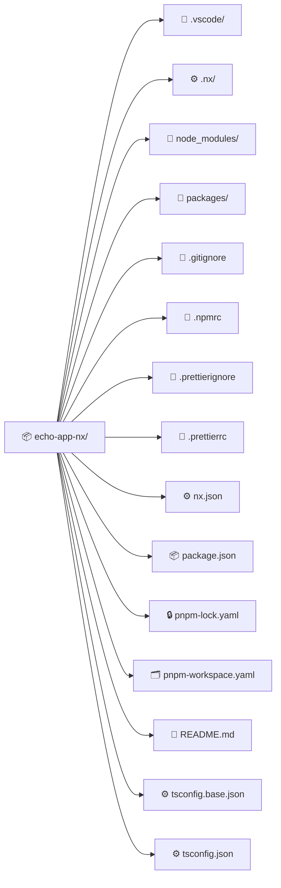
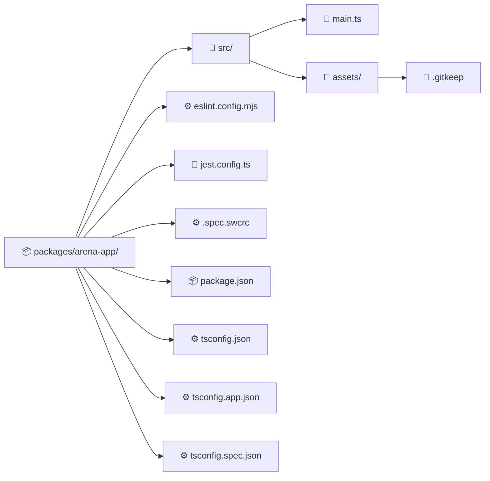

import GitHubRepoLink from "@site/src/components/GithubRepoLink";
import References from "@site/src/components/ReferencesComponent";
import ReadingTime from '@site/src/components/ReadingTime';
import * as LanguageCards from '@site/src/components/cards/LanguageCard'
import { ProCons, Pros, Cons } from '@site/src/components/cajitas/ProCons'
import BoxedTabs from '@site/src/components/cajitas/BoxedTabs'
import TabItem from '@theme/TabItem';
import Explanation from '@site/src/components/admonitions/Explanation'
                         
<ReadingTime/>
<GitHubRepoLink repo={"echo-app-nx"} user={"r8vnhill"} />

Al igual que con Gradle, es importante partir con una buena base para estructurar proyectos TypeScript o JavaScript. En este caso, exploraremos cómo hacerlo con **Nx**, una herramienta de construcción monorepo diseñada para manejar múltiples aplicaciones y bibliotecas dentro de un solo repositorio, con un enfoque en productividad, escalabilidad y buenas prácticas.

En esta unidad crearemos un proyecto con Nx que contenga una biblioteca compartida y una aplicación de consola que la utilice.

Buena observación. Si vas a utilizar `pnpm` para instalar y ejecutar **Nx**, no es estrictamente necesario usar `npx`, porque `pnpm dlx` cumple una función muy similar. Entonces, podrías simplificar la explicación sobre `npx` o incluso omitirla completamente si el flujo que enseñarás usa `pnpm` desde el inicio.

## 🧰 Paso -1: Instalar Node.js

Antes de usar **Nx**, necesitas tener instalado **Node.js**, ya que es el entorno de ejecución necesario para las herramientas del ecosistema JavaScript/TypeScript (incluyendo `pnpm`, `npm` y `nx`).

<BoxedTabs groupId={"os"}>
  <TabItem value="Windows" label="Windows">
    ```powershell
    scoop install nodejs
    ```

    <Explanation>
      Instala Node.js (y con ello también `npm`) usando Scoop, un gestor de paquetes para Windows. Una vez instalado, podrás usar herramientas como `pnpm`, `dlx` y `nx` desde la terminal.
    </Explanation>
  </TabItem>

  <TabItem value="macOS" label="macOS">
    ```bash
    brew install node
    ```

    <Explanation>
      Instala Node.js en macOS usando Homebrew. Esto incluye automáticamente `npm`, que podrás usar para instalar `pnpm` y otras herramientas necesarias para el desarrollo con Nx.
    </Explanation>
  </TabItem>

  <TabItem value="Linux" label="Linux">
    ```bash
    curl -o- https://raw.githubusercontent.com/nvm-sh/nvm/v0.39.7/install.sh | \
      bash && \
      source ~/.nvm/nvm.sh && \
      nvm install --lts && \
      nvm use --lts && \
      nvm alias default 'lts/*'
    ```

    <Explanation>
      Este comando instala y configura NVM (Node Version Manager), una herramienta para gestionar versiones de Node.js:

      - `curl ... | bash`: Descarga e instala NVM.
      - `source ~/.nvm/nvm.sh`: Habilita NVM en tu terminal actual.
      - `nvm install --lts`: Instala la última versión LTS (Long Term Support) de Node.js.
      - `nvm use --lts`: Activa esa versión.
      - `nvm alias default 'lts/*'`: Define esa versión como predeterminada.

      Una vez hecho esto, ya podrás usar `npm` para instalar `pnpm` y otras herramientas necesarias.
    </Explanation>
  </TabItem>
</BoxedTabs>

### ✅ Verifica que la instalación fue exitosa

Asegúrate de que Node.js esté disponible ejecutando:

```bash
node --version
```

Si obtienes un número de versión, ¡ya estás listx para continuar!

## 📦 Paso 0: Instalar `pnpm`

[`pnpm`](https://pnpm.io) es un gestor de paquetes moderno para el ecosistema de Node.js. A diferencia de `npm` o `yarn`, utiliza una estructura basada en enlaces simbólicos que evita duplicar dependencias, lo que se traduce en instalaciones más rápidas y eficientes.

Es especialmente útil en proyectos **monorepo**, como los que se construyen con Nx, porque:

- 📂 Reduce significativamente el espacio ocupado en `node_modules`.
- 🚀 Acelera la instalación de dependencias.
- 🧰 Ofrece una alternativa a `npx` llamada `pnpm dlx`, ideal para ejecutar herramientas temporales como `create-nx-workspace` sin instalarlas globalmente.

```bash
npm install -g pnpm
```

<Explanation>
    Instala `pnpm` globalmente usando `npm`. Esto te permitirá usar comandos como `pnpm dlx` para crear proyectos sin necesidad de instalaciones adicionales.
</Explanation>

### ✅ Verifica que la instalación fue exitosa

Ejecuta el siguiente comando para verificar que `pnpm` se instaló correctamente:

```bash
pnpm --version
```

Si ves un número de versión, ¡todo está en orden!

## 🧱 Paso 1: Crear el Proyecto Base con Nx

```bash
pnpm dlx create-nx-workspace@latest echo-app-nx
```

<Explanation>
    Ejecuta `create-nx-workspace` usando `pnpm dlx`, una alternativa moderna a `npx`.

    - `pnpm dlx`: Ejecuta un paquete directamente desde el registro, sin necesidad de instalarlo globalmente.
    - `create-nx-workspace@latest`: Usa la última versión del generador de workspaces de Nx.
    - `echo-app-nx`: Es el nombre del directorio que se creará y también el nombre del proyecto base.

    Este comando descargará e iniciará el generador de Nx, te hará una serie de preguntas interactivas y creará la estructura inicial del proyecto.
</Explanation>

## 🧩 Paso 2: Seleccionar la Pila Tecnológica

Durante la creación del workspace, Nx te preguntará qué tipo de **stack** deseas utilizar. Verás una pregunta como la siguiente:

```text
? Which stack do you want to use? ...
❯ None:          Configures a TypeScript/JavaScript monorepo.
  React:         Configures a React application with your framework of choice.
  Vue:           Configures a Vue application with your framework of choice.
  Angular:       Configures an Angular application with modern tooling.
  Node:          Configures a Node API application with your framework of choice.
```

<Explanation>
    La opción `None` configura un workspace vacío pero funcional, adecuado para gestionar múltiples proyectos TypeScript o JavaScript sin incluir frameworks específicos como React o Angular.

    Elegir esta opción te permite tener control total sobre cómo y cuándo agregar tus aplicaciones y bibliotecas dentro del workspace, ideal para entender cómo funciona Nx desde sus fundamentos.
</Explanation>

## 🎨 Paso 3: Elegir un Formateador de Código

Nx te preguntará si deseas incluir **Prettier** como herramienta de formateo automático del código fuente:

```text
? Would you like to use Prettier for code formatting?
❯ Yes
  No
```

<Explanation>
    Prettier es una herramienta ampliamente utilizada para mantener el código consistente, aplicando reglas automáticas de estilo (espaciado, indentación, uso de comillas, etc.).

    Al elegir **Yes**, Nx incluirá automáticamente su configuración básica y un conjunto de comandos útiles para aplicarlo al proyecto. Esto es especialmente útil cuando múltiples personas colaboran en el mismo repositorio.
</Explanation>

## 🔁 Paso 4: Seleccionar un proveedor de CI (opcional)

Durante la configuración, Nx te preguntará si deseas configurar un proveedor de **Integración Continua (CI)**:

```text
? Which CI provider would you like to use?
  GitHub Actions
  Gitlab
  Azure DevOps
  BitBucket Pipelines
  Circle CI
❯ Do it later
```

<Explanation>
    Para este ejercicio, selecciona **Do it later**.

    Nx permite generar automáticamente archivos de configuración para varios proveedores de CI. Sin embargo, si estás empezando o quieres mantener tu proyecto simple, puedes omitir esta parte por ahora y agregarla más adelante cuando lo necesites.
</Explanation>

## ⚡ Paso 5: Habilitar caché remota (opcional)

Durante la instalación, Nx ofrece la opción de habilitar **caché remota**, una funcionalidad que puede acelerar tus builds y tareas compartidas entre equipos:

```text
? Would you like remote caching to make your build faster?
(can be disabled any time)
  Yes
❯ No - I would not like remote caching
```

<Explanation>
    Seleccionar **Yes** habilita el caché remoto de Nx, que permite reutilizar resultados de compilación, pruebas y tareas en diferentes entornos o equipos de trabajo, lo cual mejora el rendimiento del proyecto en equipos colaborativos.

    Para este curso o pruebas locales, puedes elegir **No** sin problema. Esta opción se puede cambiar más adelante si decides integrar Nx Cloud.
</Explanation>

## 📁 Estructura del Proyecto Generado



:::info Explicación de la Estructura

- **📦 `echo-app-nx/`**: Carpeta raíz del proyecto.
- **🧩 `.vscode/`**: Configuraciones específicas de VS Code.
- **⚙️ `.nx/`**: Carpeta interna utilizada por Nx para almacenar información de tareas y resultados de análisis.
- **📁 `node_modules/`**: Directorio que contiene todas las dependencias instaladas.
- **📁 `packages/`**: Carpeta pensada para contener aplicaciones y bibliotecas creadas dentro del monorepo.

- **📄 `.gitignore`**: Define qué archivos deben ser ignorados por Git.
- **🧾 `.npmrc`**: Configuraciones específicas para `npm` o `pnpm`, como el registro o preferencias de instalación.
- **📄 `.prettierignore`**: Archivos que Prettier debe ignorar al formatear.
- **📝 `.prettierrc`**: Configuración del formateador de código Prettier.
- **⚙️ `nx.json`**: Archivo principal de configuración de Nx (proyectos, tags, tareas, etc.).
- **📦 `package.json`**: Archivo que define las dependencias y scripts del proyecto.
- **🔒 `pnpm-lock.yaml`**: Archivo de bloqueo que asegura versiones exactas al instalar dependencias.
- **🗂️ `pnpm-workspace.yaml`**: Define qué carpetas componen el monorepo (como `packages/`).
- **📘 `README.md`**: Documento inicial con instrucciones o descripción del proyecto.
- **⚙️ `tsconfig.base.json`**: Configuración base de TypeScript compartida por todos los proyectos del monorepo.
- **⚙️ `tsconfig.json`**: Punto de entrada para la configuración de TypeScript, generalmente extiende la base.

:::

## 🗣️ Paso 6: Crear una Aplicación

Vamos a crear una pequeña aplicación de consola en TypeScript dentro de nuestro workspace que diga algo como:

> “Are you not entertained?!”

Esta será nuestra primera aplicación dentro del monorepo, y servirá como una forma simple de verificar que todo está funcionando correctamente.

### 📦 Instalar Nx en el Proyecto

Desde la raíz del proyecto `echo-app-nx` (recuerda hacer `cd echo-app-nx` si no lo has hecho), ejecuta los siguientes comandos:

```bash
pnpm add -D nx @nx/node
pnpm approve-builds
```

```text
√ Choose which packages to build (Press <space> to select, <a> to toggle all, <i> to invert selection) · nx

√ The next packages will now be built: nx.
Do you approve? (y/N) · true
```

<Explanation>
    Este paso instala `nx` y el plugin `@nx/node`, necesario para crear aplicaciones en Node.js dentro del workspace.

    - `pnpm add -D nx @nx/node`: agrega Nx y su plugin para apps Node como dependencias de desarrollo.
    - `pnpm approve-builds`: aprueba los paquetes que requieren construcción posterior a su instalación. Nx lo solicita para que funcione correctamente con `pnpm`.

    Este paso es **obligatorio** cuando usas `pnpm` con Nx, ya que la instalación puede requerir pasos de *postbuild* explícitos.
</Explanation>

<details>
    <summary>🚀 ¿Prefieres instalar Nx globalmente?</summary>

    También puedes instalar Nx de forma global si prefieres usar el comando `nx` directamente en cualquier parte del sistema:

    ```bash
    pnpm add -g nx
    ```

    Esto te permitirá ejecutar comandos como `nx build` o `nx serve` sin necesidad de anteponer `pnpm`.

    :::tip
    
    Sin embargo, usar la versión local garantiza que todas las personas del equipo estén usando la misma versión de Nx definida en el proyecto.

    :::
</details>

### 🛠️ Crear una aplicación llamada `arena`

```bash
pnpm nx g @nx/node:app arena --directory=packages/arena
```

<Explanation>
    Este comando genera una nueva aplicación llamada `arena` dentro del directorio `packages/arena`, utilizando el generador de Nx para proyectos Node.js.

    - `@nx/node:app`: Indica que se usará el generador para aplicaciones Node.js.
    - `arena`: Es el nombre de la aplicación.
    - `--directory=packages/arena`: Especifica la carpeta donde se ubicará la app (`packages/arena`).
</Explanation>

---

Durante la ejecución, Nx te hará una serie de preguntas para personalizar tu aplicación:

```text
? Which linter would you like to use? …
❯ eslint
  none

? Which unit test runner would you like to use? …
❯ jest
  none

? Which end-to-end test runner would you like to use? …
  jest
❯ none

? Which framework do you want to use? …
  express
  fastify
  koa
  nest
❯ none
```

<Explanation>
    Nx te permite configurar herramientas opcionales para mejorar la calidad y mantenibilidad del proyecto:

    - **Linter (`eslint`)**: Analiza tu código en busca de errores y aplica reglas de estilo. Seleccionar `eslint` es una buena práctica para mantener un estilo consistente.
    - **Test runner (`jest`)**: Nx puede generar configuración para pruebas unitarias y de extremo a extremo (e2e) usando Jest. Para este proyecto, puedes elegir `jest` para unit tests y `none` para e2e si no los necesitas aún.
    - **Framework**: Si planeas crear una API o servidor web, puedes elegir un framework como `express`. Para una app de consola, selecciona `none`.

    Estas opciones se pueden modificar más adelante, así que no te preocupes si cambias de idea.
</Explanation>

<details>
    <summary>🔍 Comparación: ESLint vs. Detekt</summary>

    Tanto **ESLint** como **Detekt** son herramientas de análisis estático, diseñadas para detectar errores, malas prácticas y estilos inconsistentes en el código.

    | Característica       | ESLint (JS/TS)                          | Detekt (Kotlin)                           |
    |----------------------|-----------------------------------------|-------------------------------------------|
    | Lenguaje objetivo    | JavaScript / TypeScript                 | Kotlin                                     |
    | Configuración        | Archivos `.eslintrc`, `.eslint.config.mjs`, etc. | Archivos `detekt.yml`, `build.gradle.kts` |
    | Integración          | Nx, Vite, Webpack, VSCode               | Gradle, IntelliJ, Android Studio          |
    | Plugins              | Muy extensible (comunidad activa)       | Varios plugins disponibles                 |
    | Reglas personalizadas| Sí                                      | Sí                                        |
    | Autoformateo         | Opcional (usualmente junto a Prettier)  | Parcial (prefiere integración con `ktlint`) |

    **ESLint** se enfoca en la estructura del código y estilos comunes en el ecosistema JS/TS, mientras que **Detekt** apunta a detectar _code smells_, convenciones idiomáticas y problemas específicos del lenguaje Kotlin.
</details>

### 📂 ¿Qué contiene la nueva aplicación?



:::info Explicación de la Estructura

Este diagrama muestra la estructura de archivos que genera Nx al crear una nueva aplicación con el generador `@nx/node:app`:

- `src/`: Carpeta que contiene el código fuente de la aplicación.
- `main.ts`: Punto de entrada principal del programa.
- `assets/`: Carpeta para recursos estáticos. El archivo `.gitkeep` asegura que la carpeta exista en el repositorio aunque esté vacía.
- `package.json`: Define las dependencias y scripts específicos de esta aplicación.
- `eslint.config.mjs`: Configuración de ESLint para análisis estático del código.
- `jest.config.ts`: Configuración para pruebas unitarias con Jest.
- `.spec.swcrc`: Configuración de compilación para los tests.
- `tsconfig*.json`: Configuraciones específicas de TypeScript para compilación (`app`), pruebas (`spec`) y referencias comunes (`tsconfig.json`).

:::

### ✍️ Modifica el archivo `main.ts`

```ts title="packages/arena-app/src/main.ts"
console.log("Are you not entertained?!");
```

### 🚀 Ejecuta la aplicación

Desde la raíz del proyecto, ejecuta:

<BoxedTabs groupId={"os"}>
    <TabItem value="Windows" label="Windows">
        ```powershell
        pnpm nx run @echo-app-nx/arena-app:build && `
            node packages/arena-app/dist/packages/arena-app/src/main.js
        ```
    </TabItem>
    <TabItem value="Linux/macOS" label="Linux/Mac">
        ```bash
        pnpm nx run @echo-app-nx/arena-app:build && \
            node packages/arena-app/dist/packages/arena-app/src/main.js        
        ```
    </TabItem>
</BoxedTabs>

<Explanation>
    - `pnpm nx run @echo-app-nx/arena-app:build`: Compila el proyecto de la aplicación llamada `arena-app`, que se encuentra en el workspace `@echo-app-nx`. El resultado se coloca dentro del subdirectorio `dist/` siguiendo la estructura del proyecto.
    - `node packages/arena-app/dist/packages/arena-app/src/main.js`: Ejecuta directamente el archivo de salida generado por la compilación. Nx transpila el archivo `main.ts` y lo ubica en esa ruta para mantener consistencia con la estructura del workspace.
</Explanation>

Si todo ha ido bien, deberías ver el siguiente mensaje en la consola:

```text
Are you not entertained?!
```

## 🎯 Conclusiones

En esta lección exploramos cómo crear un proyecto básico usando **Nx** junto a **pnpm**, construyendo una aplicación modular y escalable en TypeScript.

A lo largo del proceso, aprendiste a configurar tu entorno, crear el workspace, generar una aplicación simple y ejecutar su código — todo dentro del contexto de un **monorepo moderno**.

### 🔑 Puntos clave

- **Instalación moderna**: Usamos `pnpm` como gestor de paquetes por su rendimiento y compatibilidad con estructuras monorepo.
- **Workspace flexible**: Nx permite comenzar con un stack vacío (`None`) para tener mayor control y flexibilidad.
- **Generación guiada**: Nx facilita la creación de apps y bibliotecas a través de comandos interactivos.
- **Estructura predecible**: Cada aplicación queda organizada en su propio directorio con configuración, dependencias y código fuente bien separados.
- **Compilación y ejecución clara**: El resultado de la compilación respeta la jerarquía del proyecto, lo que permite ubicar fácilmente los archivos generados.

### 🧰 ¿Qué nos llevamos?

Con esta lección no solo dimos nuestros primeros pasos con **Nx**, sino que sentamos las bases para trabajar en proyectos organizados, escalables y mantenibles. Aprendimos a usar herramientas modernas como `pnpm` y a navegar por las decisiones que propone Nx al iniciar un workspace. A través de la construcción de una pequeña aplicación, también comenzamos a explorar cómo estructurar un monorepo con buenas prácticas desde el principio.

Más allá del resultado —una app que imprime una frase memorable—, lo que realmente nos llevamos es la comprensión de cómo dar forma a nuestros proyectos con intención, utilizando herramientas que nos invitan a pensar en modularidad, automatización y calidad desde el día uno.

Ahora que hemos abierto la arena, es momento de preparar las bibliotecas que harán brillar nuestras aplicaciones.

## 📖 Referencias

### 🔥 Recomendadas

- 🌐 React Monorepo Tutorial. (s. f.). Nx. Recuperado 29 de marzo de 2025, de https://nx.dev/getting-started/tutorials/react-monorepo-tutorial
