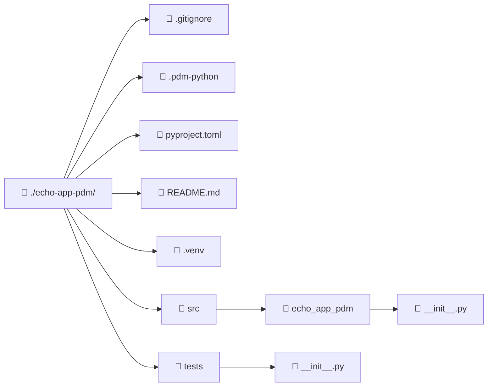

import ReadingTime from '@site/src/components/ReadingTime'
import { ProCons, Pros, Cons } from '@site/src/components/cajitas/ProCons'
import References from '@site/src/components/ReferencesComponent'
import Tabs from '@theme/Tabs'
import TabItem from '@theme/TabItem'
import Exercise from '@site/src/components/exercise/Exercise'
import Solution from '@site/src/components/exercise/Solution'
import Hint from '@site/src/components/exercise/Hint'
import Definition from '@site/src/components/Definition'
import Corollary from '@site/src/components/Corollary'
import GithubRepoLink from '@site/src/components/GithubRepoLink'
import Explanation from '@site/src/components/admonitions/Explanation'
import RepoClone from '@site/src/components/admonitions/RepoClone'
import ModuleSetup from '@site/src/components/cajitas/ModuleSetup'
import BoxedTabs from '@site/src/components/cajitas/BoxedTabs'

<ReadingTime />

Si ya estás familiarizadx con la creación de proyectos usando **Gradle** en Kotlin, encontrarás en **PDM** una alternativa moderna y eficiente en el ecosistema de **Python**. Ambas herramientas permiten definir entornos, gestionar dependencias y automatizar tareas, aunque con diferencias clave en su enfoque y capacidades.

**PDM** (*Python Development Master*) es un sistema de gestión de proyectos en Python que utiliza **`pyproject.toml` como archivo central de configuración**, de forma análoga a como Gradle usa `build.gradle.kts`. Alineado con los estándares más recientes de la comunidad, PDM se basa en especificaciones como [PEP 621](https://peps.python.org/pep-0621/) (metadatos de proyectos) y [PEP 582](https://peps.python.org/pep-0582/) (entornos locales sin virtualenv).

## 🐍 Paso -1: Instalación de Python

Antes de comenzar, asegúrate de tener Python instalado en tu sistema. Puedes descargarlo desde [python.org](https://www.python.org/downloads/) o usar un gestor de paquetes según tu sistema operativo:

<BoxedTabs groupId={"os"}>
    <TabItem value="Windows" label="Windows">
        ```powershell
        scoop install python
        ```
    </TabItem>
    <TabItem value="macOS" label="macOS">
        ```bash
        brew install python
        ```
    </TabItem>
    <TabItem value="Linux" label="Linux">
        ```bash
        sudo apt install python3
        ```
    </TabItem>
</BoxedTabs>

Una vez instalado, puedes verificarlo con:

<BoxedTabs groupId={"os"}>
    <TabItem value="Windows" label="Windows">
        ```powershell
        py --version
        ```    
    </TabItem>
    <TabItem value="macOS" label="macOS">
        ```bash
        python3 --version
        ```
    </TabItem>
    <TabItem value="Linux" label="Linux">
        ```bash
        python3 --version
        ```
    </TabItem>
</BoxedTabs>

## 📦 Paso 0: Instalación de PDM

Para instalar PDM en tu entorno local, ejecuta:

```bash
pip install pdm
```

Una vez finalizada la instalación, puedes verificar que se haya instalado correctamente con:

```bash
pdm --version
```

## 📁 Paso 1: Crear el Directorio del Proyecto

Primero, crea un nuevo directorio para tu proyecto y navega hacia él:

<BoxedTabs groupId={"os"}>
    <TabItem value="Windows" label="Windows">
        ```powershell
        'echo-app-pdm' | ForEach-Object {
          New-Item -Path $_ -ItemType 'Directory' -Force
          Set-Location -Path $_
        }
        ```

        <Explanation>
          Este fragmento toma el nombre `'echo-app-pdm'` y lo pasa a través de un pipeline a `ForEach-Object`. Dentro del bloque, se crea un directorio con ese nombre utilizando `New-Item` y el parámetro `-Force`, que asegura que el comando no falle si el directorio ya existe. Luego, con `Set-Location`, se cambia el directorio actual al recién creado. La variable `$_` representa el valor actual del pipeline, en este caso, el nombre de la carpeta.
        </Explanation>
    </TabItem>
    <TabItem value="Windows (corto)" label="Windows (corto)">
        ```powershell
        'echo-app-pdm' | %{ mkdir -p $_; cd $_ }
        ```

        <Explanation>
          Este fragmento simula en PowerShell un comportamiento típico de Bash: toma el string `'echo-app-pdm'` y lo pasa por el pipeline. El alias `%{}` corresponde a `ForEach-Object`, y `$_` representa el valor actual del pipeline. Dentro del bloque, se ejecuta `mkdir -p $_` para crear el directorio (usando el comando de Bash `mkdir -p`, que no lanza error si ya existe) y luego `cd $_` para cambiar a ese directorio. Este ejemplo mezcla comandos típicos de Bash en PowerShell, por lo que solo funcionará si Bash está disponible y los comandos están definidos en el entorno.  
        </Explanation>
    </TabItem>
    <TabItem value="Linux/Mac" label="Linux/Mac">
        ```bash
        name="echo-app-pdm"; mkdir -p "$name" && cd "$name"
        ```

        <Explanation>
            Este fragmento define una variable llamada `name` con el valor `"echo-app-pdm"`, luego crea un directorio con ese nombre usando `mkdir -p`, que no genera error si el directorio ya existe. Después, con `cd`, cambia al directorio recién creado. El operador `&&` asegura que el cambio de directorio (`cd`) solo se ejecute si `mkdir` fue exitoso.  
        </Explanation>
    </TabItem>
</BoxedTabs>

## ⚙️ Paso 2: Inicializar el Proyecto con PDM

Ejecuta el siguiente comando para comenzar la configuración interactiva:

```bash
pdm init
```

## 🧪 Paso 3: Selección del Intérprete de Python

PDM te pedirá que selecciones la versión de Python. Puedes usar la que tengas instalada localmente:

```text
Please enter the Python interpreter to use
 0. cpython@3.13 (/usr/bin/python3.13)
 1. cpython@3.12 (/usr/bin/python3.12)
Please select (0): 0
```

## 🏷️ Paso 4: Nombre del Proyecto

Puedes aceptar el nombre por defecto (el nombre de la carpeta) o escribir uno nuevo:

```text
Project name (echo-app-pdm):
```

## 🔢 Paso 5: Versión Inicial

Define la versión inicial del proyecto:

```text
Project version (0.1.0):
```

## 🚚 Paso 6: Configuración para Distribución

PDM puede preparar el proyecto para que sea instalable como un paquete:

```text
Do you want to build this project for distribution(such as wheel)? [y/n] (n): y
```

Recomendamos responder `y` para facilitar la reutilización y publicación del código.

## 🏗️ Paso 7: Backend de Construcción

Selecciona el backend de construcción. Te sugerimos dejar la opción predeterminada (`pdm-backend`) salvo que tengas una necesidad específica:

```text
Which build backend to use?
0. pdm-backend
1. setuptools
2. flit-core
3. hatchling
Please select (0): 0
```

## 📝 Paso 8: Información del Proyecto

Completa los datos básicos:

```text
License(SPDX name) (MIT):
Author name (Tu Nombre):
Author email (tu@email.com):
Python requires('*' to allow any) (>=3.11):
```

## 🧾 Estructura Generada

Una vez finalizado, verás algo como:



<Explanation>
  Este diagrama muestra la estructura de archivos y carpetas generada para el proyecto `echo-app-pdm`. Las carpetas están representadas con el ícono 📁 y los archivos con 📄. En la raíz del proyecto se incluyen archivos de configuración como `.gitignore`, `.pdm-python`, `pyproject.toml` y `README.md`, junto con un entorno virtual (`.venv`), un directorio `src` que contiene el código fuente del paquete `echo_app_pdm`, y un directorio `tests` con pruebas. Esta organización sigue una estructura recomendada para proyectos en Python, separando claramente el código de aplicación del de pruebas y configuración.
</Explanation>

## ✅ Paso 9: Verificar Instalación y Entorno

Puedes comprobar que el entorno está listo con:

```bash
pdm info
```

Y listar las tareas disponibles:

```bash
pdm list
```

## 🚀 Paso 10: Crear y Ejecutar un Hello World

Vamos a probar que todo está funcionando creando un pequeño script dentro del módulo principal.

Crea un archivo `main.py` dentro del paquete `echo_app_pdm`. Luego, edita su contenido con el siguiente código:

```python showLineNumbers title="src/echo_app_pdm/main.py"
def main():
    print("Ikebukuro never sleeps!")

if __name__ == "__main__":
    main()
```

Ahora ejecuta el script usando `pdm run`:

```bash
pdm run python src/echo_app_pdm/main.py
```

Deberías ver en consola:

```text
Ikebukuro never sleeps!
```

<Explanation>
  Este paso crea un archivo `main.py` dentro del módulo principal del proyecto y define una función `main()` que imprime un mensaje en consola. La línea `if __name__ == "__main__":` permite ejecutar la función `main()` directamente si el archivo se ejecuta como script. El comando `pdm run` asegura que el script se ejecute dentro del entorno aislado que PDM ha configurado para el proyecto.
</Explanation>

## 🎯 Conclusiones

A lo largo de esta guía, recorrimos el proceso completo de creación de un proyecto en Python utilizando **PDM**, desde la instalación hasta la ejecución de un pequeño script de prueba. Este flujo refleja una forma moderna y eficiente de trabajar con Python, alineada con los estándares actuales de la comunidad.

### 🔑 Puntos clave

- **PDM** permite estructurar proyectos de forma clara y reproducible, usando `pyproject.toml` como centro de configuración.
- No se necesita activar manualmente un entorno virtual gracias al soporte de [PEP 582](https://peps.python.org/pep-0582/).
- La inicialización guiada con `pdm init` simplifica los primeros pasos del proyecto.
- Ejecutar scripts y gestionar dependencias con `pdm run` y `pdm add` mantiene tu flujo de trabajo limpio y profesional.
- La estructura generada por defecto promueve buenas prácticas como la separación entre código fuente y pruebas.

### 🧰 ¿Qué nos llevamos?

Más allá de los comandos y configuraciones, este recorrido buscó mostrar que crear proyectos en Python no tiene por qué ser desordenado o manual. Con herramientas como **PDM**, podemos establecer estructuras claras, reproducibles y alineadas con los estándares modernos de desarrollo. 

Adoptar estas prácticas desde el principio no solo facilita la organización de nuestro código, sino que también nos prepara para colaborar, distribuir y escalar nuestras ideas con mayor confianza. Si vienes de otros ecosistemas como Kotlin o Java, encontrarás en PDM una herramienta familiar en espíritu, pero pensada específicamente para el mundo Python.

Este es solo el comienzo: con la base ya construida, el verdadero desarrollo —el de tus propias ideas— está listo para empezar.

## 📖 Referencias

### 🔥 Recomendadas

- 🌐 Introduction—PDM. (s. f.). Recuperado 27 de marzo de 2025, de https://pdm-project.org/en/latest/#__tabbed_2_1
