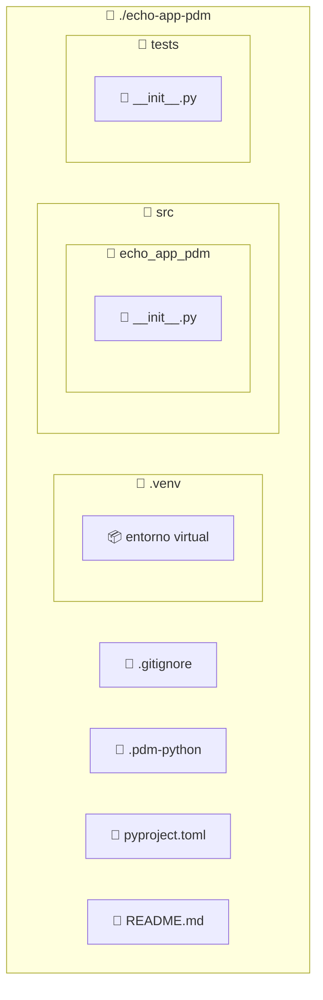

import ReadingTime from '@site/src/components/ReadingTime'
import { ProCons, Pros, Cons } from '@site/src/components/cajitas/ProCons'
import References from '@site/src/components/ReferencesComponent'
import Tabs from '@theme/Tabs'
import TabItem from '@theme/TabItem'
import Exercise from '@site/src/components/exercise/Exercise'
import Solution from '@site/src/components/exercise/Solution'
import Hint from '@site/src/components/exercise/Hint'
import Definition from '@site/src/components/Definition'
import Corollary from '@site/src/components/Corollary'
import GitHubRepoLink from '@site/src/components/git/GitHubRepoLink'
import Explanation from '@site/src/components/admonitions/Explanation'
import RepoClone from '@site/src/components/admonitions/RepoClone'
import ModuleSetup from '@site/src/components/cajitas/ModuleSetup'
import BoxedTabs from '@site/src/components/cajitas/BoxedTabs'

<ReadingTime />

Si ya estás familiarizadx con la creación de proyectos usando **Gradle** en Kotlin, encontrarás en **PDM** una alternativa moderna y eficiente dentro del ecosistema de **Python**. Ambas herramientas permiten definir entornos, gestionar dependencias y automatizar tareas, aunque presentan diferencias clave en su enfoque y capacidades.

**PDM** (*Python Development Master*) es un sistema de gestión de proyectos para Python que utiliza **`pyproject.toml` como archivo central de configuración**, de forma análoga a como Gradle emplea `build.gradle.kts`.  
Alineado con los estándares más recientes del ecosistema, PDM se basa en especificaciones oficiales como:

- [PEP 621](https://peps.python.org/pep-0621/), que define cómo declarar metadatos del proyecto en `pyproject.toml`.
- [PEP 582](https://peps.python.org/pep-0582/), que permite entornos locales sin necesidad de `virtualenv`.

Esto permite crear proyectos de Python más organizados, portables y reproducibles, sin depender de herramientas externas como `venv` o `pipenv`.

## 🐍 Paso -1: Instalar Python

Antes de comenzar a trabajar con **PDM**, necesitamos asegurarnos de tener Python instalado.

**Python** es un lenguaje de programación interpretado, de propósito general, conocido por su sintaxis clara, su amplia comunidad y su gran ecosistema de herramientas.  
Es utilizado en una amplia gama de áreas, desde desarrollo web y scripting hasta análisis de datos, inteligencia artificial y automatización de tareas.

En esta guía usaremos Python como plataforma base para crear un proyecto estructurado y moderno, similar a cómo se hace en otros ecosistemas con herramientas como **Gradle** en Kotlin.

### 🔧 Instalación

Puedes descargar Python desde [python.org](https://www.python.org/downloads/), o instalarlo con un gestor de paquetes según tu sistema operativo:

<BoxedTabs groupId={"os"}>
  <TabItem value="Windows" label="Windows">
    ```powershell
    scoop install python
    ```
  </TabItem>
  <TabItem value="macOS" label="macOS">
    ```bash
    brew install python
    ```
  </TabItem>
  <TabItem value="Linux" label="Linux">
    ```bash
    sudo apt install python3
    ```
  </TabItem>
</BoxedTabs>

Una vez instalado, verifica la versión ejecutando:

<BoxedTabs groupId={"os"}>
  <TabItem value="Windows" label="Windows">
    ```powershell
    py --version
    ```
  </TabItem>
  <TabItem value="macOS" label="macOS">
    ```bash
    python3 --version
    ```
  </TabItem>
  <TabItem value="Linux" label="Linux">
    ```bash
    python3 --version
    ```
  </TabItem>
</BoxedTabs>

:::warning Versión mínima requerida

**Python 3.8 o superior es obligatorio.**  
Versiones anteriores pueden no ser compatibles con **PDM** ni con varios estándares modernos del ecosistema Python (como `pyproject.toml` o resolutores de dependencias recientes).

:::

## 📦 Paso 0: Instalación de PDM

Para instalar **PDM** en tu entorno local, utiliza `pip`, el gestor de paquetes de Python:

<BoxedTabs groupId={"os"}>
    <TabItem value="Windows" label="Windows">
        ```powershell
        py -m pip install --upgrade pip && `
        pip install pdm
        ```

        <Explanation>
            Este bloque instala PDM y actualiza `pip` a la última versión.  
            - `py -m pip` ejecuta el módulo `pip` usando el intérprete de Python.  
            - `--upgrade` asegura que se instale la última versión de `pip`.  
            - `&&` permite encadenar comandos, asegurando que el segundo solo se ejecute si el primero fue exitoso.
            - `pip install pdm` instala PDM en el entorno actual.
        </Explanation>
    </TabItem>
    <TabItem value="Linux/macOS" label="Linux/macOS">
        ```bash
        python -m pip install --upgrade pip && \
        pip install pdm
        ```

        <Explanation>
            Este bloque instala PDM y actualiza `pip` a la última versión.  
            - `python -m pip` ejecuta el módulo `pip` usando el intérprete de Python.  
            - `--upgrade` asegura que se instale la última versión de `pip`.  
            - `&&` permite encadenar comandos, asegurando que el segundo solo se ejecute si el primero fue exitoso.
            - `pip install pdm` instala PDM en el entorno actual.
        </Explanation>
    </TabItem>
</BoxedTabs>

Una vez finalizada la instalación, verifica que el comando esté disponible:

```bash
pdm --version
```

:::tip ¿Problemas con permisos?

Si obtienes un error de permisos al instalar, puedes usar la opción `--user`:

```bash
pip install --user pdm
```

También puedes instalar PDM en un entorno virtual si prefieres mantener tu sistema limpio.

:::

:::info ¿Qué es `pip`?

`pip` es el gestor oficial de paquetes para Python. Si instalaste Python correctamente, ya deberías tener `pip` disponible.

Puedes verificarlo con:

```bash
pip --version
```

:::

## 📁 Paso 1: Crear el Directorio del Proyecto

Crea una carpeta para tu proyecto y accede a ella desde la terminal o consola:

<BoxedTabs groupId={"os"}>
    <TabItem value="Windows" label="Windows">
        ```powershell
        'echo-app-pdm' | ForEach-Object {
            New-Item -Path $_ -ItemType 'Directory' -Force | Out-Null
            Set-Location -Path $_
        }
        ```

        <Explanation>
            Este bloque crea una carpeta llamada `'echo-app-pdm'` y entra en ella.

            - `ForEach-Object` permite reutilizar el nombre dentro del bloque.  
            - `New-Item -ItemType 'Directory' -Force` crea la carpeta, evitando errores si ya existe.  
            - `Set-Location` cambia al nuevo directorio.

            La variable `$_` representa el valor actual en el pipeline, en este caso, `'echo-app-pdm'`.
        </Explanation>
    </TabItem>

    <TabItem value="Windows (corto)" label="Windows (corto)">
        ```powershell
        'echo-app-pdm' | % { md $_ -f >$null && cd $_ }
        ```

        <Explanation>
        Versión abreviada utilizando alias:

        - `%` es un alias de `ForEach-Object`.  
        - `md` es un alias de `New-Item -ItemType Directory`.  
        - `-f` evita errores si la carpeta ya existe. 

        Esta variante es útil si estás en PowerShell con configuración compatible.  
        </Explanation>
    </TabItem>

    <TabItem value="macOS/Linux" label="macOS/Linux">
        ```bash
        name="echo-app-pdm" && \
        mkdir -p "$name" && \
        cd "$name"
        ```

        <Explanation>
            Este comando crea el directorio `echo-app-pdm` y entra en él:

            - `mkdir -p` evita errores si la carpeta ya existe.  
            - `cd` cambia al directorio.  
            - El operador `&&` asegura que `cd` solo se ejecute si `mkdir` fue exitoso.
        </Explanation>
    </TabItem>
</BoxedTabs>

## ⚙️ Paso 2: Inicializar el Proyecto con PDM

Una vez dentro del directorio del proyecto, ejecuta el siguiente comando para comenzar la configuración interactiva:

```bash
pdm init
```

Este comando iniciará un asistente que te guiará paso a paso para definir el nombre del proyecto, su versión, dependencias, licencia, información del autor y más.  
Al final, generará un archivo `pyproject.toml` con toda la configuración.

:::info ¿Interfaz interactiva?

Si prefieres evitar la configuración interactiva y establecer todos los campos directamente desde la línea de comandos, puedes usar `pdm init --non-interactive` junto con opciones como `--name`, `--version`, etc.

Más adelante veremos cómo modificar el archivo `pyproject.toml` manualmente si deseas ajustar algún valor.

:::

## 🧪 Paso 3: Selección del Intérprete de Python

Durante la inicialización, **PDM buscará automáticamente las versiones de Python disponibles en tu sistema** y te pedirá que selecciones una de ellas para usarla como intérprete principal del proyecto.

```text
Please enter the Python interpreter to use
 0. cpython@3.13 (/usr/bin/python3.13)
 1. cpython@3.12 (/usr/bin/python3.12)
Please select (0): 0
```

Puedes elegir la opción por defecto presionando `Enter`, o escribir el número correspondiente a otra versión si lo deseas.  
Este intérprete se usará para resolver dependencias, ejecutar scripts y definir el entorno virtual del proyecto.

:::tip ¿Y si no aparece la versión que quiero?

Asegúrate de que la versión deseada esté instalada y disponible en tu `PATH`.  
También puedes agregarla manualmente a la lista de intérpretes ejecutando:

```bash
pdm use -f /ruta/a/python3.X
```

Esto fuerza a PDM a usar esa versión de Python como base del proyecto actual.

:::

## 🏷️ Paso 4: Nombre del Proyecto

PDM sugerirá como nombre del proyecto el nombre del directorio actual (en este caso, `echo-app-pdm`).  
Puedes aceptar ese valor por defecto simplemente presionando `Enter`, o escribir un nuevo nombre si deseas personalizarlo.

```text
Project name (echo-app-pdm):
```

Este nombre se usará en el archivo `pyproject.toml` como identificador del proyecto, y también puede influir en el nombre del paquete si decides distribuirlo más adelante.

## 🔢 Paso 5: Versión Inicial

Define la **versión inicial** de tu proyecto.  
Por defecto, PDM sugiere `0.1.0`, que es una convención común al iniciar un nuevo desarrollo.

```text
Project version (0.1.0):
```

Esta versión se registra en el archivo `pyproject.toml` y es importante si planeas publicar el proyecto como un paquete instalable.

## 🚚 Paso 6: Configuración para Distribución

PDM puede preparar el proyecto para que sea instalable como un **paquete Python**, generando formatos como `wheel` (`.whl`), que es una forma eficiente y estandarizada de distribuir código.

```text
Do you want to build this project for distribution(such as wheel)? [y/n] (n): y
```

Recomendamos responder **`y`**, incluso si no planeas publicar tu proyecto de inmediato.

:::tip ¿Por qué decir que sí?

- Permite instalar el proyecto fácilmente en otros entornos.
- Es útil para probar la instalación antes de publicar.
- Facilita la distribución interna o en entornos aislados (como CI/CD o servidores privados).

:::

## 🏗️ Paso 7: Backend de Construcción

PDM te pedirá elegir un **build backend**, es decir, el sistema que se encargará de construir tu proyecto para empaquetarlo o distribuirlo.

```text
Which build backend to use?
0. pdm-backend
1. setuptools
2. flit-core
3. hatchling
Please select (0): 0
```

Te recomendamos dejar la opción predeterminada (`0. pdm-backend`), salvo que tengas una necesidad específica o estés migrando desde otro sistema.

:::info ¿Qué es un build backend?

Es el componente que convierte tu proyecto en un paquete instalable (por ejemplo, en formato `.whl`).  
Distintos backends tienen distintas capacidades:

- `pdm-backend`: moderno, rápido, sin archivos adicionales.
- `setuptools`: el más usado históricamente, muy flexible, pero más complejo.
- `flit-core`: minimalista, ideal para proyectos simples.
- `hatchling`: orientado a proyectos grandes o gestionados con Hatch.

:::

## 📝 Paso 8: Información del Proyecto

PDM te pedirá completar los **metadatos básicos** del proyecto. Estos datos se incluirán en el archivo `pyproject.toml` y son útiles para documentación, publicación y control de versiones.

```text
License(SPDX name) (MIT):
Author name (Tu Nombre):
Author email (tu@email.com):
Python requires('*' to allow any) (>=3.11):
```

:::info ¿Qué es el “SPDX name”?

SPDX es un estándar para nombrar licencias de software de forma unificada.  
Por ejemplo:

- `MIT` → Licencia MIT
- `Apache-2.0` → Apache License 2.0
- `GPL-3.0-or-later` → GNU GPL v3 o superior

Puedes consultar la lista completa en: https://spdx.org/licenses/

:::

:::tip ¿Qué significa `Python requires`?

Este campo define la **versión mínima (o compatible) de Python** requerida para ejecutar tu proyecto.  
Por ejemplo:

- `>=3.11` → Compatible con Python 3.11 en adelante.
- `>=3.9,<3.12` → Compatible con Python 3.9, 3.10 y 3.11, pero no con 3.12.
- `*` → Acepta cualquier versión (no recomendado).

Indicar correctamente esta restricción ayuda a evitar errores cuando otrxs instalan tu proyecto.

:::

## 🧾 Estructura Generada

Una vez finalizado, verás algo como:



<Explanation>
    Este diagrama representa la estructura básica generada por `pdm init`:
    
    - **`.gitignore`**, `.pdm-python`, `pyproject.toml` y `README.md`: archivos de configuración y documentación en la raíz del proyecto.
    - **`.venv/`**: entorno virtual aislado para el proyecto.
    - **`src/echo_app_pdm/`**: módulo principal con el paquete que contiene el código fuente.
    - **`tests/`**: carpeta destinada a pruebas unitarias o de integración.
</Explanation>


## ✅ Paso 9: Verificar Instalación y Entorno

Una vez completada la inicialización, puedes verificar que todo está correctamente configurado ejecutando:

```bash
pdm info
```

Este comando muestra información sobre el proyecto actual, incluyendo:
- La ruta al entorno de Python que estás usando.
- Las dependencias instaladas.
- Información del backend de construcción.

También puedes listar los paquetes instalados con:

```bash
pdm list
```

Esto te permite comprobar que el entorno funciona correctamente y que todo está en orden antes de continuar con el desarrollo.

## 🚀 Paso 10: Crear y Ejecutar un Hello World

Vamos a comprobar que todo está funcionando correctamente creando un pequeño script dentro del módulo principal del proyecto.

Crea un archivo `main.py` dentro del paquete `echo_app_pdm` y agrega el siguiente contenido:

```python showLineNumbers title="src/echo_app_pdm/main.py"
def main():
    print("Ikebukuro never sleeps!")

if __name__ == "__main__":
    main()
```

Luego, ejecuta el script con:

```bash
pdm run python src/echo_app_pdm/main.py
```

Deberías ver en consola:

```text
Ikebukuro never sleeps!
```

<Explanation>
    Este paso crea un archivo `main.py` dentro del módulo principal y define una función `main()` con un mensaje personalizado. La línea `if __name__ == "__main__":` asegura que la función solo se ejecute cuando el archivo se ejecuta directamente, y no cuando se importa como módulo.

    El comando `pdm run` ejecuta el script dentro del entorno virtual gestionado por PDM, sin necesidad de activarlo manualmente. Esto garantiza un entorno limpio y reproducible.
</Explanation>

:::warning ¿Por qué es importante `if __name__ == "__main__"`?

Imagina que tu archivo `main.py` no usara esa condición y simplemente ejecutara `main()` directamente:

```python showLineNumbers title="src/echo_app_pdm/main.py"
def main():
    print("Ikebukuro never sleeps!")

main()  # ⚠️ Esta línea se ejecutará siempre, incluso al importar
```

Ahora supón que creas otro archivo llamado `runner.py` para usar la función `main`:

```python showLineNumbers title="src/echo_app_pdm/runner.py"
from echo_app_pdm import main
```

Cuando ejecutes `runner.py`, verás que **`main()` se ejecuta inmediatamente**, aunque no lo hayas llamado tú.  
Esto ocurre porque al importar el archivo, **Python ejecuta todo el código en nivel superior**, incluyendo la llamada a `main()`.

❌ Esto puede causar comportamientos inesperados si `main.py` contiene lógica que solo debería ejecutarse al correrlo como script.

✅ En cambio, si usas `if __name__ == "__main__":`, te aseguras de que ese bloque solo se ejecute cuando el archivo sea el punto de entrada del programa, no cuando se importe desde otro módulo.

:::

## 🎯 Conclusiones

A lo largo de esta guía, recorrimos el proceso completo de creación de un proyecto en Python utilizando **PDM**, desde su instalación hasta la ejecución de un pequeño script de prueba. Este flujo refleja una forma moderna y eficiente de trabajar con Python, alineada con los estándares actuales del ecosistema.

### 🔑 Puntos clave

- **PDM** permite estructurar proyectos de forma clara y reproducible, usando `pyproject.toml` como archivo central de configuración.
- Gracias al soporte de [PEP 582](https://peps.python.org/pep-0582/), no es necesario activar manualmente un entorno virtual.
- La inicialización guiada con `pdm init` simplifica la creación de nuevos proyectos.
- Herramientas como `pdm run` y `pdm add` facilitan la ejecución de scripts y la gestión de dependencias.
- La estructura generada por defecto promueve buenas prácticas como la separación entre código fuente y pruebas.

### 🧰 ¿Qué nos llevamos?

Más allá de los comandos y configuraciones, este recorrido demuestra que crear proyectos en Python puede ser claro, ordenado y coherente con los principios de diseño modernos. Con herramientas como **PDM**, podemos adoptar flujos de trabajo profesionales desde el primer día.

Adoptar estas prácticas desde el inicio no solo mejora la organización del código, sino que también prepara el terreno para colaborar, distribuir y escalar nuestras ideas con mayor confianza.

Si vienes de ecosistemas como Kotlin o Java, notarás que **PDM ofrece una experiencia similar a Gradle**, pero adaptada al mundo Python y basada en estándares oficiales.

🚀 **Este es solo el punto de partida**. Con tu proyecto ya configurado, el siguiente paso es explorar cómo escribir, probar y distribuir código Python de forma profesional y sostenible.

## 📖 Referencias

### 🔥 Recomendadas

- 🌐 Introduction—PDM. (s. f.). Recuperado 27 de marzo de 2025, de https://pdm-project.org/en/latest/#__tabbed_2_1

### 🔹 Adicionales

- 🌐 Using PDM for Python Dependency Management. (2022, agosto 11). [Python by Night]. https://www.pythonbynight.com/blog/using-pdm-for-your-next-python
