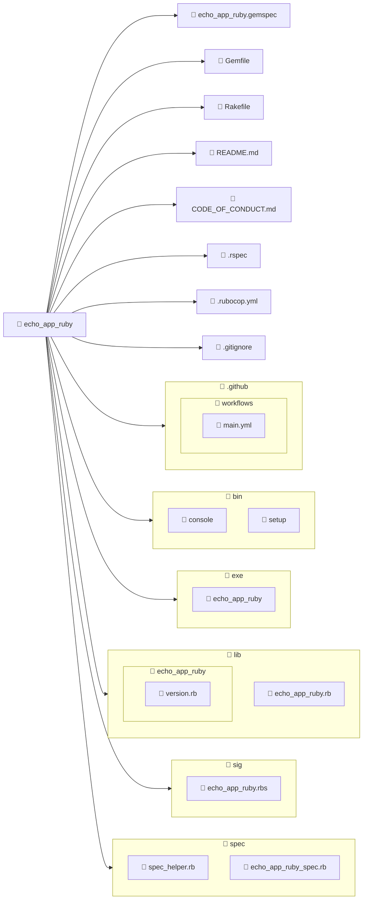

import BoxedTabs from '@site/src/components/cajitas/BoxedTabs'
import TabItem from '@theme/TabItem'
import Explanation from '@site/src/components/admonitions/Explanation'
import GitHubRepoLink from "@site/src/components/GithubRepoLink";
import ReadingTime from '@site/src/components/ReadingTime';

<ReadingTime/>
<GitHubRepoLink repo={"echo-app-ruby"} user={"r8vnhill"} />

En esta lección aprenderás a crear tu **primer proyecto Ruby** con enfoque profesional, usando la herramienta oficial del ecosistema: **Bundler**.

El objetivo no es solo imprimir un mensaje en la terminal, sino **construir desde el principio una gema bien estructurada**, con ejecutable, pruebas, integración continua, linter y documentación. En otras palabras, aprenderás a sentar las bases de una **biblioteca de software reutilizable y mantenible**.

Al igual que hicimos con Gradle en otras lecciones, aquí también pondremos el foco en las decisiones iniciales que más influyen en la calidad del proyecto a largo plazo: ¿cómo se organiza el código?, ¿qué herramientas se configuran desde el comienzo?, ¿cómo preparar el entorno para futuras contribuciones o automatizaciones?

Aunque Ruby es conocido por su simplicidad y expresividad, esta lección te mostrará cómo su ecosistema también fomenta el profesionalismo, la colaboración y el pensamiento modular desde el primer `bundle gem`.

Al finalizar, tendrás no solo una gema funcional, sino una **plantilla completa** para futuros proyectos Ruby — lista para crecer, ser compartida y, eventualmente, publicada.

## 🧱 Paso -3: (Linux/macOS) Instalar dependencias recomendadas

Antes de instalar Ruby con `rbenv`, es importante asegurarse de que tu sistema tenga todas las bibliotecas necesarias para compilarlo correctamente.

<BoxedTabs groupId={"os"}>
    <TabItem value="macOS" label="macOS">
        ```bash
        brew update && \
        brew install \
            autoconf \
            bison \
            openssl \
            readline \
            sqlite3 \
            libyaml \
            gdbm \
            libffi
        ```
    </TabItem>
    <TabItem value="Linux/macOS" label="Linux/macOS">
        ```bash
        sudo apt update && \
        sudo apt upgrade -y && \
        sudo apt install -y \
            autoconf \
            bison \
            build-essential \
            libssl-dev \
            libreadline-dev \
            zlib1g-dev \
            libsqlite3-dev \
            libyaml-dev \
            libgdbm-dev \
            libncurses5-dev \
            libffi-dev \
            libgmp-dev \
            libdb-dev
        ```
    </TabItem>
</BoxedTabs>

<Explanation>

Este paso instala las bibliotecas y herramientas necesarias para compilar e instalar Ruby desde código fuente usando `rbenv` y `ruby-build`.

- **`autoconf`, `bison`**: Utilizadas durante la configuración del entorno de compilación de Ruby.
- **Compiladores y herramientas básicas (`build-essential` en Linux)**: Incluyen `gcc`, `make`, etc.
- **Bibliotecas de desarrollo**: Permiten compilar extensiones y módulos clave de Ruby:
  - Cifrado y seguridad (OpenSSL)
  - Lectura de línea (`readline`)
  - Compresión (`zlib`)
  - Base de datos (`sqlite3`, `gdbm`, `libdb`)
  - Formato YAML (`libyaml`)
  - Interacción con terminal (`ncurses`)
  - Llamadas de C (`libffi`)
  - Aritmética avanzada (`gmp`)

Estas dependencias aseguran que la instalación de Ruby incluya soporte completo para sus funcionalidades estándar.

</Explanation>

## 🧰 Paso -2: (Linux/macOS) Instalar rbenv

<BoxedTabs groupId={"os"}>
    <TabItem value="macOS" label="macOS">
        ```bash
        brew install rbenv ruby-build
        ```

        <Explanation>
            Instala tanto `rbenv` como `ruby-build` usando Homebrew en un solo comando.

            - **`rbenv`**: Es una herramienta para gestionar múltiples versiones de Ruby en el mismo sistema, permitiéndote cambiar fácilmente entre ellas por proyecto o de forma global.
            - **`ruby-build`**: Es un plugin de `rbenv` que permite compilar e instalar versiones específicas de Ruby.
        </Explanation>
    </TabItem>
    <TabItem value="Linux" label="Linux">
        ```bash
        git clone https://github.com/rbenv/rbenv.git ~/.rbenv && \
            export PATH="$HOME/.rbenv/bin:$PATH" && \
            shell_name=$(basename "$SHELL") && \
            profile_file="$HOME/.${shell_name}rc" && \
            init_command="$(~/.rbenv/bin/rbenv init - $shell_name)" && \
            echo 'export PATH="$HOME/.rbenv/bin:$PATH"' >> "$profile_file" && \
            echo "eval \"\$($HOME/.rbenv/bin/rbenv init - $shell_name)\"" >> "$profile_file" && \
            eval "$init_command" && \
            git clone https://github.com/rbenv/ruby-build.git "$(rbenv root)"/plugins/ruby-build
        ```

        <Explanation>
            - `git clone https://github.com/rbenv/rbenv.git ~/.rbenv`: Clona el repositorio de `rbenv` en el directorio `~/.rbenv`.
            - `export PATH=...`: Añade el binario de `rbenv` al `PATH` actual, permitiendo usar `rbenv` inmediatamente en esta misma sesión.
            - `shell_name=$(basename "$SHELL")`: Detecta el nombre del shell actual (`bash`, `zsh`, etc.) extrayéndolo del valor de `$SHELL`.
            - `profile_file="$HOME/.${shell_name}rc"`: Construye la ruta al archivo de configuración del shell, como `~/.bashrc` o `~/.zshrc`.
            - `init_command="$(~/.rbenv/bin/rbenv init - $shell_name)"`: Ejecuta `rbenv init` con la opción correcta para el shell actual y guarda el resultado (el código de inicialización que `rbenv` necesita) en una variable.
            - `echo 'export PATH="$HOME/.rbenv/bin:$PATH"' >> "$profile_file"`: Agrega permanentemente al `PATH` la ruta a `rbenv` en el archivo de configuración del shell.
            - `echo "eval \"\$($HOME/.rbenv/bin/rbenv init - $shell_name)\"" >> "$profile_file"`: Añade al archivo de configuración del shell el código necesario para inicializar `rbenv` automáticamente en futuras sesiones.
            - `eval "$init_command"`: Aplica inmediatamente la inicialización de `rbenv` en la sesión actual para poder empezar a usarlo sin reiniciar la terminal.	
            - `git clone https://github.com/rbenv/ruby-build.git "$(rbenv root)"/plugins/ruby-build`: Clona el plugin `ruby-build` dentro del directorio de plugins de `rbenv`, permitiendo instalar versiones específicas de Ruby.
        </Explanation>
    </TabItem>
</BoxedTabs>

### ✔️ Verificar que `rbenv` se instaló correctamente

Para comprobar que `rbenv` está correctamente instalado y accesible desde la terminal, ejecuta:

```bash
rbenv
```

Deberías ver una salida similar a:

```plaintext
rbenv 1.3.2-2-gcd29bcc
Usage: rbenv <command> [<args>...]

Commands:
   install     Install a Ruby version
   versions    List installed Ruby versions
   global      Set or show the global Ruby version
   local       Set or show the local Ruby version
```

Esto indica que `rbenv` está funcionando correctamente.  

## 💎 Paso -1: Instalar Ruby

**Ruby** es un lenguaje de programación dinámico, elegante y muy expresivo. En esta unidad lo utilizaremos junto con herramientas del ecosistema Ruby, como [Rake](https://ruby.github.io/rake/), para explorar cómo construir, organizar y automatizar tareas en proyectos de software, al igual que hicimos con Gradle.

A continuación, se presentan las instrucciones para instalar Ruby según tu sistema operativo:

<BoxedTabs groupId={"os"}>
    <TabItem value="Windows" label="Windows">
        ```powershell
        scoop install ruby
        ```
    </TabItem>
    <TabItem value="macOS/Linux" label="macOS/Linux">
        ```bash
        latest_ruby=$(rbenv install -l | grep -E '^\s*[0-9]+\.[0-9]+\.[0-9]+$' | tail -1 | tr -d ' ') && \
            rbenv install "$latest_ruby" && \
            rbenv global "$latest_ruby"
        ```

        <Explanation>
            Este bloque detecta e instala automáticamente la versión más reciente de Ruby (MRI) disponible a través de `rbenv`.

            1. **`rbenv install -l`**: Lista todas las versiones de Ruby que pueden instalarse, incluyendo variantes como JRuby, TruffleRuby, etc.
            2. **`grep -E '^\s*[0-9]+\.[0-9]+\.[0-9]+$'`**: Filtra únicamente las versiones estándar de Ruby (MRI), descartando otras implementaciones.
            3. **`tail -1`**: Selecciona la última de esas versiones, que corresponde a la más reciente.
            4. **`tr -d ' '`**: Elimina espacios en blanco sobrantes.
            5. **`rbenv install "$latest_ruby"`**: Instala esa versión de Ruby.
            6. **`rbenv global "$latest_ruby"`**: Configura esa versión como la predeterminada a nivel global en el sistema.
        </Explanation>
    </TabItem>
</BoxedTabs>

### ✅ Verificación de la instalación

Para comprobar que Ruby se instaló correctamente, ejecuta en tu terminal:

```bash
ruby --version
```

Deberías ver una salida similar a:

```plaintext
ruby 3.4.2 (2025-02-15 revision d2930f8e7a) +PRISM [x64-mingw-ucrt]
```

Esto indica que Ruby está instalado y disponible en tu entorno.

También puedes verificar que el gestor de paquetes de Ruby está disponible:

```bash
gem --version
```

Si ambos comandos funcionan y muestran una versión, ¡todo está listo para continuar!

## 📦 Paso 0: Instalar Bundler

**Bundler** es la herramienta oficial para gestionar dependencias en proyectos Ruby. Se encarga de instalar las gemas necesarias y mantenerlas sincronizadas con el archivo `Gemfile`.

Para instalar Bundler, ejecuta el siguiente comando en la terminal:

```bash
gem install bundler
```

<Explanation>
    - Este comando instala Bundler globalmente en tu sistema.
    - Asegúrate de tener acceso al comando `gem`, que viene con Ruby por defecto.
</Explanation>

Una vez instalado, puedes verificar la versión con:

```bash
bundler --version
```

Esto debería mostrar algo como:

```plaintext
Bundler version 2.6.7
```

## 🧱 Paso 1: Crear la gema con ejecutable

Para comenzar, vamos a crear una gema llamada `echo_app_ruby` que incluya un archivo ejecutable. Esto nos permitirá estructurar el proyecto como una biblioteca reutilizable con una interfaz de línea de comandos.

```bash
bundler gem echo_app_ruby --exe
```

<Explanation>
    Este comando genera la estructura base de una gema Ruby llamada `echo_app_ruby`.

    - `bundler gem` → Comando principal para crear una nueva gema.
    - `echo_app_ruby` → Nombre del proyecto/gema.
    - `--exe` → Crea un archivo ejecutable en `exe/echo_app_ruby`, útil si planeas que tu gema se use como aplicación desde la terminal.
</Explanation>

## 🧪 Paso 2: Elegir un framework de testing

Durante la creación de la gema, Bundler te preguntará si deseas generar pruebas junto con tu proyecto. Aunque no usaremos pruebas de inmediato, es una buena práctica elegir un framework para mantener la estructura preparada desde el inicio.

```plaintext
Do you want to generate tests with your gem?
Future `bundle gem` calls will use your choice. This setting can be changed anytime with `bundle config gem.test`.
Enter a test framework. rspec/minitest/test-unit/(none): rspec
```

:::tip ¿Por qué elegir `rspec`?

Elegimos `rspec` porque su estilo **BDD** (Behavior-Driven Development) y su sistema de **aserciones expresivas** (matchers) se alinean con los temas que abordaremos más adelante en la unidad de testing. Esto nos permitirá escribir pruebas más legibles, naturales y enfocadas en el comportamiento esperado de nuestras bibliotecas.

:::

## 🔄 Paso 3: Configurar integración continua (CI)

Durante la configuración inicial, Bundler ofrece la posibilidad de preparar archivos para **integración continua**, que permite ejecutar pruebas automáticamente en cada cambio del proyecto.

```plaintext
Do you want to set up continuous integration for your gem? Supported services:
* CircleCI:       https://circleci.com/
* GitHub Actions: https://github.com/features/actions
* GitLab CI:      https://docs.gitlab.com/ee/ci/

Future `bundle gem` calls will use your choice. This setting can be changed anytime with `bundle config gem.ci`.
Enter a CI service. github/gitlab/circle/(none): github
```

:::tip ¿Por qué elegir GitHub Actions?

Si tu código estará alojado en GitHub, usar **GitHub Actions** es una opción práctica y directa. Genera automáticamente un flujo de trabajo básico en `.github/workflows/ci.yml`, listo para ejecutar tus pruebas en cada push o pull request.

Aunque aún no lo aprovecharemos, tener este archivo configurado desde el inicio facilita adoptar buenas prácticas más adelante.

:::

## ⚖️ Paso 4: Elegir una licencia

Durante el proceso de creación de la gema, Bundler ofrece añadir una licencia de uso abierta para tu código:

```plaintext
Do you want to license your code permissively under the MIT license?
This means that any other developer or company will be legally allowed to use your code for free as long as they admit you created it. You can read more about the MIT license at https://choosealicense.com/licenses/mit.
y/(n):
```

:::info ¿Qué significa esto?

Si eliges **"y"**, Bundler agregará la licencia MIT a tu proyecto. Esta es una licencia permisiva que permite el uso, modificación y redistribución del código con muy pocas restricciones, siempre que se mantenga el aviso de autoría.

:::

:::tip ¿Y si uso otra licencia?

En nuestro caso, preferimos la **[BSD-2-Clause](https://opensource.org/license/bsd-2-clause/)**, una licencia también permisiva pero con un lenguaje más conciso y restricciones mínimas.

Puedes omitir la opción (`n`) aquí y luego añadir manualmente el archivo `LICENSE` y el campo `license` en el `.gemspec`.

:::

## 🤝 Paso 5: Código de conducta

Durante la creación de la gema, Bundler te preguntará si deseas incluir un **código de conducta**:

```plaintext
Do you want to include a code of conduct in gems you generate?
Codes of conduct can increase contributions to your project by contributors who prefer collaborative, safe spaces. You can read more about the code of conduct at contributor-covenant.org. Having a code of conduct means agreeing to the responsibility of enforcing it, so be sure that you are prepared to do that.
y/(n):
```

:::tip Buenas prácticas

Incluir un código de conducta como el de [Contributor Covenant](https://www.contributor-covenant.org/) es una forma de **fomentar la colaboración en un entorno respetuoso y seguro**.

No lo usaremos activamente en esta unidad, pero es una buena costumbre para proyectos abiertos o colaborativos. Si eliges `yes`, asegúrate de especificar un email de contacto válido.

:::

## 🗒️ Paso 6: Changelog

Durante la creación de la gema, Bundler te preguntará si deseas incluir un **changelog**:

```plaintext
Do you want to include a changelog?
A changelog is a file which contains a curated, chronologically ordered list of notable changes for each version of a project. [...]
see https://keepachangelog.com
y/(n):
```

:::tip Cambios transparentes

Un changelog permite documentar los **cambios relevantes entre versiones** de forma clara y cronológica. Esto facilita que otras personas (y tú misma en el futuro) entiendan qué ha cambiado, por qué y cuándo.

Elegir `yes` genera un archivo `CHANGELOG.md` con una estructura recomendada por [Keep a Changelog](https://keepachangelog.com), que podrás completar a medida que avances con tu proyecto.

:::

## 🧹 Paso 7: Añadir un Linter

Al crear la gema, Bundler preguntará si deseas agregar un **linter y formateador de código**:

```plaintext
Do you want to add a code linter and formatter to your gem? Supported Linters:
* RuboCop:       https://rubocop.org
* Standard:      https://github.com/standardrb/standard

Future `bundle gem` calls will use your choice. This setting can be changed anytime with `bundle config gem.linter`.
Enter a linter. rubocop/standard/(none): rubocop
```

:::tip Código limpio desde el principio

Elegimos `rubocop` como linter para el proyecto. Es una herramienta muy utilizada en la comunidad Ruby que **fuerza buenas prácticas** y ayuda a mantener un estilo de código uniforme.

Aunque no es obligatorio, tener un linter desde el inicio **previene errores comunes**, mejora la legibilidad y facilita el trabajo colaborativo en proyectos más grandes.

:::

## 🗂 Estructura del proyecto



:::info Explicación de la estructura

Esta es la estructura generada automáticamente por `bundler gem echo_app_ruby --exe`, pensada para desarrollar una **gema Ruby** lista para pruebas, publicación y uso como ejecutable de consola:

- **📄 `echo_app_ruby.gemspec`**: Archivo principal que define los metadatos de la gema (nombre, versión, dependencias, etc.).
- **📄 `Gemfile`**: Lista de dependencias necesarias para desarrollar o probar la gema.
- **📄 `Rakefile`**: Define tareas automatizadas (como pruebas, limpieza, instalación, etc.) que se pueden ejecutar con `rake`.
- **📄 `README.md`**: Documentación inicial del proyecto.
- **📄 `CODE_OF_CONDUCT.md`**: Código de conducta del proyecto, útil si se planea recibir contribuciones de otras personas.
- **📄 `.rspec`**: Configuración de RSpec, el framework de pruebas.
- **📄 `.rubocop.yml`**: Configuración para el linter y formateador RuboCop.
- **📄 `.gitignore`**: Lista de archivos que Git debe ignorar.
- 📁 `.github/workflows/`: Contiene flujos de trabajo para integración continua (CI), como pruebas automáticas con GitHub Actions (`main.yml`).
- 📁 `bin/`: Contiene scripts de desarrollo:
    - **`console`**: Permite iniciar una consola interactiva para explorar la gema.
    - **`setup`**: Script para instalar dependencias y preparar el entorno.
- 📁 `exe/`: Contiene el archivo ejecutable que permite usar la gema desde la línea de comandos:
    - **`echo_app_ruby`**: Archivo invocable si se instala como binario.
- 📁 `lib/`: Contiene el código fuente principal de la gema:
    - **`echo_app_ruby.rb`**: Punto de entrada principal que carga el resto de la gema.
    - **`echo_app_ruby/version.rb`**: Define la versión actual de la gema.
- 📁 `sig/`: Contiene definiciones de tipos en formato RBS (Ruby Signature), si usas tipado estático con herramientas como [Steep](https://github.com/soutaro/steep).
- 📁 `spec/`: Contiene las pruebas escritas con RSpec:
    - **`spec_helper.rb`**: Configuración inicial de RSpec.
    - **`echo_app_ruby_spec.rb`**: Archivo de prueba para el comportamiento principal de la gema.

:::

## 🧃 Paso 8: Tu primer “Hello, World”

Ahora que tenemos la estructura lista, vamos a ejecutar un clásico **Hello, World** desde la consola, pero con un giro literario inspirado en *A Clockwork Orange*.

Primero, abre el archivo generado en `exe/echo_app_ruby` y reemplaza su contenido con lo siguiente:

```ruby title="exe/echo_app_ruby"
#!/usr/bin/env ruby
require_relative "../lib/echo_app_ruby"

puts "What's it going to be then, eh?"
```

<Explanation>
    - **`#!/usr/bin/env ruby`**: Esta línea indica que el archivo debe ejecutarse usando Ruby. Es común en scripts para asegurar compatibilidad multiplataforma.
    - **`require_relative "../lib/echo_app_ruby"`**: Carga el archivo principal de la gema desde la carpeta `lib`, preparándola para su uso. Aunque no lo usamos directamente aquí, mantiene una convención útil para futuras extensiones.
    - **`puts "What's it going to be then, eh?"`**: Imprime un mensaje por consola. En este caso, el clásico inicio de capítulo de *A Clockwork Orange*, que usamos como homenaje y como señal de que tu aplicación ha nacido.
</Explanation>

Ahora que tenemos el archivo ejecutable listo, vamos a probar la aplicación en distintos sistemas operativos:

<BoxedTabs groupId={"os"}>
    <TabItem value="Windows" label="Windows">
        Para sistemas Windows, es necesario instalar el entorno de compilación MSYS2 antes de ejecutar la aplicación:

        ```powershell
        ridk install
        ```

        <Explanation>
            Este comando lanza el instalador de MSYS2 incluido en RubyInstaller.  
            Es necesario para compilar gemas nativas como aquellas usadas por Rails o Psych (YAML).
        </Explanation>

        Al ejecutarlo, verás una salida como esta:

        ```plaintext
        1 - MSYS2 base installation
        2 - MSYS2 system update (optional)
        3 - MSYS2 and MINGW development toolchain

        Which components shall be installed? If unsure press ENTER [1,3]
        ```

        :::tip ¿Por qué seleccionar 1, 2 y 3?

        Seleccionar todas las opciones (`1, 2, 3`) garantiza que:

        - Se instale la base mínima de MSYS2.
        - Se actualice el sistema MSYS2 (lo que evita errores de compilación).
        - Se instale la toolchain necesaria para compilar gemas nativas.

        Omitir alguna de ellas puede generar errores al instalar dependencias como `nokogiri` o `psych`.

        :::

        En sistemas UNIX, es común utilizar el script `bin/setup` para instalar las dependencias necesarias de un proyecto.  
        En Windows, puedes lograr lo mismo definiendo una función en PowerShell que cumpla el mismo propósito. Para esto, crea el archivo `bin/setup.ps1` y añade el siguiente contenido:

        ```powershell showLineNumbers title="bin/setup.ps1"
        Set-StrictMode -Version Latest
        $ErrorActionPreference = "Stop"
        $VerbosePreference = "Continue"
        $DebugPreference = "Continue"

        Write-Verbose "Installing dependencies with Bundler..."
        bundle install

        # Aquí puedes agregar más pasos de configuración
        Write-Verbose "Setup complete."
        ```

        <Explanation>
            Este script en PowerShell replica el comportamiento típico del archivo `bin/setup` que se usa en sistemas UNIX.  
            Su propósito es preparar el entorno del proyecto de forma automática y segura.

            - **`Set-StrictMode -Version Latest`**: Activa reglas estrictas para evitar errores comunes y escribir código más robusto.
            - **`$ErrorActionPreference = "Stop"`**: Hace que el script se detenga inmediatamente ante cualquier error.
            - **`$VerbosePreference` y `$DebugPreference`**: Permiten mostrar mensajes detallados de lo que está ocurriendo, útil para depuración y transparencia.
            - **`bundle install`**: Instala las dependencias definidas en el `Gemfile`, asegurando que el entorno tenga todo lo necesario para ejecutar el proyecto.
            - Puedes extender este script con otros pasos como migraciones de base de datos, generación de archivos de entorno, chequeos de sistema, etc.

            Guardar este contenido en `bin/setup.ps1` permite a usuarios de Windows inicializar el proyecto con un solo comando: `.\bin\setup.ps1`.
        </Explanation>


        Una vez creado el archivo `bin/setup.ps1`, puedes utilizarlo para preparar el entorno y luego ejecutar la aplicación con un solo comando:

        ```powershell
        bin\setup.ps1 && `
            ruby exe\echo_app_ruby
        ```
    </TabItem>

    <TabItem value="Linux/macOS" label="Linux/macOS">

        ```bash
        chmod +x exe/echo_app_ruby && \
        ./bin/setup && \
        ./exe/echo_app_ruby
        ```

        <Explanation>
            1. **`chmod +x`** hace que el script Ruby sea ejecutable.
            2. **`./bin/setup`** instala las dependencias necesarias usando Bundler (equivalente a la función PowerShell).
            3. **`./exe/echo_app_ruby`** ejecuta la aplicación.
        </Explanation>
    </TabItem>
</BoxedTabs>

## 🎯 Conclusiones

Esta lección te guió paso a paso en la creación de una gema Ruby básica con Bundler, integrando desde el inicio elementos fundamentales como testing, documentación, integración continua y estilo de código. Aunque el programa resultante sea simple, el proceso refleja el ciclo real de inicialización de un proyecto Ruby profesional.

Más allá de generar archivos, esta lección te introdujo a decisiones de diseño que impactan la calidad, mantenibilidad y colaboración en tus proyectos de software: desde elegir una licencia hasta adoptar herramientas de testing y linting que acompañarán el desarrollo a lo largo del tiempo.

### 🔑 Puntos clave

- **Bundler automatiza la creación de gemas Ruby**, incluyendo ejecutables, pruebas, documentación y más.
- **La estructura generada sigue buenas prácticas**, permitiendo desarrollar bibliotecas reutilizables y ejecutables desde la terminal.
- **Las decisiones iniciales importan**: configurar testing, CI, licencia y linter desde el inicio facilita el desarrollo a largo plazo.
- **El ecosistema Ruby promueve la claridad**, con convenciones como `exe/`, `lib/`, `spec/` y scripts como `bin/setup` para estandarizar tareas.

### 🧰 ¿Qué nos llevamos?

Esta primera experiencia creando una gema Ruby con Bundler es más que un ejercicio técnico: es una introducción al pensamiento estructurado y profesional detrás del desarrollo de bibliotecas de software.

Cada paso —elegir una licencia, configurar pruebas, preparar el entorno, definir un ejecutable— refleja una práctica que va más allá del código y se conecta con la cultura del software abierto, la colaboración y la mantenibilidad. Aprender a valorar estas decisiones desde el inicio de un proyecto es clave para desarrollar herramientas que no solo funcionen, sino que también crezcan con claridad, puedan ser compartidas y reutilizadas, y faciliten el trabajo de otras personas.

Al cerrar esta lección, no solo sabes cómo crear una gema: sabes por qué es importante hacerlo bien desde el principio.

## 📖 Referencias

### 🔥 Recomendadas

- 🌐 Bundler: How to create a Ruby gem with Bundler. (s. f.). Recuperado 4 de abril de 2025, de https://bundler.io/guides/creating_gem.html
 