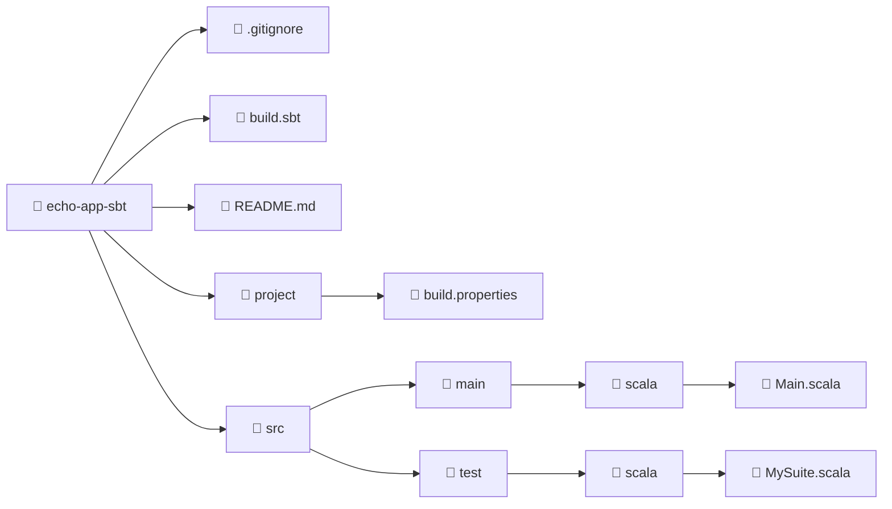

import ReadingTime from '@site/src/components/ReadingTime'
import { ProCons, Pros, Cons } from '@site/src/components/cajitas/ProCons'
import Explanation from '@site/src/components/admonitions/Explanation'
import Exercise from '@site/src/components/exercise/Exercise'
import Solution from '@site/src/components/exercise/Solution'
import BoxedTabs from '@site/src/components/cajitas/BoxedTabs'
import TabItem from '@theme/TabItem'

<ReadingTime />

Antes de automatizar tareas, definir bibliotecas reutilizables o aplicar análisis estático, necesitamos sentar las bases de nuestro proyecto. En esta lección aprenderás a crear una estructura inicial utilizando **sbt**, la herramienta de construcción más popular en el ecosistema Scala.

A través de una pequeña aplicación de consola llamada `echo-app-sbt`, exploraremos cómo iniciar un proyecto con una plantilla oficial, revisar su estructura básica y ejecutar un primer programa en Scala 3. Este proceso te dará una base sólida para continuar desarrollando bibliotecas escalables, modulares y bien organizadas c las herramientas modernas del lenguaje.

## 🛠️ ¿Qué es sbt?

**sbt** (Simple Build Tool) es la herramienta de construcción más utilizada en el ecosistema Scala, aunque también puede emplearse en proyectos Java o mixtos.

Se destaca por:

- **DSL basada en Scala:** sbt utiliza una sintaxis escrita en Scala, lo que permite definir tareas y configuraciones con la expresividad del lenguaje de desarrollo.
- **Consola interactiva:** proporciona una shell interactiva para ejecutar tareas, observar cambios en tiempo real y recargar configuraciones sin salir del entorno.
- **Cross-building:** permite compilar el mismo proyecto en múltiples versiones de Scala, lo que es esencial para mantener bibliotecas compatibles con distintas versiones del lenguaje.

## ⚙️ Paso 0: Instalar sbt

Antes de crear un nuevo proyecto, asegúrate de tener instalada la herramienta `sbt` en tu sistema. Puedes usar el gestor de paquetes correspondiente a tu sistema operativo:

<BoxedTabs groupId={"os"}>
    <TabItem value="Windows" label="Windows">
        ```powershell
        scoop install sbt
        ```
    </TabItem>
    <TabItem value="macOS" label="macOS">
        ```bash
        brew install sbt
        ```
    </TabItem>
    <TabItem value="Linux" label="Linux">
        ```bash
        sdk install sbt
        ```
    </TabItem>
</BoxedTabs>

### ✅ Verificar la Instalación

Para asegurarte de que `sbt` se ha instalado correctamente, abre una terminal y ejecuta:

```bash
sbt --version
```

Deberías ver una salida similar a la siguiente:

```plaintext
sbt runner version: 1.10.11

[info] sbt runner (sbt-the-shell-script) is a runner to run any declared version of sbt.
[info] Actual version of the sbt is declared using project/build.properties for each build.
```

:::info ¿Qué versión estás viendo?

La salida indica que `sbt` está instalado correctamente y listo para usarse.  
Ten en cuenta que esta versión es la del *runner*, y que la versión real de `sbt` utilizada por tu proyecto se definirá en el archivo `project/build.properties`.

:::

## 🧱 Paso 1: Crear el Proyecto Base con sbt

Al igual que otras herramientas de construcción, **sbt** permite crear nuevos proyectos rápidamente a partir de **plantillas oficiales** conocidas como *giter8 templates*. En este paso, utilizaremos la plantilla oficial para proyectos en **Scala 3**.

```bash
sbt new scala/scala3.g8
```

<Explanation>
    Ejecuta `sbt new` para generar un proyecto a partir de una plantilla remota.

    - **`sbt new`**: Comando de sbt que inicia un asistente interactivo para crear un nuevo proyecto basado en una plantilla definida en GitHub.
    - **`scala/scala3.g8`**: Plantilla oficial mantenida por el equipo de Scala, diseñada para iniciar proyectos en Scala 3. El sufijo `.g8` indica que es una plantilla compatible con *giter8*.
</Explanation>

## 🧩 Paso 2: Nombrar el Proyecto

Al ejecutar `sbt new scala/scala3.g8`, el asistente interactivo te pedirá que ingreses un único valor:

```plaintext
name [Scala 3 Project Template]: echo-app-sbt
```

<Explanation>
    En este paso, sbt solicita el **nombre del proyecto**, que será también el nombre del directorio creado.

    - Si presionas Enter sin escribir nada, se usará el valor por defecto (`Scala 3 Project Template`), lo cual **no es recomendable**.
    - Escribe un nombre representativo como `echo-app-sbt` para que el proyecto quede bien identificado.

    Este nombre también será utilizado en configuraciones internas del proyecto, por lo que es buena práctica utilizar un formato en **kebab-case** (minúsculas y guiones).
</Explanation>

## 🗂 Estructura del Proyecto

Al completar el asistente de creación del proyecto con sbt, se genera una estructura de carpetas organizada que incluye el código fuente, archivos de configuración y pruebas. A continuación se muestra un diagrama con los archivos y directorios más relevantes:



:::info Explicación de la Estructura

Este diagrama muestra la estructura generada por la plantilla oficial de Scala 3 al ejecutar `sbt new scala/scala3.g8`. Los componentes principales son:

- **📄 `.gitignore`**: Archivo de configuración para Git que indica qué archivos deben ignorarse (como carpetas de compilación, archivos temporales, etc.).
- **📄 `build.sbt`**: Archivo principal de configuración del proyecto. Aquí se declaran dependencias, opciones de compilación y plugins.
- **📄 `README.md`**: Documento inicial con instrucciones o descripción del proyecto.
- **📁 `project/`**: Carpeta reservada para archivos auxiliares de configuración de sbt.
  - **📄 `build.properties`**: Archivo que especifica la versión de sbt a utilizar para este proyecto.
- **📁 `src/`**: Carpeta raíz del código fuente.
  - **📁 `main/scala/`**: Código fuente principal de la aplicación.
    - **📄 `Main.scala`**: Punto de entrada del programa.
  - **📁 `test/scala/`**: Código fuente de pruebas.
    - **📄 `MySuite.scala`**: Archivo de ejemplo con una prueba unitaria básica.

Esta estructura está pensada para proyectos simples y es totalmente compatible con prácticas modernas de desarrollo con Scala.

:::

## 🐟 Paso 3: Ejecutar un Hello World inquietante

Ahora que ya tienes un proyecto funcional, reemplaza el contenido del archivo `Main.scala` con lo siguiente:

```scala title="src/main/scala/Main.scala"
@main def main(): Unit =
  println("The smell... it's coming from the sea.")
```

<Explanation>
    Este código reemplaza el contenido del archivo `Main.scala` generado por la plantilla. La función `@main` indica el **punto de entrada** del programa en Scala 3, y permite definirlo de forma directa y concisa.

    - La anotación `@main` elimina la necesidad de declarar una clase o extender `App`, como era habitual en Scala 2.
    - En versiones anteriores, el punto de entrada solía declararse como:
        ```scala
        object Main extends App {
          println("The smell... it's coming from the sea.")
        }
        ```
    - Ahora basta con una función anotada, lo que reduce el código boilerplate y mejora la legibilidad.

    El programa imprimirá una frase inquietante inspirada en *Gyo* de Junji Ito.
</Explanation>

### ▶️ Ejecutar el programa

Para compilar y ejecutar tu aplicación, desde el directorio del proyecto ejecuta:

```bash
sbt run
```

Deberías ver una salida como esta:

```plaintext
[info] welcome to sbt 1.10.11 (Azul Systems, Inc. Java 23)
[info] loading project definition from ./project
[info] loading settings for project root from build.sbt...
[info] set current project to echo-app-sbt (in build file:./)
[info] compiling 1 Scala source to ./target/scala-3.6.4/classes ...
[info] running 'main'
The smell... it's coming from the sea.
[success] Total time: 4 s, completed Apr 2, 2025, 6:22:12 PM
```

Este pequeño experimento demuestra lo fácil que es poner en marcha una aplicación con sbt y Scala 3, incluso si el primer mensaje proviene… del fondo del océano. 🌊🐠

## 🎯 Conclusiones

En esta lección aprendimos a crear un proyecto básico usando **sbt** y **Scala 3**, siguiendo un enfoque moderno, simple y expresivo. Comenzamos instalando la herramienta, generamos un proyecto a partir de una plantilla oficial, exploramos su estructura, y finalizamos ejecutando un pequeño programa de consola con una atmósfera misteriosa.

### 🔑 Puntos clave

- **sbt** es la herramienta de construcción más utilizada en el ecosistema Scala, compatible tanto con proyectos en Scala como en Java.
- Usamos el comando `sbt new scala/scala3.g8` para generar un proyecto básico basado en Scala 3.
- La estructura resultante es clara y está organizada siguiendo convenciones modernas.
- Scala 3 permite definir el punto de entrada del programa usando `@main`, simplificando el código comparado con Scala 2.
- Ejecutar el programa con `sbt run` compila y lanza automáticamente la aplicación principal.

### 🧰 ¿Qué nos llevamos?

Más allá del código que ejecutamos o de los archivos que ahora pueblan nuestro directorio, esta lección nos deja algo más importante: el punto de partida. Aprendimos que crear un proyecto en Scala no tiene por qué ser complejo, y que herramientas como **sbt**, lejos de ser obstáculos, pueden convertirse en aliados para estructurar, automatizar y hacer crecer nuestras ideas.

También descubrimos que Scala 3 simplifica muchos aspectos del lenguaje, permitiéndonos escribir programas claros desde el primer día. Iniciar con una función `@main` puede parecer trivial, pero encierra una filosofía: **eliminar el ruido, enfocarse en lo esencial y escribir código que diga exactamente lo que queremos decir**.

A partir de aquí, ya no estamos frente a un archivo en blanco. Tenemos un entorno preparado, una herramienta lista, y un lenguaje que respira expresividad. El olor viene del mar... pero el impulso viene de ti.

## 📖 Referencias

### 🔥 Recomendadas

- 🌐 Building and Testing Scala Projects with sbt. (s. f.). Scala Documentation. Recuperado 2 de abril de 2025, de https://docs.scala-lang.org/scala3/book/tools-sbt.html
