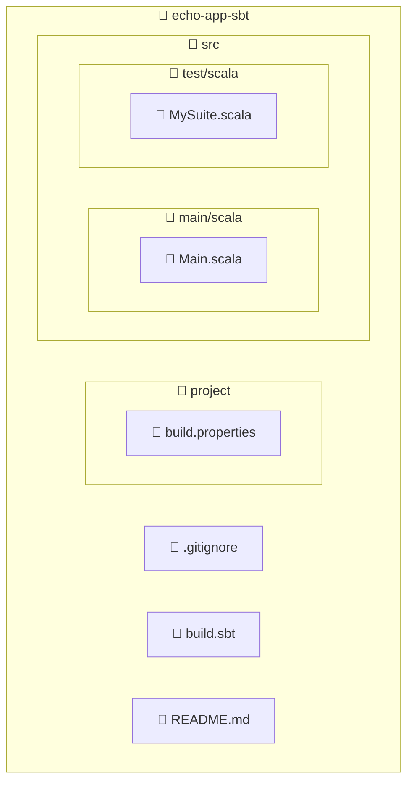

import ReadingTime from '@site/src/components/ReadingTime'
import { ProCons, Pros, Cons } from '@site/src/components/cajitas/ProCons'
import Explanation from '@site/src/components/admonitions/Explanation'
import Exercise from '@site/src/components/exercise/Exercise'
import Solution from '@site/src/components/exercise/Solution'
import BoxedTabs from '@site/src/components/cajitas/BoxedTabs'
import TabItem from '@theme/TabItem'

<ReadingTime />

Antes de automatizar tareas, definir bibliotecas reutilizables o aplicar análisis estático, necesitamos sentar las bases de nuestro proyecto. En esta lección aprenderás a crear una estructura inicial utilizando **sbt**, la herramienta de construcción más popular en el ecosistema Scala.

A través de una pequeña aplicación de consola llamada `echo-app-sbt`, exploraremos cómo iniciar un proyecto a partir de una plantilla oficial, revisar su estructura básica y ejecutar un primer programa en Scala 3. Este proceso te dará una base sólida para continuar desarrollando bibliotecas escalables, modulares y bien organizadas con las herramientas modernas del lenguaje.

## 🛠️ ¿Qué es sbt?

**sbt** (*Simple Build Tool*) es la herramienta de construcción más utilizada en el ecosistema Scala, aunque también puede emplearse en proyectos Java o mixtos.

Se destaca por:

- **DSL basado en Scala:** permite definir tareas y configuraciones utilizando una sintaxis declarativa escrita en Scala, lo que brinda mayor expresividad y flexibilidad.
- **Consola interactiva:** ofrece una shell integrada para ejecutar tareas, observar cambios en tiempo real y recargar configuraciones sin reiniciar el entorno.
- **Cross-building:** facilita la compilación del mismo proyecto en múltiples versiones de Scala, una capacidad clave para desarrollar bibliotecas compatibles con distintos entornos.

## ⚙️ Paso 0: Instalar sbt

Antes de crear un nuevo proyecto, asegúrate de tener instalada la herramienta `sbt` en tu sistema. Puedes hacerlo utilizando el gestor de paquetes correspondiente a tu sistema operativo:

<BoxedTabs groupId={"os"}>
  <TabItem value="Windows" label="Windows">
    ```powershell
    scoop install sbt
    ```
  </TabItem>
  <TabItem value="macOS" label="macOS">
    ```bash
    brew install sbt
    ```
  </TabItem>
  <TabItem value="Linux" label="Linux">
    ```bash
    sdk install sbt
    ```
  </TabItem>
</BoxedTabs>

### ✅ Verificar la instalación

Para confirmar que `sbt` se ha instalado correctamente, abre una terminal y ejecuta:

```bash
sbt --version
```

Deberías ver una salida similar a:

```plaintext
sbt runner version: 1.10.11

[info] sbt runner (sbt-the-shell-script) is a runner to run any declared version of sbt.
[info] Actual version of the sbt is declared using project/build.properties for each build.
```

:::info ¿Qué versión estás viendo?

La línea inicial muestra la versión del *runner* de `sbt`, es decir, el script que permite lanzar distintos proyectos con diferentes versiones.  
La versión real de `sbt` utilizada por un proyecto se define en el archivo `project/build.properties`, lo que permite controlar y fijar la versión de compilación por proyecto.

:::

## 🧱 Paso 1: Crear el Proyecto Base con sbt

Al igual que otras herramientas de construcción, **sbt** permite generar nuevos proyectos rápidamente a partir de **plantillas oficiales**, conocidas como *giter8 templates*. En este paso, usaremos la plantilla oficial para proyectos en **Scala 3**:

```bash
sbt new scala/scala3.g8
```

<Explanation>
    Este comando genera un nuevo proyecto a partir de una plantilla remota.

    - **`sbt new`**: Lanza un asistente interactivo para crear un proyecto basado en una plantilla disponible en GitHub.
    - **`scala/scala3.g8`**: Plantilla oficial mantenida por el equipo de Scala, pensada para proyectos con Scala 3.  
      El sufijo `.g8` indica que es una plantilla compatible con [giter8](https://www.foundweekends.org/giter8/), un sistema de scaffolding inspirado en Yeoman.
</Explanation>

## 🧩 Paso 2: Nombrar el Proyecto

Al ejecutar `sbt new scala/scala3.g8`, el asistente interactivo te pedirá un único dato:

```plaintext
name [Scala 3 Project Template]: echo-app-sbt
```

<Explanation>
    En este paso, sbt solicita el **nombre del proyecto**, que también determinará el nombre del directorio que se creará.

    - Si presionas Enter sin ingresar nada, se usará el valor por defecto (`Scala 3 Project Template`), lo cual **no es recomendable**, ya que el nombre no es representativo y contiene espacios.
    - Se recomienda escribir un nombre descriptivo como `echo-app-sbt`, siguiendo la convención **kebab-case** (minúsculas y guiones).

    Este nombre también será utilizado en configuraciones internas del proyecto, por lo que conviene mantenerlo corto, claro y consistente con el propósito del proyecto.
</Explanation>

## 🗂 Estructura del Proyecto

Al completar el asistente de creación del proyecto con sbt, se genera una estructura organizada que incluye el código fuente, archivos de configuración y pruebas. A continuación se muestra un diagrama con los archivos y directorios más relevantes:



:::info Explicación de la estructura

Este diagrama representa la estructura generada por la plantilla oficial de Scala 3 (`scala/scala3.g8`). Los componentes principales son:

- **📄 `.gitignore`**: Indica a Git qué archivos deben ignorarse (como carpetas de compilación y archivos temporales).
- **📄 `build.sbt`**: Archivo principal de configuración. Aquí se definen dependencias, opciones de compilación y plugins.
- **📄 `README.md`**: Documento inicial con información básica del proyecto.
- **📁 `project/`**: Contiene configuraciones adicionales para sbt.
  - **📄 `build.properties`**: Especifica la versión de sbt que debe usarse.
- **📁 `src/`**: Carpeta raíz del código fuente.
  - **📁 `main/scala/`**: Contiene el código fuente principal.
    - **📄 `Main.scala`**: Punto de entrada del programa.
  - **📁 `test/scala/`**: Contiene las pruebas.
    - **📄 `MySuite.scala`**: Prueba de ejemplo incluida por la plantilla.

Esta estructura promueve buenas prácticas y es ideal para comenzar con proyectos en Scala bien organizados y escalables.

:::

## 🐟 Paso 3: Ejecutar un Hello World inquietante

Ahora que ya tienes un proyecto funcional, reemplaza el contenido del archivo `Main.scala` con lo siguiente:

```scala showLineNumbers title="src/main/scala/Main.scala"
@main def main(): Unit =
  println("A shark... walking...")
```

<Explanation>
    Este código reemplaza el contenido generado por la plantilla. La función `@main` marca el **punto de entrada** del programa en Scala 3, y permite declararlo de forma directa y concisa.

    - La anotación `@main` elimina la necesidad de declarar una clase o extender `App`, como era habitual en Scala 2.
    - En versiones anteriores, el punto de entrada se escribía así:
        ```scala showLineNumbers
        object Main extends App {   // Extender App ya no se recomienda
          println("A shark... walking...")
        }
        ```
        o bien
        ```scala showLineNumbers
        object Main {
          def main(args: Array[String]): Unit = {
            println("A shark... walking...")
          }
        }
        ```
    - Scala 3 permite una versión más simple y expresiva, reduciendo el código boilerplate y mejorando la legibilidad.

    El mensaje impreso es una referencia inquietante a *Gyo*, un manga de terror de Junji Ito.
</Explanation>

### ▶️ Ejecutar el programa

Para compilar y ejecutar tu aplicación, desde el directorio del proyecto ejecuta:

```bash
sbt run
```

Deberías ver una salida similar a esta:

```plaintext
[info] welcome to sbt 1.10.11 (Azul Systems, Inc. Java 23)
[info] loading project definition from ./project
[info] loading settings for project root from build.sbt...
[info] set current project to echo-app-sbt (in build file:./)
[info] compiling 1 Scala source to ./target/scala-3.6.4/classes ...
[info] running 'main'
The smell... it's coming from the sea.
[success] Total time: 4 s, completed Apr 2, 2025, 6:22:12 PM
```

Este pequeño experimento demuestra lo fácil que es poner en marcha una aplicación con sbt y Scala 3, incluso si el primer mensaje proviene… del fondo del océano glu glu

## 🎯 Conclusiones

En esta lección aprendimos a crear un proyecto básico usando **sbt** y **Scala 3**, siguiendo un enfoque moderno, simple y expresivo. Comenzamos instalando la herramienta, generamos un proyecto a partir de una plantilla oficial, exploramos su estructura, y finalizamos ejecutando un pequeño programa de consola con una atmósfera misteriosa.

### 🔑 Puntos clave

- **sbt** es la herramienta de construcción más utilizada en el ecosistema Scala, compatible tanto con proyectos en Scala como en Java.
- Usamos el comando `sbt new scala/scala3.g8` para generar un proyecto básico basado en Scala 3.
- La estructura resultante es clara y organizada, siguiendo convenciones modernas de desarrollo.
- Scala 3 permite definir el punto de entrada de forma directa con la anotación `@main`, reduciendo el código boilerplate habitual en versiones anteriores.
- Ejecutar el programa con `sbt run` compila y lanza automáticamente la aplicación principal.

### 🧰 ¿Qué nos llevamos?

Más allá del código ejecutado o de los archivos que ahora pueblan nuestro directorio, esta lección nos deja algo más importante: el punto de partida. Aprendimos que crear un proyecto en Scala no tiene por qué ser complejo, y que herramientas como **sbt**, lejos de ser obstáculos, pueden convertirse en aliadas para estructurar, automatizar y hacer crecer nuestras ideas.

También descubrimos que Scala 3 simplifica muchos aspectos del lenguaje, permitiéndonos escribir programas claros desde el primer día. Iniciar con una función `@main` puede parecer trivial, pero encierra una filosofía: **eliminar el ruido, enfocarse en lo esencial y escribir código que diga exactamente lo que queremos decir**.

A partir de aquí, ya no estás comenzando desde cero. Tienes un entorno configurado, una herramienta poderosa y un lenguaje expresivo a tu disposición.  
🎬 **El escenario está listo: ahora puedes concentrarte en escribir el código que realmente importa.**

## 📖 Referencias

### 🔥 Recomendadas

- 🌐 Building and Testing Scala Projects with sbt. (s. f.). Scala Documentation. Recuperado 2 de abril de 2025, de https://docs.scala-lang.org/scala3/book/tools-sbt.html

### 🔹 Adicionales

- 📚 Why sbt? (2016). En J. D. Suereth & M. Farwell, Sbt in Action: The simple Scala build tool (pp. 3–23). Manning.
