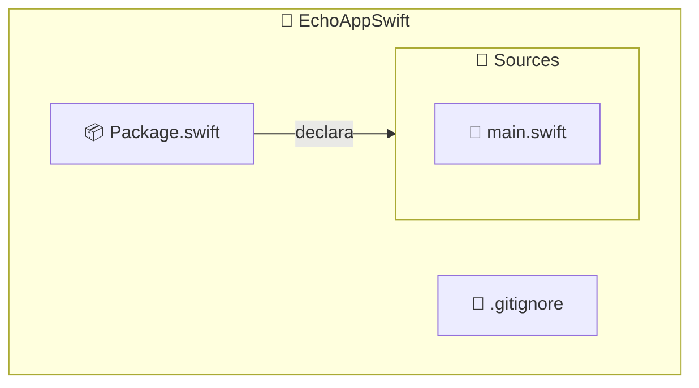

import ReadingTime from '@site/src/components/ReadingTime'
import References from '@site/src/components/ReferencesComponent'
import { ProCons, Pros, Cons } from '@site/src/components/cajitas/ProCons'
import Explanation from '@site/src/components/admonitions/Explanation'
import BoxedTabs from '@site/src/components/cajitas/BoxedTabs'
import TabItem from '@theme/TabItem'

<ReadingTime />

Swift es un lenguaje de programación creado por Apple con el objetivo de ofrecer una alternativa moderna, segura y veloz a Objective-C. Aunque su adopción se dio inicialmente en el desarrollo de aplicaciones iOS y macOS, Swift ha demostrado ser un lenguaje **versátil y multiplataforma**: hoy se utiliza también para crear herramientas de línea de comandos, scripts, bibliotecas compartidas e incluso servicios web, tanto en **macOS** como en **Linux** y **Windows**.

Una de sus grandes fortalezas es el **Swift Package Manager (SwiftPM)**, la herramienta oficial para organizar proyectos modulares, compilar código y gestionar dependencias, sin requerir entornos gráficos como Xcode.

En esta lección aprenderás a:

- Instalar Swift y verificar su disponibilidad en tu sistema.
- Crear un nuevo proyecto ejecutable con SwiftPM desde la terminal.
- Comprender la estructura de archivos generada por defecto.
- Editar el punto de entrada del programa (`main.swift`) y compilarlo con `swift run`.

El objetivo es que puedas **iniciar cualquier proyecto Swift desde cero**, con una estructura sólida y portable, sin depender de herramientas externas. Este conocimiento será especialmente útil si vienes de otros entornos como Kotlin con Gradle, ya que muchas de las ideas —como los módulos, los targets o la compilación desde terminal— se presentan de forma similar pero con convenciones propias de Swift.

## 🦅 Paso 0: Instalar Swift

[**Swift**](https://www.swift.org) es un lenguaje de programación moderno, seguro y de alto rendimiento desarrollado por Apple.
Fue diseñado inicialmente para reemplazar a Objective-C en el desarrollo de aplicaciones iOS y macOS, pero su uso no se limita a esas plataformas:
también es utilizado para crear herramientas de línea de comandos, servidores web, scripts y bibliotecas reutilizables —incluso en Linux y Windows.

Una de sus principales fortalezas es su compatibilidad con el **Swift Package Manager (SwiftPM)**, que permite gestionar dependencias y organizar proyectos modulares de forma integrada.

Antes de poder compilar y gestionar proyectos en Swift, necesitas instalar el compilador y SwiftPM.

A continuación te mostramos cómo instalar Swift en los sistemas operativos más comunes:

<BoxedTabs groupId={"os"}>
    <TabItem value="Windows" label="Windows">
        ```powershell
        scoop install swift
        ```
    </TabItem>
    <TabItem value="macOS" label="macOS">
        ```bash
        brew install swift
        ```
    </TabItem>
    <TabItem value="Linux" label="Linux">
        ```bash
        curl -O https://download.swift.org/swiftly/linux/swiftly-$(uname -m).tar.gz && \
        tar zxf swiftly-$(uname -m).tar.gz && \
        ./swiftly init --quiet-shell-followup && \
        . ~/.local/share/swiftly/env.sh && \
        hash -r
        ```
        <Explanation>
            Este bloque descarga e instala **Swiftly**, una herramienta ligera que facilita la gestión de versiones de Swift en Linux.  
            A diferencia de otros métodos, **Swiftly no solo se instala a sí misma, sino que también descarga e instala Swift** como parte del proceso:

            1. Descarga el archivo comprimido de Swiftly para tu arquitectura.
            2. Extrae el contenido.
            3. Inicializa Swiftly y descarga Swift estable.
            4. Configura el entorno del shell.
            5. Refresca el caché de comandos del shell para que el comando `swift` esté disponible.

            :::warning Dependencias del sistema

            Es posible que después de la instalación veas mensajes advirtiendo sobre **dependencias adicionales del sistema**, como bibliotecas de desarrollo o herramientas de depuración.

            Por ejemplo, podrías ver instrucciones como:

            ```text
            apt-get -y install libcurl4-openssl-dev libxml2-dev ...
            ```

            Estos comandos deben ejecutarse como **administrador (root)** para que Swift funcione correctamente.

            :::
        </Explanation>
    </TabItem>
</BoxedTabs>

### ✅ Verificar la instalación

Una vez instalado, puedes confirmar que Swift esté correctamente disponible ejecutando:

```bash
swift --version
```

```text title="Salida esperada (puede variar)"
Swift version 6.0.3 (swift-6.0.3-RELEASE)
Target: x86_64-unknown-linux-gnu
```

## 📁 Paso 1: Crear el directorio e inicializar el proyecto

Antes de comenzar a desarrollar tu biblioteca o aplicación en Swift, es importante contar con una estructura de proyecto bien organizada. Swift proporciona una herramienta oficial de construcción y empaquetado llamada **Swift Package Manager (SwiftPM)**, que permite crear y administrar proyectos de forma coherente y portable, sin depender de entornos gráficos como Xcode.

A continuación, te mostramos cómo crear un nuevo proyecto básico de Swift desde la terminal en diferentes sistemas operativos:

<BoxedTabs groupId={"os"}>
    <TabItem value="Windows" label="Windows">    
        ```powershell title="En PowerShell"
        'EchoAppSwift' | ForEach-Object {
            $project = $_
            New-Item -ItemType Directory -Path $project -Force | Out-Null
            Set-Location $project
            swift package init --type executable
        }
        ```

        <Explanation>
            Este bloque de PowerShell automatiza la creación e inicialización de un nuevo proyecto Swift desde cero:

            - **`'EchoAppSwift' | ForEach-Object { ... }`**: Usa una única fuente (`EchoAppSwift`) para que el nombre del proyecto no se repita dentro del bloque.
            - **`New-Item -ItemType Directory -Force`**: Crea la carpeta del proyecto, sin errores si ya existe.
            - **`Out-Null`**: Suprime la salida del comando anterior.
            - **`Set-Location`**: Entra al nuevo directorio.
            - **`swift package init --type executable`**: Inicializa el proyecto con una plantilla básica para ejecutables.

            El resultado es un proyecto Swift listo para compilar y ejecutar desde la terminal.
        </Explanation>
    </TabItem>

    <TabItem value="Windows (corto)" label="Windows (corto)">
        ```powershell title="Inicializar un proyecto Swift ejecutable"
        'EchoAppSwift' | % {
            md $_ -f > $null
            cd $_
            swift package init --type executable
        }
        ```

        <Explanation>
            Este bloque compacto de PowerShell crea e inicializa un nuevo proyecto Swift llamado `EchoAppSwift`:

            - **`'EchoAppSwift' | % { ... }`**: Utiliza `%` como alias de `ForEach-Object`, evitando repetir el nombre del proyecto dentro del bloque.
            - **`md $_ -f > $null`**: Crea el directorio si no existe, suprimiendo la salida con `> $null`.
            - **`cd $_`**: Cambia al nuevo directorio del proyecto.
            - **`swift package init --type executable`**: Inicializa un proyecto con plantilla de ejecutable.

            El resultado es una base lista para compilar y extender con módulos personalizados.
        </Explanation>
    </TabItem>

    <TabItem value="Linux/macOS" label="Linux/macOS">
        ```bash title="Inicializar un proyecto Swift ejecutable"
        dir="EchoAppSwift"
        mkdir -p "$dir"
        cd "$dir"
        swift package init --type executable
        ```

        <Explanation>
            Este bloque crea e inicializa un nuevo proyecto Swift con una estructura estándar para ejecutables:

            - **`dir="EchoAppSwift"`**: Define el nombre del proyecto en una variable reutilizable.
            - **`mkdir -p "$dir"`**: Crea el directorio del proyecto si no existe, sin errores si ya está presente.
            - **`cd "$dir"`**: Entra al directorio recién creado.
            - **`swift package init --type executable`**: Genera una plantilla de proyecto Swift.

            Al finalizar, tendrás un proyecto Swift listo para compilar y extender.
        </Explanation>
    </TabItem>
</BoxedTabs>

:::warning ¡Atención!

Si omites la opción `--type executable` al crear el proyecto, Swift generará una **biblioteca** en lugar de una aplicación ejecutable.  
En ese caso, el comando `swift run` **fallará** con un mensaje como:

```
error: no executable product available
```

Para evitar este problema, asegúrate de incluir `--type executable` al usar `swift package init`.

:::

:::tip Convención de nombres

Swift sigue una convención de nombres muy clara para proyectos y módulos: se prefiere **PascalCase**, es decir, palabras unidas con mayúscula inicial.

Por ejemplo:

✅ `EchoAppSwift` → forma recomendada  
❌ `echo-app-swift` → forma desaconsejada (estilo más común en sistemas de archivos o en otros lenguajes como JavaScript)

Adoptar PascalCase mejora la coherencia con las herramientas del ecosistema y evita problemas al generar carpetas y targets automáticamente con SwiftPM.

:::

## 🗂️ Estructura generada del proyecto

Cuando ejecutas `swift package init --type executable`, SwiftPM genera automáticamente la siguiente estructura básica:



:::info Explicación de la estructura

- **`Package.swift`**: Archivo central de configuración del proyecto SwiftPM. Declara los módulos (targets), sus dependencias y los productos que se exponen.
- **`.gitignore`**: Archivo que indica a Git qué archivos o carpetas deben ignorarse (por ejemplo, archivos de compilación o entornos temporales).
- **`Sources/`**: Carpeta que contiene el código fuente del ejecutable principal.
    - **`main.swift`**: Punto de entrada del programa, similar a `main()` en Kotlin. Aquí comienza la ejecución del ejecutable.

Esta estructura es mínima, pero funcional. SwiftPM puede expandirse fácilmente para incluir bibliotecas, pruebas y múltiples módulos conforme evolucione tu proyecto.

:::

## 📦 Archivo de configuración del proyecto

Cuando creas un proyecto con `swift package init`, SwiftPM genera un archivo llamado `Package.swift`.
Este archivo es el corazón del proyecto: define su nombre, sus módulos (llamados *targets*), sus productos y dependencias externas si las hay.

Aquí tienes un ejemplo mínimo generado automáticamente para un proyecto ejecutable:

```swift showLineNumbers title="Archivo de configuración inicial (Package.swift)"
// swift-tools-version: 6.1
import PackageDescription

let package = Package(
    name: "EchoAppSwift",
    targets: [
        .executableTarget(
            name: "EchoAppSwift"
        )
    ]
)
```

<Explanation>
    Este archivo declara la configuración del proyecto SwiftPM:

    - **`// swift-tools-version: 6.1`**:
        Indica la versión mínima del `Swift Package Manager` necesaria para interpretar este archivo. Debe estar en la primera línea.
    - **`import PackageDescription`**:
        Importa la biblioteca necesaria para construir la descripción del paquete.
    - **`name: "EchoAppSwift"`**:
        Define el nombre del paquete (y del proyecto). SwiftPM usará este nombre como base para el ejecutable y los módulos generados.
    - **`targets`**:
        Especifica los componentes que se compilarán dentro del paquete. En este caso, hay un único módulo:
        - **`.executableTarget(name: "EchoAppSwift")`**:
        Declara un target ejecutable llamado `EchoAppSwift`. SwiftPM buscará su código en `Sources/EchoAppSwift/`.

    Aunque este ejemplo no tiene aún dependencias ni productos explícitos, es suficiente para compilar y ejecutar un programa simple.
</Explanation>

## 🌪️ Paso 2: Modificar y ejecutar el `Hello, World`

Al crear el proyecto, Swift genera automáticamente un archivo llamado `main.swift` dentro del directorio `Sources/`.
Este archivo contiene una función principal simple que imprime el mensaje `"Hello, world!"`.

Vamos a editarlo para que imprima un mensaje memorable inspirado en *Uzumaki* de Junji Ito.

```swift showLineNumbers title="Punto de entrada del ejecutable (Sources/main.swift)"
print("Spirals.... this town is contaminated with spirals.")
```
Aquí tienes algunas sugerencias de título para ese bloque, dependiendo del enfoque que quieras destacar:

### ▶️ Ejecutar el proyecto

Una vez que hayas modificado el archivo `main.swift`, puedes compilar y ejecutar el proyecto con:

```bash
swift run
```

```plaintext title="Salida esperada (puede variar)"
Building for debugging...
[8/8] Linking EchoAppSwift
Build of product 'EchoAppSwift' complete! (5.10s)
Spirals.... this town is contaminated with spirals.
```

<Explanation>
    El comando `swift run` realiza dos pasos clave:

    1. **Compila** el proyecto automáticamente si no ha sido compilado antes, o si detecta cambios recientes.
    2. **Ejecuta** el binario generado de inmediato.

    Esto lo convierte en una herramienta ideal para ciclos rápidos de desarrollo, ya que evita tener que compilar (`swift build`) y buscar el ejecutable manualmente.  
    También garantiza que siempre se esté ejecutando la versión más actualizada del proyecto.
</Explanation>

## 🎯 Conclusiones

En esta lección aprendimos a instalar Swift en distintos sistemas operativos, crear un proyecto desde cero usando Swift Package Manager (SwiftPM), comprender su estructura base, y ejecutar un programa sencillo desde la línea de comandos.

Aunque el programa resultante es minimalista, los conceptos y herramientas que utilizamos representan el punto de partida para cualquier proyecto profesional en Swift —ya sea una biblioteca, un ejecutable o una aplicación multiplataforma.

Dominar la estructura de `Package.swift` y entender cómo se organizan los módulos es clave para escalar de forma ordenada y mantener una base de código limpia y sostenible.

### 🔑 Puntos clave

- Swift es un lenguaje moderno, seguro y multiplataforma, con una sintaxis expresiva y un enfoque fuerte en la seguridad y el rendimiento.
- Swift Package Manager (SwiftPM) permite crear proyectos modulares sin depender de Xcode, lo que lo hace ideal para entornos multiplataforma o de línea de comandos.
- El comando `swift package init --type executable` crea una estructura básica funcional para comenzar rápidamente.
- El archivo `Package.swift` es el centro de configuración de todo proyecto SwiftPM: allí se declaran los módulos, productos y dependencias.
- La convención de nombres en **PascalCase** no es solo estilística, sino que garantiza compatibilidad con las herramientas del ecosistema.
- `swift run` compila y ejecuta el proyecto en un solo paso, ideal para desarrollo iterativo.

### 🧰 ¿Qué nos llevamos?

Esta lección sienta las bases para trabajar de forma profesional con Swift en cualquier contexto: desde pequeños scripts hasta aplicaciones modulares de gran escala.

A partir de aquí, podrás:

- Añadir nuevos módulos al proyecto.
- Separar tu código en bibliotecas reutilizables.
- Escribir pruebas unitarias.
- Preparar tus paquetes para distribución o publicación.

Además, lo aprendido en esta lección no solo es útil para usar Swift como lenguaje, sino también para entender cómo organizar y estructurar cualquier proyecto modular de forma clara y escalable.

## 📖 Referencias

### 🔥 Recomendadas

- [📰 Crea tu primera Swift app de línea de comandos y ejecútala en tu terminal](https://www.swiftbeta.com/crea-tu-primera-command-line-tool-en-swift/) en *SwiftBeta*: Un tutorial completo que muestra cómo crear una *command line tool* en Swift con `swift package init`, realizar peticiones HTTP, y automatizar tareas con `Shortcuts.app`. Es útil para complementar esta lección porque lleva los conceptos vistos —como el uso de SwiftPM y la estructura básica del proyecto— a un caso más avanzado y práctico.

### 🔹 Adicionales

- [🎥 How to Make a Swift Command Line Tool - Swift CLI in Terminal](https://youtu.be/w7HvY29P9A4) de **Paul Solt**: Un video introductorio que guía paso a paso la creación de un CLI en Swift usando SwiftPM. Explica cómo estructurar el proyecto, compilar desde terminal, añadir dependencias como `Swift Argument Parser`, y ejecutar el binario desde cualquier ubicación. Relevante para quienes desean profundizar en el desarrollo de herramientas de terminal y comprender mejor el archivo `Package.swift`.
