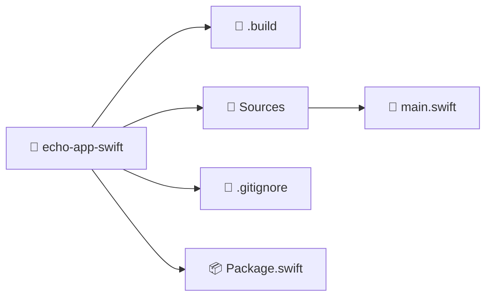

import ReadingTime from '@site/src/components/ReadingTime'
import References from '@site/src/components/ReferencesComponent'
import { ProCons, Pros, Cons } from '@site/src/components/cajitas/ProCons'
import Explanation from '@site/src/components/admonitions/Explanation'
import BoxedTabs from '@site/src/components/cajitas/BoxedTabs'
import TabItem from '@theme/TabItem'

<ReadingTime />

Swift es un lenguaje moderno, seguro y expresivo, utilizado tanto en el desarrollo de aplicaciones para Apple como en otros entornos multiplataforma.  
Aunque es comúnmente asociado a Xcode y al desarrollo para iOS o macOS, Swift también ofrece herramientas oficiales que permiten compilar, ejecutar y organizar proyectos directamente desde la línea de comandos, en cualquier sistema operativo.

En esta guía aprenderás a:

- Instalar Swift en tu sistema operativo.
- Crear un proyecto ejecutable básico usando Swift Package Manager (SwiftPM).
- Modificar el punto de entrada del programa.
- Ejecutar tu aplicación desde la terminal.

## 🦅 Paso 0: Instalar Swift

Antes de poder compilar y gestionar proyectos en Swift, necesitas instalar el compilador y el Swift Package Manager.  
A continuación te mostramos cómo instalar Swift en los sistemas operativos más comunes:

<BoxedTabs groupId={"os"}>
    <TabItem value="Windows" label="Windows">
        ```powershell
        scoop install swift
        ```
    </TabItem>
    <TabItem value="macOS" label="macOS">
        ```bash
        brew install swift
        ```
    </TabItem>
    <TabItem value="Linux" label="Linux">
        ```bash
        curl -O https://download.swift.org/swiftly/linux/swiftly-$(uname -m).tar.gz && \
            tar zxf swiftly-$(uname -m).tar.gz && \
            ./swiftly init --quiet-shell-followup && \
            . ~/.local/share/swiftly/env.sh && \
            hash -r
        ```

        <Explanation>
            Este bloque descarga e instala **Swiftly**, una herramienta ligera que facilita la gestión de versiones de Swift en Linux.  
            A diferencia de otros métodos, **Swiftly no solo se instala a sí misma, sino que también descarga e instala Swift** como parte del proceso:

            1. **`curl -O https://download.swift.org/swiftly/linux/swiftly-$(uname -m).tar.gz`**: Descarga el archivo comprimido de Swiftly para tu arquitectura (`x86_64`, `aarch64`, etc.).
            2. **`tar zxf swiftly-$(uname -m).tar.gz`**: Extrae el archivo.
            3. **`./swiftly init --quiet-shell-followup`**: Inicializa Swiftly y automáticamente instala la versión recomendada de Swift (estable). La opción `--quiet-shell-followup` evita mensajes interactivos innecesarios.
            4. **`. ~/.local/share/swiftly/env.sh`**: Configura el entorno de tu shell para que reconozca Swift y Swiftly.
            5. **`hash -r`**: Refresca el caché de comandos del shell para asegurar que `swift` esté disponible.

            Después de ejecutar estos pasos, tendrás **Swift listo para usarse** con el comando `swift` directamente desde la terminal.

            :::warning Dependencias del sistema

            Es posible que después de la instalación veas mensajes advirtiendo sobre **dependencias del sistema que deben instalarse manualmente**, como bibliotecas de desarrollo, herramientas de depuración o enlaces nativos.

            Por ejemplo, podrías ver instrucciones como:

            ```text
            apt-get -y install libcurl4-openssl-dev libxml2-dev ...
            ```

            Estos mensajes indican que tu entorno Linux no cuenta con todas las herramientas necesarias para compilar o depurar programas en Swift.  
            Sigue las instrucciones específicas que aparezcan en tu terminal, y ejecuta los comandos como **administrador del sistema (root)** si es necesario.

            :::
        </Explanation>
    </TabItem>
</BoxedTabs>

### ✅ Verificar la instalación

Después de instalar Swift, puedes comprobar que todo esté funcionando ejecutando:

```bash
swift --version
```

## 📁 Paso 1: Crear el directorio e inicializar el proyecto

Antes de comenzar a desarrollar tu biblioteca o aplicación en Swift, es importante contar con una estructura de proyecto bien organizada. Swift proporciona una herramienta oficial de construcción y empaquetado llamada **Swift Package Manager (SwiftPM)**, que permite crear y administrar proyectos de forma coherente y portable, sin depender de entornos gráficos como Xcode.

A continuación, te mostramos cómo crear un nuevo proyecto básico de Swift desde la terminal en diferentes sistemas operativos:

<BoxedTabs groupId={"os"}>
    <TabItem value="Windows" label="Windows">    
        ```powershell
        'echo-app-swift' | ForEach-Object {
            New-Item -ItemType Directory -Path $_ -Force && `
                Set-Location $_
        } && swift package init --type executable
        ```

        <Explanation>
            Este bloque crea un nuevo proyecto Swift ejecutable desde la terminal en Windows:

            1. **`'echo-app-swift' | ForEach-Object { ... }`**: Aplica los comandos al nombre `'echo-app-swift'`. Este patrón puede escalar fácilmente a múltiples nombres.
            2. **`New-Item -ItemType Directory -Path $_ -Force`**: Crea el directorio del proyecto. La opción `-Force` evita errores si ya existe.
            3. **`Set-Location $_`**: Cambia al directorio recién creado.
            4. **`swift package init --type executable`**: Inicializa el proyecto como una aplicación ejecutable compatible con Swift Package Manager (SwiftPM).
        </Explanation>
    </TabItem>

    <TabItem value="Windows (corto)" label="Windows (corto)">
        ```powershell
        'echo-app-swift' | % { md $_ -f && cd $_ } && `
            swift package init --type executable
        ```

        <Explanation>
            Versión abreviada del comando anterior, utilizando alias comunes de PowerShell:

            1. **`%`** es un alias de `ForEach-Object`.  
               **`md`** es un alias de `New-Item -ItemType Directory`.  
               **`-f`** equivale a `-Force`.  
               **`cd`** es un alias de `Set-Location`.
            2. Crea el directorio `echo-app-swift` (sin fallar si ya existe) y entra en él.
            3. Ejecuta `swift package init --type executable` para generar la estructura del proyecto.
        </Explanation>
    </TabItem>

    <TabItem value="Linux/macOS" label="Linux/macOS">
        ```bash
        dir="echo-app-swift" && mkdir -p "$dir" && cd "$dir" && \
            swift package init --type executable
        ```

        <Explanation>
            Este comando en Bash crea un nuevo proyecto Swift ejecutable:

            1. **`dir="echo-app-swift"`**: Define el nombre del proyecto como variable reutilizable.
            2. **`mkdir -p "$dir"`**: Crea el directorio si no existe.
            3. **`cd "$dir"`**: Entra en el directorio del proyecto.
            4. **`swift package init --type executable`**: Inicializa una estructura de proyecto ejecutable para SwiftPM.
        </Explanation>
    </TabItem>
</BoxedTabs>

:::warning ¡Atención!

Si omites la opción `--type executable` al crear el proyecto, Swift generará una **biblioteca** en lugar de una aplicación ejecutable.  
En ese caso, el comando `swift run` **fallará** con un mensaje como:

```
error: no executable product available
```

Para evitar este problema, asegúrate de incluir `--type executable` al usar `swift package init`.

:::

## 🗂️ Estructura del proyecto



:::info Explicación de la estructura

Esta estructura representa un proyecto Swift inicializado con `swift package init --type executable`. Los elementos clave son:

- **📁 `echo-app-swift/`**: Carpeta raíz del proyecto.
- **📁 `.build/`**: Directorio generado automáticamente tras compilar el proyecto. Contiene artefactos, dependencias y cachés usados por SwiftPM.
- **📁 `Sources/`**: Carpeta que contiene el código fuente del ejecutable principal.
  - **📄 `main.swift`**: Punto de entrada del programa. Aquí es donde se escribe el código que se ejecutará al usar `swift run`.
- **🙈 `.gitignore`**: Archivo que indica a Git qué archivos deben ser ignorados, como los contenidos de `.build/`.
- **📦 `Package.swift`**: Archivo de configuración del proyecto. Define el nombre del paquete, los targets y las dependencias.

Esta estructura mínima permite compilar y ejecutar un programa Swift desde la terminal, sin depender de Xcode ni de entornos gráficos.

:::

## 🌪️ Paso 2: Modificar y ejecutar el `Hello, World`

Al crear el proyecto, Swift genera automáticamente un archivo llamado `echo_app_swift.swift` dentro del directorio `Sources/echo-app-swift/`.  
Este archivo contiene una función principal simple que imprime el mensaje `"Hello, world!"`.

Vamos a editarlo para que imprima un mensaje memorable inspirado en *Uzumaki* de Junji Ito.

```swift showLineNumbers title="Sources\main.swift"
print("Spirals.... this town is contaminated with spirals.")
```

### ▶️ Ejecutar el proyecto

Una vez que hayas modificado el archivo `main.swift`, puedes compilar y ejecutar el proyecto con el siguiente comando:

```bash
swift run
```

Deberías ver una salida similar a la siguiente:

```
Building for debugging...
[8/8] Linking .build/x86_64-unknown-windows-msvc/debug/echo-app-swift.exe
Build of product 'echo-app-swift' complete! (4.57s)
Spirals.... this town is contaminated with spirals.
```

<Explanation>
    El comando `swift run` realiza dos acciones principales:

    1. **Compila** el proyecto, si aún no ha sido compilado o si hubo cambios recientes.
    2. **Ejecuta** el binario generado inmediatamente después.

    Es una forma conveniente de probar tu aplicación sin tener que usar `swift build` y luego buscar el ejecutable manualmente.  
    También es útil en ciclos rápidos de desarrollo, como cuando haces pequeños cambios y quieres verificar su efecto de inmediato.
</Explanation>

## 🎯 Conclusiones

Swift no solo es un lenguaje moderno y poderoso, sino que también ofrece herramientas accesibles para comenzar a trabajar sin necesidad de entornos gráficos complejos como Xcode.  
A lo largo de esta guía, aprendimos a configurar Swift en distintos sistemas operativos, a crear un proyecto ejecutable desde la terminal, y a modificar su punto de entrada para ejecutar nuestro propio programa.

Este flujo de trabajo es ideal tanto para quienes quieren aprender Swift desde cero como para quienes buscan crear herramientas pequeñas, scripts portables o incluso bibliotecas multiplataforma.

### 🔑 Puntos clave

- **Swift se puede usar desde la línea de comandos** sin necesidad de Xcode, en Windows, macOS y Linux.
- **Swift Package Manager (SwiftPM)** permite crear, compilar y ejecutar proyectos de forma estructurada y coherente.
- Es crucial usar `--type executable` al inicializar el proyecto si queremos que se pueda ejecutar con `swift run`.
- El archivo `main.swift` es el punto de entrada de nuestra aplicación y se encuentra dentro de `Sources`.

### 🧰 ¿Qué nos llevamos?

Al cerrar esta lección, no solo aprendimos a instalar y configurar Swift, sino también a usar sus herramientas fundamentales de forma directa y consciente.  
Trabajar desde la terminal nos permitió ver con claridad cómo se estructura un proyecto, cómo se compila y cómo se ejecuta, sin depender de entornos gráficos ni automatismos opacos.

Más allá del ejemplo que escribimos —un simple mensaje en pantalla inspirado en *Uzumaki*—, lo importante es que dimos el primer paso hacia una comprensión más profunda del lenguaje y de su ecosistema técnico.  
Crear, modificar y ejecutar un proyecto nos deja listxs para explorar ideas más ambiciosas, con la confianza de saber cómo empezar desde cero, en cualquier sistema operativo.

Con esta base, el camino queda abierto para desarrollar bibliotecas, herramientas de línea de comandos o incluso aplicaciones multiplataforma.  
Y todo comienza aquí: con un archivo, una línea de código… y una espiral.

## 📖 Referencias

### 🔥 Recomendadas

- 📰 Crea tu primera Swift app de línea de comandos y ejecútala en tu terminal. (2022, septiembre 13). SwiftBeta. https://www.swiftbeta.com/crea-tu-primera-command-line-tool-en-swift/

