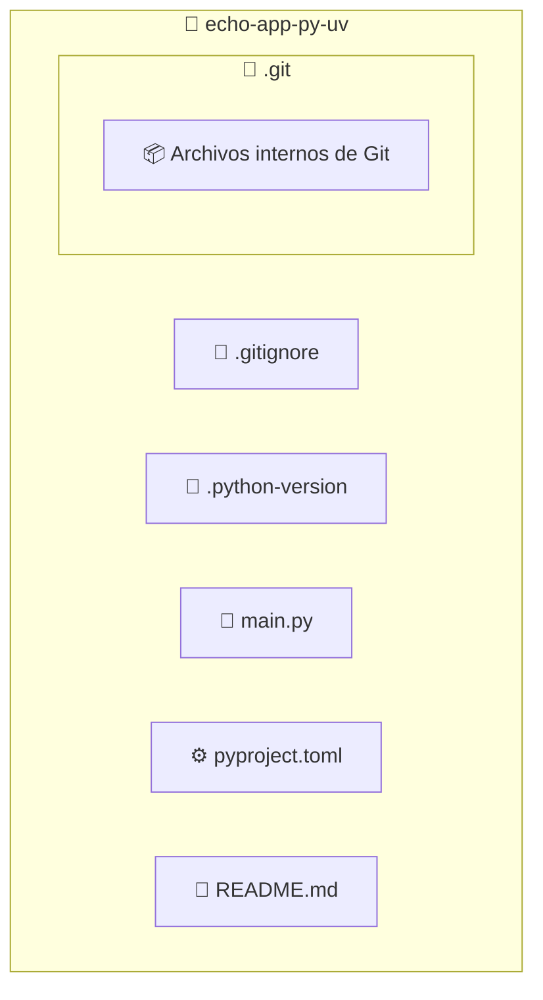

import BoxedTabs from '@site/src/components/cajitas/BoxedTabs'
import TabItem from '@theme/TabItem'
import Explanation from '@site/src/components/admonitions/Explanation'

## 🐍 Paso -1: Instalar Python

Antes de comenzar a trabajar con **uv**, necesitamos asegurarnos de tener **Python instalado**.

**Python** es un lenguaje de programación interpretado, de propósito general, conocido por su sintaxis clara, su amplia comunidad y su gran ecosistema de herramientas.
Se utiliza en una amplia gama de áreas: desarrollo web, scripting, análisis de datos, inteligencia artificial y automatización, entre otros.

En esta guía, usaremos Python como plataforma base para crear un proyecto estructurado y moderno, similar a cómo se hace en otros ecosistemas con herramientas como **Gradle** en Kotlin.

Puedes descargar Python desde [python.org](https://www.python.org/downloads/), o instalarlo con un gestor de paquetes según tu sistema operativo:

<BoxedTabs groupId="os">
    <TabItem value="Windows" label="Windows">
        ```powershell title="En PowerShell"
        scoop install python
        ```
    </TabItem>
    <TabItem value="macOS" label="macOS">
        ```bash title="En tu terminal"
        brew install python
        ```
    </TabItem>
    <TabItem value="Linux" label="Linux">
        ```bash title="En tu terminal"
        sudo apt install python3
        ```
    </TabItem>
</BoxedTabs>

### ✅ Verificar la instalación de Python

Una vez instalado, puedes verificar que esté correctamente disponible ejecutando:

<BoxedTabs groupId="os">
    <TabItem value="Windows" label="Windows">
        ```powershell title="En PowerShell"
        py --version
        ```
    </TabItem>
    <TabItem value="macOS" label="macOS">
        ```bash title="En tu terminal"
        python3 --version
        ```
    </TabItem>
    <TabItem value="Linux" label="Linux">
        ```bash title="En tu terminal"
        python3 --version
        ```
    </TabItem>
</BoxedTabs>

```plaintext title="Salida esperada (puede variar)"
Python 3.13.2
```

La salida debe mostrar una versión de Python igual o superior a 3.8. No es necesario que coincida exactamente con la que aparece aquí (3.13.2), pero sí debe confirmar que Python está instalado y disponible desde la terminal.

## ⚙️ Paso 0: Instalar *uv*

[*uv*](https://docs.astral.sh/uv/) es una herramienta ultrarrápida para gestionar entornos virtuales e instalar dependencias en proyectos basados en `pyproject.toml`.
Aunque todavía no ha alcanzado su versión 1.0, se encuentra en una etapa muy activa de desarrollo y ya ofrece funcionalidades equivalentes —e incluso superiores en algunos aspectos— a herramientas como **PDM**, **Poetry** o **Hatch**.

:::tip ¿Por qué usamos *uv*?

Elegimos *uv* porque, a diferencia de otras alternativas, **soporta de forma nativa estructuras multi-módulo (workspaces o monorepos)**.
Esto lo hace ideal no solo para proyectos como este —donde separamos una biblioteca (`core`) y una aplicación (`app`) dentro del mismo repositorio—, sino también para el enfoque que adoptaremos durante el curso:
**mantener una clara separación entre la lógica de negocios y la lógica de aplicación.**

Gracias a esta capacidad, podremos organizar nuestros proyectos de forma modular, escalar su complejidad de manera controlada y facilitar la reutilización de componentes.

:::

Instálala según tu sistema operativo:

<BoxedTabs groupId="os">
    <TabItem value="Windows" label="Windows">
        ```powershell title="En PowerShell"
        scoop install main/uv
        ```
    </TabItem>
    <TabItem value="macOS" label="macOS">
        ```bash title="En tu terminal"
        brew install uv
        ```
    </TabItem>
    <TabItem value="Linux" label="Linux">
        ```bash title="En tu terminal"
        curl -LsSf https://astral.sh/uv/install.sh | sh && \
        source $HOME/.local/bin/env
        ```
    </TabItem>
</BoxedTabs>

### ✅ Verificar la instalación de *uv*

Una vez instalada, verifica que esté correctamente disponible con:

```bash
uv --version
```

```plaintext title="Salida esperada (puede variar)"
uv 0.6.14 (a4cec56dc 2025-04-09)
```

Aunque la versión puede variar, deberías ver un número como `0.x.x` seguido de un identificador de compilación.  
Eso confirma que *uv* está correctamente instalado y listo para usarse en la gestión del proyecto.

## 🧱 Paso 1: Crear el directorio del proyecto

Vamos a crear una carpeta raíz llamada `echo-app-py-uv`, donde ubicaremos los distintos módulos del proyecto.

<BoxedTabs groupId="os">
    <TabItem value="Windows" label="Windows">
        ```powershell title="En PowerShell"
        'echo-app-py-uv' | ForEach-Object {
            New-Item -Path $_ -ItemType Directory -Force | Out-Null
            Set-Location -Path $_
        }
        ```

        <Explanation>
            Este bloque crea una carpeta llamada `echo-app-py-uv` (si aún no existe) y cambia el directorio actual a esa carpeta.

            - `New-Item -ItemType Directory -Force` crea el directorio, incluso si ya existe.
            - `Set-Location` cambia el directorio de trabajo actual.
            - `Out-Null` evita que la terminal imprima mensajes innecesarios.

            Es una forma clara y robusta de inicializar el entorno antes de estructurar el proyecto.
        </Explanation>
    </TabItem>
    <TabItem value="Windows (corto)" label="Windows (corto)">
        ```powershell title="Versión compacta"
        'echo-app-py-uv' | % { md $_ -f > $null; cd $_ }
        ```

        <Explanation>
            Variante abreviada que logra el mismo efecto:

            - `%` es alias de `ForEach-Object`.
            - `md` es alias de `New-Item -ItemType Directory`.
            - `-f` (`-Force`) asegura que no falle si el directorio ya existe.
            - `> $null` suprime la salida.
            - `cd` cambia al nuevo directorio.

            Esta versión es útil para scripts rápidos o líneas únicas en terminal.
        </Explanation>
    </TabItem>
    <TabItem value="Linux/macOS" label="Linux/macOS">
        ```bash title="En tu terminal"
        project="echo-app-py-uv" && \
        mkdir -p "$project" && \
        cd "$project"
        ```

        <Explanation>
            Este bloque crea la carpeta `echo-app-py-uv` y cambia al nuevo directorio:

            - `project="echo-app-py-uv"` guarda el nombre en una variable reutilizable.
            - `mkdir -p` crea el directorio solo si no existe.
            - `cd` entra a la carpeta del proyecto.
            - El uso de `&&` garantiza que cada paso se ejecute solo si el anterior tuvo éxito.

            Es una forma segura y limpia de comenzar a estructurar un proyecto desde cero.
        </Explanation>
    </TabItem>
</BoxedTabs>

## ⚙️ Paso 2: Inicializar el proyecto con `uv`

Inicializa la estructura base del proyecto ejecutando el siguiente comando desde la carpeta raíz:

```bash title="En tu terminal"
uv init
```

Este comando genera una estructura mínima compatible con `uv`, incluyendo archivos esenciales para la configuración del entorno.

### 🗂️ Resultado esperado



<Explanation>
    Al ejecutar `uv init`, se crea un archivo `pyproject.toml` con la configuración mínima del proyecto, así como un archivo `main.py` vacío y otros archivos útiles como `.gitignore` y `.python-version`.

    Esta estructura proporciona una base lista para agregar dependencias, definir entornos y comenzar a organizar tus módulos (`core/`, `app/`, etc.) en los siguientes pasos.
</Explanation>

## 🧩 Paso 3: Revisar el archivo `pyproject.toml`

Después de ejecutar `uv init`, se habrá generado un archivo `pyproject.toml` con la configuración mínima del proyecto.  
Antes de continuar, es importante revisarlo y ajustar los campos principales según tus necesidades.

Asegúrate de que el contenido sea similar a lo siguiente:

```toml title="pyproject.toml"
[project]
name = "echo-app-py-uv"
version = "0.1.0"
description = "Proyecto base con uv"
readme = "README.md"
requires-python = ">=3.10"
dependencies = []
```

<Explanation>
  Este archivo define los metadatos esenciales del proyecto y servirá como punto de partida para declarar dependencias, entornos, y más adelante, submódulos.

  - `name`: el nombre del proyecto.
  - `version`: la versión actual del proyecto.
  - `description`: una breve descripción (puedes completarla más adelante).
  - `readme`: archivo que se usará como documentación principal del proyecto.
  - `requires-python`: versión mínima de Python requerida.
  - `dependencies`: se dejará vacío por ahora, pero aquí podrás agregar bibliotecas necesarias en pasos posteriores.

  No es necesario declarar aún ningún workspace, ya que por ahora el proyecto será de un solo módulo.
</Explanation>
