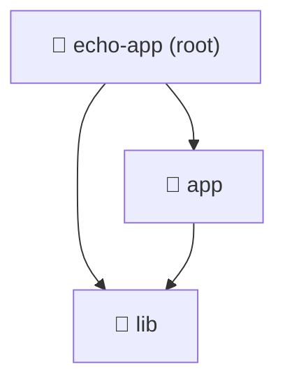

import ReadingTime from '@site/src/components/ReadingTime'
import { ProCons, Pros, Cons } from '@site/src/components/cajitas/ProCons'
import References from '@site/src/components/ReferencesComponent'
import Tabs from '@theme/Tabs'
import TabItem from '@theme/TabItem'
import Exercise from '@site/src/components/exercise/Exercise'
import Solution from '@site/src/components/exercise/Solution'
import Hint from '@site/src/components/exercise/Hint'
import Definition from '@site/src/components/Definition'
import Corollary from '@site/src/components/Corollary'
import GithubRepoLink from '@site/src/components/GithubRepoLink'
import * as LanguageCards from '@site/src/components/cards/LanguageCard'
import Explanation from '@site/src/components/admonitions/Explanation'
import RepoClone from '@site/src/components/admonitions/RepoClone'

<ReadingTime />
<GithubRepoLink user="r8vnhill" repo="echo-app-kt" />

Cuando trabajamos con **Gradle** en proyectos que contienen múltiples módulos, es esencial definir desde el inicio una estructura clara y coherente. Esto no solo mejora la organización del código, sino que también facilita la reutilización, el mantenimiento y la colaboración entre distintas partes de un sistema.

En esta lección aprenderás a configurar un proyecto **multi-módulo** en Gradle, una práctica común en el desarrollo de **bibliotecas de software**. Exploraremos cómo declarar submódulos en el archivo `settings.gradle.kts`, cómo estructurar tu código de forma modular y cómo gestionar versiones de dependencias de manera centralizada con un **catálogo de versiones**.

Aunque los ejemplos serán simples, la estructura que construiremos imita la de proyectos profesionales y escalables. Esto te preparará para aplicar buenas prácticas desde el comienzo, sin importar el tamaño del proyecto o el equipo con el que trabajes.

## 🛠️ `settings.gradle.kts`

El archivo `settings.gradle.kts` es fundamental para establecer los ajustes globales de un proyecto **Gradle**. Desde aquí se define el nombre del proyecto y se configura su estructura de módulos. Gradle evalúa este archivo al inicio del proceso de construcción, por lo que su contenido determina cómo se organizará el resto del proyecto.

En proyectos simples, su función se limita a establecer el nombre del proyecto. Sin embargo, en proyectos más grandes —como los multi-módulo— permite declarar y organizar subproyectos de forma centralizada, haciendo posible que cada módulo se compile y desarrolle de manera independiente.

### Funciones principales

1. **Definir el nombre del proyecto**: Útil cuando el nombre de la carpeta raíz no coincide con el nombre que queremos asignar al proyecto.
2. **Estructurar un proyecto multi-módulo**: Permite declarar los distintos módulos del proyecto, facilitando la organización y el mantenimiento del código.

Para comenzar, nuestro archivo `settings.gradle.kts` puede ser tan simple como:

```kotlin showLineNumbers title="settings.gradle.kts"
rootProject.name = "echo-app"
``` 

## 📂 Proyectos Multi-Módulo

En proyectos de mayor tamaño, concentrar todo el código en un único módulo puede volverse poco práctico y difícil de mantener. Esto es especialmente importante al desarrollar **bibliotecas de software**, donde las personas que las usan podrían requerir solo una parte específica de su funcionalidad.

Para abordar este desafío, los sistemas de construcción modernos —como Gradle, Maven o SBT— permiten definir **proyectos multi-módulo**. Esta estructura divide el proyecto en componentes más pequeños y desacoplados, lo que facilita la **reutilización**, la **modularidad** y el **desarrollo independiente** de cada parte.

Aunque los ejercicios de este curso no requieren múltiples módulos por su complejidad, adoptaremos una estructura multi-módulo desde el inicio para **familiarizarnos con este patrón**. Esta práctica es fundamental en el desarrollo de bibliotecas escalables y bien organizadas.

### 📌 Estructura de un Proyecto Multi-Módulo

Para comprender mejor la organización de un proyecto **multi-módulo** en Gradle, visualicemos su estructura en un **diagrama**:


```mermaid
graph TD;
    root["📂 echo-app (root)"]
    app["📂 app"]
    lib["📂 lib"]

    root --> app
    root --> lib
    app --> lib
```

:::info Estructura del Proyecto

- **📂 `echo-app (root)`**: Es la **raíz del proyecto**, donde se encuentran los archivos de configuración de Gradle, como `settings.gradle.kts`.
- **📂 `app` (módulo de aplicación)**: Contiene la lógica principal de la aplicación y **depende** del código definido en `lib` para reutilizar funcionalidades.
- **📂 `lib` (módulo de biblioteca)**: Agrupa funcionalidades reutilizables que pueden ser usadas tanto por `app` como por otros proyectos que requieran esta lógica.
- 🔗 **Conexión entre módulos**: En lecciones posteriores configuraremos `app` para **importar correctamente `lib`**, estableciendo su dependencia en `build.gradle.kts`.

:::

#### 📜 Definir un Proyecto Multi-Módulo

A continuación, te mostramos cómo configurar un proyecto Gradle multi-módulo en el archivo `settings.gradle.kts`. Este archivo define el nombre del proyecto raíz y los módulos que lo componen:

```kotlin showLineNumbers title="settings.gradle.kts"
rootProject.name = "echo-app"

include(
    ":app",
    ":lib"
)
```

<Explanation>
    - **[4]** `app`: Módulo de la aplicación principal.
    - **[5]** `lib`: Módulo que contendrá la funcionalidad que queremos reutilizar, como nuestras bibliotecas de software.
</Explanation>

:::note Prefijo `:` en los Módulos

El prefijo `:` antes del nombre del módulo indica que la ruta es "absoluta" y comienza desde la raíz del proyecto. Esto es útil para distinguir los módulos de los subproyectos y facilitar la referencia a los módulos en otros archivos de configuración.

:::

#### 🔍 ¿Por qué usar Proyectos Multi-Módulo?

<ProCons>
    <Pros>
        - **Modularidad**: Cada módulo puede contener una parte específica de la funcionalidad, lo que facilita el desarrollo independiente de cada uno.
        - **Reutilización**: Los módulos se pueden compartir entre diferentes proyectos. Por ejemplo, puedes reutilizar el módulo `lib` en otros proyectos sin necesidad de copiar el código.
        - **Mantenimiento**: Al dividir el proyecto en módulos, es más fácil detectar y solucionar problemas, ya que el código está mejor organizado.
        - **Optimización**: Gradle solo recompilará los módulos que hayan sido modificados, lo que reduce el tiempo de compilación en proyectos grandes.
    </Pros>
</ProCons>

#### 🚀 Aplicación en el Curso

En este curso, aunque los ejemplos serán sencillos, nos enfocaremos principalmente en crear módulos como **`lib`**, ya que el objetivo principal es desarrollar **bibliotecas de software**. Aun así, la estructura multi-módulo te permitirá practicar cómo organizar un proyecto real en el que:
- La biblioteca (módulo `lib`) encapsula las funcionalidades.
- El módulo de aplicación (`app`) consume las bibliotecas desarrolladas.

## 🏗️ Dependencias en un Proyecto Multi-Módulo

Las **dependencias** son componentes externos o bibliotecas que tu proyecto necesita para compilarse y ejecutarse correctamente. Estas dependencias pueden incluir desde bibliotecas de terceros hasta herramientas internas que extienden la funcionalidad de tu código. En lugar de manejar manualmente las dependencias y sus versiones, los sistemas de construcción modernos automatizan este proceso.

### 📦 Gestión de Dependencias en Gradle

**Gradle**, como muchos otros sistemas de construcción, automatiza la descarga e integración de las dependencias, ya sea desde repositorios remotos como **Maven Central** o **JCenter**, o desde repositorios locales. Algunos ejemplos de sistemas de construcción que también gestionan dependencias incluyen **Maven**, **npm**, **SBT** y **Cargo**.

En las próximas lecciones, profundizaremos en cómo agregar y manejar dependencias en Gradle, lo cual es esencial para desarrollar proyectos más complejos.

### 🔥 Beneficios de la Gestión de Dependencias en Multi-Módulo

<ProCons>
    <Pros>
        - **Separación de responsabilidades**: Cada módulo gestiona sus propias dependencias sin interferir con otros.
        - **Reutilización**: Un módulo puede ser utilizado en diferentes aplicaciones sin modificar su código.
        - **Optimización de compilación**: Gradle recompila solo los módulos modificados, reduciendo tiempos de build.
    </Pros>
</ProCons>

## 🎯 Conclusiones

En esta lección, exploramos la configuración de **proyectos multi-módulo** en **Gradle**, abordando su estructura, gestión de dependencias y organización de versiones. Esta configuración es fundamental para desarrollar **bibliotecas de software** de manera modular y mantenible.

### 🔑 Puntos clave

1. **`settings.gradle.kts` define la estructura del proyecto**  
   - Es el punto de entrada donde establecemos el nombre del proyecto y los módulos que lo conforman.
2. **Los proyectos multi-módulo mejoran la modularidad y reutilización**  
   - Separar la aplicación en módulos (`app`, `lib`, etc.) facilita el mantenimiento y permite compartir funcionalidades entre proyectos.
3. **Las dependencias se administran en cada módulo**  
   - Los módulos pueden importar otros módulos o bibliotecas externas de forma independiente.
4. **El catálogo de versiones centraliza la gestión de dependencias**  
   - Usar un archivo `libs.versions.toml` ayuda a garantizar coherencia y facilita actualizaciones en todas las partes del proyecto.

### 🚀 Reflexión final

El uso de **proyectos multi-módulo** en Gradle permite escalar aplicaciones y bibliotecas de manera eficiente, promoviendo la separación de responsabilidades y la optimización del tiempo de compilación. A medida que avancemos en el curso, veremos cómo aplicar estas configuraciones en escenarios más avanzados, incluyendo la integración con herramientas de pruebas.

Esta estructura te prepara para proyectos más complejos y te da herramientas clave para desarrollar **software reutilizable y mantenible**.

<div className="language-card-container">
    <LanguageCards.CabalCard link="/docs/build-systems/modular-design/cabal" />
    <LanguageCards.MavenCard link="/docs/build-systems/modular-design/maven" />
    <LanguageCards.PdmCard link="/docs/build-systems/modular-design/pdm" />
    <LanguageCards.SbtCard link="/docs/build-systems/modular-design/sbt" />
    <LanguageCards.SwiftCard link="/docs/build-systems/modular-design/swift" />
</div>

<References references={[
    {
        accessedDate: '9 de septiembre de 2024',
        siteOrAuthor: 'Gradle',
        title: 'Settings File Basics',
        type: 'web',
        url: 'https://docs.gradle.org/current/userguide/settings_file_basics.html'
    },
    {
        accessedDate: '9 de septiembre de 2024',
        siteOrAuthor: 'Gradle',
        title: 'Sharing dependency versions between projects',
        type: 'web',
        url: 'https://docs.gradle.org/current/userguide/platforms.html'
    },
    {
        title: "Multiproject Builds",
        bookTitle: "Gradle in Action",
        pages: "133–156",
        location: "Shelter Island, NY",
        publisher: "Manning",
        year: "2014",
        type: "book",
        author: 'Muschko, Benjamin and Dockter, Hans',
    },
]}/>
