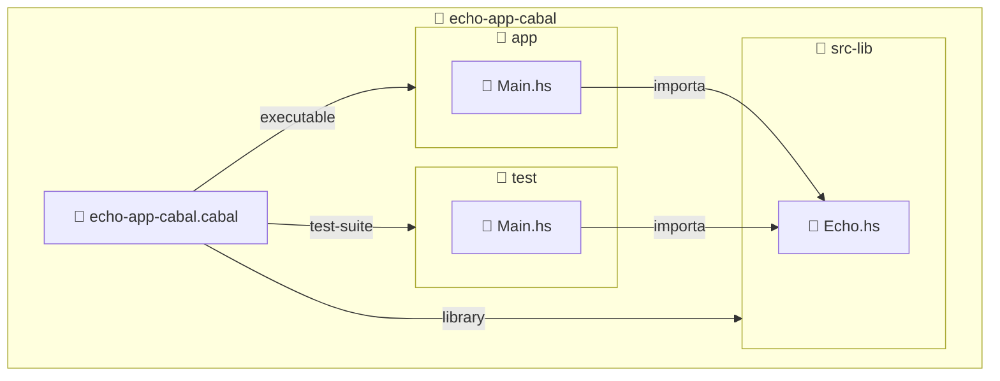

import ReadingTime from '@site/src/components/ReadingTime'
import GitHubRepoLink from '@site/src/components/git/GitHubRepoLink'
import Explanation from '@site/src/components/admonitions/Explanation'
import BoxedTabs from '@site/src/components/cajitas/BoxedTabs'
import TabItem from '@theme/TabItem'
import ScriptSetup from '@site/src/components/ScriptSetup'

<ReadingTime />
<GitHubRepoLink user="r8vnhill" repo="echo-app-cabal" />

En esta lección aprenderás a estructurar un proyecto en **Haskell** con múltiples módulos usando **Cabal**, la herramienta oficial del ecosistema. Veremos cómo separar la lógica principal en una biblioteca reutilizable, cómo escribir un ejecutable que la consuma, y cómo preparar el terreno para incorporar pruebas automatizadas más adelante.

Este enfoque modular cobra especial relevancia si vienes del mundo de las bibliotecas en Kotlin o Scala, donde separar `lib` y `app` es una práctica común. En Haskell, esa misma separación también es posible (y recomendable), ya que permite escribir código más mantenible, reutilizable y preparado para escalar.

A lo largo del camino:

- Construiremos un proyecto llamado `echo-app-cabal` con una estructura clara y bien organizada.
- Implementaremos una función sencilla para imprimir mensajes.
- Veremos cómo pasar argumentos desde la terminal para probar su reutilización.
- Y ajustaremos el archivo `.cabal` para conectar todos los componentes de forma explícita.

Como siempre en este curso, no solo veremos el *cómo*, sino también el *por qué*. Entender la intención detrás de cada decisión de diseño es lo que diferencia a quien simplemente usa herramientas de quien sabe cuándo y cómo aplicarlas con criterio.

初め！

## 🧱 Estructura esperada del proyecto

Antes de modificar el archivo `.cabal`, es importante visualizar cómo estará organizado nuestro proyecto. Lo estructuraremos en tres componentes principales:

- Una **biblioteca** (`src-lib/`) que contendrá la lógica reutilizable.
- Una **aplicación** (`app/`) que actuará como ejecutable principal.
- Un módulo de **pruebas** (`test/`) que verificará el comportamiento de la biblioteca.



:::info Explicación de la estructura del proyecto

Esta estructura separa claramente las responsabilidades:

- `src-lib/` contiene la lógica del programa y se declara como una biblioteca dentro del archivo `.cabal`.
- `app/` contiene el punto de entrada del ejecutable (`Main.hs`), que depende explícitamente de la biblioteca.
- `test/` contiene las pruebas del proyecto, reutilizando también la lógica definida en la biblioteca.
- El archivo `echo-app-cabal.cabal` es el corazón del proyecto: declara los módulos, dependencias y configuraciones de compilación para cada componente.

:::

## 📦 Paso 1: Crear la estructura de carpetas

<BoxedTabs groupId={"os"}>
    <TabItem value="Windows" label="Windows">
        <ScriptSetup moduleName="Initialize-CabalModules" repo="echo-app-cabal" />

        <details>
            <summary>
                Script de inicialización
            </summary>
            
            ```powershell showLineNumbers title="Initialize-CabalModules.psm1"
            function Initialize-CabalModules {
                [CmdletBinding(SupportsShouldProcess)]
                param (
                    [Alias('app', 'executables', 'apps')]
                    [ValidateNotNullOrEmpty()]
                    [string[]]$AppFiles = @('Main.hs'),

                    [Alias('lib', 'modules', 'libs')]
                    [ValidateNotNullOrEmpty()]
                    [string[]]$LibFiles = @('Lib.hs'),

                    [Alias('test', 'tests')]
                    [ValidateNotNullOrEmpty()]
                    [string[]]$TestFiles = @('Main.hs'),

                    [Alias('f')]
                    [switch]$Force,

                    [Alias('ni', 'noPrompt')]
                    [switch]$NoInteractive
                )

                begin {
                    Write-Host "`n🚀 Initializing Haskell modules...`n" -ForegroundColor Cyan
                }

                process {
                    if ($PSCmdlet.ShouldProcess('Initialize Haskell files', 'Creating Haskell files')) {
                        $params = @{
                            Verbose       = $VerbosePreference
                            WhatIf        = $WhatIfPreference
                            Force         = $Force
                            NoInteractive = $NoInteractive
                        }

                        Initialize-FilesInDirectory -Directory 'app' `
                            -Files $AppFiles `
                            -Confirm:$false `
                            @params
                        Initialize-FilesInDirectory -Directory 'src-lib' `
                            -Files $LibFiles  `
                            -Confirm:$false `
                            @params
                        Initialize-FilesInDirectory -Directory 'test' `
                            -Files $TestFiles `
                            -Confirm:$false `
                            @params
                    }
                }

                end {
                    if ($PSCmdlet.ShouldProcess('Haskell files', 'Final confirmation')) {
                        Write-Host "`n✅ Haskell files created successfully." -ForegroundColor Green
                    }
                    if ($WhatIfPreference) {
                        Write-Host "`nℹ️ WhatIf: No files were created." -ForegroundColor Yellow
                    }
                }
            }
            ```

            <Explanation>
                La función `Initialize-CabalModules` es el punto de entrada para generar la estructura inicial de archivos de un proyecto Haskell basado en Cabal. Está pensada para automatizar la creación de los archivos típicos de una aplicación modular: ejecutables (`app`), biblioteca (`src-lib`) y pruebas (`test`).

                #### ¿Qué hace esta función?

                - Declara parámetros para recibir listas de archivos a crear en cada directorio, con valores por defecto (`Main.hs` o `Lib.hs`).
                - Usa `ShouldProcess` para soportar los flags `-WhatIf` y `-Confirm`, integrándose con flujos interactivos o de simulación.
                - Usa aliases convenientes como `-lib`, `-apps` o `-ni` para facilitar su uso desde la terminal.
                - Pasa los parámetros comunes a `Initialize-FilesInDirectory`, que es responsable de crear cada archivo Haskell.
                - Al final del proceso, imprime un mensaje de éxito o un recordatorio si se ejecutó con `-WhatIf`.

                Esta función es una forma segura, reutilizable y flexible de generar la estructura base de un proyecto, permitiendo personalización con poco esfuerzo.
            </Explanation>
        
            <details>
                <summary>
                    Funciones auxiliares
                </summary>

                ```powershell showLineNumbers title="Initialize-CabalModules.psm1"
                function Script:Initialize-FilesInDirectory {
                    [CmdletBinding(SupportsShouldProcess)]
                    param (
                        [Parameter(Mandatory)][string]$Directory,
                        [Parameter(Mandatory)][string[]]$Files,
                        [switch]$Force,
                        [switch]$NoInteractive
                    )
                    foreach ($file in $Files) {
                        $filePath = Join-Path -Path $Directory -ChildPath $file

                        if ($PSCmdlet.ShouldProcess($filePath, 'Create Haskell file')) {
                            New-HaskellFile -FileName $filePath `
                                -Force:$Force `
                                -NoInteractive:$NoInteractive `
                                -Verbose:$VerbosePreference `
                                -WhatIf:$WhatIfPreference `
                                -Confirm:$false
                        }
                    }
                }
                ```

                <Explanation>
                    La función `Initialize-FilesInDirectory` se encarga de crear múltiples archivos Haskell dentro de un directorio específico. Recibe:

                    - Un nombre de directorio (`$Directory`) donde crear los archivos.
                    - Una lista de nombres de archivo (`$Files`), como `"Main.hs"` o `"Lib.hs"`.
                    - Dos modificadores opcionales: `-Force` para sobrescribir archivos existentes sin preguntar, y `-NoInteractive` para evitar solicitudes de confirmación en caso de conflicto.

                    Por cada archivo:
                    - Se construye la ruta completa con `Join-Path`.
                    - Se evalúa si debería proceder la operación con `ShouldProcess`, lo cual respeta los flags `-WhatIf` y `-Confirm`.
                    - Se invoca `New-HaskellFile`, que crea el archivo con el encabezado de módulo correspondiente, manejando la lógica de existencia, sobrescritura y confirmación.

                    Este patrón modular permite que la inicialización de archivos sea clara, reutilizable y segura para flujos interactivos y automatizados.
                </Explanation>

                
                ```powershell showLineNumbers title="Initialize-CabalModules.psm1"
                function Script:Initialize-FilesInDirectory {
                    [CmdletBinding(SupportsShouldProcess)]
                    param (
                        [Parameter(Mandatory)][string]$Directory,
                        [Parameter(Mandatory)][string[]]$Files,
                        [switch]$Force,
                        [switch]$NoInteractive
                    )
                    foreach ($file in $Files) {
                        $filePath = Join-Path -Path $Directory -ChildPath $file

                        if ($PSCmdlet.ShouldProcess($filePath, 'Create Haskell file')) {
                            New-HaskellFile -FileName $filePath `
                                -Force:$Force `
                                -NoInteractive:$NoInteractive `
                                -Verbose:$VerbosePreference `
                                -WhatIf:$WhatIfPreference `
                                -Confirm:$false
                        }
                    }
                }
                ```

                <Explanation>
                    La función `Initialize-FilesInDirectory` automatiza la creación de varios archivos en una carpeta específica.

                    - Recorre una lista de nombres de archivo (`$Files`) y los concatena con el nombre del directorio (`$Directory`) usando `Join-Path`.
                    - Antes de crear cada archivo, evalúa si la operación debe ejecutarse con `ShouldProcess`, lo que habilita soporte para los flags `-WhatIf` y `-Confirm`.
                    - Llama a `New-HaskellFile` con los parámetros adecuados, incluyendo:
                        - `-Force` para sobrescribir sin preguntar.
                        - `-NoInteractive` para evitar confirmaciones manuales.
                        - `-Verbose`, `-WhatIf` y `-Confirm` para respetar las preferencias del usuario.

                    Esta función sirve como un puente entre el usuario y la lógica de creación de archivos, permitiendo ejecutar múltiples inicializaciones de forma controlada y segura.
                </Explanation>

                ```powershell showLineNumbers title="Initialize-CabalModules.psm1"
                function Script:New-HaskellFile {
                    [CmdletBinding(SupportsShouldProcess)]
                    param (
                        [Parameter(Mandatory, Position = 0, ValueFromPipeline)]
                        [ValidateNotNullOrEmpty()]
                        [string]$FileName,

                        [switch]$Force,
                        [switch]$NoInteractive
                    )

                    process {
                        # Required: PowerShell 7.0 or later
                        $finalName = $FileName.EndsWith('.hs') ? $FileName : "$FileName.hs"
                        $fullPath = Resolve-FullPath $finalName
                        $directory = Split-Path $fullPath -Parent

                        if (-not (Test-ShouldOverwrite -Path $fullPath `
                                    -Force:$Force `
                                    -NoInteractive:$NoInteractive)) {
                            Write-Host "⏭️ Skipped: $fullPath" -ForegroundColor Gray
                            return
                        }

                        if ($PSCmdlet.ShouldProcess($fullPath, 'Create Haskell file')) {
                            try {
                                New-DirectoryIfMissing $directory
                                Write-ModuleHeader $fullPath
                                Write-Verbose "✅ Created file: $fullPath"
                            } catch {
                                Write-Error "❌ Failed to create file '$fullPath': $_"
                            }
                        }
                    }
                }
                ```

                <Explanation>
                    La función `New-HaskellFile` crea un archivo de módulo `.hs` de forma segura, evitando sobrescrituras accidentales y admitiendo ejecución interactiva o automatizada.

                    - **Normaliza el nombre**: Si el nombre no termina en `.hs`, lo agrega automáticamente.
                    - **Resuelve la ruta**: Usa `Resolve-FullPath` para obtener la ruta absoluta del archivo.
                    - **Verifica sobrescritura**: Usa `Test-ShouldOverwrite` para decidir si debe continuar, según la existencia del archivo y los flags `-Force` o `-NoInteractive`.
                    - **Crea la carpeta si es necesario**: Llama a `New-DirectoryIfMissing`.
                    - **Genera el contenido base del archivo**: Escribe un encabezado de módulo con `Write-ModuleHeader`.
                    - **Soporta `-WhatIf` y `-Confirm`**: Gracias a `ShouldProcess`, permite simular acciones o confirmar antes de ejecutarlas.

                    Este enfoque modular mejora la legibilidad, mantiene el control en manos del usuario, y facilita integrar esta función en scripts más grandes para inicializar proyectos Haskell.
                </Explanation>
        
                ```powershell showLineNumbers title="Initialize-CabalModules.psm1"
                function Script:Test-ShouldOverwrite(
                    [string]$Path,
                    [switch]$Force,
                    [switch]$NoInteractive
                ) {
                    if (-not (Test-Path $Path) -or $Force) { return $true }
                    if ($NoInteractive) {
                        Write-Host "⚠️ File already exists: $Path. Use -Force to overwrite." `
                            -ForegroundColor DarkYellow
                        return $false
                    }

                    $answer = Read-Host "⚠️ File '$Path' exists. Overwrite? (y/N)"
                    return $answer -eq 'y' -or $answer -eq 'Y'
                }
                ```

                <Explanation>
                    La función `Test-ShouldOverwrite` decide si se debe sobrescribir un archivo existente, controlando de forma flexible tanto flujos automáticos como interactivos.

                    - Si el archivo no existe o se pasó `-Force`, devuelve `true`, permitiendo la creación o sobrescritura sin preguntar.
                    - Si se pasó `-NoInteractive`, se evita la pregunta y se emite un mensaje de advertencia, devolviendo `false`.
                    - En otros casos, se solicita confirmación manual con `Read-Host`, devolviendo `true` solo si se responde "y" o "Y".

                    Esta función es útil para scripts que generan archivos, como módulos de Haskell, y que deben ser cuidadosos al sobrescribir contenido ya existente. También permite que los scripts funcionen bien tanto en entornos automatizados como en sesiones interactivas.
                </Explanation>
        
                ```powershell showLineNumbers title="Initialize-CabalModules.psm1"
                function Script:Write-ModuleHeader([string]$Path) {
                    $module = [IO.Path]::GetFileNameWithoutExtension($Path)
                    $header = "module $module where`n"
                    Set-Content -Path $Path `
                        -Value $header `
                        -Force `
                        -Encoding UTF8 `
                        -Confirm:$false `
                        -WhatIf:$WhatIfPreference
                }
                ```

                <Explanation>
                    La función `Write-ModuleHeader` escribe una cabecera básica de módulo Haskell en un archivo dado.

                    - Primero, se extrae el nombre del módulo a partir del nombre del archivo usando `[IO.Path]::GetFileNameWithoutExtension`.  
                    Por ejemplo, para `Echo.hs`, se obtiene `Echo`.
                    - Luego, se construye una línea de cabecera del estilo `module Echo where` y se guarda como contenido del archivo usando `Set-Content`.
                    - Los flags:
                        - `-Force`: crea o sobreescribe el archivo si ya existe.
                        - `-Encoding UTF8`: asegura una codificación estándar.
                        - `-Confirm:$false` y `-WhatIf:$WhatIfPreference`: respetan los modos de ejecución y simulación del script.

                    Esta función se usa para inicializar rápidamente archivos `.hs` vacíos con una declaración válida de módulo, algo necesario para que GHC o Cabal los reconozcan correctamente.
                </Explanation>
                    
                ```powershell showLineNumbers title="Initialize-CabalModules.psm1"
                function Script:New-DirectoryIfMissing([string]$Path) {
                    if ($Path -and -not (Test-Path $Path)) {
                        New-Item -ItemType Directory `
                            -Path $Path `
                            -Force `
                            -Confirm:$false `
                            -WhatIf:$WhatIfPreference | Out-Null
                        Write-Verbose "✅ Created directory: $Path"
                    }
                }
                ```

                <Explanation>
                    La función `New-DirectoryIfMissing` se asegura de que un directorio exista. Si la ruta especificada no existe aún, lo crea de manera silenciosa y segura:

                    - `Test-Path $Path` verifica si ya existe el directorio.
                    - Si no existe, se invoca `New-Item` para crearlo con:
                    - `-Force` para evitar errores si parte de la ruta ya existe.
                    - `-Confirm:$false` para omitir confirmaciones.
                    - `-WhatIf:$WhatIfPreference` para respetar los modos simulados.

                    Esto permite que el script sea idempotente y compatible con `-WhatIf` y `-Verbose`, evitando errores innecesarios si los directorios ya existen o están por crearse más adelante.
                </Explanation>

                ```powershell showLineNumbers title="Initialize-CabalModules.psm1"
                function Script:Resolve-FullPath([string]$Path) {
                    $resolved = Resolve-Path -Path $Path -ErrorAction SilentlyContinue
                    return $resolved ? $resolved.Path : $Path
                }
                ```

                <Explanation>
                    La función `Resolve-FullPath` intenta obtener la ruta absoluta de un archivo o directorio. Si no puede resolverla (por ejemplo, si el archivo aún no existe), devuelve la ruta original sin producir errores.

                    Esto asegura que las rutas que usamos más adelante en el script sean siempre válidas, ya sea que apunten a archivos existentes o que vayan a crearse más adelante.

                    Se utiliza el operador ternario (`? :`) introducido en PowerShell 7.0+, lo que permite expresar la lógica condicional de forma más concisa.
                </Explanation>
            </details>   
        </details>

        ```powershell showLineNumbers title="Establece tu paquete (desde la terminal)"
        Initialize-CabalModules `
            -LibFiles 'Echo.hs' `
            -NoInteractive `
            -Verbose
        ```
    </TabItem>
    <TabItem value="macOS" label="macOS">
        {/* <Bash /> */}
    </TabItem>
    <TabItem value="Ubuntu/Debian" label="Ubuntu/Debian">
        {/* <Bash /> */}
    </TabItem>
</BoxedTabs>

## 🧪 Paso 1: Crear un módulo de biblioteca

Comenzamos implementando la lógica reutilizable en un módulo llamado `Echo`. Este módulo definirá una función `echoMessage` que imprimirá un mensaje en la terminal.

```haskell title="src-lib/Echo.hs"
module Echo (echoMessage) where

echoMessage :: String -> String
echoMessage msg = msg
```

<Explanation>
    En este paso definimos un **módulo de biblioteca** en `src-lib/Echo.hs`. 

    - Usamos `module Echo (echoMessage) where` para declarar el nombre del módulo y exportar explícitamente la función `echoMessage`.
    - La función tiene el tipo `String -> String`, lo que indica que recibe un mensaje de texto y devuelve el mismo mensaje como resultado.
    
    Este diseño modular nos permite importar `Echo` desde otros componentes del proyecto, como la aplicación principal o las pruebas. Es un patrón común en Haskell para escribir código reutilizable y testable.
</Explanation>

## 🚀 Paso 2: Usar la biblioteca desde el ejecutable

Ya que nuestra función `echoMessage` está definida como parte de un módulo de biblioteca, podemos usarla desde el ejecutable para procesar argumentos de línea de comandos.

```haskell title="app/Main.hs" showLineNumbers
module Main where

import Echo (echoMessage)
import System.Environment (getArgs)

main :: IO ()
main = getArgs >>= mapM_ (putStrLn . echoMessage)
```

<Explanation>
    En este paso creamos el punto de entrada principal del programa (`Main.hs`), que actúa como ejecutable.

    - Usamos `getArgs` para obtener los argumentos pasados por la terminal.
    - Aplicamos `echoMessage` a cada uno usando `mapM_`, que ejecuta una acción (`putStrLn`) sobre cada elemento de la lista, descartando el resultado.
    - La expresión `(putStrLn . echoMessage)` aplica la función `echoMessage` a cada argumento y luego imprime el resultado.
</Explanation>

Esta forma es idiomática en Haskell, compacta y expresiva, y muestra cómo una biblioteca puede ser reutilizada desde un módulo ejecutable.
## ⚙️ Paso 3: Ajustar el archivo `.cabal`

Ahora configuraremos el archivo `echo-app-cabal.cabal` para que el ejecutable y la suite de pruebas puedan reutilizar la biblioteca definida en `src-lib`.

<BoxedTabs>
    <TabItem label="Código esencial" value="Código esencial">
        ```haskell showLineNumbers title="echo-app-cabal.cabal"
        -- Nombre del proyecto
        name:               echo-app-cabal

        -- Configuración de la biblioteca
        library
            exposed-modules:  Echo
            hs-source-dirs:   src-lib

        -- Ejecutable que usa la biblioteca
        executable echo-app-cabal
            main-is:          Main.hs
            hs-source-dirs:   app
            build-depends:    echo-app-cabal

        -- Suite de pruebas que también depende de la biblioteca
        test-suite echo-app-cabal-test
            main-is:          Main.hs
            hs-source-dirs:   test
            type:             exitcode-stdio-1.0
            build-depends:    echo-app-cabal
        ```
    </TabItem>
    <TabItem label="Código completo" value="Código completo">
        ```haskell showLineNumbers title="echo-app-cabal.cabal"
        cabal-version:      3.0
        name:               echo-app-cabal
        version:            0.1.0.0
        homepage:           https://dibs.pages.dev
        license:            BSD-2-Clause
        license-file:       LICENSE
        author:             r8vnhill
        maintainer:         reachme@ravenhill.cl
        build-type:         Simple
        extra-doc-files:    CHANGELOG.md

        common warnings
            ghc-options:      -Wall

        library
            import:           warnings
            exposed-modules:  Echo
            build-depends:    base ^>=4.17.2.1
            hs-source-dirs:   src-lib
            default-language: GHC2021

        executable echo-app-cabal
            import:           warnings
            main-is:          Main.hs
            hs-source-dirs:   app
            build-depends:
            base ^>=4.17.2.1,
            echo-app-cabal
            default-language: GHC2021

        test-suite echo-app-cabal-test
            import:           warnings
            main-is:          Main.hs
            hs-source-dirs:   test
            type:             exitcode-stdio-1.0
            build-depends:
            base ^>=4.17.2.1,
            echo-app-cabal
            default-language: GHC2021
        ```
    </TabItem>
</BoxedTabs>

<Explanation>
    El archivo `.cabal` describe cómo se construyen y conectan los distintos componentes del proyecto:

    - En la sección `library`, declaramos que el módulo `Echo` estará disponible para otros componentes, y especificamos que su código fuente vive en `src-lib/`.
    - En `executable`, indicamos que `Main.hs` es el punto de entrada de la app, que está en `app/`, y que este módulo depende de la biblioteca del proyecto.
    - En `test-suite`, seguimos una estructura similar para habilitar pruebas que también pueden usar el código de la biblioteca.
    - Usamos `import: warnings` para aplicar opciones comunes como `-Wall` a todos los componentes, favoreciendo advertencias útiles durante el desarrollo.
</Explanation>

Esta configuración modular refleja buenas prácticas de diseño en Haskell: separar responsabilidades, promover la reutilización y preparar el terreno para escalar el proyecto con facilidad.

## ▶️ Paso 4: Ejecutar el proyecto

Con la biblioteca, el ejecutable y la configuración listos, ya podemos compilar y lanzar el programa desde la raíz del proyecto.

Ejecuta el siguiente comando:

```bash showLineNumbers title=""
cabal run echo-app-cabal -- "Hi Barbie!" "Hi Ken!" "Do you guys ever think about dying?"
```

La salida debería ser algo como:

```plaintext
Hi Barbie!
Hi Ken!
Do you guys ever think about dying?
```

<Explanation>
    Usamos `cabal run` seguido del nombre del ejecutable (`echo-app-cabal`) y los argumentos que queremos pasar entre comillas.  
    Estos argumentos son capturados por la función `getArgs` en `Main.hs`, lo que permite que el programa procese entradas dinámicas desde la línea de comandos.

    Luego, cada argumento se transforma con la función `echoMessage` definida en la biblioteca y se imprime por separado, gracias al uso de `mapM_`.
</Explanation>

👉 Este paso confirma que el ejecutable está correctamente conectado a la biblioteca y que puede recibir entradas externas, lo que lo hace más interactivo y reutilizable.

## 🎯 Conclusiones

Dividir un proyecto Haskell en múltiples módulos no es solo una cuestión de orden: es una forma de expresar con claridad qué partes del código son reutilizables, cuáles se ejecutan como aplicación y cuáles prueban su correcto funcionamiento. Esta separación de responsabilidades es clave al diseñar bibliotecas, y en esta lección dimos nuestros primeros pasos en esa dirección.

Aprendimos a usar `cabal init` para crear un proyecto bien estructurado, a definir una biblioteca simple con una función exportada, y a configurar el ejecutable para que la consuma. También comprendimos cómo ajustar el archivo `.cabal` para reflejar estas relaciones y cómo ejecutar el programa con argumentos reales desde la terminal.

Este ejercicio no solo nos enseñó herramientas, sino también una forma de pensar: **crear software reutilizable, modular y preparado para crecer**.

### 🔑 Puntos clave

- Crear un proyecto con `cabal init` permite estructurar desde el inicio la biblioteca, el ejecutable y las pruebas.
- Definir módulos separados facilita la reutilización y el mantenimiento del código.
- El archivo `.cabal` actúa como contrato entre los componentes: describe qué se construye, desde dónde y con qué dependencias.
- La función `getArgs` permite capturar argumentos desde la terminal, y `forM_` es una forma idiomática de recorrerlos.
- Tanto la app como los tests pueden importar lógica común desde la biblioteca.

### 🧰 ¿Qué nos llevamos?

Esta lección nos mostró que un proyecto no comienza cuando escribimos código, sino cuando tomamos decisiones sobre su estructura.  
Separar la lógica reutilizable en una biblioteca, definir un ejecutable claro y configurar correctamente los archivos del proyecto es lo que transforma un conjunto de archivos en una base sólida para construir software real.

Pero también nos llevamos algo más sutil: que **la forma en que organizamos nuestro código influye en cómo pensamos nuestros programas**.  
Cuando estructuramos bien, podemos escribir menos y lograr más. Podemos componer, reutilizar y probar.  
Y cuando eso ocurre, lo que estamos creando no es solo un programa... es una biblioteca que puede vivir más allá del proyecto original.

## 📖 Referencias

### 🔥 Recomendadas

- 🌐 Structure of a Haskell project—HaskellWiki. (s. f.). Recuperado 5 de abril de 2025, de https://wiki.haskell.org/Structure_of_a_Haskell_project

{/* ### 🔹 Adicionales */}
