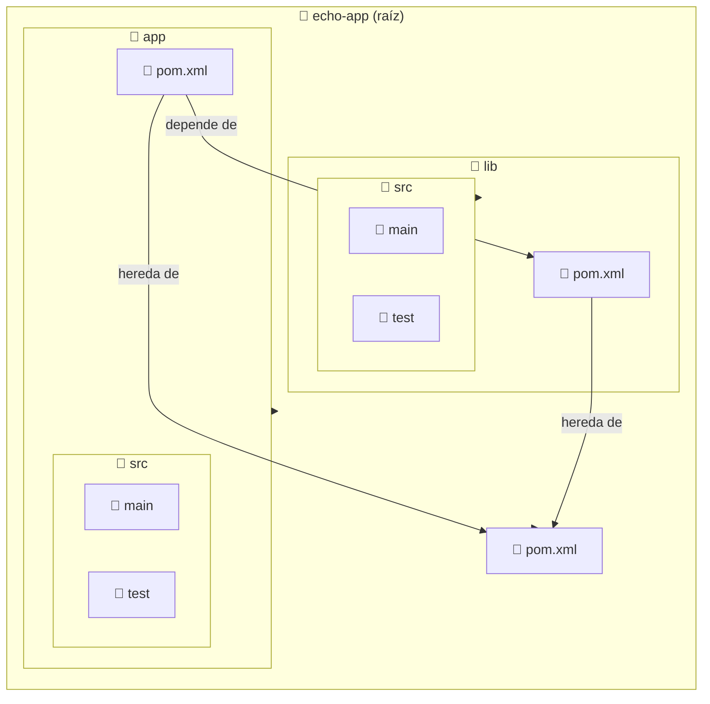

import ReadingTime from '@site/src/components/ReadingTime'
import { ProCons, Pros, Cons } from '@site/src/components/cajitas/ProCons'
import References from '@site/src/components/ReferencesComponent'
import Tabs from '@theme/Tabs'
import TabItem from '@theme/TabItem'
import Exercise from '@site/src/components/exercise/Exercise'
import Solution from '@site/src/components/exercise/Solution'
import Hint from '@site/src/components/exercise/Hint'
import Definition from '@site/src/components/Definition'
import Corollary from '@site/src/components/Corollary'
import GithubRepoLink from '@site/src/components/git/GithubRepoLink'
import { LanguageCard, PoetryCard } from '@site/src/components/cards/LanguageCard'
import Explanation from '@site/src/components/admonitions/Explanation'
import RepoClone from '@site/src/components/admonitions/RepoClone'
import BoxedTabs from '@site/src/components/cajitas/BoxedTabs'

<ReadingTime />
<GithubRepoLink user="r8vnhill" repo="echo-app-maven" />

A medida que los proyectos crecen, mantener todo el código en un solo módulo se vuelve poco práctico. La solución está en adoptar una **arquitectura modular**, que permita dividir el sistema en partes más pequeñas, reutilizables y mantenibles. Maven, una de las herramientas más populares del ecosistema Java, nos permite implementar esta arquitectura de forma sencilla mediante el uso de proyectos multi-módulo.

En esta lección aprenderás a transformar un proyecto básico en una estructura modular con Maven. Verás cómo declarar módulos, reutilizar código entre ellos y mantener una organización clara y escalable. Esta es una práctica esencial cuando desarrollamos **librerías de software** que deben ser fáciles de mantener, probar y extender.

Partiremos de un proyecto simple y lo dividiremos en dos módulos:  
- `lib`, que contiene utilidades reutilizables, y  
- `app`, la aplicación principal que depende de `lib`.

Verás cómo configurar los `pom.xml` para conectar estos módulos entre sí, cómo compilar y ejecutar la aplicación desde la línea de comandos, y cómo entender la jerarquía de un proyecto multi-módulo.

Todo esto te dará una base sólida para diseñar bibliotecas profesionales, manteniendo una estructura clara y preparada para escalar.

## 🧱 Paso 1: Declarar los módulos del proyecto

Ahora que ya tienes un proyecto Maven básico, es momento de escalar su estructura dividiéndolo en **módulos independientes**.  
Esto te permitirá separar responsabilidades, reutilizar código y preparar tu proyecto para crecer de forma limpia y organizada.

Para comenzar, modifica el archivo `pom.xml` en la raíz del proyecto para declarar los módulos que lo compondrán: `lib` (una biblioteca reutilizable) y `app` (la aplicación principal que dependerá de `lib`).

```xml showLineNumbers title="pom.xml (raíz)"
<project xmlns="http://maven.apache.org/POM/4.0.0"
         xmlns:xsi="http://www.w3.org/2001/XMLSchema-instance"
         xsi:schemaLocation="http://maven.apache.org/POM/4.0.0
         https://maven.apache.org/maven-v4_0_0.xsd">
    <modelVersion>4.0.0</modelVersion>

    <groupId>com.github.username</groupId>
    <artifactId>echo-app-maven</artifactId>
    <packaging>pom</packaging>
    <version>1.0.0</version>
    <name>echo-app-maven</name>

    <modules>
        <module>lib</module>
        <module>app</module>
    </modules>
</project>
```

<Explanation>
    - **`<packaging>pom</packaging>`**: Indica que este proyecto no produce un artefacto (como un `.jar`), sino que actúa como **contenedor** de otros módulos.
    - **`<modules>`**: Enumera los submódulos del proyecto. Cada entrada debe coincidir con el nombre de una carpeta existente dentro del directorio raíz.
</Explanation>

Esta declaración permite a Maven entender cómo se organiza tu proyecto y en qué orden deben compilarse los módulos.

## 📦 Paso 2: Crear un módulo de biblioteca

Comenzaremos creando el primer submódulo de nuestro proyecto: una biblioteca llamada `lib`.  
Este módulo contendrá funcionalidades reutilizables que luego serán utilizadas por la aplicación principal.

### 📄 Crear el `pom.xml` del módulo `lib`

Dentro de la carpeta `lib/`, crea un archivo `pom.xml` con el siguiente contenido:

```xml showLineNumbers title="lib/pom.xml"
<project xmlns="http://maven.apache.org/POM/4.0.0"
         xmlns:xsi="http://www.w3.org/2001/XMLSchema-instance"
         xsi:schemaLocation="http://maven.apache.org/POM/4.0.0
         http://maven.apache.org/xsd/maven-4.0.0.xsd">
    <modelVersion>4.0.0</modelVersion>

    <parent>
        <groupId>com.github.username</groupId>
        <artifactId>echo-app-maven</artifactId>
        <version>1.0.0</version>
    </parent>

    <artifactId>lib</artifactId>
</project>
```

<Explanation>
    - **`<parent>`**: Este bloque indica que el módulo `lib` **hereda configuración** del proyecto raíz, incluyendo el `groupId`, las propiedades compartidas y futuras configuraciones comunes.
    - **`<artifactId>lib</artifactId>`**: Define el nombre del artefacto generado para este módulo.
</Explanation>

### 📢 Crear una utilidad en el módulo `lib`

Ahora agregaremos una clase simple con una función que el módulo `app` podrá utilizar para mostrar mensajes.

```java showLineNumbers title="lib/src/main/java/com/github/username/echo/EchoUtils.java"
package com.github.username.echo;

public class EchoUtils {
    public static String echoMessage(String message) {
        return message;
    }
}
```

<Explanation>
    Esta clase representa una **utilidad básica** que simplemente devuelve el mensaje recibido.  
    La función `echoMessage` es **estática** (`static`) para que podamos llamarla sin necesidad de crear una instancia de `EchoUtils`.

    Veremos los métodos estáticos más adelante en detalle, pero por ahora basta con saber que los usamos en este caso porque **no necesitamos guardar ni modificar ningún estado interno**: solo queremos agrupar una operación que es pura y reutilizable.

    Este tipo de diseño es común en bibliotecas que exponen funciones utilitarias sencillas.
</Explanation>

## 🚀 Paso 3: Crear el módulo de aplicación

Después de definir el módulo `lib`, es momento de crear el módulo `app`, el cual será responsable de la lógica principal de la aplicación y **dependerá** del módulo `lib`.

### 📄 Crear el `pom.xml` del módulo `app`

Crea un archivo llamado `pom.xml` dentro de la carpeta `app` con el siguiente contenido:

```xml showLineNumbers title="app/pom.xml"
<project xmlns="http://maven.apache.org/POM/4.0.0"
         xmlns:xsi="http://www.w3.org/2001/XMLSchema-instance"
         xsi:schemaLocation="http://maven.apache.org/POM/4.0.0
         http://maven.apache.org/xsd/maven-4.0.0.xsd">
    <modelVersion>4.0.0</modelVersion>

    <parent>
        <groupId>com.github.username</groupId>
        <artifactId>echo-app-maven</artifactId>
        <version>1.0.0</version>
    </parent>

    <artifactId>app</artifactId>

    <dependencies>
        <dependency>
            <groupId>com.github.username</groupId>
            <artifactId>lib</artifactId>
            <version>1.0.0</version>
        </dependency>
    </dependencies>
</project>
```

<Explanation>
    Este archivo define al módulo `app` como un subproyecto del proyecto raíz `echo-app-maven`.  

    - El bloque `<parent>` indica que este módulo **hereda configuración** del `pom.xml` raíz. Esto incluye propiedades comunes, repositorios y posibles versiones definidas en un BOM.
    - Con `<artifactId>app</artifactId>`, damos un nombre único a este módulo dentro del proyecto.
    - En `<dependencies>`, declaramos explícitamente que `app` **depende del módulo `lib`**, permitiéndole reutilizar sus clases y funciones.
</Explanation>

### 🧪 Crear la clase principal de la aplicación

Ahora vamos a crear la clase `App`, que servirá como **punto de entrada** del programa. Esta clase utilizará el módulo `lib` para imprimir cada argumento recibido.

```java showLineNumbers title="app/src/main/java/com/github/username/App.java"
package com.github.username;

import com.github.username.echo.EchoUtils;

public class App {
    public static void main(String[] args) {
        for (String arg : args) {
            System.out.println(EchoUtils.echoMessage(arg));
        }
    }
}
```

<Explanation>
    Esta clase representa el **inicio del programa**. Su función `main` recorre los argumentos pasados por consola (`args`) y, por cada uno, llama al método `echoMessage` de `EchoUtils`.

    - **`import com.github.username.echo.EchoUtils;`**: Importamos la clase del módulo `lib` que creamos previamente.
    - **`main(String[] args)`**: Es el punto de entrada estándar en aplicaciones Java.
    - **`for (String arg : args)`**: Usamos un ciclo `for-each` para recorrer los argumentos.
    - **`EchoUtils.echoMessage(arg)`**: Delegamos la lógica al módulo `lib`.
</Explanation>

## ▶️ Paso 4: Compilar y ejecutar la aplicación

Ahora que tienes definidos ambos módulos (`lib` y `app`), es momento de compilar el proyecto completo y ejecutar la aplicación principal.

<BoxedTabs groupId={"os"}>
    <TabItem value="Windows" label="Windows">
        ```powershell
        mvn clean install && `
        mvn -pl app 'exec:java' `
            '-Dexec.mainClass=com.github.username.App' `
            '-Dexec.args=Ryugamine Celty Shizuo'
        ```
    </TabItem>
    <TabItem value="Linux/macOS" label="Linux/macOS">
        ```bash
        mvn clean install && \
        mvn -pl app exec:java \
            -Dexec.mainClass=com.github.username.App \
            -Dexec.args="Ryugamine Celty Shizuo"
        ```
    </TabItem>
</BoxedTabs>

<Explanation>
    Este comando hace dos cosas:

    - **`mvn clean install`**: Limpia los archivos de compilación anteriores (`clean`) y compila e instala los módulos localmente (`install`), respetando el orden de dependencias: primero `lib`, luego `app`.
    - **`mvn -pl app exec:java`**: Ejecuta solo el módulo `app`, usando el plugin `exec-maven-plugin`. Los argumentos adicionales indican:
        - `-Dexec.mainClass`: la clase principal a ejecutar.
        - `-Dexec.args`: los argumentos pasados por línea de comandos.

    El módulo `app` imprimirá cada palabra recibida como argumento, gracias al método `echoMessage` definido en el módulo `lib`.

    En este caso usamos `"Ryugamine Celty Shizuo"` como entrada para rendir homenaje a *Durarara!!*.
</Explanation>

### 💬 Salida esperada

```plaintext
[INFO] Scanning for projects...
[INFO]
[INFO] --------------------------< com.github.username:app >--------------------------
[INFO] Building app 1.0.0
[INFO]   from pom.xml
[INFO] --------------------------------[ jar ]---------------------------------
[INFO]
[INFO] --- exec:3.5.0:java (default-cli) @ app ---
Ryugamine
Celty
Shizuo
[INFO] ------------------------------------------------------------------------
[INFO] BUILD SUCCESS
[INFO] ------------------------------------------------------------------------
[INFO] Total time:  0.798 s
[INFO] Finished at: 2025-04-06T17:42:03-04:00
[INFO] ------------------------------------------------------------------------
```

Como ves, Maven genera **mucha información de contexto durante la ejecución**, no solo la salida de tu programa.  
Esto incluye detalles sobre la compilación, ejecución de plugins y tiempos de construcción.  
**Presta atención a la sección donde se imprimen tus argumentos**: es ahí donde ocurre la lógica de tu aplicación.

## 🔍 Visión general de un proyecto multi-módulo    



:::info Estructura del Proyecto

- **📂 `echo-app (root)`**: Contiene el POM padre (`pom.xml`), que define la estructura general del proyecto y centraliza configuraciones comunes.
- **📂 `app` (módulo de aplicación)**: Implementa la lógica principal de la aplicación y depende del módulo `lib`.
- **📂 `lib` (módulo de biblioteca)**: Incluye componentes reutilizables que pueden ser consumidos por `app` y otros módulos o proyectos.

:::

## 📦 Herencia vs. Dependencias en Proyectos Multi-Módulo

En Maven, un módulo puede **heredar configuraciones comunes** desde el POM raíz (POM padre) usando la etiqueta `<parent>`. Esto permite compartir elementos como versiones de plugins, propiedades globales, perfiles de compilación o configuración de repositorios.

Sin embargo, **esta herencia no incluye las dependencias funcionales**. Cada módulo debe declarar de forma **explícita** sus propias dependencias en la sección `<dependencies>`. Esto garantiza que cada módulo:

- Exprese de forma precisa qué necesita para compilarse.
- Se mantenga **modular y reutilizable**, sin acoplamientos implícitos.
- Pueda ser compilado o probado de forma aislada si es necesario.

Esta separación clara entre lo que se **hereda** (configuración común) y lo que se **declara** (dependencias funcionales) es esencial para mantener un diseño limpio, escalable y fácil de mantener en proyectos multi-módulo.

## 🎯 Conclusiones

En esta lección construimos paso a paso un proyecto modular utilizando Maven, con un enfoque claro en la **separación de responsabilidades**, la **reutilización de código** y la **escalabilidad**. Aprendimos a:

- Estructurar un proyecto usando un `pom.xml` raíz que actúa como coordinador.
- Crear módulos independientes con configuraciones heredadas y dependencias explícitas.
- Ejecutar aplicaciones desde la línea de comandos usando `exec-maven-plugin`.

Este tipo de arquitectura es especialmente útil cuando construimos bibliotecas de software que crecerán con el tiempo o cuando trabajamos en equipos donde la claridad y la mantenibilidad son fundamentales.

### 🔑 Puntos clave

- **Multi-módulos en Maven**: Organizar el proyecto en módulos independientes ayuda a mantener un diseño limpio y escalable.
- **POM raíz como coordinador**: Centraliza configuraciones comunes y define la estructura del proyecto.
- **Herencia vs. dependencias**: Heredamos configuración con `<parent>`, pero las dependencias funcionales deben declararse explícitamente.
- **Compilación jerárquica**: Maven respeta el orden de los módulos y sus relaciones al compilar.
- **Ejecución modular**: Podemos ejecutar un solo módulo (`app`) mientras reutilizamos el código de otros (`lib`).

### 🧰 ¿Qué nos llevamos?

Más allá de comandos y configuraciones, lo que realmente nos llevamos es una forma de **pensar modularmente**.

Aprendimos que dividir un proyecto no es solo cuestión de organización, sino una decisión que afecta la mantenibilidad, la claridad y la colaboración. Un proyecto modular permite que cada parte evolucione de forma independiente, facilita el testing, y reduce el riesgo de efectos colaterales inesperados.

También vimos cómo Maven, a pesar de su rigidez inicial, nos ofrece una base sólida y predecible para construir sistemas robustos.  
Y sobre todo, dimos el primer paso hacia una forma de desarrollar **bibliotecas profesionales**, preparadas para crecer, ser compartidas y mantenerse en el tiempo.

Como en toda buena arquitectura, lo invisible —la estructura— es lo que sostiene todo lo demás.

## 📖 Referencias

### 🔥 Recomendadas

- 📚 Multi-module Projects. (2015). En R. Bharathan, Apache Maven cookbook: Over 90 hands-on recipes to successfully build and automate development life cycle tasks following Maven conventions and best practices (1st ed, pp. 177–195). Packt Publishing.

### 🔹 Adicionales

- 🌐 Chapter 6. A Multi-Module Project. (s. f.). TheNEXUS. Recuperado 25 de marzo de 2025, de http://www.sonatype.org/nexus/
- 🌐 Guide to Working with Multiple Subprojects in Maven 4 – Maven. (s. f.). Recuperado 19 de marzo de 2025, de https://maven.apache.org/guides/mini/guide-multiple-subprojects-4.html
- 🌐 Multi-Module Project with Maven | Baeldung. (2018, octubre 14). https://www.baeldung.com/maven-multi-module
