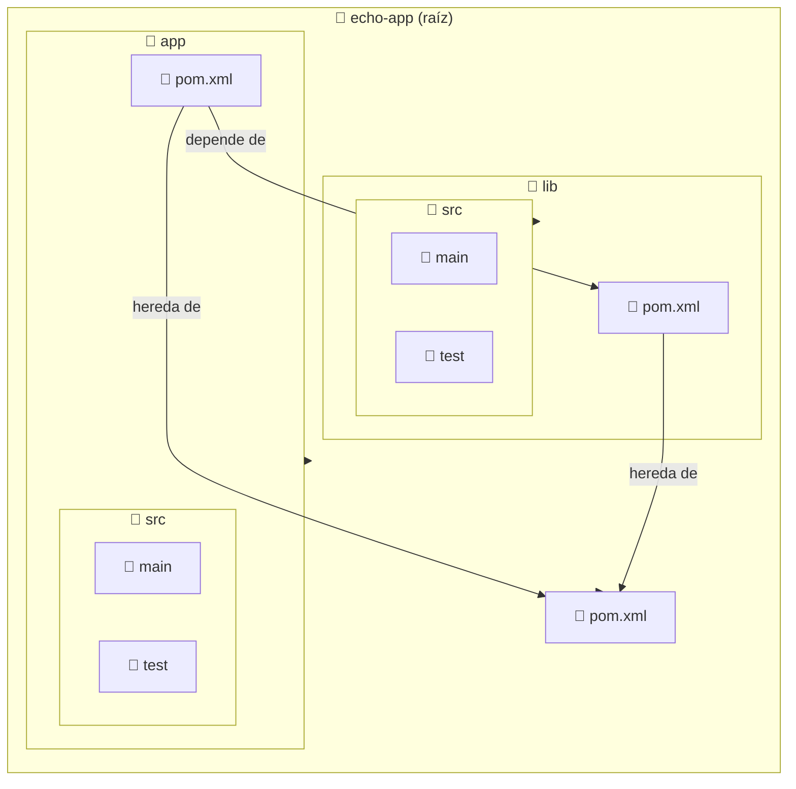

import ReadingTime from '@site/src/components/ReadingTime'
import { ProCons, Pros, Cons } from '@site/src/components/cajitas/ProCons'
import References from '@site/src/components/ReferencesComponent'
import Tabs from '@theme/Tabs'
import TabItem from '@theme/TabItem'
import Exercise from '@site/src/components/exercise/Exercise'
import Solution from '@site/src/components/exercise/Solution'
import Hint from '@site/src/components/exercise/Hint'
import Definition from '@site/src/components/Definition'
import Corollary from '@site/src/components/Corollary'
import GithubRepoLink from '@site/src/components/GithubRepoLink'
import { LanguageCard, PoetryCard } from '@site/src/components/cards/LanguageCard'
import Explanation from '@site/src/components/admonitions/Explanation'
import RepoClone from '@site/src/components/admonitions/RepoClone'
import BoxedTabs from '@site/src/components/cajitas/BoxedTabs'

<ReadingTime />
<GithubRepoLink user="r8vnhill" repo="echo-app-maven" />

Cuando trabajamos con **Maven** en proyectos que contienen múltiples módulos, es fundamental configurar correctamente el archivo `pom.xml` del proyecto raíz. Este archivo define la estructura general del proyecto, facilita la organización de los módulos y promueve la reutilización del código.

En esta lección aprenderás a configurar un proyecto **multi-módulo** en Maven, a comprender el rol de las **dependencias internas** entre módulos y a gestionar versiones de manera centralizada mediante un **BOM (Bill of Materials)**.

Estas prácticas son fundamentales para crear bibliotecas de software modulares, mantenibles y reutilizables.

## 🛠️ `pom.xml` en proyectos multi-módulo

El archivo `pom.xml` es el núcleo de configuración de Maven. En un **proyecto multi-módulo**, el `pom.xml` ubicado en el directorio raíz actúa como **POM padre** y define la estructura general del proyecto. Este archivo permite centralizar configuraciones y coordinar los distintos submódulos, que heredan su configuración para mantener coherencia y reducir duplicación.

En nuestro caso, comenzamos con un `pom.xml` sencillo en el directorio raíz:

```xml showLineNumbers title="pom.xml (proyecto raíz)"
<project xmlns="http://maven.apache.org/POM/4.0.0"
         xmlns:xsi="http://www.w3.org/2001/XMLSchema-instance"
         xsi:schemaLocation="http://maven.apache.org/POM/4.0.0
         http://maven.apache.org/maven-v4_0_0.xsd">
    <modelVersion>4.0.0</modelVersion>

    <groupId>com.github.username</groupId>
    <artifactId>echo-app-maven</artifactId>
    <packaging>pom</packaging>
    <version>1.0.0</version>
    <name>echo-app-maven</name>

    <modules>
        <module>app</module>
        <module>lib</module>
    </modules>
</project>
```

<Explanation>
    - **`<packaging>pom</packaging>`** → Indica que este módulo es un contenedor y no genera un artefacto como `.jar` o `.war`.
    - **`<modules>`** → Lista los submódulos del proyecto. Cada entrada corresponde a un directorio relativo dentro del proyecto raíz.
    - **Herencia de configuración** → Los submódulos heredan configuraciones comunes del POM principal, lo que simplifica la gestión y evita repeticiones.
    - **Compilación en cascada** → Al ejecutar `mvn install` desde el directorio raíz, Maven compila los módulos en el orden indicado, respetando sus dependencias internas.
</Explanation>

## 📂 Proyectos Multi-Módulo en Maven

En proyectos de gran tamaño, concentrar todo el código en un único módulo puede volverse poco escalable, difícil de mantener y propenso a errores. Dividir el código en múltiples módulos permite una mejor organización, facilita la reutilización y mejora la mantenibilidad general del sistema.

A diferencia de otros sistemas de construcción, Maven adopta un enfoque jerárquico y declarativo para estructurar proyectos:

- **Cada módulo tiene su propio `pom.xml`**, donde define sus dependencias, configuraciones y artefactos de forma independiente.
- **Los módulos heredan configuración del POM padre**, lo que fomenta la consistencia entre módulos y evita la repetición. Sin embargo, pueden sobrescribir o extender esa configuración si lo necesitan.

### 🔍 Visión general de un proyecto multi-módulo



:::info Estructura del Proyecto

- **📂 `echo-app (root)`**: Contiene el POM padre (`pom.xml`), que define la estructura general del proyecto y centraliza configuraciones comunes.
- **📂 `app` (módulo de aplicación)**: Implementa la lógica principal de la aplicación y depende del módulo `lib`.
- **📂 `lib` (módulo de biblioteca)**: Incluye componentes reutilizables que pueden ser consumidos por `app` y otros módulos o proyectos.

:::

Cada submódulo tiene su propio archivo `pom.xml`. Por ejemplo, el módulo `app` podría definirse así:

```xml showLineNumbers title="app/pom.xml"
<project xmlns="http://maven.apache.org/POM/4.0.0"
         xmlns:xsi="http://www.w3.org/2001/XMLSchema-instance"
         xsi:schemaLocation="http://maven.apache.org/POM/4.0.0
         http://maven.apache.org/xsd/maven-4.0.0.xsd">
    <modelVersion>4.0.0</modelVersion>

    <parent>
        <groupId>com.github.username</groupId>
        <artifactId>echo-app-maven</artifactId>
        <version>1.0.0</version>
    </parent>

    <artifactId>app</artifactId>

    <dependencies>
        <dependency>
            <groupId>com.github.username</groupId>
            <artifactId>lib</artifactId>
            <version>1.0.0</version>
        </dependency>
    </dependencies>
</project>
```

<Explanation>
    - **`<parent>`** → Indica que este módulo hereda configuraciones del `pom.xml` raíz. Esto evita duplicar información como versiones de plugins, propiedades comunes o configuración de repositorios.
    - **`<artifactId>app</artifactId>`** → Define el identificador del módulo, que se utiliza en el build y para la publicación de artefactos.
    - **`<dependencies>`** → Declara las dependencias requeridas por el módulo:
        - En este caso, `app` depende del módulo `lib`, por lo que se agrega como una dependencia explícita.
        - Ambos módulos comparten el mismo `groupId` y versión porque forman parte del mismo proyecto multi-módulo.
    - **Gestión de versiones** → Gracias a la herencia, este módulo puede omitir configuraciones redundantes, como la versión de dependencias internas o plugins.
    - **Compilación jerárquica** → Al ejecutar `mvn install` desde el proyecto raíz, Maven compilará primero `lib` (ya que `app` lo necesita) y luego `app`, respetando el orden de declaración en `<modules>`.
</Explanation>

## 🏗️ Gestión de Dependencias en Maven

### 📦 Herencia vs. Dependencias en Proyectos Multi-Módulo

En Maven, un módulo puede **heredar configuraciones comunes** desde el POM raíz (POM padre) usando la etiqueta `<parent>`. Esto permite compartir elementos como versiones de plugins, propiedades globales, perfiles de compilación o configuración de repositorios.

Sin embargo, **esta herencia no incluye las dependencias funcionales**. Cada módulo debe declarar de forma **explícita** sus propias dependencias en la sección `<dependencies>`. Esto garantiza que cada módulo:

- Exprese de forma precisa qué necesita para compilarse.
- Se mantenga **modular y reutilizable**, sin acoplamientos implícitos.
- Pueda ser compilado o probado de forma aislada si es necesario.

Esta separación clara entre lo que se **hereda** (configuración común) y lo que se **declara** (dependencias funcionales) es esencial para mantener un diseño limpio, escalable y fácil de mantener en proyectos multi-módulo.

### 🔥 Bill of Materials (BOM)

En proyectos multi-módulo, mantener versiones consistentes entre dependencias puede ser un reto. Para resolverlo, Maven permite centralizar la gestión de versiones usando un **BOM (Bill of Materials)**, definido dentro del bloque `<dependencyManagement>` del `pom.xml` raíz.

Este enfoque tiene múltiples beneficios:

- Asegura **coherencia de versiones** en todo el proyecto.
- Evita la repetición de versiones en cada submódulo.
- Reduce el riesgo de errores por versiones incompatibles.

#### 🧩 Ejemplo de BOM en el `pom.xml` raíz:

<BoxedTabs>
    <TabItem label={"Código esencial"} value={"Código esencial"}>
        ```xml showLineNumbers title="pom.xml (raíz)"
        <dependencyManagement>
            <dependencies>
                <dependency>
                    <groupId>org.junit.jupiter</groupId>
                    <artifactId>junit-jupiter-api</artifactId>
                    <version>5.13.0-M2</version>
                </dependency>
            </dependencies>
        </dependencyManagement>
        ```
    </TabItem>
    <TabItem label={"Código completo"} value={"Código completo"}>
        ```xml showLineNumbers title="pom.xml (raíz)"
        <project xmlns="http://maven.apache.org/POM/4.0.0"
                xmlns:xsi="http://www.w3.org/2001/XMLSchema-instance"
                xsi:schemaLocation="http://maven.apache.org/POM/4.0.0
                https://maven.apache.org/maven-v4_0_0.xsd">
            <modelVersion>4.0.0</modelVersion>

            <groupId>com.github.username</groupId>
            <artifactId>echo-app-maven</artifactId>
            <packaging>pom</packaging>
            <version>1.0.0</version>
            <name>echo-app-maven</name>

            <modules>
                <module>lib</module>
                <module>app</module>
            </modules>
            <dependencyManagement>
                <dependencies>
                    <dependency>
                        <groupId>org.junit.jupiter</groupId>
                        <artifactId>junit-jupiter</artifactId>
                        <version>5.13.0-M2</version>
                    </dependency>
                </dependencies>
            </dependencyManagement>
        </project>
        ```
    </TabItem>
</BoxedTabs>

<Explanation>
    - **`<dependencyManagement>`** define un conjunto de dependencias que podrán ser utilizadas por los submódulos sin necesidad de repetir versiones.
        - Dentro de él, el bloque **`<dependencies>`** actúa como una lista contenedora.
            - Cada entrada **`<dependency>`** especifica un artefacto y su versión.
                - **Esto *no* agrega automáticamente esas dependencias a ningún módulo**, solo les ofrece una versión estándar para cuando las necesiten.
</Explanation>

#### ✅ Cómo se usa en un módulo:

<BoxedTabs>
    <TabItem label={"Código esencial"} value={"Código esencial"}>
        ```xml showLineNumbers title="lib/pom.xml"
        <parent>
            <groupId>com.github.username</groupId>
            <artifactId>echo-app-maven</artifactId>
            <version>1.0.0</version>
        </parent>
        <!-- ... -->
        <dependencies>
            <dependency>
                <groupId>org.junit.jupiter</groupId>
                <artifactId>junit-jupiter</artifactId>
            </dependency>
        </dependencies>
        ```
    </TabItem>
    <TabItem label={"Código completo"} value={"Código completo"}>
        ```xml showLineNumbers title="lib/pom.xml"
        <project xmlns="http://maven.apache.org/POM/4.0.0"
                xmlns:xsi="http://www.w3.org/2001/XMLSchema-instance"
                xsi:schemaLocation="http://maven.apache.org/POM/4.0.0 http://maven.apache.org/xsd/maven-4.0.0.xsd">
            <modelVersion>4.0.0</modelVersion>

            <parent>
                <groupId>com.github.username</groupId>
                <artifactId>echo-app-maven</artifactId>
                <version>1.0.0</version>
            </parent>

            <artifactId>lib</artifactId>

            <dependencies>
                <dependency>
                    <groupId>org.junit.jupiter</groupId>
                    <artifactId>junit-jupiter</artifactId>
                </dependency>
            </dependencies>
        </project>
        ```
    </TabItem>
</BoxedTabs>

<Explanation>
    - El bloque `<parent>` le dice a Maven que este módulo (`lib`) hereda la configuración del proyecto raíz (`echo-app-maven`). Gracias a esto, accede al bloque `<dependencyManagement>` definido allí.
    - En `<dependencies>`, el módulo declara qué bibliotecas necesita. En este caso, usamos `junit-jupiter`, pero **no indicamos su versión**.
    - Maven buscará la versión correspondiente en el BOM del proyecto raíz. Esto garantiza consistencia entre módulos y evita repetir versiones.
    - Si olvidaras el bloque `<parent>`, Maven no tendría acceso al `dependencyManagement` del padre, y fallaría al no encontrar la versión.
</Explanation>

:::warning Omitir el bloque `<parent>`

Si se omite el bloque `<parent>`, el módulo no podrá acceder al BOM, y Maven requerirá que la versión sea especificada manualmente.

:::

## 📊 Comparación entre Maven y Gradle en Proyectos Multi-Módulo

| **Aspecto**                  | **Maven**                                                                 | **Gradle**                                                                  |
|-----------------------------|---------------------------------------------------------------------------|-----------------------------------------------------------------------------|
| **Definición de módulos**    | Se usa `<modules>` en el `pom.xml` del proyecto raíz                      | Se usa `include(":modulo")` en `settings.gradle(.kts)`                     |
| **Herencia de configuración**| Se logra con `<parent>` en cada `pom.xml`                                 | Se logra con bloques `subprojects` y `allprojects`, y con `plugins`        |
| **Manejo de versiones**      | Se centraliza con un **BOM** vía `dependencyManagement`                   | Se centraliza con un **catálogo de versiones** (`libs.versions.toml`)      |
| **Compilación incremental**  | No soporta compilación incremental de forma nativa                        | Soporta compilación incremental y paralela                                 |
| **Flexibilidad**             | Convención sobre configuración; basado en XML rígido                     | Más flexible y expresivo; basado en un DSL declarativo                     |
| **Ecosistema**               | Amplio soporte en entornos empresariales tradicionales                    | Preferido en proyectos modernos, móviles y de código abierto               |

### ✅ Beneficios / ❌ Limitaciones

<ProCons>
    <Pros>
        - **Estandarización**: Maven sigue convenciones estrictas, lo que hace que su estructura sea predecible y fácil de entender para otrxs integrantes del equipo.
        - **Compatibilidad con grandes proyectos**: Ampliamente adoptado en entornos empresariales con múltiples módulos y dependencias complejas.
        - **Amplio ecosistema de plugins**: Hay muchos plugins maduros disponibles para pruebas, empaquetado, análisis estático, cobertura, etc.
    </Pros>
    <Cons>
        - **Menos flexible**: Definir tareas personalizadas o flujos fuera de lo convencional puede ser complicado o requerir plugins adicionales.
        - **XML verboso**: Las configuraciones pueden ser largas, repetitivas y menos expresivas que las de Gradle u otras herramientas basadas en código.
        - **Menor soporte para builds incrementales**: Cada cambio tiende a recompilar más de lo necesario, lo cual impacta proyectos grandes.
    </Cons>
</ProCons>

## 🎯 Conclusiones

En esta lección aprendimos a estructurar un proyecto multi-módulo en Maven, comprendiendo cómo organizar los módulos, cómo establecer relaciones entre ellos y cómo centralizar configuraciones y versiones para mantener el proyecto limpio, escalable y coherente.

El enfoque modular no solo mejora la reutilización del código, sino que también promueve una separación clara de responsabilidades, lo cual es esencial en bibliotecas de software bien diseñadas.

También exploramos la comparación entre Maven y Gradle, entendiendo que, aunque Maven puede ser más rígido, su estructura convencional lo convierte en una herramienta robusta y ampliamente adoptada, especialmente en contextos empresariales.

### 🔑 Puntos clave

- **Proyectos multi-módulo**: Maven permite organizar aplicaciones complejas dividiéndolas en módulos con responsabilidades bien definidas.
- **POM raíz como punto central**: El `pom.xml` del proyecto raíz define la estructura y centraliza configuraciones comunes mediante herencia (`<parent>`).
- **Gestión de dependencias**: Cada módulo declara sus propias dependencias explícitamente, lo que asegura independencia y claridad en los límites del módulo.
- **Uso de BOM (`Bill of Materials`)**: Permite definir versiones de dependencias en un único lugar, evitando redundancias y facilitando la consistencia.
- **Compilación jerárquica**: Maven respeta las dependencias entre módulos al compilar, asegurando que todo esté en orden antes de empaquetar artefactos.
- **Comparación con Gradle**: Maven destaca por su estandarización y predictibilidad, mientras que Gradle se impone cuando se busca flexibilidad y eficiencia en builds incrementales.

### 🧰 ¿Qué nos llevamos?

Trabajar con proyectos multi-módulo en Maven no solo es una cuestión técnica, sino una decisión de diseño que refleja cómo entendemos, organizamos y escalamos nuestras aplicaciones o bibliotecas. Al adoptar esta estructura, ganamos claridad en la división de responsabilidades, facilitamos la reutilización del código y mejoramos la mantenibilidad a largo plazo.

Maven, con su enfoque basado en convenciones y su sistema de herencia estructurada, nos obliga a ser explícitxs en cómo relacionamos nuestros módulos, lo cual puede parecer rígido al principio, pero termina dando frutos en términos de consistencia y previsibilidad. El uso de herramientas como `dependencyManagement` o el patrón de BOM refuerza ese compromiso con la claridad, permitiéndonos mantener control total sobre las versiones sin caer en la repetición.

Así, lo que nos llevamos no es solo un conocimiento técnico sobre cómo configurar `pom.xml`, sino una perspectiva más madura sobre cómo construir software modular, limpio y preparado para crecer. Porque a medida que nuestros proyectos se expanden, también lo debe hacer nuestra capacidad de organizarlos con criterio.

## 📖 Referencias

### 🔥 Recomendadas

- 📚 Multi-module Projects. (2015). En R. Bharathan, Apache Maven cookbook: Over 90 hands-on recipes to successfully build and automate development life cycle tasks following Maven conventions and best practices (1st ed, pp. 177–195). Packt Publishing.

### 🔹 Adicionales

- 🌐 Chapter 6. A Multi-Module Project. (s. f.). TheNEXUS. Recuperado 25 de marzo de 2025, de http://www.sonatype.org/nexus/
- 🌐 Guide to Working with Multiple Subprojects in Maven 4 – Maven. (s. f.). Recuperado 19 de marzo de 2025, de https://maven.apache.org/guides/mini/guide-multiple-subprojects-4.html
