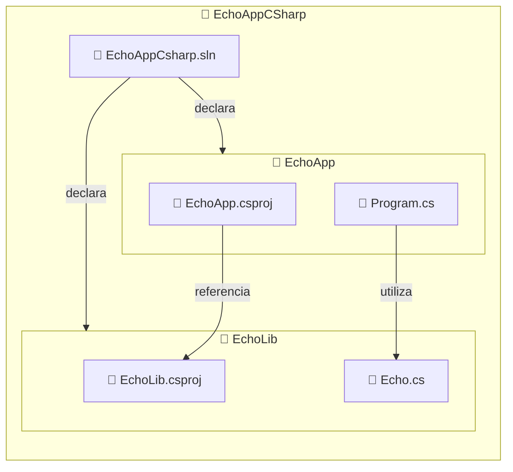

import BoxedTabs from '@site/src/components/cajitas/BoxedTabs';
import TabItem from '@theme/TabItem';
import RemoveEchoAppCsprojBashCode from '@site/src/components/mdx/build-systems/modular-design/msbuild/RemoveEchoAppCsprojBashCode';
import RemoveEchoAppCsprojPsCode from '@site/src/components/mdx/build-systems/modular-design/msbuild/RemoveEchoAppCsprojPsCode';
import InitializeCSharpSolutionBashCode from '@site/src/components/mdx/build-systems/modular-design/msbuild/InitializeCSharpSolutionBash';
import InitializeCSharpSolutionPsCode from '@site/src/components/mdx/build-systems/modular-design/msbuild/InitializeCSharpSolutionPsCode';
import Explanation from '@site/src/components/admonitions/Explanation';
import ReadingTime from '@site/src/components/reading-time/ReadingTime';
import GitHubRepo from '@site/src/components/git/GitHubRepo';
import GitLabRepo from '@site/src/components/git/GitLabRepo';
import RepoLinks from '@site/src/components/git/RepoLinks';
import ReferenceList from '@site/src/components/references/ReferenceList';
import WebPage from '@site/src/components/references/WebPage';

<ReadingTime />
<RepoLinks children={[
    <GitLabRepo repo="echo-app-csharp" user="r8vnhill" />,
    <GitHubRepo repo="echo-app-csharp" user="r8vnhill" />
]} />

C# permite organizar proyectos en soluciones modulares, lo que facilita la reutilización de código, la separación de responsabilidades y el mantenimiento a largo plazo. En lugar de mantener toda la lógica en una única aplicación, es preferible separar funcionalidades en bibliotecas que puedan ser utilizadas desde distintos proyectos.

En esta lección, aprenderás a crear una solución en C# con **MSBuild** que contenga dos proyectos:

- Una **biblioteca reutilizable** llamada `EchoLib`.
- Una **aplicación de consola** llamada `EchoApp` que utiliza dicha biblioteca.

Usaremos herramientas de línea de comandos multiplataforma para automatizar la creación, referencia y ejecución de los proyectos, sentando así las bases para diseñar aplicaciones limpias y modulares en el ecosistema .NET.

## 🏗️ Estructura esperada del proyecto

Esta es la estructura típica de una solución modular en C# utilizando MSBuild. Incluye dos proyectos: una biblioteca reutilizable (`EchoLib`) y una aplicación de consola (`EchoApp`) que consume esa biblioteca. Todo está organizado bajo una única solución (`.sln`).



:::info Explicación de la estructura

- `EchoAppCsharp.sln`: Archivo de solución que actúa como punto de entrada para abrir toda la estructura del proyecto en Visual Studio o cualquier editor compatible.
- `EchoLib/`: Contiene una biblioteca reutilizable con utilidades (en este caso, la clase `Echo`).
- `EchoApp/`: Contiene la aplicación de consola que consume `EchoLib`.
- `EchoApp.csproj` → `EchoLib.csproj`: Se establece como una referencia de proyecto, permitiendo reutilizar código sin compilar por separado.

:::

:::tip ¿Y el proyecto anterior?

Puedes eliminar el proyecto `EchoAppCSharp` que creamos en la lección anterior, ya que ahora vamos a crear una solución modular con dos proyectos: una biblioteca y una aplicación que la utiliza.

<BoxedTabs groupId={"os"}>
    <TabItem value="Windows" label="Windows">
        <RemoveEchoAppCsprojPsCode />
    </TabItem>
    <TabItem value="macOS" label="macOS">
        <RemoveEchoAppCsprojBashCode title="scripts/macos/remove_echo_app_csproj.sh" />
    </TabItem>
    <TabItem value="Ubuntu/Debian" label="Ubuntu/Debian">
        <RemoveEchoAppCsprojBashCode title="scripts/linux/remove_echo_app_csproj.sh" />
    </TabItem>
</BoxedTabs>

:::

## 🛠️ Paso 1: Crear solución base en C#

En esta sección automatizaremos la creación de una solución C# que contiene dos proyectos: una biblioteca (`EchoLib`) y una aplicación de consola (`EchoApp`) que depende de ella.  
Puedes usar los siguientes scripts según tu sistema operativo:

<BoxedTabs groupId={"os"}>
    <TabItem value="Windows" label="Windows">
        <InitializeCSharpSolutionPsCode />
    </TabItem>
    <TabItem value="macOS" label="macOS">
        <InitializeCSharpSolutionBashCode title="scripts/macos/initialize_csharp_solution.sh" />
    </TabItem>
    <TabItem value="Ubuntu/Debian" label="Ubuntu/Debian">
        <InitializeCSharpSolutionBashCode title="scripts/linux/initialize_csharp_solution.sh" />
    </TabItem>
</BoxedTabs>

### 🧩 Entendiendo la solución

El archivo de solución (`.sln`) de Visual Studio organiza múltiples proyectos en un mismo entorno de trabajo. En este archivo, se definen los proyectos que componen la solución, sus configuraciones de compilación y otras propiedades relevantes.

```plaintext showLineNumbers title="EchoAppCsharp.sln"
Microsoft Visual Studio Solution File, Format Version 12.00
# Visual Studio Version 17
Project("{...}") = "EchoLib", "EchoLib\EchoLib.csproj", "{...}"
EndProject
Project("{...}") = "EchoApp", "EchoApp\EchoApp.csproj", "{...}"
EndProject
Global
    GlobalSection(SolutionConfigurationPlatforms) = preSolution
        Debug|Any CPU = Debug|Any CPU
        Release|Any CPU = Release|Any CPU
    EndGlobalSection
    GlobalSection(ProjectConfigurationPlatforms) = postSolution
        {...}.Debug|Any CPU.ActiveCfg = Debug|Any CPU
        {...}.Debug|Any CPU.Build.0 = Debug|Any CPU
        {...}.Release|Any CPU.ActiveCfg = Release|Any CPU
        {...}.Release|Any CPU.Build.0 = Release|Any CPU
    EndGlobalSection
    GlobalSection(SolutionProperties) = preSolution
        HideSolutionNode = FALSE
    EndGlobalSection
EndGlobal
```

<Explanation>
    - `Project("{...}") = "Nombre", "Ruta", "{GUID}"`: Define un proyecto incluido en la solución, indicando su nombre, ubicación y un identificador único.
    - `SolutionConfigurationPlatforms`: Lista las combinaciones de configuración y plataforma disponibles (como `Debug|Any CPU`).
    - `ProjectConfigurationPlatforms`: Establece cómo debe compilarse cada proyecto bajo cada configuración definida globalmente.
    - `SolutionProperties`: Define propiedades generales de la solución, como si se debe ocultar el nodo raíz en el explorador de soluciones de Visual Studio.
</Explanation>

### 🧱 Entendiendo los proyectos

Cada proyecto en una solución de .NET está definido por un archivo `.csproj` en formato XML. Este archivo contiene metadatos y configuraciones necesarias para compilar, empaquetar y ejecutar el proyecto. A continuación, se muestra cómo están definidos los dos proyectos de esta solución: una biblioteca (`EchoLib`) y una aplicación de consola (`EchoApp`).

```xml showLineNumbers title="EchoLib\EchoLib.csproj"
<Project Sdk="Microsoft.NET.Sdk">

  <PropertyGroup>
    <TargetFramework>net9.0</TargetFramework>
    <ImplicitUsings>enable</ImplicitUsings>
    <Nullable>enable</Nullable>
  </PropertyGroup>

</Project>
```

Este archivo define un proyecto de biblioteca de clases:
- `TargetFramework`: Especifica que el proyecto se compila para .NET 9.
- `ImplicitUsings`: Habilita la inclusión automática de espacios de nombres comunes.
- `Nullable`: Activa las anotaciones y advertencias para referencias anulables.

```xml showLineNumbers title="EchoApp\EchoApp.csproj"
<Project Sdk="Microsoft.NET.Sdk">

  <ItemGroup>
    <ProjectReference Include="..\EchoLib\EchoLib.csproj" />
  </ItemGroup>

  <PropertyGroup>
    <OutputType>Exe</OutputType>
    <TargetFramework>net9.0</TargetFramework>
    <ImplicitUsings>enable</ImplicitUsings>
    <Nullable>enable</Nullable>
  </PropertyGroup>

</Project>
```

Este archivo describe una aplicación de consola que referencia la biblioteca `EchoLib`:
- `ProjectReference`: Establece una dependencia directa a otro proyecto del mismo repositorio, lo que permite reutilizar su código sin necesidad de compilarlo por separado.
- `OutputType`: Indica que este proyecto genera un ejecutable.
- Las demás propiedades son similares a las de la biblioteca.

## 🔁 Paso 2: Crear una biblioteca reutilizable

Creamos una clase estática `Echo` dentro del proyecto `EchoLib`. Esta biblioteca está pensada para agrupar utilidades relacionadas con cadenas de texto. Por ahora, define un único método `Repeat`, que simplemente retorna la cadena entregada como entrada.

```csharp showLineNumbers title="EchoLib/Echo.cs"
namespace EchoLib;

public static class Echo {
    public static string Repeat(string input) => input;
}
```

<Explanation>
    - `namespace EchoLib;`: Define el espacio de nombres de la biblioteca. Agrupar tipos bajo un mismo namespace ayuda a mantener el código organizado y evita conflictos.
    - `public static class Echo`: Se declara como estática porque la clase no necesita ser instanciada y solo contiene utilidades.
    - `Repeat(string input)`: Por ahora, este método simplemente devuelve el valor original.
</Explanation>

## 🧪 Paso 3: Ejecutar con argumentos

Este programa toma argumentos desde la línea de comandos, repite cada uno usando la función `Echo.Repeat`, y los imprime en pantalla. Es una forma simple de probar la conexión entre el proyecto de consola y la biblioteca.

```csharp showLineNumbers title="EchoApp/Program.cs"
using EchoLib;

namespace EchoApp;

internal static class Program {
    private static void Main(string[] args) {
        foreach (var arg in args) Console.WriteLine(Echo.Repeat(arg));
    }
}
```

<Explanation>
    - `args`: arreglo de cadenas que contiene los argumentos recibidos al ejecutar el programa.
    - `Echo.Repeat(arg)`: utiliza la función de la biblioteca para procesar cada argumento.
    - `foreach`: itera sobre cada argumento y lo imprime por separado.
</Explanation>

### 🚀 Ejecutar la aplicación

Para ejecutar la aplicación, utiliza el siguiente comando en la terminal:

<BoxedTabs groupId={"os"}>
    <TabItem value="Windows" label="Windows">
        ```powershell showLineNumbers title="En PowerShell"
        dotnet run --project EchoApp -- `
            "Is this the end of the beginning", `
            "or the beginning of the end?"
        ```
    </TabItem>
    <TabItem value="macOS" label="macOS">
        ```bash showLineNumbers title="En la terminal"
        dotnet run --project EchoApp -- \
            "Is this the end of the beginning" \
            "or the beginning of the end?"
        ```
    </TabItem>
    <TabItem value="Ubuntu/Debian" label="Ubuntu/Debian">
        ```bash showLineNumbers title="En la terminal"
        dotnet run --project EchoApp -- \
            "Is this the end of the beginning" \
            "or the beginning of the end?"
        ```
    </TabItem>
</BoxedTabs>

Esto imprimirá:

```plaintext
Is this the end of the beginning
or the beginning of the end?
```

<Explanation>
    - `dotnet run --project EchoApp --`: Ejecuta el proyecto `EchoApp`, pasando los argumentos después del `--`.
    - Las barras invertidas (`\`) o backticks (`` ` ``) permiten dividir argumentos en varias líneas, según el sistema operativo.
</Explanation>

## 🎯 Conclusiones

En esta lección construimos una solución C# modular compuesta por una biblioteca reutilizable y una aplicación de consola. Aprendimos a usar `dotnet` para crear, organizar y vincular proyectos dentro de una misma solución, y entendimos cómo aprovechar los archivos `.sln` y `.csproj` para configurar cada componente. Esta estructura no solo mejora la organización del código, sino que también facilita su mantenimiento y evolución.

### 🔑 Puntos clave

- Las soluciones (`.sln`) permiten agrupar múltiples proyectos de forma coherente.
- Las bibliotecas (`classlib`) son ideales para encapsular lógica reutilizable.
- Las referencias de proyecto (`ProjectReference`) eliminan la necesidad de compilar y distribuir dependencias por separado.
- Ejecutar aplicaciones con argumentos permite probar funcionalidades directamente desde la línea de comandos.

### 🧰 ¿Qué nos llevamos?

Dividir tu proyecto en módulos desde el inicio promueve buenas prácticas como la separación de responsabilidades, la reutilización de código y la mantenibilidad a largo plazo. Esta estructura es especialmente útil cuando tu código crece o cuando quieres compartir bibliotecas entre diferentes aplicaciones. En lugar de tener una gran aplicación monolítica, pensar en términos de bibliotecas te permite diseñar sistemas más limpios, extensibles y testeables.

Esta lección sienta las bases para continuar explorando herramientas del ecosistema .NET como pruebas automatizadas, empaquetado de bibliotecas y publicación en NuGet.

## 📖 ¿Con ganas de más?

<ReferenceList title="🔥 Referencias recomendadas" items={[
    <WebPage 
        title=<code>dotnet sln</code>
        url="https://learn.microsoft.com/en-us/dotnet/core/tools/dotnet-sln"
        location="Microsoft Learn"
    >
        Este recurso documenta el comando <code>dotnet sln</code>, que permite crear, listar, agregar, eliminar y migrar proyectos dentro de archivos de solución (<code>.sln</code> o <code>.slnx</code>) en proyectos .NET. Explica cómo generar una solución con <code>dotnet new sln</code>, cómo organizar proyectos mediante carpetas virtuales con <code>--solution-folder</code>, y cómo utilizar patrones (<code>globbing</code>) para agregar o quitar múltiples proyectos a la vez. También cubre la conversión de <code>.sln</code> a <code>.slnx</code> y proporciona ejemplos prácticos multiplataforma para automatizar la organización modular de soluciones.
    </WebPage>
]}  />
