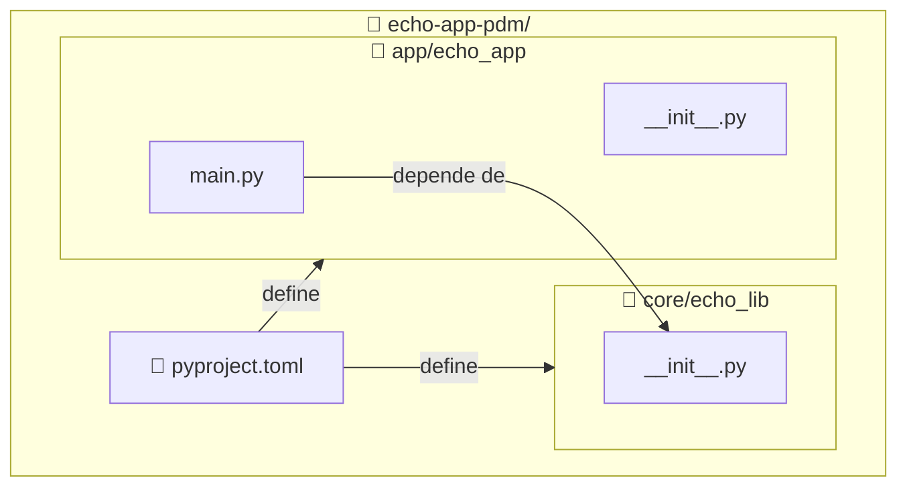

import ReadingTime from '@site/src/components/ReadingTime'
import Explanation from '@site/src/components/admonitions/Explanation'
import BoxedTabs from '@site/src/components/cajitas/BoxedTabs'
import TabItem from '@theme/TabItem'

<ReadingTime />

## 🏗️ Estructura esperada del proyecto

Vamos a crear un proyecto con la siguiente estructura:



:::info Explicación de la estructura

Este diagrama representa la organización del proyecto con dos módulos separados (`lib` y `app`), siguiendo un patrón común en el desarrollo de bibliotecas y aplicaciones:

- **`lib/echo_lib/`** contiene la lógica reutilizable, que en este caso está en `echo.py`. Es nuestro módulo de biblioteca.
- **`app/echo_app/`** contiene el punto de entrada principal de la aplicación, `main.py`, que **depende** del módulo `lib`.
- **`pyproject.toml`** es el archivo central de configuración del proyecto. Define metadatos, dependencias, scripts y cualquier otro aspecto relacionado con la construcción del proyecto.
- La flecha `main.py --> echo.py` indica que el código de la app **importa** o **usa** funciones o clases definidas en la biblioteca.
- Las flechas desde `pyproject.toml` muestran que este archivo **define y configura** ambos módulos dentro del mismo proyecto PDM.

Este diseño facilita la separación de responsabilidades: puedes desarrollar, probar y documentar la lógica de `lib` por separado, mientras que `app` actúa como consumidor de esa lógica, permitiendo una evolución más limpia del proyecto.

:::

## 📦 Paso 1: Crear la estructura de carpetas

Desde la raíz del proyecto:

<BoxedTabs groupId={"os"}>
    <TabItem value="Windows" label="Windows">
        ```powershell title="En PowerShell"
        'core\echo_core', 'app\echo_app' | ForEach-Object {
            $dir = $_
            New-Item -ItemType Directory -Path $dir -Force | Out-Null
            New-Item -ItemType File -Path "$dir\__init__.py" -Force | Out-Null

            if ($dir -eq 'app\echo_app') {
                New-Item -ItemType File -Path "$dir\main.py" -Force | Out-Null
            }
        }
        ```

        <Explanation>
            Este bloque de PowerShell crea dos módulos separados dentro del proyecto:

            - `core\echo_core`: representa el módulo reutilizable de la biblioteca.
            - `app\echo_app`: representa la aplicación que depende de `core`.

            Para cada módulo se crean:
            - La carpeta correspondiente (si no existe).
            - Un archivo `__init__.py` que marca el directorio como paquete de Python.

            Además, si el módulo es `app\echo_app`, también se crea un archivo `main.py` vacío, que actuará como punto de entrada de la aplicación.

            El operador `| Out-Null` se utiliza para **suprimir la salida que normalmente mostrarían los comandos `New-Item`**. Esto hace que el script se ejecute de forma silenciosa, sin imprimir mensajes innecesarios en la consola, lo cual es útil para mantener el entorno limpio especialmente al automatizar la creación de estructura de carpetas.
        </Explanation>
    </TabItem>
    <TabItem value="Windows (corto)" label="Windows (corto)">
        ```powershell title="En PowerShell"
        'core\echo_core', 'app\echo_app' | % {
            md $_ -f >$null
            ni "$_\__init__.py" -f >$null
            if ($_ -eq 'app\echo_app') {
                ni "$_\main.py" -f >$null
            }
        }
        ```

        <Explanation>
            Este bloque de PowerShell inicializa la estructura del proyecto:

            - Crea dos directorios: `core\echo_core` y `app\echo_app`.
            - En cada uno, agrega un archivo `__init__.py` para marcarlo como paquete de Python.
            - En el módulo `app\echo_app`, también crea un archivo `main.py` como punto de entrada para la aplicación.

            El uso de alias (`md` para `New-Item -ItemType Directory` y `ni` para `New-Item`) y la redirección de salida a `$null` permite que el comando sea breve y silencioso.
        </Explanation>
    </TabItem>
    <TabItem value="Linux/macOS" label="Linux/macOS">
        ```bash title="En tu terminal"
        for dir in core/echo_core app/echo_app; do
            mkdir -p "$dir"
            : > "$dir/__init__.py"
            if [[ "$dir" == "app/echo_app" ]]; then
                : > "$dir/main.py"
            fi
        done
        ```

        <Explanation>
            Este bloque de Bash crea la estructura inicial de un proyecto Python con dos módulos separados:

            - `core/echo_core`: contiene la lógica reutilizable de la biblioteca.
            - `app/echo_app`: contiene la aplicación que consume esa lógica.

            Para cada módulo se realizan dos acciones:
            - Se crea el directorio si no existe (`mkdir -p`).
            - Se crea un archivo `__init__.py`, necesario para que Python reconozca la carpeta como un paquete.

            Además, si el módulo es `app/echo_app`, se crea un archivo `main.py` vacío, que actuará como punto de entrada de la aplicación.

            La instrucción `: > archivo` es una forma idiomática y muy eficiente en Bash para **crear un archivo vacío** (o vaciarlo si ya existe), sin depender de `touch`. Es especialmente útil para scripts automatizados y portables.
        </Explanation>
    </TabItem>
</BoxedTabs>

## 🧠 Paso 2: Implementar una función en core

Edita `core/echo_core/__init__.py` y agrega una función reutilizable:

Una buena sugerencia para ese bloque sería:

```python showLineNumbers title="Función de eco definida en el módulo core (core/echo_core/__init__.py)"
def echo(message: str) -> str:
    return message
``` 

Este título indica claramente la ubicación del archivo y refuerza que se está trabajando dentro del módulo `core`. ¿Quieres que siga ese formato para los demás bloques también (`app/echo_app/main.py`, por ejemplo)?

Luego, modifica el archivo `pyproject.toml` para declarar el módulo `core/echo_core` como un paquete editable dentro del proyecto.  
Agrega esta sección al final del archivo:

```toml showLineNumbers title="Declaración del módulo core como dependencia editable (pyproject.toml)"
[tool.pdm.dev-dependencies]
core = { path = "core", develop = true }
```

Y ejecuta en terminal:

```bash title="En tu terminal"
pdm install
```

<Explanation>
    Esta función `echo` recibe un mensaje como argumento y simplemente lo devuelve sin modificarlo.  
    Aunque su implementación es trivial, cumple un propósito importante: actúa como **punto de partida** para probar que la biblioteca `core` puede ser importada y utilizada correctamente desde el módulo `app`.

    Además, al declarar `core` como un paquete editable en `pyproject.toml`, permitimos que su código pueda ser importado directamente desde el entorno gestionado por PDM, sin necesidad de modificar rutas manualmente.  
    Esto facilita el desarrollo iterativo y la separación clara entre lógica de biblioteca (`core`) y lógica de aplicación (`app`).
</Explanation>

## 🧪 Paso 3: Usar la función del módulo core desde app

Edita `app/echo_app/main.py` y escribe un pequeño script que utilice la función `echo` definida en el módulo `core`.

```python showLineNumbers title="Uso de la función echo desde app (app/echo_app/main.py)"
from echo_core import echo

def main():
    message = "¡Hola desde app usando core!"
    print(echo(message))

if __name__ == "__main__":
    main()
```

<Explanation>
    Este archivo `main.py` define una función principal que importa la función `echo` desde el paquete `core`, la invoca con un mensaje de prueba y muestra el resultado por consola.

    Este paso valida que:
    - La estructura multi-módulo funciona correctamente.
    - `core` fue registrado como paquete editable en el entorno de PDM.
    - Puedes desarrollar y ejecutar la app sin modificar manualmente variables de entorno como `PYTHONPATH`.

    Además, el uso del patrón `if __name__ == "__main__"` asegura que el código solo se ejecute cuando `main.py` sea ejecutado directamente, no al ser importado desde otro módulo.
</Explanation>

### ▶️ Ejecutar el programa

Puedes ejecutar el módulo directamente desde terminal usando:

```bash title="En tu terminal"
pdm run python app/echo_app/main.py
```

<Explanation>
    El comando `pdm run` asegura que el script se ejecute dentro del entorno virtual gestionado por PDM, respetando la configuración del proyecto.

    Si todo está bien configurado, deberías ver en consola:

    ```text
    ¡Hola desde app usando core!
    ```
</Explanation>

## 🚀 Paso 3: Consumir lib desde app

Edita `app/echo_app/main.py` con el siguiente contenido:

```python
from lib.echo_lib import shout

def main():
    print(shout("lib and app are working"))

if __name__ == "__main__":
    main()
```

## 🔍 Paso 4: Asegurar que lib esté en el path

Para que Python pueda encontrar el módulo `lib`, debes agregarlo al `PYTHONPATH` cuando ejecutes tu script:

```bash
PYTHONPATH=./ app/echo_app/main.py
```

Pero si estás usando PDM, es mejor definirlo como script en `pyproject.toml`:

```toml
[tool.pdm.scripts]
run-app = { cmd = "python app/echo_app/main.py", env = { PYTHONPATH = "." } }
```

Ahora puedes ejecutar:

```bash
pdm run run-app
```

Y deberías ver:

```text
LIB AND APP ARE WORKING!!
```

<Explanation>
  La variable de entorno `PYTHONPATH` le indica a Python dónde buscar módulos al hacer imports.  
  En este caso, apuntamos a la raíz del proyecto (`.`) para que Python pueda resolver correctamente `lib.echo_lib`.
</Explanation>

## 🔁 Alternativa: mover lib a `src/lib` (opcional)

Si prefieres seguir el patrón `src/`, puedes mover `lib/` a `src/lib/` y ajustar `PYTHONPATH=./src` en el script.  
Ambos enfoques son válidos; lo importante es que haya una **separación clara entre la lógica de biblioteca y la lógica de aplicación**.

## 🧪 Verificar

También puedes probar manualmente desde la consola:

```bash
PYTHONPATH=. python app/echo_app/main.py
```

O ejecutar desde PDM:

```bash
pdm run run-app
```

Ambos comandos deberían ejecutar correctamente la aplicación y mostrar el resultado del uso de `lib`.

## 🎯 Conclusiones

Separar `lib` y `app` desde el comienzo mejora la **organización**, **reutilización** y **mantenibilidad** de tu proyecto.

### 🔑 Puntos clave

- `lib` contiene lógica genérica reutilizable.
- `app` actúa como cliente de `lib`.
- Con `PYTHONPATH=.` se permite importar módulos entre carpetas sin empaquetar aún.
- PDM permite definir scripts reutilizables para facilitar la ejecución.

En próximas lecciones podrás convertir `lib` en un **paquete instalable** e incluso publicarlo, si lo deseas.

## 📖 Referencias

- [Import system — Python Docs](https://docs.python.org/3/reference/import.html)
- [PDM - Defining scripts](https://pdm-project.org/latest/usage/scripts/)
