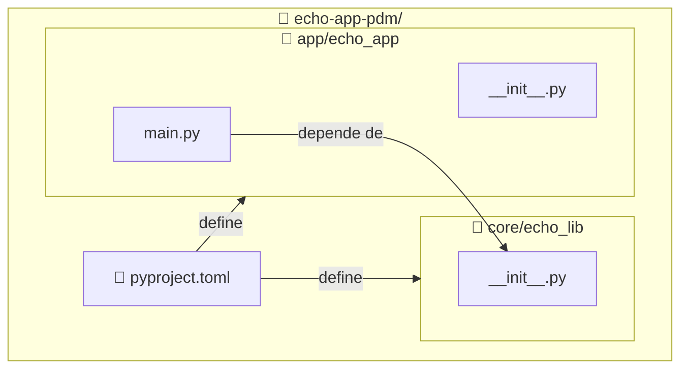

import ReadingTime from '@site/src/components/ReadingTime'
import Explanation from '@site/src/components/admonitions/Explanation'
import BoxedTabs from '@site/src/components/cajitas/BoxedTabs'
import TabItem from '@theme/TabItem'
import AnimatedCodeExample from '@site/src/components/animations/AnimatedCode'

<ReadingTime />

## 🏗️ Estructura esperada del proyecto

Vamos a crear un proyecto con la siguiente estructura:



:::info Explicación de la estructura

Este diagrama representa la organización del proyecto con dos módulos separados (`lib` y `app`), siguiendo un patrón común en el desarrollo de bibliotecas y aplicaciones:

- **`lib/echo_lib/`** contiene la lógica reutilizable, que en este caso está en `echo.py`. Es nuestro módulo de biblioteca.
- **`app/echo_app/`** contiene el punto de entrada principal de la aplicación, `main.py`, que **depende** del módulo `lib`.
- **`pyproject.toml`** es el archivo central de configuración del proyecto. Define metadatos, dependencias, scripts y cualquier otro aspecto relacionado con la construcción del proyecto.
- La flecha `main.py --> echo.py` indica que el código de la app **importa** o **usa** funciones o clases definidas en la biblioteca.
- Las flechas desde `pyproject.toml` muestran que este archivo **define y configura** ambos módulos dentro del mismo proyecto PDM.

Este diseño facilita la separación de responsabilidades: puedes desarrollar, probar y documentar la lógica de `lib` por separado, mientras que `app` actúa como consumidor de esa lógica, permitiendo una evolución más limpia del proyecto.

:::

## 📦 Paso 1: Crear la estructura de carpetas

Desde la raíz del proyecto:

<BoxedTabs groupId={"os"}>
    <TabItem value="Windows" label="Windows">
        ```powershell
        'core\echo_core', 'app\echo_app' | ForEach-Object {
            $dir = $_
            New-Item -ItemType Directory -Path $dir -Force | Out-Null
            New-Item -ItemType File -Path "$dir\__init__.py" -Force | Out-Null

            if ($dir -eq 'app\echo_app') {
                New-Item -ItemType File -Path "$dir\main.py" -Force | Out-Null
            }
        }
        ```

        <Explanation>
            Este bloque de PowerShell crea dos módulos separados dentro del proyecto:

            - `core\echo_core`: representa el módulo reutilizable de la biblioteca.
            - `app\echo_app`: representa la aplicación que depende de `core`.

            Para cada módulo se crean:
            - La carpeta correspondiente (si no existe).
            - Un archivo `__init__.py` que marca el directorio como paquete de Python.

            Además, si el módulo es `app\echo_app`, también se crea un archivo `main.py` vacío, que actuará como punto de entrada de la aplicación.

            El operador `| Out-Null` se utiliza para **suprimir la salida que normalmente mostrarían los comandos `New-Item`**. Esto hace que el script se ejecute de forma silenciosa, sin imprimir mensajes innecesarios en la consola, lo cual es útil para mantener el entorno limpio especialmente al automatizar la creación de estructura de carpetas.
        </Explanation>
    </TabItem>
    <TabItem value="Windows (corto)" label="Windows (corto)">
        ```powershell
        'core\echo_core', 'app\echo_app' | % {
            md $_ -f >$null
            ni "$_\__init__.py" -f >$null
            if ($_ -eq 'app\echo_app') {
                ni "$_\main.py" -f >$null
            }
        }
        ```

        <Explanation>
            Este bloque de PowerShell inicializa la estructura del proyecto:

            - Crea dos directorios: `core\echo_core` y `app\echo_app`.
            - En cada uno, agrega un archivo `__init__.py` para marcarlo como paquete de Python.
            - En el módulo `app\echo_app`, también crea un archivo `main.py` como punto de entrada para la aplicación.

            El uso de alias (`md` para `New-Item -ItemType Directory` y `ni` para `New-Item`) y la redirección de salida a `$null` permite que el comando sea breve y silencioso.
        </Explanation>
    </TabItem>
    <TabItem value="Linux/macOS" label="Linux/macOS">
        ```bash
        for dir in core/echo_core app/echo_app; do
            mkdir -p "$dir"
            : > "$dir/__init__.py"
            if [[ "$dir" == "app/echo_app" ]]; then
                : > "$dir/main.py"
            fi
        done
        ```

        <Explanation>
            {/* ¿Qué acabamos de hacer? */}
        </Explanation>
    </TabItem>
</BoxedTabs>

Luego crea un archivo de entrada para la app:

```bash
touch app/echo_app/main.py
```

## 🧠 Paso 2: Implementar una función en lib

Edita `lib/echo_lib/__init__.py` y agrega una función reutilizable:

```python
def shout(message: str) -> str:
    return message.upper() + "!!"
```

## 🚀 Paso 3: Consumir lib desde app

Edita `app/echo_app/main.py` con el siguiente contenido:

```python
from lib.echo_lib import shout

def main():
    print(shout("lib and app are working"))

if __name__ == "__main__":
    main()
```

## 🔍 Paso 4: Asegurar que lib esté en el path

Para que Python pueda encontrar el módulo `lib`, debes agregarlo al `PYTHONPATH` cuando ejecutes tu script:

```bash
PYTHONPATH=./ app/echo_app/main.py
```

Pero si estás usando PDM, es mejor definirlo como script en `pyproject.toml`:

```toml
[tool.pdm.scripts]
run-app = { cmd = "python app/echo_app/main.py", env = { PYTHONPATH = "." } }
```

Ahora puedes ejecutar:

```bash
pdm run run-app
```

Y deberías ver:

```text
LIB AND APP ARE WORKING!!
```

<Explanation>
  La variable de entorno `PYTHONPATH` le indica a Python dónde buscar módulos al hacer imports.  
  En este caso, apuntamos a la raíz del proyecto (`.`) para que Python pueda resolver correctamente `lib.echo_lib`.
</Explanation>

## 🔁 Alternativa: mover lib a `src/lib` (opcional)

Si prefieres seguir el patrón `src/`, puedes mover `lib/` a `src/lib/` y ajustar `PYTHONPATH=./src` en el script.  
Ambos enfoques son válidos; lo importante es que haya una **separación clara entre la lógica de biblioteca y la lógica de aplicación**.

## 🧪 Verificar

También puedes probar manualmente desde la consola:

```bash
PYTHONPATH=. python app/echo_app/main.py
```

O ejecutar desde PDM:

```bash
pdm run run-app
```

Ambos comandos deberían ejecutar correctamente la aplicación y mostrar el resultado del uso de `lib`.

## 🎯 Conclusiones

Separar `lib` y `app` desde el comienzo mejora la **organización**, **reutilización** y **mantenibilidad** de tu proyecto.

### 🔑 Puntos clave

- `lib` contiene lógica genérica reutilizable.
- `app` actúa como cliente de `lib`.
- Con `PYTHONPATH=.` se permite importar módulos entre carpetas sin empaquetar aún.
- PDM permite definir scripts reutilizables para facilitar la ejecución.

En próximas lecciones podrás convertir `lib` en un **paquete instalable** e incluso publicarlo, si lo deseas.

## 📖 Referencias

- [Import system — Python Docs](https://docs.python.org/3/reference/import.html)
- [PDM - Defining scripts](https://pdm-project.org/latest/usage/scripts/)
