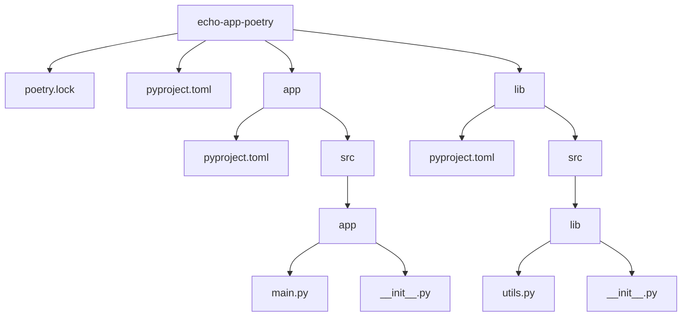

import ReadingTime from '@site/src/components/ReadingTime'
import { ProCons, Pros, Cons } from '@site/src/components/cajitas/ProCons'
import References from '@site/src/components/ReferencesComponent'
import Tabs from '@theme/Tabs'
import TabItem from '@theme/TabItem'
import Exercise from '@site/src/components/exercise/Exercise'
import Solution from '@site/src/components/exercise/Solution'
import Hint from '@site/src/components/exercise/Hint'
import Definition from '@site/src/components/Definition'
import Corollary from '@site/src/components/Corollary'
import GitHubRepoLink from '@site/src/components/git/GitHubRepoLink'
import { LanguageCard } from '@site/src/components/cards/LanguageCard'
import Explanation from '@site/src/components/admonitions/Explanation'
import RepoClone from '@site/src/components/admonitions/RepoClone'
import ModuleSetup from '@site/src/components/cajitas/ModuleSetup'
import BoxedTabs from '@site/src/components/cajitas/BoxedTabs'

<ReadingTime />
<GitHubRepoLink user="r8vnhill" repo="echo-app-poetry" />

**Poetry** es una herramienta moderna para gestionar dependencias y empaquetar proyectos en Python. Simplifica la instalación de paquetes, la gestión de versiones y la publicación en PyPI, todo desde un único archivo de configuración (`pyproject.toml`).  
En esta lección, aprenderemos a utilizar Poetry para configurar proyectos multi-módulo y gestionar dependencias, comparando su funcionalidad con herramientas similares como Gradle.

## Instalación de Poetry

Para instalar Poetry en tu sistema, ejecuta:

<BoxedTabs>
    <TabItem value="Windows" label="Windows">
        ```powershell
        (Invoke-WebRequest -Uri https://install.python-poetry.org -UseBasicParsing).Content | py -
        ```
    </TabItem>
    <TabItem value="Windows (corto)" label="Windows (corto)">
        ```powershell
        (iwr https://install.python-poetry.org -UseBasicParsing).Content | py -
        ```
    </TabItem>
    <TabItem value="Linux/Mac" label="Linux/Mac">
        ```bash
        curl -sSL https://install.python-poetry.org | python3 -
        ```
    </TabItem>
</BoxedTabs>

Después de la instalación, asegúrate de agregar Poetry a tu `PATH` reiniciando tu terminal o siguiendo las instrucciones que proporciona el instalador.

Verifica la instalación ejecutando:

```bash
poetry --version
```

## Crear un Proyecto con Poetry

Poetry facilita la creación de proyectos. Para iniciar un nuevo proyecto, usa:

```bash
poetry new echo-app-poetry
```

Esto generará una estructura básica con un archivo `pyproject.toml` en la raíz del proyecto, que contiene la configuración principal del proyecto, incluyendo las dependencias, el nombre, la versión, y otros metadatos. Esta estructura es similar a la de `build.gradle.kts` y `settings.gradle.kts` en Gradle.

```toml title="pyproject.toml"
[tool.poetry]
name = "echo-app-poetry"
version = "1.0.0"
description = "A simple echo app using Poetry"
authors = ["r8vnhill <reachme@ravenhill.cl>"]
readme = "README.md"

[tool.poetry.dependencies]
python = "^3.13.2"


[build-system]
requires = ["poetry-core"]
build-backend = "poetry.core.masonry.api"
```

## Proyectos Multi-Módulo en Poetry

A diferencia de herramientas como **Gradle**, **Poetry no tiene soporte nativo** para proyectos multi-módulo. Sin embargo, es posible organizar un proyecto con múltiples módulos utilizando **dependencias locales** dentro del archivo `pyproject.toml`. 

En este enfoque, cada módulo tiene su propio `pyproject.toml`, y los módulos pueden referenciarse entre sí mediante la opción `{ path = "<ruta>" }`. Esto permite definir configuraciones y dependencias específicas para cada módulo sin necesidad de publicarlos en PyPI.

### Estructura del Proyecto

Supongamos que tenemos un proyecto llamado **`echo-app-poetry`**, compuesto por dos módulos:
- **`app/`**: Contiene la lógica principal de la aplicación.
- **`lib/`**: Un módulo independiente que proporciona funciones reutilizables.

La estructura del proyecto sería:



### Configuración del Módulo Raíz

El archivo `pyproject.toml` en la raíz del proyecto define las dependencias principales y las referencias a los módulos internos (`app` y `lib`).

```toml title="pyproject.toml"
[tool.poetry]
name = "echo-app-poetry"
version = "1.0.0"
description = "A simple echo app using Poetry"
authors = ["r8vnhill <reachme@ravenhill.cl>"]
readme = "README.md"

[tool.poetry.dependencies]
python = "^3.13.2"
app = { path = "app", develop = true }
lib = { path = "lib", develop = true }

[build-system]
requires = ["poetry-core"]
build-backend = "poetry.core.masonry.api"
```

Aquí, `app` y `lib` se definen como **dependencias locales** usando `{ path = "<ruta>" }`, con la opción `develop = true` para indicar que son módulos en desarrollo.

### Configuración de los Módulos `app` y `lib`

Cada módulo necesita su propio `pyproject.toml`, donde se pueden declarar dependencias adicionales.

#### 📁 `app/pyproject.toml`
```toml title="app/pyproject.toml"
[tool.poetry]
name = "app"
version = "1.0.0"
description = "Main application module"
authors = ["r8vnhill <reachme@ravenhill.cl>"]

[tool.poetry.dependencies]
python = "^3.13.2"
lib = { path = "../lib", develop = true }  # Dependencia local a lib
```

#### 📁 `lib/pyproject.toml`
```toml title="lib/pyproject.toml"
[tool.poetry]
name = "lib"
version = "1.0.0"
description = "Utility library module"
authors = ["r8vnhill <reachme@ravenhill.cl>"]

[tool.poetry.dependencies]
python = "^3.13.2"
```

### Evitar Bucles en las Dependencias

Al configurar módulos en un proyecto multi-módulo, es importante **evitar dependencias cíclicas**. Un **bucle de dependencia** ocurre cuando:
- `app` depende de `lib`
- `lib` también depende de `app`

Esto generará errores en Poetry y puede hacer que el entorno de desarrollo sea inconsistente. Para evitarlo:

✅ **Define relaciones de dependencia de manera unidireccional**  
✅ **Extrae funcionalidades comunes en módulos independientes**  
✅ **Reconsidera la arquitectura si detectas ciclos innecesarios**

### Ejecutando el Proyecto 🚀

Una vez configurados los módulos, instala todas las dependencias del proyecto, incluyendo los módulos locales, con:

```bash
poetry install --no-root
```

<details>
    <summary>
        ¿Por qué `--no-root`?
    </summary>
    
    Este flag evita instalar el paquete raíz en sí mismo dentro del entorno virtual. Es útil en proyectos multi-módulo, ya que **solo instala las dependencias** sin tratar al módulo principal como una dependencia más.
</details>

Después de la instalación, puedes verificar que los módulos están accesibles ejecutando:

```bash
poetry run python -c "import app, lib; print('Módulos cargados correctamente')"
```

### Configuración del Módulo Raíz

El archivo `pyproject.toml` en el módulo raíz define las dependencias del proyecto principal e incluye referencias a los módulos `app` y `lib`. Este archivo podría verse de la siguiente manera:

```toml title="pyproject.toml"
[tool.poetry]
name = "echo-app-poetry"
version = "1.0.0"
description = "A simple echo app using Poetry"
authors = ["r8vnhill <reachme@ravenhill.cl>"]
readme = "README.md"

[tool.poetry.dependencies]
python = "^3.13.2"

[build-system]
requires = ["poetry-core"]
build-backend = "poetry.core.masonry.api"
```

En este archivo, las dependencias de `app` y `lib` se declaran con la opción `develop = true` para que se traten como módulos en desarrollo dentro del proyecto principal.

### Configuración de los Módulos `app` y `lib`

Cada módulo define su propio archivo `pyproject.toml` con sus dependencias y metadatos. Los archivos `pyproject.toml` en `app` y `lib` podrían configurarse como sigue:

```toml title="app/pyproject.toml"
[tool.poetry]
name = "app"
version = "1.0.0"
description = "A subproject for the app"
authors = ["Ignacio Slater <reachme@ravenhill.cl>"]

[tool.poetry.dependencies]
python = "^3.13.2"
```

```toml title="lib/pyproject.toml"
[tool.poetry]
name = "lib"
version = "1.0.0"
description = "A subproject for the lib"
authors = ["Ignacio Slater <reachme@ravenhill.cl>"]

[tool.poetry.dependencies]
python = "^3.13.2"
```

## Gestión de Dependencias en Poetry

Para agregar una dependencia en Poetry, utiliza el comando:

```bash
poetry add <nombre-dependencia>
```

Este comando actualiza el archivo `pyproject.toml`, donde Poetry gestiona versiones y configuraciones de dependencias, similar al archivo `libs.versions.toml` en Gradle.

Por ejemplo, para añadir **Flask** a tu proyecto, ejecuta:

```bash
poetry add flask
```

Esto agregará **Flask** a las dependencias de tu proyecto y actualizará el archivo `pyproject.toml` automáticamente:

```toml title="pyproject.toml"
[tool.poetry.dependencies]
python = "^3.13.2"
app = { path = "app", develop = true }
lib = { path = "lib", develop = true }
flask = "^3.0.3"
```

Con este sistema, **Poetry** permite un control centralizado de todas las versiones y dependencias del proyecto, manteniéndolas en un solo archivo de configuración.

## Resumen Comparativo

Aunque Poetry y Gradle son herramientas de gestión de dependencias, cada una está diseñada para su propio ecosistema. Mientras Gradle ofrece un amplio soporte para múltiples lenguajes y configuraciones avanzadas, Poetry se centra exclusivamente en la simplicidad y eficiencia para proyectos Python. Veamos una comparación de sus características clave:

| **Característica**                          | **Poetry**                                                                                               | **Gradle**                                                                                               |
|---------------------------------------------|----------------------------------------------------------------------------------------------------------|----------------------------------------------------------------------------------------------------------|
| **Gestión de dependencias**                 | Las dependencias se agregan con `poetry add`, lo que actualiza `pyproject.toml` de forma centralizada.  | Utiliza `implementation`, `api`, y otros keywords en `build.gradle(.kts)`, controlando dependencias por módulo. |
| **Soporte para multi-módulos**              | Permite configurar múltiples módulos mediante subdirectorios con sus propios archivos `pyproject.toml`. | Configura múltiples módulos en `settings.gradle(.kts)`, permitiendo estructura jerárquica en módulos raíz y submódulos. |
| **Configuración de versiones**              | Usa `pyproject.toml` para definir versiones, similares a `libs.versions.toml` en Gradle.                 | Puede gestionar versiones con `versions` o `libs.versions.toml` en combinación con el sistema de versiones. |
| **Compatibilidad y flexibilidad**           | Compatible con proyectos Python, centrándose en simplificar la configuración y gestión de paquetes.      | Compatible con múltiples lenguajes (Java, Kotlin, Android), permitiendo configuraciones complejas y plugins. |
| **Control centralizado del proyecto**       | Centraliza la configuración en `pyproject.toml` a nivel raíz, fácil de leer y modificar.                 | Centraliza configuraciones globales en `build.gradle(.kts)`, adaptable para cada módulo en `settings.gradle(.kts)`. |
| **Compatibilidad con PyPI/Maven**           | Directamente compatible con PyPI para la publicación de paquetes de Python.                              | Directamente compatible con Maven Central y otros repositorios Java para la publicación de bibliotecas. |
| **Instalación de herramientas**             | Instala dependencias y herramientas de desarrollo con `poetry install`.                                 | Usa `gradlew build` para compilar y `gradlew dependencies` para gestionar dependencias locales.

### Beneficios y Limitaciones de Poetry

<ProCons>
    <Pros>
        - **Configuración Sencilla y Centralizada**: Poetry centraliza la configuración de dependencias y metadatos del proyecto en `pyproject.toml`, facilitando la gestión y lectura del estado del proyecto.
        - **Soporte para Proyectos Multi-Módulo**: Poetry permite definir subproyectos o módulos con sus propios archivos `pyproject.toml`, lo que ayuda a gestionar dependencias y configuraciones de forma independiente dentro de un mismo proyecto.
        - **Gestión de Versiones Simplificada**: Con comandos como `poetry add <nombre-dependencia>`, es fácil añadir, actualizar y administrar versiones de dependencias de manera centralizada.
        - **Compatibilidad Directa con PyPI**: Poetry permite publicar paquetes en PyPI, lo cual es conveniente para desarrolladores de Python que quieren distribuir sus proyectos sin configuraciones adicionales.
        - **Entornos de Desarrollo Virtuales**: Crea automáticamente entornos virtuales aislados para cada proyecto, asegurando una mayor estabilidad y consistencia entre diferentes entornos.
    </Pros>
    <Cons>
        - **Compatibilidad Limitada con Otros Lenguajes**: A diferencia de Gradle, Poetry está diseñado exclusivamente para proyectos de Python, lo cual restringe su uso en proyectos multi-lenguaje.
        - **Soporte Limitado para Scripts de Construcción Personalizados**: Poetry carece de un sistema de scripting tan avanzado como Gradle, limitando su personalización en flujos de construcción complejos.
        - **Dependencias Externas Limitadas en Proyectos Multi-Módulo**: En comparación con Gradle, Poetry puede presentar limitaciones al gestionar dependencias complejas o internas en grandes proyectos con múltiples módulos interdependientes.
        - **Menos Integración con IDEs**: Aunque compatible con IDEs comunes de Python, su integración y soporte no están tan optimizados como en herramientas más veteranas, lo cual puede limitar ciertas configuraciones avanzadas.
        - **Falta de Plugins y Extensiones**: Poetry no cuenta con un ecosistema amplio de plugins, lo cual puede ser una limitante para proyectos que requieren configuraciones avanzadas o funcionalidades específicas.
    </Cons>
</ProCons>

## 📌 Conclusiones  

En esta lección, exploramos cómo **Poetry** facilita la gestión de dependencias y la configuración de proyectos **multi-módulo** en Python. Aunque no ofrece soporte **nativo** para proyectos multi-módulo como Gradle, es posible estructurar proyectos organizados mediante **dependencias locales**, permitiendo un control claro de cada módulo y sus relaciones.

### 🔑 Puntos clave  

1. **Gestión centralizada de dependencias**  
   - Poetry permite administrar paquetes de manera estructurada con `pyproject.toml`, simplificando la instalación y actualización de librerías.  
2. **Organización de proyectos multi-módulo**  
   - Aunque Poetry no tiene una arquitectura multi-módulo integrada, se puede lograr mediante dependencias locales y archivos `pyproject.toml` individuales para cada módulo.  
3. **Evitando dependencias cíclicas**  
   - Es crucial definir relaciones de dependencia **de manera unidireccional** para evitar bucles que puedan generar errores en la instalación o dificultar la gestión del código.  
4. **Comparación con Gradle**  
   - Mientras Gradle está diseñado para la flexibilidad y el soporte multi-lenguaje, Poetry se enfoca exclusivamente en **Python**, ofreciendo una solución más sencilla pero con menos opciones avanzadas de personalización.  
5. **Manejo eficiente de entornos**  
   - Poetry crea automáticamente **entornos virtuales aislados**, lo que facilita el control de dependencias sin interferir con otros proyectos o configuraciones del sistema.  

### ✅ Reflexión final  

Poetry es una excelente opción para proyectos Python que buscan una solución **moderna y centralizada** para la gestión de dependencias. Si bien su enfoque en Python lo hace menos flexible que herramientas como Gradle, su simplicidad y facilidad de uso lo convierten en una herramienta poderosa para el desarrollo estructurado y modular.  

Para proyectos más complejos con múltiples dependencias internas, es importante planificar cuidadosamente la estructura del proyecto y evitar ciclos de dependencia. Con una correcta configuración, **Poetry puede ser una alternativa eficiente y escalable para la gestión de proyectos en Python**. 🚀

<References references={[
    {
        title: "Dependency Management With Python Poetry – Real Python",
        url: "https://realpython.com/dependency-management-python-poetry/",
        type: "article",
        author: "Philipp Acsany",
        publishedDate: "15 de diciembre de 2024",
    },
]} additionalReferences={[
    {
        title: "Poetry—Python dependency management and packaging made easy",
        url: "https://python-poetry.org/",
        accessedDate: "1 de noviembre de 2024",
        type: "web",
    },
]}/>
