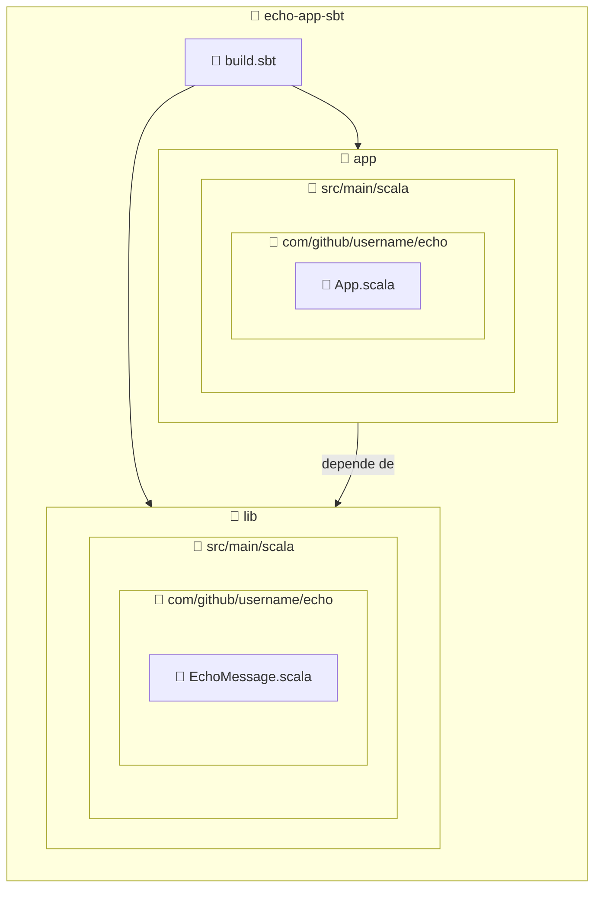

import ReadingTime from '@site/src/components/ReadingTime'
import Explanation from '@site/src/components/admonitions/Explanation'
import BoxedTabs from '@site/src/components/cajitas/BoxedTabs'
import TabItem from '@theme/TabItem'
import GithubRepoLink from '@site/src/components/GithubRepoLink'
import Ps from '@site/src/components/mdx/build-systems/modular-design/sbt/ps.mdx'
import Bash from '@site/src/components/mdx/build-systems/modular-design/sbt/bash.mdx'
import Glossary from '@site/src/components/admonitions/Glossary'

<ReadingTime />
<GithubRepoLink user="r8vnhill" repo="echo-app-sbt" />

Antes de que una biblioteca crezca —antes de agregar pruebas o automatizar tareas—, es fundamental estructurar bien el proyecto. Si en la lección anterior aprendiste a crear un proyecto básico con sbt y a ejecutar tu primer programa en Scala 3, esta vez daremos un paso más allá: **modularizar tu aplicación**.

En esta lección aprenderás a organizar un proyecto multi-módulo con sbt, una práctica esencial para desarrollar bibliotecas reutilizables y aplicaciones escalables. A través de un ejemplo simple pero completo, veremos cómo:

- Definir múltiples subproyectos (`lib` y `app`) dentro de un mismo `build.sbt`.
- Compartir configuraciones comunes entre módulos.
- Reutilizar lógica definida en un módulo desde otro.
- Ejecutar un subproyecto específico desde la línea de comandos.

Este enfoque modular te permitirá escribir código más limpio, reutilizable y fácil de mantener. Lo que comienza como un proyecto simple puede convertirse en una base sólida para bibliotecas profesionales. **Paso a paso, construimos una arquitectura que Scala (hehe).**

<Glossary>

- **Multi-módulo**: Estructura de proyecto donde el código se divide en varios subproyectos (`lib`, `app`, etc.), cada uno con su propia funcionalidad. Permite separar responsabilidades y facilita el mantenimiento y la escalabilidad del código.
- **`build.sbt`**: Archivo de configuración principal de sbt. Define los módulos del proyecto, sus dependencias, configuraciones compartidas y más.
- **Paquete**: Estructura jerárquica utilizada para organizar el código en namespaces. En Scala se suelen usar dominios invertidos, como `com.github.username.echo`.

</Glossary>

## 🏗️ Estructura esperada del proyecto

Antes de configurar el `build.sbt`, es importante visualizar cómo estará organizado el proyecto. Nuestro objetivo es dividirlo en dos subproyectos: una **biblioteca (`lib`)** que contendrá la lógica de negocio reutilizable, y una **aplicación (`app`)** que funcionará como punto de entrada y consumirá esa biblioteca.

La siguiente estructura refleja esta separación, mostrando cómo se distribuyen los archivos fuente dentro de cada módulo y cómo se conectan entre sí:



:::info Explicación de la estructura

Este proyecto está dividido en dos módulos: una biblioteca (`lib`) y una aplicación (`app`). Ambos son definidos en el archivo raíz `build.sbt`, lo que permite que compartan configuraciones y se compilen como parte del mismo proyecto.

- `lib/` contiene la lógica de negocio reutilizable, organizada en el paquete `com.github.username.echo`.
- `app/` define la aplicación que importa y utiliza la funcionalidad de `lib`, dentro del mismo paquete para mantener consistencia.
- `EchoMessage.scala` representa una función o clase reutilizable en la biblioteca.
- `App.scala` actúa como punto de entrada de la aplicación.
- El subproyecto `app` declara una dependencia directa sobre `lib`, lo que permite acceder a su código sin necesidad de duplicación.

Esta estructura modular refleja buenas prácticas de diseño en proyectos reales, donde la separación entre lógica de negocio y lógica de ejecución permite mayor claridad, mantenibilidad y escalabilidad.

:::

:::tip ¿Y la carpeta `src/` que habíamos creado antes?

Puedes eliminar el directorio `src/` que creaste en la lección anterior, o guardarlo como recuerdo.

:::


## 📦 Paso 1: Crear la estructura de carpetas

<BoxedTabs groupId={"os"}>
    <TabItem value="Windows" label="Windows">
        <Ps />
    </TabItem>
    <TabItem value="macOS" label="macOS">
        <Bash />
    </TabItem>
    <TabItem value="Ubuntu/Debian" label="Ubuntu/Debian">
        <Bash />
    </TabItem>
</BoxedTabs>


## 🧱 Paso 2: Declarar los módulos del proyecto

Para transformar nuestro proyecto en una estructura multi-módulo, comenzamos por definir sus componentes principales dentro del archivo `build.sbt` raíz:

```scala showLineNumbers title="build.sbt"
val scala3Version = "3.6.4"

lazy val commonSettings = Seq(
    scalaVersion := scala3Version
)

lazy val lib = project
  .in(file("lib"))
  .settings(commonSettings *)

lazy val app = project
  .in(file("app"))
  .dependsOn(lib)
  .settings(commonSettings *)
```

<Explanation>
    En este paso transformamos nuestro proyecto en una **estructura multi-módulo**, lo que nos permite separar responsabilidades entre distintos componentes (por ejemplo, una biblioteca reutilizable y una aplicación principal).

    - Primero definimos `scala3Version` como una variable para centralizar la versión del compilador.
    - Luego creamos una lista llamada `commonSettings` que contiene configuraciones compartidas, como `scalaVersion`.
    - A continuación declaramos dos módulos (`lib` y `app`) usando `lazy val`:
        - `lib` se encuentra en el subdirectorio `lib/` y recibe las configuraciones comunes.
        - `app` se encuentra en `app/`, también hereda las configuraciones comunes y depende explícitamente de `lib` usando `.dependsOn(lib)`.

    Usamos **`lazy val`** porque `sbt` necesita construir la estructura del proyecto de forma perezosa (lazy): permite que las referencias entre proyectos (como `app.dependsOn(lib)`) se resuelvan sin problemas incluso si aún no se han evaluado por completo.  
    Esto evita errores de orden de inicialización y permite que `sbt` maneje correctamente las dependencias entre módulos.
</Explanation>

Esta estructura modular es especialmente útil en proyectos de bibliotecas, ya que permite mantener el código reutilizable separado del código específico de una aplicación o herramienta.

## 📦 Paso 3: Crear el módulo de biblioteca

Una vez declarado el subproyecto `lib`, es momento de comenzar a escribir la lógica de negocio que deseamos reutilizar. Empezaremos con una función sencilla, pensada para ser consumida desde otros módulos:

```scala title="lib/src/main/scala/com/github/username/echo/EchoMessage.scala" showLineNumbers
package com.github.username
package echo

def echoMessage(message: String): String = message
```

<Explanation>
    Este archivo define un **componente reutilizable** dentro del subproyecto `lib`.

    - El paquete `com.github.username.echo` sigue la convención de dominios invertidos, facilitando la organización del código en proyectos más grandes.
    - La función `echoMessage` simplemente devuelve el mismo mensaje que recibe. Aunque su comportamiento es sencillo, nos servirá para verificar que otros módulos pueden importar y utilizar funcionalidades definidas en esta biblioteca.

    Este módulo marca el punto de partida para construir una biblioteca bien estructurada, que podrá crecer y evolucionar conforme avancemos en el curso.
</Explanation>

## 🚀 Paso 4: Crear el módulo de aplicación

Ahora que tenemos una biblioteca reutilizable en `lib`, es momento de crear el subproyecto `app`, encargado de ejecutar la lógica principal del programa. Esta aplicación imprimirá en consola los mensajes recibidos como argumentos, utilizando la función `echoMessage` definida previamente.

```scala title="app/src/main/scala/com/github/username/echo/App.scala" showLineNumbers
package com.github.username
package echo

@main def app(args: String*): Unit =
  for arg <- args do
    println(echoMessage(arg))
```

<Explanation>
    Este archivo define la **aplicación principal** del proyecto. Su objetivo es utilizar la funcionalidad proporcionada por la biblioteca `lib`.

    - La anotación `@main` indica que esta es la función de entrada del programa. Scala 3 permite definir puntos de entrada sin necesidad de declarar una clase o `object`.
    - La función recibe los argumentos de línea de comandos como una secuencia variable (`String*`) y los recorre con un bucle `for`.
    - Cada argumento se imprime utilizando la función `echoMessage`, definida en el subproyecto `lib`.

    Gracias a esta integración, podemos verificar que `app` depende correctamente de `lib`, y que los módulos se comunican de forma efectiva dentro del mismo proyecto multi-módulo.
</Explanation>

Este paso demuestra cómo separar la lógica de ejecución (aplicación) de la lógica reutilizable (biblioteca), una práctica esencial para construir proyectos bien organizados y escalables.

## 🧪 Paso 5: Ejecutar la aplicación

Con ambos módulos ya configurados y conectados, es momento de ejecutar `app` desde la raíz del proyecto para comprobar que la integración entre módulos funciona correctamente.

```bash
sbt "app/run Alex Dim Nah Dim"
```

Deberías ver una salida como esta:

```plaintext
Alex
Dim
Nah
Dim
```

<Explanation>
    En este paso usamos el comando `sbt "app/run"` para compilar y ejecutar el subproyecto `app`.  
    Los argumentos que siguen (`Alex Dim Nah Dim`) se envían directamente a la función `@main` definida en `App.scala`.

    - Scala ejecuta la función principal con los argumentos indicados.
    - Cada uno se procesa mediante `echoMessage`, definida en el subproyecto `lib`, y se imprime por separado.
    - Elegimos nombres de personajes de *A Clockwork Orange* como una forma divertida de verificar el comportamiento del programa.

    Este paso valida que la **estructura modular del proyecto está funcionando**: `app` puede usar sin problemas la lógica definida en `lib`, y sbt maneja correctamente la compilación y ejecución de ambos módulos.
</Explanation>

Con esta ejecución completamos la primera prueba de integración de nuestro proyecto multi-módulo. A partir de aquí, podemos escalar la aplicación o la biblioteca de forma independiente, manteniendo una separación clara de responsabilidades.

## 🎯 Conclusiones

Dividir un proyecto en múltiples módulos no solo mejora la organización del código, sino que sienta las bases para desarrollar software más **escalable**, **reutilizable** y **mantenible**. En esta lección aprendimos a estructurar un proyecto multi-módulo con sbt, separando la lógica principal de la aplicación (`app`) de una biblioteca reutilizable (`lib`), todo dentro de una configuración común y coherente.

También exploramos cómo ejecutar la aplicación con argumentos personalizados, lo que nos permitió validar la integración entre módulos y ver en acción una arquitectura modular.

### 🔑 Puntos clave

- sbt permite declarar múltiples subproyectos con `lazy val` dentro de un único `build.sbt`.
- Compartir `commonSettings` asegura coherencia entre módulos y simplifica la configuración global.
- La directiva `.dependsOn(...)` conecta módulos para compartir funcionalidades de forma explícita.
- Scala 3 permite usar `@main` para definir puntos de entrada sin necesidad de `object` o `App`.
- Para ejecutar un subproyecto, usamos `sbt "nombreModulo/run"` desde la raíz del proyecto.

### 🧰 ¿Qué nos llevamos?

Esta lección no solo mostró cómo configurar un proyecto multi-módulo, sino **por qué conviene hacerlo desde el inicio**.  
Aprendimos a separar responsabilidades, reducir el acoplamiento y preparar la base del proyecto para escalar con claridad.

Con esta estructura podemos:

- Añadir nuevas funcionalidades en `lib` sin afectar directamente a `app`.
- Reutilizar la biblioteca en otros proyectos si es necesario.
- Incorporar más módulos (como pruebas, documentación o herramientas internas) sin perder orden ni coherencia.

Empezamos con un simple "echo" y terminamos con una **arquitectura preparada para crecer**. En el desarrollo de bibliotecas, **modularizar desde el principio** es una decisión clave para crear proyectos sostenibles y profesionales.

<div class="exclude-from-reading-time">
## 📖 Referencias

### 🔥 Recomendadas

- [🌐 *"Multi-project builds"*](https://www.scala-sbt.org/1.x/docs/Multi-Project.html) en **la documentación oficial de sbt**: Introduce cómo estructurar múltiples subproyectos en un mismo `build.sbt`. Explica cómo definir módulos (`lazy val`), compartir configuraciones y establecer dependencias con `.dependsOn(...)`. Es clave para entender la arquitectura modular en sbt.

### 🔹 Adicionales

- [🎥 *"SBT in Scala (part 2) - Setting up Modules, Organizing Builds, Using Plugins"*](https://www.youtube.com/watch?v=HBZDKt9ZqSg) (19m40s) en *YouTube* por **Rock the JVM**: Muestra paso a paso cómo crear un proyecto multi-módulo en sbt y aplicar buenas prácticas como centralizar configuraciones, usar plugins y definir constantes en archivos Scala. Ideal para complementar la teoría con un caso práctico.
</div>