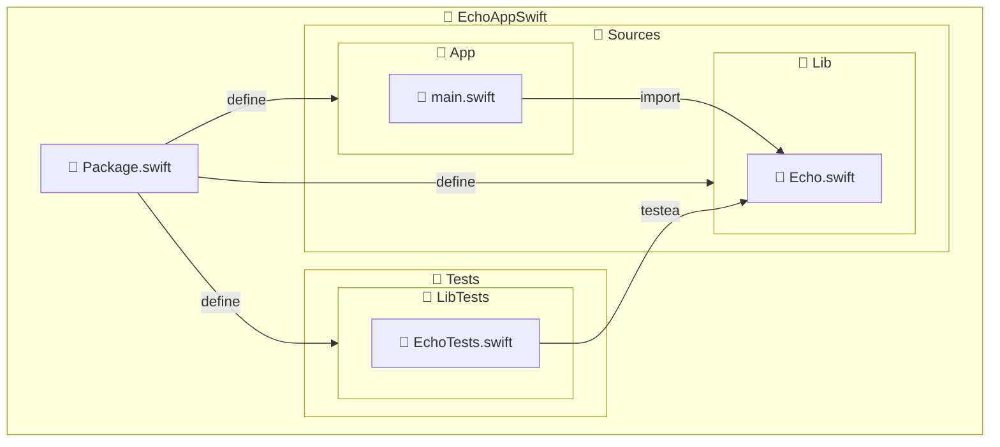

import { ProCons, Pros, Cons } from '@site/src/components/cajitas/ProCons'
import Explanation from '@site/src/components/admonitions/Explanation'
import GitHubRepoLink from "@site/src/components/GithubRepoLink";
import BoxedTabs from '@site/src/components/cajitas/BoxedTabs'
import TabItem from '@theme/TabItem'
import Glossary from '@site/src/components/admonitions/Glossary'
import Sh from '@site/src/components/mdx/build-systems/modular-design/swift/sh.mdx'
import ExcludeFromReadingTime from '@site/src/components/reading-time/ExcludeFromReadingTime'
import ReadingTime from '@site/src/components/reading-time/ReadingTime'

<ReadingTime/>
<GitHubRepoLink repo={"echo-app-swift"} user={"r8vnhill"} />

En esta lección vamos a ir más allá del típico archivo `main.swift`: aprenderás a **estructurar un proyecto Swift en múltiples módulos** usando [Swift Package Manager (SwiftPM)](https://www.swift.org/package-manager/), la herramienta oficial para construir, distribuir y organizar código en Swift.

Dividiremos el proyecto en tres partes:
- Un ejecutable (`App`) que actúa como punto de entrada.
- Una biblioteca (`Lib`) que contiene la lógica reutilizable.
- Un conjunto de pruebas (`LibTests`) que valida esa lógica.

Este enfoque modular no solo mejora la organización del código, sino que sienta las bases para proyectos **escalables, testeables y fáciles de mantener** — como los que se esperan en entornos profesionales.

:::tip ¿Por qué importa?

Diseñar un proyecto con módulos bien definidos te permite **trabajar por capas**, **reutilizar lógica en distintos contextos**, y **acelerar el desarrollo y las pruebas**.

:::

Al terminar esta lección, estarás en condiciones de construir tus propias bibliotecas en Swift, integrarlas en aplicaciones y ejecutar proyectos bien estructurados desde la terminal.

_Let's-a go!_ 🚀

<Glossary>
    - **SwiftPM (Swift Package Manager)**: Herramienta oficial de Swift para gestionar dependencias, compilar, testear y distribuir código. Equivalente a Gradle en Kotlin o Cargo en Rust.
    - **Target**: Unidad de compilación dentro de un paquete Swift. Puede ser un ejecutable, una biblioteca o un conjunto de pruebas.
    - **Product**: Resultado exportable de uno o más targets. Puede ser una librería (`library`) o una aplicación (`executable`).
    - **Module**: Unidad lógica de código importable en Swift. Cada target define un módulo.
</Glossary>

## 🏗️ Estructura de carpetas para proyectos Swift con SwiftPM

SwiftPM impone una convención estricta de carpetas para que los módulos (targets) funcionen correctamente.
A continuación se muestra la estructura completa que debe seguir el proyecto EchoAppSwift para compilar correctamente y mantener una separación clara entre ejecutable, biblioteca y pruebas:



::::info Explicación de la estructura del proyecto

Este diagrama muestra cómo organizar un proyecto modular en Swift utilizando **Swift Package Manager (SwiftPM)**, respetando sus convenciones:

- **`Package.swift`**: Archivo central de configuración donde se declaran los módulos (`App`, `Lib`, `LibTests`) y sus relaciones.
- **`Sources/App/`**: Contiene el ejecutable principal. SwiftPM buscará aquí un archivo `main.swift` como punto de entrada del programa.
- **`Sources/Lib/`**: Módulo de biblioteca reutilizable. Puede ser importado por `App` o cualquier otro módulo.
- **`Tests/LibTests/`**: Módulo de pruebas unitarias para `Lib`. SwiftPM vincula automáticamente esta carpeta con el target de pruebas `LibTests`.

:::warning Convención estricta de nombres

Los nombres de las carpetas dentro de `Sources/` y `Tests/` deben coincidir **exactamente** con los nombres de los targets definidos en `Package.swift`. De lo contrario, SwiftPM no podrá asociarlos correctamente.

:::
::::

## 📦 Paso 1: Crear la estructura de carpetas

Desde la raíz del proyecto:

<BoxedTabs groupId={"os"}>
    <TabItem value="Windows" label="Windows">
        ```powershell showLineNumbers title="scripts/ps1/CreateProjectStructure.ps1"
        @{
            App = @("Sources/App/main.swift")
            Lib = @("Sources/Lib/Echo.swift", "Tests/EchoTests.swift")
        }.GetEnumerator() | ForEach-Object {
            $module = $_.Key
            $files = $_.Value

            Write-Host "📁 Creating structure for module: $module" -ForegroundColor Cyan

            foreach ($file in $files) {
                $dir = Split-Path $file -Parent
                if (-not (Test-Path $dir)) {
                    New-Item -Path $dir -ItemType Directory -Force | Out-Null
                }
                New-Item -Path $file -ItemType File -Force | Out-Null
                Write-Host "✅ $file" -ForegroundColor Green
            }
        }

        Write-Host "🟢 Project initialized successfully." -ForegroundColor Green
        ```

        <Explanation>
            Este fragmento de PowerShell crea de forma automática la estructura mínima de archivos y carpetas para un proyecto modular en Swift usando SwiftPM.

            Se define un diccionario que asocia cada módulo (`App` y `Lib`) con los archivos que debe contener. Luego, por cada archivo:
            
            - Se crea el directorio padre si no existe (`Sources/App`, `Sources/Lib`, `Tests`).
            - Se crea un archivo vacío (`main.swift`, `Echo.swift`, `EchoTests.swift`).

            Esto garantiza que el proyecto tenga la estructura correcta para compilar sin errores desde el principio.
        </Explanation>

        Puedes crear el archivo `CreateProjectStructure.ps1` y ejecutarlo desde PowerShell para crear la estructura de carpetas y archivos automáticamente.

        ```powershell
        .\scripts\ps1\CreateProjectStructure.ps1
        ```
    </TabItem>
    <TabItem value="macOS" label="macOS">
        <Sh />
    </TabItem>
    <TabItem value="Ubuntu/Debian" label="Ubuntu/Debian">
        <Sh />
    </TabItem>
</BoxedTabs>

## 🧩 Paso 2: Declarar módulos y productos

Vamos a definir la configuración del proyecto en `Package.swift`. Aquí declaramos:

- Un ejecutable llamado `App`, que actuará como punto de entrada del programa.
- Una biblioteca llamada `Lib`, que contendrá la lógica reutilizable del proyecto.
- Un módulo de pruebas llamado `LibTests`, encargado de verificar el comportamiento de `Lib`.

```swift showLineNumbers title="Package.swift"
// swift-tools-version: 6.1
import PackageDescription

let package = Package(
    name: "echo-app-swift",
    products: [
        .executable(name: "App", targets: ["App"]),   // Ejecutable principal
        .library(name: "Lib", targets: ["Lib"])       // Biblioteca reutilizable
    ],
    targets: [
        .target(name: "Lib"),                         // Lógica central del proyecto
        .executableTarget(
            name: "App",
            dependencies: ["Lib"]                     // App depende de Lib
        ),
        .testTarget(
            name: "LibTests",
            dependencies: ["Lib"]                     // Pruebas para Lib
        )
    ]
)
```

<Explanation>
    Este archivo configura el proyecto como un **paquete Swift modular y multiplataforma**.

    - `App` es el ejecutable principal: puede compilarse y ejecutarse desde la línea de comandos.
    - `Lib` es la biblioteca donde colocamos la lógica principal del proyecto (como la función `echo`).
    - `LibTests` es un módulo de pruebas unitarias que verifica el comportamiento de `Lib`.

    Al declarar explícitamente estos módulos y sus dependencias, SwiftPM entiende cómo construir, enlazar y testear cada componente.
</Explanation>

## 🧪 Paso 3: Implementar la lógica reutilizable

Vamos a definir una función `echo` dentro de la biblioteca `Lib`. Esta función será pública para que el módulo `App` pueda utilizarla.

```swift showLineNumbers title="Sources/Lib/Echo.swift"
public func echo(_ message: String) -> String {
    return message
}
```

<Explanation>
    En este paso implementamos una función pública `echo`, que simplemente devuelve el mensaje recibido como argumento.

    - Se utiliza el modificador `public` para que la función esté disponible fuera del módulo `Lib`. Si omitiéramos `public`, la función tendría visibilidad solo dentro del mismo módulo.
    - Aunque su comportamiento es trivial, la función nos permite establecer una separación clara entre la **lógica de negocio** (en `Lib`) y el **punto de entrada** (en `App`).

    Este archivo representa la **unidad más básica de lógica reutilizable** y servirá como base para futuras pruebas y extensiones.
</Explanation>

## 🚀 Paso 4: Crear el punto de entrada de la aplicación

Ahora implementamos la función principal de la aplicación en el módulo `App`, que utilizará la función `echo` definida en la biblioteca `Lib`.

```swift showLineNumbers title="Sources/App/main.swift"
import Lib

func main() {
    // Ignora el primer argumento (nombre del ejecutable)
    let args = CommandLine.arguments.dropFirst()
    for arg in args {
        print(echo(arg))
    }
}

main()
```

<Explanation>
    Este archivo define el **punto de entrada** del ejecutable:

    - `import Lib` permite acceder a la función `echo` declarada como `public` en el módulo `Lib`.
    - `CommandLine.arguments` recupera todos los argumentos pasados al ejecutar el programa.
    - `dropFirst()` descarta el primer argumento (el nombre del ejecutable), ya que no nos interesa procesarlo.
    - Se recorre cada argumento restante y se imprime el resultado de `echo(arg)`.

    Este diseño deja clara la separación entre la **lógica de aplicación** (cómo interactuar con el sistema o el usuario) y la **lógica de negocio** (qué hacer con esos datos), favoreciendo un estilo modular y mantenible.
</Explanation>

## ▶️ Paso 5: Ejecutar la aplicación

Una vez que has definido los módulos y escrito el código, puedes ejecutar la aplicación directamente desde la terminal con:

```bash title="En tu terminal"
swift run App Kanna Kenji Friend
```

```plaintext title="Salida esperada"
Kanna
Kenji
Friend
```

<Explanation>
    El comando `swift run App` compila el módulo `App` (si es necesario) y lo ejecuta, pasando los argumentos `Kanna`, `Kenji` y `Friend` desde la línea de comandos.

    Cada argumento se imprime en una línea distinta, lo que demuestra que:

    - `App` está invocando correctamente la función `echo` definida en `Lib`.
    - El programa responde dinámicamente a entradas del usuario.
    - La separación entre lógica de negocio (`Lib`) y lógica de aplicación (`App`) funciona de forma efectiva.
</Explanation>

✅ ¡Tu primer programa modular en Swift está en marcha!

## 🎯 Conclusiones

En esta lección aprendiste a estructurar un proyecto en Swift utilizando una arquitectura modular con **Swift Package Manager (SwiftPM)**.

Partiste desde cero y construiste una estructura clara que separa la **lógica de aplicación** (módulo `App`) de la **lógica reutilizable** (módulo `Lib`). También sentaste las bases para un desarrollo profesional al incluir un módulo de pruebas (`LibTests`), aunque aún no hayas escrito tests.

Esta separación no solo mejora la organización, sino que te prepara para escalar el proyecto, reutilizar componentes y aplicar buenas prácticas como pruebas automatizadas e integración continua.

### 🔑 Puntos clave

- **SwiftPM** permite definir ejecutables, bibliotecas y pruebas dentro de un mismo proyecto siguiendo convenciones claras.
- El archivo `Package.swift` es el centro de la configuración: ahí se declaran los módulos y sus relaciones.
- El módulo `App` actúa como punto de entrada y puede depender de bibliotecas como `Lib`.
- El módulo `Lib` encapsula la lógica reutilizable; su visibilidad se controla con el modificador `public`.
- El módulo `LibTests` permite probar la biblioteca de forma aislada.
- Una estructura modular mejora la escalabilidad, el mantenimiento y la testabilidad del software.

### 🧰 ¿Qué nos llevamos?

Pasaste de un archivo Swift suelto a una **estructura profesional y escalable**, donde cada módulo cumple un rol bien definido.

Aprendiste a:

- Respetar las convenciones de SwiftPM.
- Diseñar una arquitectura basada en la separación de responsabilidades.
- Compartir funcionalidad entre módulos mediante `import`.
- Ejecutar tu aplicación con argumentos desde la línea de comandos.

Este enfoque modular será la base para futuras lecciones donde abordaremos pruebas, documentación, empaquetado y automatización.  
**Ya estás pensando como quien diseña software, no solo como quien lo escribe.**

<ExcludeFromReadingTime>

## 📖 Referencias

### 🔥 Recomendadas

- [🌐 "Package Manager"](https://www.swift.org/documentation/package-manager/) de **la documentación oficial de Swift**: Explica los fundamentos de **Swift Package Manager (SwiftPM)**, incluyendo cómo definir módulos (`targets`), productos (`products`) y dependencias. La lección usa precisamente estos conceptos para estructurar el proyecto en módulos (`App`, `Lib`, `LibTests`) y compartir lógica mediante `import`. Esta lectura es clave para entender cómo SwiftPM organiza, compila y vincula proyectos modulares de manera automática y escalable.

### 🔹 Adicionales

- [📰 "Modular Project Structure with Swift Package Manager (SPM)"](https://santoshbotre01.medium.com/modular-project-structure-with-swift-package-manager-spm-c81fb62c8619) de **Santosh Botre**: Explica cómo estructurar aplicaciones iOS en múltiples módulos usando **Swift Package Manager** para lograr escalabilidad, reutilización y aislamiento. Presenta un enfoque práctico para dividir el código en paquetes locales (como `Network`, `Logger`, `Login`, etc.) y vincularlos al proyecto. Es relevante para esta lección porque ilustra los beneficios y el proceso de migrar de un diseño monolítico a una arquitectura modular realista con SwiftPM.

</ExcludeFromReadingTime>
