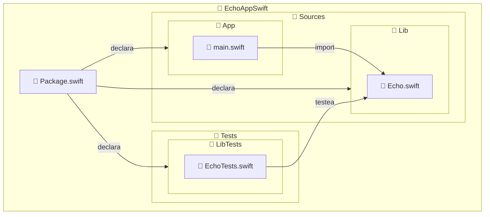

import { ProCons, Pros, Cons } from '@site/src/components/cajitas/ProCons'
import Explanation from '@site/src/components/admonitions/Explanation'
import GitHubRepoLink from "@site/src/components/GithubRepoLink";
import ReadingTime from '@site/src/components/ReadingTime';
import BoxedTabs from '@site/src/components/cajitas/BoxedTabs'
import TabItem from '@theme/TabItem'

<ReadingTime/>
<GitHubRepoLink repo={"echo-app-swift"} user={"r8vnhill"} />

En esta lección vamos a dar un paso más allá del típico archivo `main.swift`: aprenderás a **estructurar un proyecto Swift en múltiples módulos** usando [Swift Package Manager (SwiftPM)](https://www.swift.org/package-manager/), la herramienta oficial para construir, distribuir y organizar código en Swift.

Dividiremos el proyecto en tres partes:  
- Un ejecutable (`App`) que actúa como punto de entrada,  
- Una biblioteca (`Lib`) que contiene la lógica reutilizable,  
- Y un conjunto de pruebas (`LibTests`) que valida esa lógica.

Este enfoque modular no solo mejora la organización del código, sino que sienta las bases para proyectos más escalables, testeables y fáciles de mantener — como los que se esperan en entornos profesionales.

:::tip ¿Por qué importa?

Diseñar un proyecto en módulos bien definidos te permite **trabajar en capas**, **reutilizar lógica** en múltiples contextos, y **acelerar los ciclos de desarrollo y prueba**.

:::

Al terminar esta lección, estarás en condiciones de construir tus propias bibliotecas Swift, integrarlas en aplicaciones y ejecutar proyectos bien estructurados desde la terminal.

Let's-a go!

## 🏗️ Estructura esperada del proyecto

SwiftPM impone una convención estricta de carpetas para que los módulos (targets) funcionen correctamente.
A continuación se muestra la estructura completa que debe seguir el proyecto `EchoAppSwift` para que compile correctamente y mantenga una separación clara entre ejecutable, biblioteca y pruebas:



:::info Explicación de la estructura del proyecto

Este diagrama muestra cómo organizar un proyecto modular en Swift utilizando **Swift Package Manager (SwiftPM)**, respetando sus convenciones:

- **`Package.swift`**: Archivo central de configuración donde se declaran los módulos (`App`, `Lib`, `LibTests`) y sus relaciones.
- **`Sources/App/`**: Contiene el ejecutable principal. SwiftPM buscará aquí un archivo `main.swift` como punto de entrada del programa.
- **`Sources/Lib/`**: Módulo de biblioteca reutilizable. Puede ser importado por `App` o cualquier otro módulo.
- **`Tests/LibTests/`**: Módulo de pruebas unitarias para `Lib`. SwiftPM asocia automáticamente esta carpeta con el target `LibTests`.

📌 Los nombres de las carpetas dentro de `Sources/` y `Tests/` deben coincidir **exactamente** con los nombres de los targets definidos en `Package.swift`.

:::

## 📦 Paso 1: Crear la estructura de carpetas

Desde la raíz del proyecto:

<BoxedTabs groupId={"os"}>
  <TabItem value="Windows" label="Windows">
        ```powershell title="En PowerShell"
        'App', 'Lib' | ForEach-Object {
            $target = "Sources/$_"
            New-Item $target -ItemType Directory -Force | Out-Null

            switch ($_) {
                'App' {
                    New-Item "$target/main.swift" `
                        -ItemType File -Force | Out-Null
                }
                'Lib' {
                    $echo = 'Echo'
                    New-Item "$target/$echo.swift", `
                        "Tests/${echo}Tests.swift" `
                        -ItemType File -Force | Out-Null
                }
            }
        }
        ```

        <Explanation>
            Este script inicializa la estructura de un proyecto Swift con dos módulos:

            - **`Sources/App/`**: contiene el archivo `main.swift` como punto de entrada para la aplicación.
            - **`Sources/Lib/`**: define la biblioteca reutilizable en `Echo.swift`.
            - **`Tests/`**: contiene el archivo `EchoTests.swift` para pruebas automatizadas de la biblioteca.
            - **`| Out-Null`** se usa para suprimir la salida de la consola al crear directorios y archivos.

            El uso de `switch` permite generar diferentes archivos según el módulo, y las rutas se construyen dinámicamente para mantener el código claro y compacto.
        </Explanation>
        </TabItem>
        <TabItem value="Windows (corto)" label="Windows (corto)">
            ```powershell title="En PowerShell"
            'App', 'Lib' | % {
                $src = "Sources/$_"
                md $src -f > $null

                switch ($_) {
                    'App' { ni "$src/main.swift" -f > $null }
                    'Lib' { ni "$src/Echo.swift", "Tests/EchoTests.swift" -f > $null }
                }
            }
            ```

            <Explanation>
                Este bloque configura la estructura inicial de un proyecto Swift dividido en dos módulos:

                - Crea los directorios `Sources/App` y `Sources/Lib`.
                - En `App`, genera el archivo `main.swift`, punto de entrada de la aplicación.
                - En `Lib`, crea `Echo.swift` (lógica reutilizable) y `EchoTests.swift` dentro de `Tests` para futuras pruebas.

                El uso de `> $null` en cada comando suprime la salida innecesaria en la consola, manteniendo el script limpio y silencioso.
            </Explanation>
    </TabItem>
    <TabItem value="Linux/macOS" label="Linux/macOS">
        ```bash title="En tu terminal (Linux/macOS)"
        mkdir -p Tests  # Asegura que la carpeta de pruebas exista
        for module in App Lib; do
            src="Sources"
            mkdir -p "$src/$module"  # Crea la carpeta del módulo

            case "$module" in
                App)
                    touch "$src/$module/main.swift"  # Archivo principal de la app
                    ;;
                Lib)
                    touch "$src/$module/Echo.swift"  # Lógica compartida (biblioteca)
                    touch "Tests/EchoTests.swift"    # Archivo de pruebas para la biblioteca
                    ;;
            esac
        done
        ```

        <Explanation>
            Este script configura un proyecto Swift modular:

            - Crea los directorios `Sources/App` y `Sources/Lib`, donde vivirán los archivos fuente.
            - Si el módulo es `App`, genera `main.swift`, el punto de entrada de la aplicación.
            - Si el módulo es `Lib`, crea `Echo.swift` para la lógica reutilizable y `EchoTests.swift` dentro de `Tests` para escribir pruebas más adelante.

            El uso de `case` mejora la claridad respecto a múltiples condiciones, facilitando la escalabilidad del script si se agregan más módulos en el futuro.
        </Explanation>
    </TabItem>
</BoxedTabs>

## 🧩 Paso 2: Declarar módulos y productos

Vamos a definir la configuración del proyecto en `Package.swift`. Aquí declaramos:

- Un ejecutable llamado `App`, que actuará como punto de entrada.
- Una biblioteca llamada `Lib`, que contendrá la lógica reutilizable.
- Un conjunto de pruebas unitarias llamado `LibTests`.

```swift showLineNumbers title="Package.swift"
// swift-tools-version: 6.1
import PackageDescription

let package = Package(
    name: "echo-app-swift",
    products: [
        .executable(name: "App", targets: ["App"]),   // Ejecutable principal
        .library(name: "Lib", targets: ["Lib"])       // Biblioteca compartida
    ],
    targets: [
        .target(name: "Lib"),                         // Lógica reutilizable
        .executableTarget(
            name: "App",
            dependencies: ["Lib"]                     // App depende de Lib
        ),
        .testTarget(
            name: "LibTests",
            dependencies: ["Lib"]                     // Pruebas para la biblioteca
        )
    ]
)
```

<Explanation>
    Este archivo configura el proyecto como un **paquete de Swift multiplataforma** con una estructura modular.

    - `App` será el ejecutable que se puede lanzar desde consola.
    - `Lib` es la biblioteca donde colocamos la lógica de negocio (como la función `echo`).
    - `LibTests` es un módulo de pruebas para verificar el comportamiento de `Lib`.

    Al declarar estas relaciones, el compilador entiende cómo construir cada componente y cómo se relacionan entre sí.
</Explanation>

## 🧪 Paso 3: Implementar la lógica reutilizable

Vamos a definir una función `echo` dentro de la biblioteca `Lib`. Esta función será pública para que el módulo `App` pueda usarla.

```swift showLineNumbers title="Sources/Lib/Echo.swift"
public func echo(_ message: String) -> String {
    return message
}
```

<Explanation>
    En este paso declaramos una función pública `echo`, que recibe un mensaje y lo devuelve sin cambios.

    - Usamos `public` para que otros módulos —como `App`— puedan acceder a esta función.
    - La función encapsula una responsabilidad simple, pero servirá como ejemplo para entender cómo se comparte lógica entre módulos.

    Este archivo representa la **unidad mínima de lógica de negocio** dentro de la biblioteca `Lib`.
</Explanation>

## 🚀 Paso 4: Crear el punto de entrada de la aplicación

Ahora implementamos la función principal de la aplicación en el módulo `App`, que utilizará la función `echo` de la biblioteca `Lib`.

```swift showLineNumbers title="Sources/App/main.swift"
import Lib

func main() {
    // Ignora el primer argumento (nombre del ejecutable)
    let args = CommandLine.arguments.dropFirst()
    for arg in args {
        print(echo(arg))
    }
}

main()
```

<Explanation>
    Este archivo define el punto de entrada del programa:

    - `import Lib` habilita el uso de funciones públicas del módulo `Lib`, como `echo`.
    - `CommandLine.arguments` captura los argumentos pasados por terminal.
    - `dropFirst()` elimina el primer argumento, que es el nombre del binario ejecutado.
    - `print(echo(arg))` imprime cada argumento utilizando la función definida en la biblioteca.

    Esta estructura demuestra cómo separar la **lógica de aplicación (App)** de la **lógica de negocio (Lib)**, siguiendo buenas prácticas de diseño modular.
</Explanation>

## ▶️ Paso 5: Ejecutar la aplicación

Una vez que has definido los módulos y escrito el código, puedes ejecutar la aplicación directamente desde la terminal con:

```bash title="En tu terminal"
swift run App Kanna Kenji Friend
```

```plaintext title="Salida esperada"
Kanna
Kenji
Friend
```

<Explanation>
    Este comando compila el proyecto (si es necesario) y ejecuta el módulo `App` con los argumentos `Kanna`, `Kenji` y `Friend`.
</Explanation>

Cada argumento se imprime en una nueva línea. Esto demuestra que:

- `App` puede consumir funciones públicas de `Lib`.
- El programa responde correctamente a entradas dinámicas.
- La separación entre biblioteca y aplicación funciona de forma efectiva.

✅ ¡Tu primer programa modular en Swift está en marcha!

## 🎯 Conclusiones

En esta lección aprendiste a estructurar un proyecto en Swift utilizando una arquitectura modular basada en **Swift Package Manager (SwiftPM)**.

Partiste desde cero y construiste una estructura que separa claramente la **lógica de aplicación** (módulo `App`) de la **lógica reutilizable** (módulo `Lib`). Además, sentaste las bases para un desarrollo profesional al incluir un módulo de pruebas (`LibTests`), aun cuando todavía no hayas escrito los tests.

Esta separación no solo mejora la organización del proyecto, sino que te prepara para escalarlo, reutilizar código entre proyectos, y aplicar buenas prácticas como pruebas unitarias e integración continua.

### 🔑 Puntos clave

- SwiftPM permite definir ejecutables, bibliotecas y pruebas dentro de un mismo proyecto, usando una convención clara de carpetas.
- El archivo `Package.swift` es el punto central para declarar módulos y sus relaciones.
- `App` actúa como punto de entrada y puede depender de bibliotecas como `Lib`.
- `Lib` contiene la lógica reutilizable, y su visibilidad se controla con el modificador `public`.
- `LibTests` permite probar la biblioteca de forma aislada.
- La separación modular mejora la escalabilidad, el mantenimiento y la testeabilidad del proyecto.

### 🧰 ¿Qué nos llevamos?

Con esta lección pasaste de tener un único archivo Swift a trabajar con una **estructura profesional y escalable**, donde cada módulo cumple un rol bien definido.

Aprendiste a:

- Respetar las convenciones de SwiftPM.
- Diseñar una arquitectura basada en separación de responsabilidades.
- Compartir funcionalidad entre módulos mediante `import`.
- Ejecutar un programa con argumentos desde la línea de comandos.

Este enfoque modular será la base para futuras lecciones en las que exploraremos pruebas, documentación, empaquetado y automatización. **Ya estás pensando como quien construye software, no solo como quien lo escribe.**

## 📖 Referencias

### 🔥 Recomendadas

- [🌐 "Package Manager"](https://www.swift.org/documentation/package-manager/) de **la documentación oficial de Swift**: Explica los fundamentos de **Swift Package Manager (SwiftPM)**, incluyendo cómo definir módulos (`targets`), productos (`products`) y dependencias. La lección usa precisamente estos conceptos para estructurar el proyecto en módulos (`App`, `Lib`, `LibTests`) y compartir lógica mediante `import`. Esta lectura es clave para entender cómo SwiftPM organiza, compila y vincula proyectos modulares de manera automática y escalable.

### 🔹 Adicionales

- [📰 "Modular Project Structure with Swift Package Manager (SPM)"](https://santoshbotre01.medium.com/modular-project-structure-with-swift-package-manager-spm-c81fb62c8619) de **Santosh Botre**: Explica cómo estructurar aplicaciones iOS en múltiples módulos usando **Swift Package Manager** para lograr escalabilidad, reutilización y aislamiento. Presenta un enfoque práctico para dividir el código en paquetes locales (como `Network`, `Logger`, `Login`, etc.) y vincularlos al proyecto. Es relevante para esta lección porque ilustra los beneficios y el proceso de migrar de un diseño monolítico a una arquitectura modular realista con SwiftPM.
