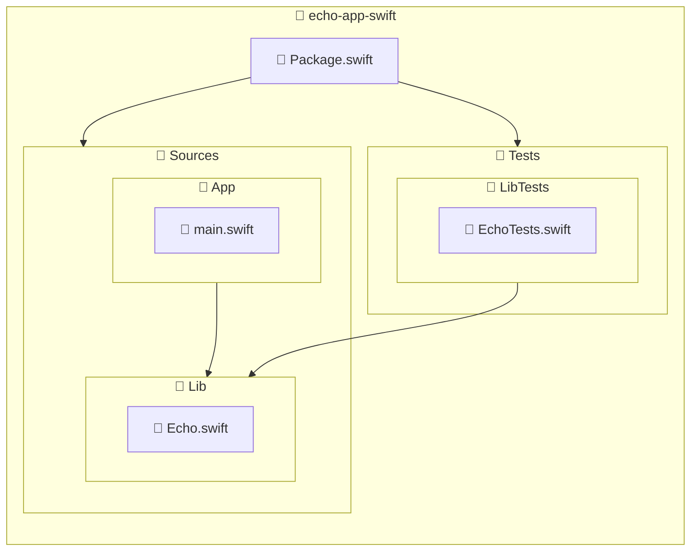

import { ProCons, Pros, Cons } from '@site/src/components/cajitas/ProCons'
import Explanation from '@site/src/components/admonitions/Explanation'
import GitHubRepoLink from "@site/src/components/GithubRepoLink";
import ReadingTime from '@site/src/components/ReadingTime';

<ReadingTime/>
<GitHubRepoLink repo={"echo-app-swift"} user={"r8vnhill"} />

En lecciones anteriores aprendiste cómo estructurar un proyecto multi-módulo utilizando **Gradle**. Ahora aplicaremos esos mismos principios en un entorno diferente: **Swift**.

Swift Package Manager (SwiftPM) es la herramienta oficial para gestionar dependencias, construir proyectos y organizar código en módulos dentro del ecosistema Swift. A diferencia de Gradle, SwiftPM favorece una estructura de carpetas muy estricta basada en convenciones, lo que simplifica muchas decisiones pero también limita algunas opciones de personalización.

En esta lección aprenderás a:

- Declarar múltiples módulos en `Package.swift`.
- Establecer relaciones de dependencia entre ellos.
- Comprender cómo SwiftPM estructura el código en carpetas y archivos.
- Preparar una base sólida para bibliotecas modulares escritas en Swift.

Aunque los ejemplos que verás aquí son simples, reproducen una estructura típica de proyectos reales —y escalables— que te servirá tanto para crear **bibliotecas reutilizables** como para organizar aplicaciones Swift complejas desde el inicio.

## 📦 Declarar múltiples módulos

En SwiftPM, los módulos se organizan como **targets** dentro de un archivo `Package.swift`.  
Para que otros paquetes o ejecutables puedan usar esos módulos, también se deben declarar como **productos**.

```swift showLineNumbers title="Package.swift"
// swift-tools-version: 6.0
import PackageDescription

let package = Package(
    name: "echo-app-swift",
    products: [
        .executable(name: "App", targets: ["App"]),
        .library(name: "Lib", targets: ["Lib"])
    ],
    targets: [
        .target(name: "Lib"),
        .executableTarget(
            name: "App",
            dependencies: ["Lib"]
        ),
        .testTarget(
            name: "LibTests",
            dependencies: ["Lib"]
        )
    ]
)
```

<Explanation>
    - **`products`**: Definen los artefactos que el paquete expone públicamente. En este caso, una **librería** (`Lib`) y un **ejecutable** (`App`).
    - **`targets`**: Representan los módulos reales que se compilan. Cada uno puede ser una librería, un ejecutable o un conjunto de tests.
    - `App` declara una dependencia interna sobre `Lib`, lo que le permite importar y usar su funcionalidad.
    - `LibTests` depende también de `Lib`, siguiendo el patrón común de "testear la biblioteca de forma aislada".
</Explanation>

## 🧱 Estructura de un proyecto multi-módulo en Swift

Al igual que en Gradle, Swift Package Manager (**SwiftPM**) permite organizar un proyecto en múltiples **módulos reutilizables**, llamados *targets*. Esta estructura facilita el desarrollo independiente, la reutilización y la escalabilidad del código.

Un proyecto básico puede organizarse así:



:::info Descripción de la estructura del proyecto

- **`Package.swift`**: Archivo de configuración del proyecto, donde se declaran los módulos (targets) y productos.
- **`Sources/App`**: Módulo ejecutable principal. Contiene la entrada del programa (`main.swift`) y depende de la biblioteca `Lib`.
- **`Sources/Lib`**: Módulo de biblioteca reutilizable. Puede incluir lógica compartida entre múltiples aplicaciones o tests.
- **`Tests/LibTests`**: Módulo de pruebas para la biblioteca `Lib`.

Este patrón de separación es estándar en SwiftPM y ayuda a mantener el código organizado y fácil de escalar.
:::

:::tip ¿Y el `main.swift` anterior?

Si previamente creaste un archivo `Sources/main.swift` fuera de un módulo, puedes eliminarlo.  
Ahora que el módulo ejecutable se llama `App`, todo el código de entrada debe ubicarse dentro de `Sources/App/main.swift`.
:::

## 🎯 Conclusiones

En esta lección aprendiste cómo estructurar un proyecto Swift utilizando múltiples módulos (*targets*) con Swift Package Manager (SwiftPM), siguiendo principios similares a los vistos en Gradle.

Esta organización es clave para proyectos **escalables, reutilizables y mantenibles**, especialmente cuando desarrollas bibliotecas de software que deben estar bien separadas de las aplicaciones que las consumen.

### 🔑 Puntos clave

- **SwiftPM organiza el proyecto a través de `Package.swift`**, donde defines productos (`library`, `executable`) y módulos (`target`, `testTarget`).
- **Cada target representa un módulo de código** que puede compilarse, testearse e integrarse de manera independiente.
- **Las dependencias entre módulos se declaran explícitamente**, por ejemplo, haciendo que el ejecutable `App` dependa de la biblioteca `Lib`.
- **La estructura de carpetas sigue convenciones estrictas**, como `Sources/` y `Tests/`, lo cual mejora la claridad y la interoperabilidad del proyecto.

### 🧰 ¿Qué nos llevamos?

Más allá de los detalles sintácticos y técnicos, esta lección te da una herramienta conceptual poderosa: **la modularidad como principio de diseño**.

Aprender a organizar un proyecto en múltiples módulos no es solo una cuestión de estilo o limpieza, sino una decisión estratégica que facilita el crecimiento, la prueba, la colaboración y la reutilización del código. SwiftPM, con su enfoque explícito y su estructura basada en convenciones, nos obliga a pensar de forma clara en **qué hace cada parte del sistema y cómo se relaciona con las demás**.

Al aplicar esta estructura desde los primeros pasos de tu proyecto, te estás preparando no solo para escribir buen código hoy, sino para mantenerlo y escalarlo mañana.

## 📖 Referencias

### 🔥 Recomendadas

- 🌐 Apple Inc. (s. f.). Package Manager. Swift.Org. Recuperado 4 de abril de 2025, de https://www.swift.org/documentation/package-manager/

{/* ### 🔹 Adicionales */}
