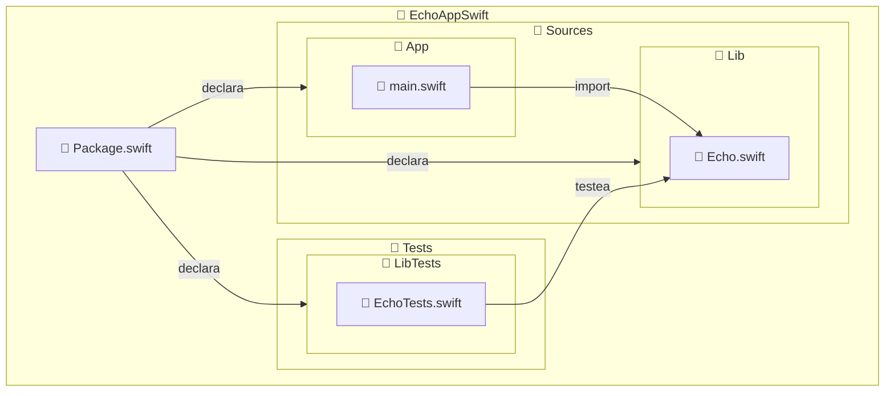
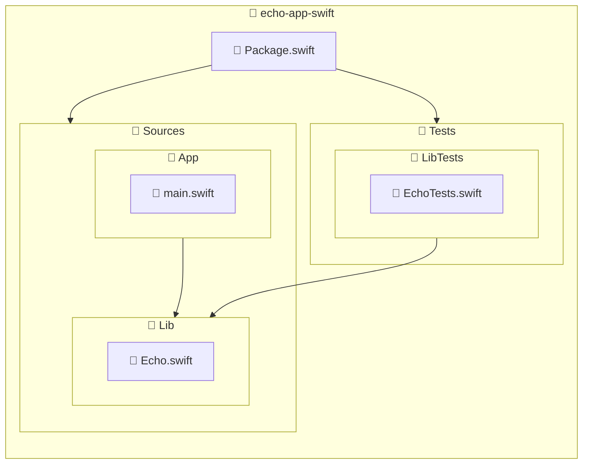

import { ProCons, Pros, Cons } from '@site/src/components/cajitas/ProCons'
import Explanation from '@site/src/components/admonitions/Explanation'
import GitHubRepoLink from "@site/src/components/GithubRepoLink";
import ReadingTime from '@site/src/components/ReadingTime';

<ReadingTime/>
<GitHubRepoLink repo={"echo-app-swift"} user={"r8vnhill"} />

## 🏗️ Estructura esperada del proyecto

SwiftPM impone una convención estricta de carpetas para que los módulos (targets) funcionen correctamente.
A continuación se muestra la estructura completa que debe seguir el proyecto `EchoAppSwift` para que compile correctamente y mantenga una separación clara entre ejecutable, biblioteca y pruebas:



:::info Explicación de la estructura del proyecto

Este diagrama muestra cómo organizar un proyecto modular en Swift utilizando **Swift Package Manager (SwiftPM)**, respetando sus convenciones:

- **`Package.swift`**: Archivo central de configuración donde se declaran los módulos (`App`, `Lib`, `LibTests`) y sus relaciones.
- **`Sources/App/`**: Contiene el ejecutable principal. SwiftPM buscará aquí un archivo `main.swift` como punto de entrada del programa.
- **`Sources/Lib/`**: Módulo de biblioteca reutilizable. Puede ser importado por `App` o cualquier otro módulo.
- **`Tests/LibTests/`**: Módulo de pruebas unitarias para `Lib`. SwiftPM asocia automáticamente esta carpeta con el target `LibTests`.

📌 Los nombres de las carpetas dentro de `Sources/` y `Tests/` deben coincidir **exactamente** con los nombres de los targets definidos en `Package.swift`.

:::

## 📦 Declarar múltiples módulos

En Swift, todos los proyectos gestionados con SwiftPM se definen a través de un archivo llamado `Package.swift`.
Este archivo actúa como el punto central de configuración: en él se declaran los módulos (llamados **targets**), los productos que se generan, sus dependencias internas y externas, y la versión mínima de herramientas requeridas para compilar el proyecto.

A continuación, un ejemplo completo que define una aplicación modular simple con una biblioteca y sus pruebas:

```swift showLineNumbers title="Declaración de módulos y productos (Package.swift)"
// swift-tools-version: 6.0
import PackageDescription

let package = Package(
    name: "echo-app-swift",
    products: [
        .executable(name: "App", targets: ["App"]),
        .library(name: "Lib", targets: ["Lib"])
    ],
    targets: [
        .target(name: "Lib"),
        .executableTarget(
            name: "App",
            dependencies: ["Lib"]
        ),
        .testTarget(
            name: "LibTests",
            dependencies: ["Lib"]
        )
    ]
)
```

<Explanation>
    Este archivo está compuesto por varias secciones clave:

    - **`// swift-tools-version: 6.0`**:
        Esta línea debe estar al inicio del archivo. Indica la versión mínima del `Swift Package Manager` requerida para interpretar correctamente la sintaxis y las capacidades usadas en el paquete.
    - **`import PackageDescription`**
        Importa la API necesaria para construir la definición del paquete. Es obligatorio para usar `Package`, `Target`, `Product`, etc.
    - **`name`**:
        Define el nombre del paquete. También será el nombre de la carpeta raíz del proyecto.
    - **`products`**:
        Declara los artefactos que este paquete expone públicamente.
        En este caso:
        - Un ejecutable llamado **`App`**, construido a partir del target `App`.
        - Una biblioteca llamada **`Lib`**, expuesta a partir del target `Lib`.
    - **`targets`**:
        Representan las unidades internas que SwiftPM compila.
        - `.target(name: "Lib")`: Un módulo de biblioteca con código reutilizable.
        - `.executableTarget(name: "App", dependencies: ["Lib"])`: Un ejecutable que **importa** y **usa** la biblioteca `Lib`.
        - `.testTarget(name: "LibTests", dependencies: ["Lib"])`: Un conjunto de pruebas unitarias que también depende de `Lib`, permitiendo testearla de forma aislada.

    Esta estructura modular facilita la separación de responsabilidades entre componentes del sistema, como:

    - **`Lib`** → lógica reutilizable
    - **`App`** → entrada principal de la aplicación
    - **`LibTests`** → validación de la biblioteca
</Explanation>

## 🧱 Estructura de un proyecto multi-módulo en Swift

Al igual que en Gradle, **Swift Package Manager (SwiftPM)** permite organizar el proyecto en múltiples **módulos reutilizables**, llamados *targets*.  
Esta organización mejora la mantenibilidad, facilita el desarrollo modular y permite escalar el código sin perder claridad.

En SwiftPM, la estructura de carpetas **no es arbitraria**: debe seguir convenciones estrictas para que los targets funcionen correctamente.  
Un proyecto básico multi-módulo puede organizarse así:



:::info Descripción de la estructura del proyecto

- **`Package.swift`**: Archivo central de configuración. Define los módulos (*targets*) y productos del proyecto.
- **`Sources/App/`**: Contiene el código del ejecutable principal (`App`). El archivo `main.swift` es el punto de entrada del programa.
- **`Sources/Lib/`**: Contiene el código de una biblioteca reutilizable. Puede ser usada por otros targets, como `App` o `LibTests`.
- **`Tests/LibTests/`**: Contiene las pruebas del módulo `Lib`.  
  SwiftPM busca automáticamente archivos de test en carpetas llamadas `Tests/<TargetName>Tests`.

📌 Los nombres de las carpetas dentro de `Sources/` y `Tests/` **deben coincidir exactamente** con los nombres de los targets declarados en `Package.swift`.

:::

:::tip ¿Y el `main.swift` anterior?

Si creaste un archivo `Sources/main.swift` antes de definir módulos, puedes eliminarlo.  
Ahora que el ejecutable se llama `App`, su punto de entrada debe estar en `Sources/App/main.swift`.

:::

## 🎯 Conclusiones

En esta lección aprendiste cómo estructurar un proyecto Swift utilizando múltiples módulos (*targets*) con Swift Package Manager (SwiftPM), siguiendo principios similares a los vistos en Gradle.

Esta organización es clave para proyectos **escalables, reutilizables y mantenibles**, especialmente cuando desarrollas bibliotecas de software que deben estar bien separadas de las aplicaciones que las consumen.

### 🔑 Puntos clave

- **SwiftPM organiza el proyecto a través de `Package.swift`**, donde defines productos (`library`, `executable`) y módulos (`target`, `testTarget`).
- **Cada target representa un módulo de código** que puede compilarse, testearse e integrarse de manera independiente.
- **Las dependencias entre módulos se declaran explícitamente**, por ejemplo, haciendo que el ejecutable `App` dependa de la biblioteca `Lib`.
- **La estructura de carpetas sigue convenciones estrictas**, como `Sources/` y `Tests/`, lo cual mejora la claridad y la interoperabilidad del proyecto.

### 🧰 ¿Qué nos llevamos?

Más allá de los detalles sintácticos y técnicos, esta lección te da una herramienta conceptual poderosa: **la modularidad como principio de diseño**.

Aprender a organizar un proyecto en múltiples módulos no es solo una cuestión de estilo o limpieza, sino una decisión estratégica que facilita el crecimiento, la prueba, la colaboración y la reutilización del código. SwiftPM, con su enfoque explícito y su estructura basada en convenciones, nos obliga a pensar de forma clara en **qué hace cada parte del sistema y cómo se relaciona con las demás**.

Al aplicar esta estructura desde los primeros pasos de tu proyecto, te estás preparando no solo para escribir buen código hoy, sino para mantenerlo y escalarlo mañana.

## 📖 Referencias

### 🔥 Recomendadas

- 🌐 Apple Inc. (s. f.). Package Manager. Swift.Org. Recuperado 4 de abril de 2025, de https://www.swift.org/documentation/package-manager/

{/* ### 🔹 Adicionales */}
