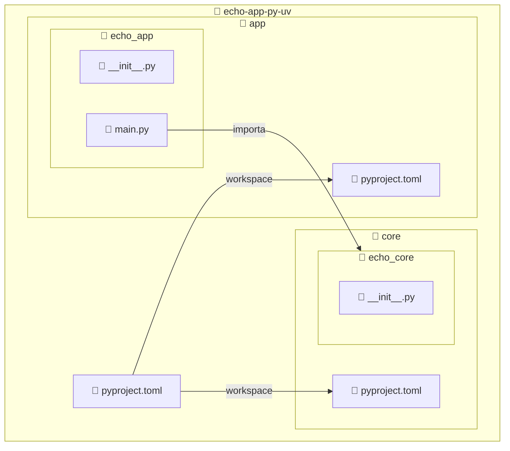

import ReadingTime from '@site/src/components/ReadingTime'
import Explanation from '@site/src/components/admonitions/Explanation'
import GitHubRepoLink from "@site/src/components/git/GitHubRepoLink";
import BoxedTabs from '@site/src/components/cajitas/BoxedTabs'
import TabItem from '@theme/TabItem'
import References from '@site/src/components/mdx/build-systems/modular-design/uv/references.mdx'
import CleanupSh from '@site/src/components/mdx/build-systems/modular-design/uv/cleanup-sh.mdx'

<ReadingTime />
<GitHubRepoLink repo={"echo-app-py-uv"} user={"r8vnhill"} />

En la lección anterior dimos nuestros primeros pasos con `uv`, creando un proyecto simple en Python y ejecutando un *Hello, World!* en un entorno virtual aislado.

Ahora llevaremos esa base un paso más allá: **estructuraremos el proyecto en múltiples módulos**, separando la lógica de negocio en una biblioteca (`core`) y la lógica de ejecución en una aplicación (`app`) que la consume. Este enfoque modular no solo mejora la organización del código, sino que también permite una evolución más sostenible y profesional del proyecto.

En esta lección aprenderás a:

- Declarar múltiples módulos dentro de un workspace de `uv`.
- Crear la estructura base de carpetas y archivos para organizar paquetes de Python.
- Establecer dependencias locales entre módulos.
- Ejecutar una aplicación que importa y utiliza código de otro módulo.

Al finalizar, habrás transformado un script suelto en un proyecto con una **estructura escalable y responsabilidades bien definidas**, alineado con las buenas prácticas de desarrollo profesional.

## 🏗️ Estructura esperada del proyecto

Nuestro objetivo es organizar el repositorio en dos módulos independientes: una biblioteca llamada `core`, que contiene la lógica de negocio, y una aplicación llamada `app`, que consume esa biblioteca.

La estructura final será la siguiente:



:::info Explicación de la estructura

Esta estructura representa un proyecto Python **multi-módulo**, organizado con `uv` como workspace. Está compuesta por:

- `pyproject.toml` en la raíz: define el proyecto principal y declara `core` y `app` como miembros del workspace.
- `core/`: contiene la lógica de negocio del proyecto. Dentro:
    - `echo_core/`: paquete Python que implementa la biblioteca.
    - `__init__.py`: habilita `echo_core` como módulo importable.
- `app/`: contiene la aplicación que depende de `core`. Dentro:
    - `echo_app/`: paquete Python de la aplicación.
    - `main.py`: punto de entrada de la app.
    - `__init__.py`: habilita `echo_app` como módulo.

Esta estructura modular permite mantener una **clara separación entre lógica de negocio y lógica de aplicación**, lo que facilita la escalabilidad, las pruebas unitarias independientes y la reutilización en otros proyectos.

:::

::::tip Limpieza

Puedes borrar los archivos creados en la lección pasada o guardarlos como recuerdo.

<BoxedTabs groupId={"os"}>
    <TabItem value="Windows" label="Windows">
        ```powershell showLineNumbers title="scripts/ps1/CleanupProject.ps1"
        Remove-Item -Path 'main.py' -Verbose
        ```

        Puedes ejecutar el comando desde la terminal, o como script de PowerShell:

        ```powershell title="En PowerShell"
        .\scripts\ps1\CleanupProject.ps1
        ```
    </TabItem>
    <TabItem value="macOS" label="macOS">
        <CleanupSh />
    </TabItem>
    <TabItem value="Ubuntu/Debian" label="Ubuntu/Debian">
        <CleanupSh />
    </TabItem>
</BoxedTabs>

::::

## 📦 Paso 1: Crear la estructura de carpetas

Desde la raíz del proyecto:

<BoxedTabs groupId={"os"}>

{/* #region Windows */}
<TabItem value="Windows" label="Windows">

```powershell showLineNumbers title="scripts/ps1/SetupModularProject.ps1"
@{
    App = @("app\pyproject.toml", "app\echo_app\__init__.py", "app\echo_app\main.py")
    Core = @("core\pyproject.toml", "core\echo_core\__init__.py")
}.GetEnumerator() | ForEach-Object {
    $module = $_.Key
    $files = $_.Value

    Write-Host "📁 Creating structure for module: $module" -ForegroundColor Cyan

    foreach ($file in $files) {
        $dir = Split-Path $file -Parent
        if (-not (Test-Path $dir)) {
            New-Item -Path $dir -ItemType Directory -Force | Out-Null
        }
        New-Item -Path $file -ItemType File -Force | Out-Null
        Write-Host "✅ $file" -ForegroundColor Green
    }
}

Write-Host "🟢 Project initialized successfully." -ForegroundColor Green
```

<Explanation>

Este script de PowerShell **automatiza la creación de la estructura base del proyecto**. Lo que hace es:

1. **Definir los módulos** `App` y `Core`, junto con la lista de archivos que cada uno debe contener.
2. Recorrer esa información usando `GetEnumerator()` y `ForEach-Object`.
3. Para cada archivo:
   - **Verifica si la carpeta padre existe** (`Split-Path` + `Test-Path`) y la crea si no está (`New-Item -ItemType Directory`).
   - **Crea el archivo vacío correspondiente** (`New-Item -ItemType File`).
   - Muestra un mensaje en consola por cada archivo creado.

</Explanation>

Puedes ejecutar los comandos desde la terminal, o como script de PowerShell:

```powershell title="En PowerShell"
.\scripts\ps1\SetupModularProject.ps1
```

</TabItem>
{/* #endregion */}

{/* region : macOS ----------------------------------------------------------------------------- */}
<TabItem value="macOS" label="macOS">

:::danger TODO

- [ ] Añadir código de creación de estructura para macOS.

:::

```bash showLineNumbers title="scripts/sh/setup_modular_project.sh"

```

</TabItem>
{/* endregion macOS ---------------------------------------------------------------------------- */}

{/* region : Ubuntu/Debian --------------------------------------------------------------------- */}
<TabItem value="Ubuntu/Debian" label="Ubuntu/Debian">

:::danger TODO

- [ ] Añadir código de creación de estructura para Ubuntu/Debian (reusar el de macOS).

:::

```bash showLineNumbers title=""

```

</TabItem>
{/* endregion Ubuntu/Debian ------------------------------------------------------------------- */}

</BoxedTabs>

## ⚙️ Paso 2: Declarar los módulos en el `pyproject.toml`

Para que `uv` reconozca que estamos trabajando en un proyecto con múltiples módulos, necesitamos declarar los subproyectos en el archivo `pyproject.toml` raíz. Esto permitirá que las dependencias entre módulos se resuelvan de forma local, sin necesidad de instalar ni publicar paquetes.

<BoxedTabs>
    <TabItem label="Código esencial" value="Código esencial">
        ```toml showLineNumbers title="pyproject.toml"
        [tool.uv.workspace]
        members = ["core", "app"]

        [tool.uv.sources]
        core = { workspace = true }
        app  = { workspace = true }
        ```
    </TabItem>
    <TabItem label="Código completo" value="Código completo">
        ```toml showLineNumbers
        [project]
        name = "echo-app-py-uv"
        version = "0.1.0"
        description = "Base project for the echo app"
        readme = "README.md"
        requires-python = ">=3.10"
        dependencies = []

        [tool.uv.workspace]
        members = ["core", "app"]

        [tool.uv.sources]
        core = { workspace = true }
        app  = { workspace = true }
        ```
    </TabItem>
</BoxedTabs>

<Explanation>
    Este bloque declara que el proyecto raíz es un workspace con dos módulos: `core` y `app`.  
    - La sección `[tool.uv.workspace]` enumera las carpetas que conforman el workspace.
    - La sección `[tool.uv.sources]` indica que ambos módulos deben resolverse desde el mismo workspace.
</Explanation>

Esto permite que `uv` reconozca `core` y `app` como proyectos conectados y que puedan **interactuar entre sí** sin necesidad de publicar o instalar paquetes manualmente.

## ⚙️ Paso 3: Definir el módulo `core`

Ahora vamos a crear el primer submódulo del proyecto: `core`. Este módulo contendrá la lógica de negocio reutilizable. Primero definimos su archivo `pyproject.toml` con los metadatos básicos:

```toml showLineNumbers title="core/pyproject.toml"
[project]
name = "core"
version = "0.1.0"
description = "Business logic for the echo app"
requires-python = ">=3.10"
```

Luego escribimos una función simple que servirá como punto de partida para probar el consumo desde el módulo `app`.

```python showLineNumbers title="core/echo_core/echo.py"
def echo(message: str) -> str:
    return message
```

<Explanation>
    Este módulo está diseñado para ser completamente independiente de la aplicación que lo consuma. En proyectos bien estructurados, **la lógica de negocio debería residir en módulos reutilizables** como este, facilitando su prueba, mantenimiento y posible uso desde diferentes interfaces o entornos.
</Explanation>


## 🚀 Paso 4: Crear el módulo `app` que consume `core`

Ahora definiremos el módulo `app`, que actuará como punto de entrada de nuestra aplicación. Este módulo importará la función `echo` definida en `core` y la usará para imprimir los argumentos recibidos desde la línea de comandos.

Primero, definimos su archivo `pyproject.toml` indicando que `core` es una dependencia local:

```toml showLineNumbers title="app/pyproject.toml"
[project]
name = "app"
version = "0.1.0"
description = "Application for the echo app that consumes the core library"
requires-python = ">=3.10"
dependencies = ["core"]
```

Luego escribimos el archivo `main.py`, que tomará los argumentos de la terminal y los procesará con `echo`.

```python showLineNumbers title="app/echo_app/main.py"
from echo_core import echo


def main(args: list[str]):
    for arg in args:
        print(echo(arg))


if __name__ == "__main__":
    import sys

    main(sys.argv[1:])
```

<Explanation>
    Este archivo define el comportamiento de la aplicación.  
    - Importa la función `echo` desde el módulo `core`, gracias a que `core` está declarado como dependencia.
    - Toma los argumentos que recibe el script desde la terminal (usando `sys.argv[1:]`) y los pasa uno a uno a `echo()`, imprimiendo el resultado.
</Explanation>

Esta es la primera vez que vemos cómo conectar los módulos entre sí, lo que valida la organización en **capas separadas y reutilizables**.

## 🧪 Paso 5: Ejecutar la aplicación

Ahora que la aplicación `app` depende correctamente de `core` y tiene definido un punto de entrada (`main.py`), podemos ejecutarla directamente desde la raíz del proyecto usando `uv`.

```bash title="Desde la raíz del proyecto"
uv run app/echo_app/main.py Butcher Hughie Kimiko Frenchie M.M.
```

Esto imprimirá:

```text
Butcher
Hughie
Kimiko
Frenchie
M.M.
```

<Explanation>
    Cada argumento que pasamos se interpreta como una cadena y se envía a la función `echo()` definida en `core`. El resultado es que la aplicación actúa como un **eco de nombres**: toma lo que le das y lo devuelve tal cual, usando una lógica desacoplada en el módulo central.

    Este patrón demuestra cómo separar responsabilidades:  
    - `core` se encarga de la **lógica de negocio** (qué hacer con el mensaje),
    - `app` se encarga de la **interfaz de entrada y salida** (cómo recibir datos y mostrar resultados).
</Explanation>

## 🎯 Conclusiones

En esta lección dimos un paso importante hacia la estructuración de proyectos Python más complejos y profesionales. Aprendimos a crear un **workspace multi-módulo con `uv`**, dividiendo la lógica en dos capas independientes: un módulo `core` con la funcionalidad reutilizable, y un módulo `app` que actúa como punto de entrada y la consume.

Gracias a esta separación, comenzamos a trabajar con un enfoque **modular, escalable y fácil de mantener**, que refleja buenas prácticas en el diseño de bibliotecas y aplicaciones.

### 🔑 Puntos clave

- `uv` permite declarar un workspace con múltiples módulos, facilitando la colaboración entre ellos.
- Separar la lógica de negocio (`core`) de la lógica de aplicación (`app`) mejora la claridad y reutilización.
- Cada módulo tiene su propio `pyproject.toml`, lo que permite gestionar dependencias de forma independiente.
- `uv run` permite ejecutar cualquier archivo dentro del entorno virtual sin necesidad de activarlo manualmente.
- La estructura de carpetas y paquetes es esencial para que los módulos sean importables entre sí.

### 🧰 ¿Qué nos llevamos?

Con esta lección pasamos de un proyecto plano a una **arquitectura modular basada en workspaces**, donde cada componente cumple un rol bien definido.

Este cambio no solo mejora la organización del código, sino que **abre la puerta a funcionalidades más avanzadas**: desde pruebas por módulo y publicación de bibliotecas, hasta automatización de tareas, integración continua y empaquetado profesional.

A partir de ahora, nuestro proyecto está listo para escalar —sin perder claridad, reutilizabilidad ni mantenibilidad.

<References />
