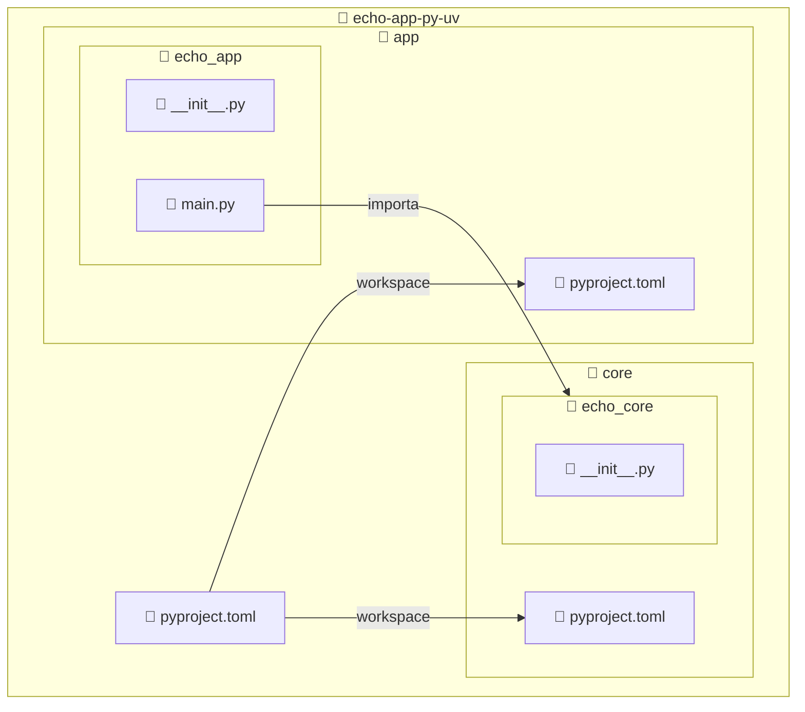

import ReadingTime from '@site/src/components/ReadingTime'
import Explanation from '@site/src/components/admonitions/Explanation'
import GitHubRepoLink from "@site/src/components/GithubRepoLink";
import BoxedTabs from '@site/src/components/cajitas/BoxedTabs'
import TabItem from '@theme/TabItem'

<ReadingTime />
<GitHubRepoLink repo={"echo-app-py-uv"} user={"r8vnhill"} />

En la lección anterior dimos nuestros primeros pasos con `uv`, creando un proyecto simple en Python y ejecutando un *Hello, World!* en un entorno virtual aislado.

Ahora llevaremos esa base un paso más allá: **estructuraremos el proyecto en múltiples módulos**, separando la lógica de negocios en una biblioteca (`core`) y la lógica de ejecución en una aplicación (`app`) que la consume. Este enfoque modular no solo facilita la organización del código, sino que también habilita una evolución más sostenible y profesional del proyecto.

En esta lección aprenderás a:

- Declarar múltiples módulos en un workspace de `uv`.
- Crear carpetas y archivos base para organizar los paquetes Python.
- Establecer dependencias locales entre módulos.
- Ejecutar una aplicación que importa y utiliza código de otro módulo.

Al finalizar, habrás transformado un script suelto en un proyecto con **estructura escalable y responsabilidad bien delimitada**, tal como se esperaría en un entorno de desarrollo profesional.

## 🏗️ Estructura esperada del proyecto

Nuestro objetivo es organizar el repositorio en dos módulos independientes: una biblioteca llamada `core` con la lógica de negocios, y una aplicación llamada `app` que consume esa biblioteca.

La estructura final será la siguiente:



:::info Explicación de la estructura

Esta estructura representa un proyecto Python **multi-módulo** organizado con `uv` como workspace. Está compuesta por:

- `pyproject.toml` en la raíz: define el proyecto principal y declara los módulos `core` y `app` como miembros del workspace.
- `core/`: contiene la lógica de negocios del proyecto. Dentro:
    - `echo_core/`: paquete Python que implementa la biblioteca.
    - `__init__.py`: habilita `echo_core` como módulo importable.
- `app/`: contiene la aplicación que consume `core`. Dentro:
    - `echo_app/`: paquete Python de la aplicación.
    - `main.py`: punto de entrada.
    - `__init__.py`: habilita `echo_app` como módulo.

Esta estructura modular permite mantener una **clara separación entre lógica de negocio y lógica de aplicación**, facilitando la escalabilidad, el testeo independiente de componentes y la reutilización en otros proyectos.

:::

:::tip ¿Y el `main.py` anterior?

Puedes eliminar el archivo `main.py` que creaste en la lección anterior, o guardarlo como recuerdo.

:::

## 📦 Paso 1: Crear la estructura de carpetas

Desde la raíz del proyecto:

<BoxedTabs groupId={"os"}>
    <TabItem value="Windows" label="Windows">
        ```powershell title="En PowerShell"
        'core', 'app' | ForEach-Object {
            $name = $_
            $modulePath = ".\$name"
            $packagePath = "$modulePath\echo_$name"

            # Crear carpeta del módulo y del paquete
            New-Item -ItemType Directory -Path $packagePath -Force | Out-Null
            New-Item -ItemType File -Path "$packagePath\__init__.py" -Force | Out-Null

            # Crear pyproject.toml
            New-Item -ItemType File -Path "$modulePath\pyproject.toml" -Force | Out-Null

            # Crear main.py solo en app
            if ($name -eq 'app') {
                New-Item -ItemType File -Path "$packagePath\main.py" -Force | Out-Null
            }
        }
        ```

        <Explanation>
            Este bloque crea dos módulos: `core` y `app`, cada uno con una subcarpeta `echo_core` o `echo_app` que actúa como paquete Python.

            - Crea las carpetas del módulo (`core/`, `app/`) y sus respectivos paquetes (`echo_core/`, `echo_app/`).
            - Genera un archivo `__init__.py` en cada paquete, para marcarlo como módulo importable.
            - Crea un archivo `pyproject.toml` vacío en cada módulo, que luego será completado manualmente.
            - Si el módulo es `app`, se crea además un `main.py` como punto de entrada para la aplicación.

            Esta estructura permite definir una biblioteca reutilizable (`core`) y una aplicación que la consume (`app`), siguiendo buenas prácticas de separación de responsabilidades.
        </Explanation>
    </TabItem>
    <TabItem value="Windows (corto)" label="Windows (corto)">
        ```powershell title="En PowerShell"
        'core', 'app' | % {
            $pkg = "echo_$_"
            md $_, "$_/$pkg" -f > $null
            ni "$_/$pkg/__init__.py", "$_/$pkg/pyproject.toml" -f > $null
            if ($_ -eq 'app') {
                ni "$_/$pkg/main.py" -f > $null
            }
        }
        ```

        <Explanation>
            Este script compacto:

            - Crea dos módulos: `core` y `app`.
            - Dentro de cada módulo, genera un paquete Python (`echo_core` o `echo_app`) con `__init__.py`.
            - Agrega un `pyproject.toml` vacío en cada módulo.
            - En el módulo `app`, también crea `main.py` como punto de entrada.
        </Explanation>
    </TabItem>
    <TabItem value="Linux/macOS" label="Linux/macOS">
        ```bash title="En tu terminal"
        for module in core app; do
            pkg="echo_$module"
            mkdir -p "$module/$pkg"
            : > "$module/pyproject.toml" "$module/$pkg/__init__.py"
            [[ $module == app ]] && : > "$module/$pkg/main.py"
        done
        ```

        <Explanation>
            Este script:

            - Crea dos módulos: `core` y `app`.
            - Dentro de cada uno, genera un paquete Python (`echo_core` o `echo_app`) con `__init__.py`.
            - Agrega un `pyproject.toml` vacío por módulo.
            - En el módulo `app`, también crea `main.py` como punto de entrada.
        </Explanation>
    </TabItem>
</BoxedTabs>

## ⚙️ Paso 2: Declarar los módulos en el `pyproject.toml`

Para que `uv` reconozca que estamos trabajando en un proyecto con múltiples módulos, necesitamos declarar los subproyectos en el archivo `pyproject.toml` raíz. Esto permitirá que las dependencias entre módulos se resuelvan de forma local, sin necesidad de instalar ni publicar paquetes.

<BoxedTabs>
    <TabItem label="Código esencial" value="Código esencial">
        ```toml showLineNumbers title="pyproject.toml"
        [tool.uv.workspace]
        members = ["core", "app"]

        [tool.uv.sources]
        core = { workspace = true }
        app  = { workspace = true }
        ```
    </TabItem>
    <TabItem label="Código completo" value="Código completo">
        ```toml showLineNumbers
        [project]
        name = "echo-app-py-uv"
        version = "0.1.0"
        description = "Base project for the echo app"
        readme = "README.md"
        requires-python = ">=3.10"
        dependencies = []

        [tool.uv.workspace]
        members = ["core", "app"]

        [tool.uv.sources]
        core = { workspace = true }
        app  = { workspace = true }
        ```
    </TabItem>
</BoxedTabs>

<Explanation>
    Este bloque declara que el proyecto raíz es un workspace con dos módulos: `core` y `app`.  
    - La sección `[tool.uv.workspace]` enumera las carpetas que conforman el workspace.
    - La sección `[tool.uv.sources]` indica que ambos módulos deben resolverse desde el mismo workspace.
</Explanation>

Esto permite que `uv` reconozca `core` y `app` como proyectos conectados y que puedan **interactuar entre sí** sin necesidad de publicar o instalar paquetes manualmente.

## ⚙️ Paso 3: Definir el módulo `core`

Ahora vamos a crear el primer submódulo del proyecto: `core`. Este módulo contendrá la lógica de negocio reutilizable. Primero definimos su archivo `pyproject.toml` con los metadatos básicos:

```toml showLineNumbers title="core/pyproject.toml"
[project]
name = "core"
version = "0.1.0"
description = "Business logic for the echo app"
requires-python = ">=3.10"
```

Luego escribimos una función simple que servirá como punto de partida para probar el consumo desde el módulo `app`.

```python showLineNumbers title="core/echo_core/echo.py"
def echo(message: str) -> str:
    return message
```

<Explanation>
    Este módulo está diseñado para ser completamente independiente de la aplicación que lo consuma. En proyectos bien estructurados, **la lógica de negocio debería residir en módulos reutilizables** como este, facilitando su prueba, mantenimiento y posible uso desde diferentes interfaces o entornos.
</Explanation>


## 🚀 Paso 4: Crear el módulo `app` que consume `core`

Ahora definiremos el módulo `app`, que actuará como punto de entrada de nuestra aplicación. Este módulo importará la función `echo` definida en `core` y la usará para imprimir los argumentos recibidos desde la línea de comandos.

Primero, definimos su archivo `pyproject.toml` indicando que `core` es una dependencia local:

```toml showLineNumbers title="app/pyproject.toml"
[project]
name = "app"
version = "0.1.0"
description = "Application for the echo app that consumes the core library"
requires-python = ">=3.10"
dependencies = ["core"]
```

Luego escribimos el archivo `main.py`, que tomará los argumentos de la terminal y los procesará con `echo`.

```python showLineNumbers title="app/echo_app/main.py"
from echo_core import echo


def main(args: list[str]):
    for arg in args:
        print(echo(arg))


if __name__ == "__main__":
    import sys

    main(sys.argv[1:])
```

<Explanation>
    Este archivo define el comportamiento de la aplicación.  
    - Importa la función `echo` desde el módulo `core`, gracias a que `core` está declarado como dependencia.
    - Toma los argumentos que recibe el script desde la terminal (usando `sys.argv[1:]`) y los pasa uno a uno a `echo()`, imprimiendo el resultado.
</Explanation>

Esta es la primera vez que vemos cómo conectar los módulos entre sí, lo que valida la organización en **capas separadas y reutilizables**.

## 🧪 Paso 5: Ejecutar la aplicación

Ahora que la aplicación `app` depende correctamente de `core` y tiene definido un punto de entrada (`main.py`), podemos ejecutarla directamente desde la raíz del proyecto usando `uv`.

```bash title="Desde la raíz del proyecto"
uv run app/echo_app/main.py Butcher Hughie Kimiko Frenchie M.M.
```

Esto imprimirá:

```text
Butcher
Hughie
Kimiko
Frenchie
M.M.
```

<Explanation>
    Cada argumento que pasamos se interpreta como una cadena y se envía a la función `echo()` definida en `core`. El resultado es que la aplicación actúa como un **eco de nombres**: toma lo que le das y lo devuelve tal cual, usando una lógica desacoplada en el módulo central.

    Este patrón demuestra cómo separar responsabilidades:  
    - `core` se encarga de la **lógica de negocio** (qué hacer con el mensaje),
    - `app` se encarga de la **interfaz de entrada y salida** (cómo recibir datos y mostrar resultados).
</Explanation>

## 🎯 Conclusiones

En esta lección dimos un paso importante hacia la estructuración de proyectos Python más complejos y profesionales. Aprendimos a crear un **workspace multi-módulo con `uv`**, dividiendo la lógica en dos capas independientes: un módulo `core` con la funcionalidad reutilizable, y un módulo `app` que actúa como punto de entrada y la consume.

Gracias a esta separación, comenzamos a trabajar con un enfoque **modular, escalable y fácil de mantener**, que refleja buenas prácticas en el diseño de bibliotecas y aplicaciones.

### 🔑 Puntos clave

- `uv` permite declarar un workspace con múltiples módulos, facilitando la colaboración entre ellos.
- Separar la lógica de negocio (`core`) de la lógica de aplicación (`app`) mejora la claridad y reutilización.
- Cada módulo tiene su propio `pyproject.toml`, lo que permite gestionar dependencias de forma independiente.
- `uv run` permite ejecutar cualquier archivo dentro del entorno virtual sin necesidad de activarlo manualmente.
- La estructura de carpetas y paquetes es esencial para que los módulos sean importables entre sí.

### 🧰 ¿Qué nos llevamos?

Con esta lección pasamos de un proyecto plano a una **arquitectura modular basada en workspaces**, donde cada componente cumple un rol bien definido.

Este cambio no solo mejora la organización del código, sino que **abre la puerta a funcionalidades más avanzadas**: desde pruebas por módulo y publicación de bibliotecas, hasta automatización de tareas, integración continua y empaquetado profesional.

A partir de ahora, nuestro proyecto está listo para escalar —sin perder claridad, reutilizabilidad ni mantenibilidad.

## 📖 Referencias

### 🔥 Recomendadas

- [🌐 "Using workspaces"](https://docs.astral.sh/uv/concepts/projects/workspaces/) de **la documentación oficial de _uv_**: Explica cómo organizar múltiples módulos en un solo repositorio usando `uv workspaces`, compartiendo un lockfile y gestionando dependencias entre paquetes de forma local. Es relevante porque sustenta la estructura modular adoptada en esta lección, permitiendo que `core` y `app` interactúen sin necesidad de publicar paquetes ni activar entornos separados.
    
{/* ### 🔹 Adicionales */}
