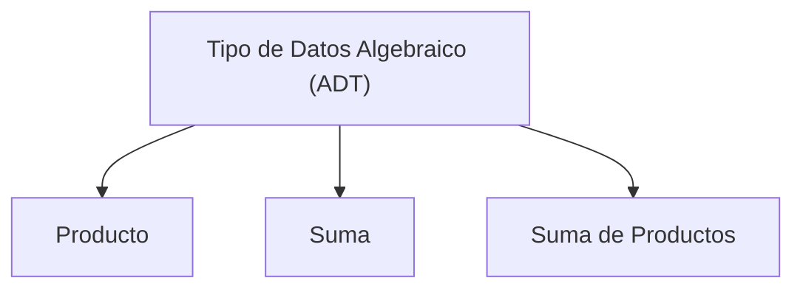

import ReadingTime from '@site/src/components/ReadingTime'
import { ProCons, Pros, Cons } from '@site/src/components/cajitas/ProCons'
import References from '@site/src/components/ReferencesComponent'
import Tabs from '@theme/Tabs'
import TabItem from '@theme/TabItem'
import Exercise from '@site/src/components/exercise/Exercise'
import Solution from '@site/src/components/exercise/Solution'
import Hint from '@site/src/components/exercise/Hint'
import Definition from '@site/src/components/Definition'
import Corollary from '@site/src/components/Corollary'
import GithubRepoLink from '@site/src/components/GithubRepoLink'
import { LanguageCard } from '@site/src/components/cards/LanguageCard'
import BoxedTabs from '@site/src/components/cajitas/BoxedTabs'

<ReadingTime />

Cuando diseñamos bibliotecas, uno de los desafíos más comunes es representar los datos de forma precisa, segura y expresiva. Necesitamos tipos que transmitan claramente su propósito, que impidan estados inválidos, y que puedan evolucionar sin romper el código que los usa.

Los **tipos de datos algebraicos** (Algebraic Data Types, o *ADTs*) son una herramienta fundamental para lograr esto. Nos permiten construir nuevos tipos combinando otros más simples, siguiendo las reglas del álgebra: **producto** para agrupar información, y **suma** para expresar alternativas.

Estos conceptos no solo son importantes desde el punto de vista teórico, sino que aparecen constantemente en el diseño de bibliotecas modernas: desde cómo definimos estructuras de datos hasta cómo representamos flujos de ejecución, errores, validaciones, eventos, o incluso estados de interfaz.

En este bloque exploraremos cómo Kotlin —al igual que muchos lenguajes modernos— nos permite expresar este tipo de construcciones usando `data class`, `enum class` y `sealed class`. Aprenderás no solo a identificarlos, sino también a utilizarlos para crear modelos de datos robustos, mantenibles y alineados con los principios de claridad y seguridad que caracterizan a las buenas bibliotecas.

## 🧩 ¿Qué son los Tipos de Datos Algebraicos?

Los **tipos de datos algebraicos** (Algebraic Data Types, o *ADTs*) son una forma de construir nuevos tipos combinando otros más simples, siguiendo los principios del álgebra: **suma** (elección) y **producto** (composición). Son una herramienta esencial para modelar datos de forma clara, segura y expresiva.

:::warning No confundir con *Abstract Data Types (ADTs)*

Los ADTs algebraicos describen cómo se **estructura** un tipo (como `Either` o `Pair`), mientras que los ADTs abstractos describen cómo se **comporta** (como `Stack`, `Queue`, o `Map`).

:::

### 🧠 Desde la teoría…

En álgebra, podemos componer conjuntos usando dos operaciones:

- **Producto ($\times$)**: combina elementos de dos conjuntos para formar pares. Por ejemplo, si tienes un conjunto de colores $\{\text{Rojo}, \text{Verde}\}$ y un conjunto de tallas $\{ \mathbf{S}, \mathbf{M}, \mathbf{L} \}$, su producto contiene todas las combinaciones posibles, como $\left(\text{Rojo},\, \mathbf{S}\right)$, $\left( \text{Verde},\, \mathbf{L} \right)$, etc.
- **Suma ($+$)**: representa una elección entre alternativas. Si tienes un conjunto de monedas $\{ \text{Peso}, \text{Euro} \}$ y uno de criptomonedas $\{ Bitcoin \}$, su suma representa un valor que puede ser una **moneda** o una **cripto**, pero no ambas a la vez.

### 🔍 …hacia un ejemplo concreto

Imagina que estás construyendo una biblioteca para manejar órdenes de compra. Quieres representar el **estado de una orden**.

Una primera aproximación podría ser usar una cadena de texto para guardar estados como `"pending"`, `"shipped"`, `"cancelled"`… pero eso es propenso a errores: el código no puede validar fácilmente que todos los valores sean correctos.

En cambio, puedes definir un tipo de datos que contenga solo los estados válidos. Este nuevo tipo sería un **tipo suma**, porque una orden puede estar en *uno entre varios estados posibles*, pero **no en más de uno al mismo tiempo**. Al definir estos estados de forma explícita, evitas valores inválidos y habilitas validaciones automáticas en tiempo de compilación.

Del mismo modo, podrías querer representar la **dirección de entrega** de una orden como un conjunto de campos: calle, número, ciudad y país. Este es un **tipo producto**, porque todos esos campos se combinan para formar una dirección completa.

## 🧩 ¿Qué tipos de ADTs existen?

Los **tipos de datos algebraicos** se construyen combinando dos operaciones fundamentales: **producto** y **suma**. Esto nos da tres formas básicas de definir tipos:

- **Producto**: Un valor que **contiene varios campos al mismo tiempo**.  
  Ejemplo: `data class Person(val name: String, val age: Int)`
- **Suma**: Un valor que representa **una entre varias alternativas**.  
  Ejemplo: `enum class Result { Success, Failure }`
- **Suma de productos**: Cada alternativa tiene su propia estructura de campos.  
  Ejemplo: `sealed class Shape` con subtipos como `Circle(radius)` y `Rectangle(width, height)`

Esta última forma es la más expresiva y común en diseño de tipos modernos.

### ✏️ Representación formal

Podemos expresar estas combinaciones usando una notación inspirada en gramáticas formales:

```text
ADT ::= Producto
      | Suma
      | Suma(Productos)
```

- `Producto`: Agrupa varios valores simultáneamente.  
- `Suma`: Representa una elección entre varias opciones.  
- `Suma(Productos)`: Une ambas ideas: cada opción puede tener su propia estructura.



## 🤔 ¿Hay algo más además de suma y producto?

Aunque los **tipos de datos algebraicos** se basan en combinaciones de suma y producto, hay otros tipos que no encajan directamente en esa clasificación pero que aparecen con frecuencia y tienen un papel importante en la teoría de tipos:

### 1. Funciones ($A \to B$)

Las funciones no son ADTs, ya que no representan estructuras de datos, sino transformaciones entre ellas. Sin embargo, en la analogía algebraica, se consideran **exponenciales**, porque el número de funciones posibles de `A` a `B` es `B^A`. Son esenciales en programación funcional, especialmente cuando combinamos funciones con tipos algebraicos.

### 2. Tipos especiales: `Unit` y `Nothing`

Estos tipos son casos límite que completan el panorama:

- **`Unit`**: Representa un tipo con **un único valor posible** (`Unit`). Puede verse como un **producto vacío**, es decir, una tupla de cero elementos.
- **`Nothing`**: Representa un tipo sin valores posibles. Se interpreta como una **suma vacía**, ya que no hay ninguna alternativa disponible.

Estos tipos no solo son útiles en teoría: también aparecen en la práctica, por ejemplo, como retornos de funciones que no devuelven información (`Unit`) o funciones que nunca terminan (`Nothing`).

## 🔍 ¿Qué aprenderás en este bloque?

A lo largo de este bloque temático, profundizaremos en el uso de **tipos de datos algebraicos** en Kotlin con un enfoque orientado al diseño de bibliotecas reutilizables y expresivas. Aprenderás a:

- Reconocer cuándo usar tipos **producto**, **suma**, o **mixtos** para modelar estructuras de datos.
- Aplicar el diseño con **data classes**, **enums** y **clases selladas** (`sealed`) para capturar relaciones lógicas y casos posibles de manera segura.
- Evitar estructuras débiles como cadenas o enteros sin semántica clara, reemplazándolas por tipos explícitos y verificables en tiempo de compilación.
- Entender las ventajas de los ADTs frente a modelos menos expresivos, especialmente en APIs públicas o dominios complejos.
- Ver cómo estas ideas se conectan con otros lenguajes funcionales y se traducen a patrones robustos de diseño en bibliotecas.

Dividiremos este bloque en tres lecciones principales, cada una centrada en un tipo de construcción:

- **Tipos producto**: estructuras con múltiples campos a la vez.
- **Tipos suma**: valores que representan una entre varias posibilidades.
- **Tipos mixtos**: combinaciones de ambas formas (la más potente y común en modelado de datos).

Cada lección incluirá teoría, ejemplos, ejercicios y comparaciones para ayudarte a incorporar estas herramientas en tu repertorio como diseñadorx de bibliotecas.

## 🎯 Objetivos de aprendizaje

Al finalizar este bloque serás capaz de:

- Explicar qué son los tipos de datos algebraicos y distinguir entre producto, suma y suma de productos.
- Modelar datos usando `data class`, `enum class` y `sealed class` en Kotlin de forma idiomática.
- Elegir el tipo más adecuado según el problema a resolver, priorizando claridad, seguridad y expresividad.
- Construir modelos de datos robustos y mantenibles como parte de bibliotecas que otros puedan reutilizar.

Este conocimiento será clave para construir APIs seguras, evitar errores comunes en estructuras de datos, y mantener una base de código más expresiva, predecible y fácil de probar.
