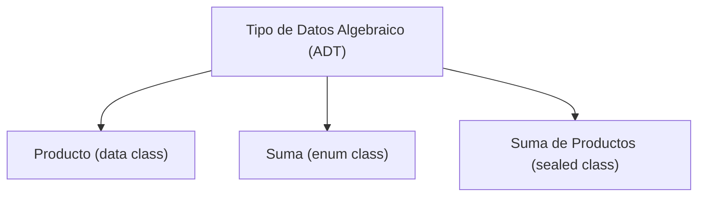

import ReadingTime from '@site/src/components/ReadingTime'
import { ProCons, Pros, Cons } from '@site/src/components/cajitas/ProCons'
import References from '@site/src/components/ReferencesComponent'
import Tabs from '@theme/Tabs'
import TabItem from '@theme/TabItem'
import Exercise from '@site/src/components/exercise/Exercise'
import Solution from '@site/src/components/exercise/Solution'
import Hint from '@site/src/components/exercise/Hint'
import Definition from '@site/src/components/Definition'
import Corollary from '@site/src/components/Corollary'
import GithubRepoLink from '@site/src/components/GithubRepoLink'
import { LanguageCard } from '@site/src/components/cards/LanguageCard'
import BoxedTabs from '@site/src/components/cajitas/BoxedTabs'

<ReadingTime />

Cuando diseñamos bibliotecas, uno de los desafíos más comunes es representar los datos de forma precisa, segura y expresiva. Necesitamos tipos que comuniquen claramente su propósito, que impidan estados inválidos, y que puedan evolucionar sin romper el código que los utiliza.

Los **tipos de datos algebraicos** (*Algebraic Data Types*, o **ADTs**) son una herramienta fundamental para lograr esto. Permiten construir nuevos tipos combinando otros más simples, siguiendo las reglas del álgebra: **producto**, para agrupar información; y **suma**, para representar alternativas.

Estos conceptos no solo son relevantes desde el punto de vista teórico, sino que están presentes en muchas decisiones de diseño en bibliotecas modernas: desde la definición de estructuras de datos hasta la representación de flujos de ejecución, errores, validaciones, eventos o estados de interfaz.

En este módulo exploraremos cómo Kotlin —al igual que otros lenguajes modernos— permite expresar estas construcciones mediante `data class`, `enum class` y `sealed class`. Aprenderás no solo a identificarlas, sino también a aplicarlas para crear modelos de datos robustos, mantenibles y alineados con los principios de claridad y seguridad que distinguen a las buenas bibliotecas.

## 🔍 ¿Qué aprenderás en este módulo?

En este módulo temático profundizaremos en el uso de **tipos de datos algebraicos** en Kotlin, con un enfoque orientado al diseño de bibliotecas reutilizables y expresivas. Aprenderás a:

- Reconocer cuándo usar tipos **producto**, **suma** o **mixtos** para modelar estructuras de datos.
- Aplicar el diseño con **data classes**, **enums** y **clases selladas** (`sealed`) para capturar relaciones lógicas y casos posibles de manera segura y explícita.
- Evitar estructuras débiles, como cadenas o enteros sin semántica clara, reemplazándolas por tipos precisos y verificables en tiempo de compilación.
- Entender las ventajas de los ADTs frente a modelos menos expresivos, especialmente en APIs públicas o dominios complejos.
- Conectar estas ideas con otros lenguajes funcionales y traducirlas en patrones robustos de diseño aplicables a bibliotecas modernas.

Dividiremos este bloque en tres lecciones principales, cada una centrada en un tipo de construcción:

- **Tipos producto**: estructuras que agrupan múltiples datos simultáneamente.
- **Tipos suma**: valores que representan una entre varias alternativas posibles.
- **Tipos mixtos**: combinaciones de producto y suma (la forma más flexible y común en modelado de datos).

Cada lección incluirá teoría, ejemplos, ejercicios y comparaciones para ayudarte a incorporar estas herramientas en tu repertorio como diseñadorx de bibliotecas.

## 🎯 Objetivos de aprendizaje

Al finalizar este bloque serás capaz de:

- Explicar qué son los tipos de datos algebraicos y distinguir entre tipos **producto**, **suma** y **suma de productos**.
- Modelar datos en Kotlin de forma idiomática usando `data class`, `enum class` y `sealed class`.
- Elegir el tipo de construcción más adecuado según el problema a resolver, priorizando claridad, seguridad y expresividad.
- Diseñar modelos de datos robustos y mantenibles como parte de bibliotecas reutilizables.

Este conocimiento será clave para crear APIs seguras, evitar errores comunes en estructuras de datos, y mantener una base de código más expresiva, predecible y fácil de probar.

## 🧩 ¿Qué son los Tipos de Datos Algebraicos?

Los **tipos de datos algebraicos** (*Algebraic Data Types*, o *ADTs*) son una forma de construir nuevos tipos combinando otros más simples, siguiendo los principios del álgebra: **producto** (composición) y **suma** (elección). Son una herramienta fundamental para modelar datos de forma clara, segura y expresiva.

:::warning No confundir con *Abstract Data Types (ADTs)*

Los tipos de datos **algebraicos** describen cómo se **estructura** un valor (por ejemplo, `Either`, `Option`, o `Pair`), mientras que los tipos de datos **abstractos** describen cómo se **comporta** una colección o entidad (como `Stack`, `Queue`, o `Map`).

:::

### 🧠 Desde la teoría…

En álgebra, podemos construir nuevos conjuntos a partir de otros mediante dos operaciones fundamentales:

- **Producto ($\times$)**: combina elementos de dos conjuntos formando pares ordenados.
  Por ejemplo, si tienes un conjunto de colores $\{\text{Rojo}, \text{Verde}\}$ y uno de tallas $\{\mathbf{S}, \mathbf{M}, \mathbf{L}\}$, su producto contiene todas las combinaciones posibles:
  $\left(\text{Rojo},\, \mathbf{S}\right)$, $\left(\text{Rojo},\, \mathbf{M}\right)$, $\left( \text{Verde},\, \mathbf{L} \right)$, etc.
- **Suma ($+$)**: representa una elección entre alternativas exclusivas.
  Si tienes un conjunto de monedas $\{\text{Peso}, \text{Euro}\}$ y uno de criptomonedas $\{\text{Bitcoin}\}$, su suma representa un valor que puede ser una **moneda** o una **cripto**, pero no ambas a la vez.

### 🔍 …hacia un ejemplo concreto

Imagina que estás desarrollando una biblioteca para manejar órdenes de compra, y necesitas representar el **estado de una orden**.

Una primera aproximación podría ser guardar el estado como una cadena de texto: `"pending"`, `"shipped"`, `"cancelled"`…
Pero este enfoque es propenso a errores: nada impide que alguien escriba `"canceled"` (con una sola "l") o `"shippedd"` por accidente.
El código no puede validar fácilmente que todos los valores sean correctos.

Una alternativa más segura es definir un tipo que contenga **solo los estados válidos**.
Este tipo sería un **tipo suma**, ya que una orden puede estar en *uno entre varios estados posibles*, pero **no en más de uno al mismo tiempo**.
Definir estos estados explícitamente evita errores y permite validaciones automáticas en tiempo de compilación.

Del mismo modo, podrías querer representar la **dirección de entrega** como un conjunto de campos: calle, número, ciudad y país.
Esto es un **tipo producto**, porque todos esos campos se combinan para formar una dirección completa y coherente.

## 🧩 ¿Qué tipos de ADTs existen?

Los **tipos de datos algebraicos** se construyen combinando dos operaciones fundamentales: **producto** y **suma**. A partir de ellas, podemos definir tres formas básicas de modelar datos:

- **Tipo producto**: representa un valor que **contiene varios campos al mismo tiempo**.  
  📦 Ejemplo: `data class Person(val name: String, val age: Int)`
- **Tipo suma**: representa un valor que puede ser **una entre varias alternativas mutuamente excluyentes**.  
  🎯 Ejemplo: `enum class Result { Success, Failure }`
- **Suma de productos**: combina ambas ideas: **cada alternativa** tiene su **propia estructura interna**.  
  🧬 Ejemplo: `sealed class Shape`, con subtipos como `Circle(val radius: Double)` y `Rectangle(val width: Double, val height: Double)`

La **suma de productos** es la forma más expresiva y poderosa, especialmente útil para modelar casos complejos en bibliotecas reutilizables.

### ✏️ Representación formal

Podemos expresar las combinaciones fundamentales de tipos algebraicos usando una notación inspirada en gramáticas formales:

```text
ADT ::= Producto
      | Suma
      | Suma(Productos)
```

- `Producto`: Agrupa **varios valores simultáneamente**.  
- `Suma`: Representa **una elección entre múltiples alternativas**.  
- `Suma(Productos)`: Une ambas ideas: cada alternativa puede tener **su propia estructura interna**.



> 🧠 Esta clasificación te ayudará a elegir el tipo correcto según si necesitas **combinar datos**, **diferenciar casos**, o **ambas cosas**.

## 🤔 ¿Hay algo más además de suma y producto?

Aunque los **tipos de datos algebraicos** se construyen principalmente a partir de **suma** y **producto**, existen otros tipos que, si bien no son ADTs en sentido estricto, desempeñan un rol fundamental en la teoría de tipos y la práctica de programación funcional.

### 1. Funciones (`A -> B`)

Las funciones **no son ADTs** porque no representan estructuras de datos, sino **transformaciones** entre ellas.
Sin embargo, desde el punto de vista algebraico, se las considera **exponenciales**, ya que el número de funciones posibles de `A` a `B` es `B^A`.
Esto las ubica en una posición clave dentro del álgebra de tipos, y son imprescindibles al componer transformaciones, validaciones y control de flujo en combinación con tipos algebraicos.

### 2. Tipos especiales: `Unit` y `Nothing`

Estos tipos completan los extremos de la jerarquía algebraica:

- **`Unit`**: Tiene **un único valor posible**, `Unit`. Representa un **producto vacío**, es decir, una tupla con cero elementos.
  Se usa como valor de retorno en funciones que "no devuelven nada útil", pero igual deben tener un tipo.
- **`Nothing`**: No tiene valores posibles. Representa una **suma vacía**, es decir, un tipo con cero alternativas.
  Se usa para funciones que **nunca terminan**, como aquellas que lanzan excepciones o entran en loops infinitos.

Estos tipos no son solo curiosidades teóricas: su presencia en Kotlin (y otros lenguajes) permite escribir código más expresivo, seguro y coherente con los principios de tipado fuerte.

## 📖 Referencias

### 🔥 Recomendadas

- 📚 *"Algebraic data types and Pattern matching"* (pp. 174–198) en *Functional Programming in C++* de **Ivan Čukić**: Este capítulo muestra cómo los tipos de datos algebraicos permiten modelar estados de forma segura, evitando combinaciones inválidas y mejorando la claridad del código. Es pertinente a esta lección porque ilustra cómo los **tipos suma** pueden reemplazar estructuras frágiles con modelos más expresivos. Aunque también se aborda *pattern matching*, esta técnica queda fuera del alcance y foco de este curso.

### 🔹 Adicionales

- [📄 "Tipos Algebraicos de Datos en Fork Álgebras"](https://clei.org/proceedings_data/CLEI1996/CLEI1996%20-%20Tomo%201/Por%20capitulo_OCR/CLEI1996_310-321_OCR.pdf) en *"XXII Conferencia Latinoamericana de Informática"* de **Pablo E. Martínez López y Gabriel A. Baum**: Presenta una definición formal de tipos algebraicos en el marco de las fork álgebras, con énfasis en su utilidad para especificaciones modulares y correctas. Es una **referencia avanzada** y teórica que aporta una base formal útil para comprender los fundamentos algebraicos detrás de estructuras de datos como las usadas en Kotlin o Haskell.
